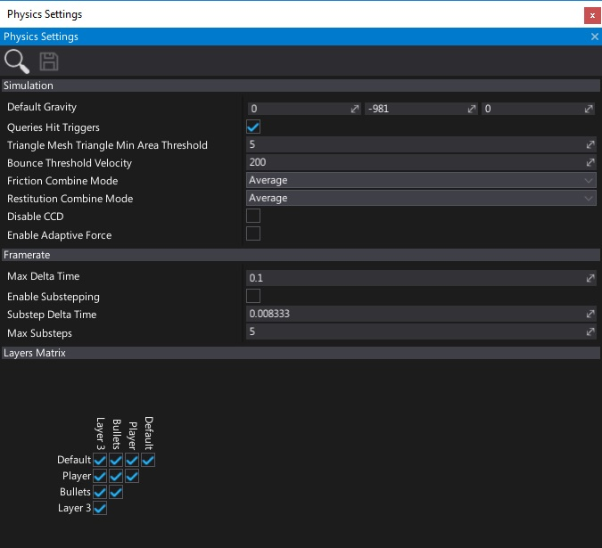
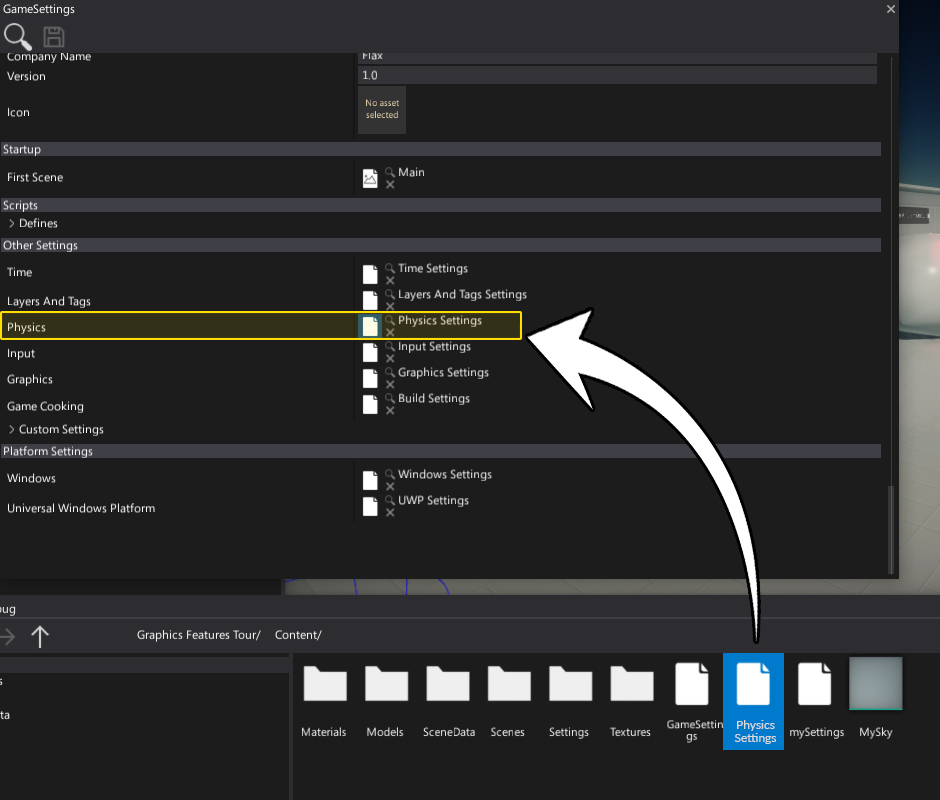
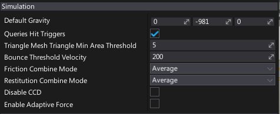
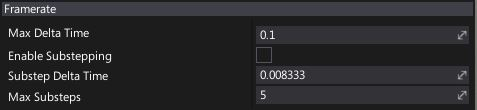
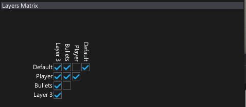

# Physics Settings

**Physics Settings asset** is used to specify the initial physics simulation configuration. In fact, some of its options can be set only on physics engine startup so using that asset can be very handy. Hovewer, most of the physics simulation options can be adjusted at runtime using [Physics](https://docs.flaxengine.com/api/FlaxEngine.Physics.html) class.

## Create physics settings

1. Navigate to the Content directory in the *Content* window

2. Right-click and select option **New -> Settings**, specify the asset name (eg. *Physics Settings*) and hit *Enter*
    

3. Choose option **Physics Settings** and press **Create** button
    

4. Double-click on an asset to open it and edit
    

## Use physics settings

You can create as many physics settings as you want (even special versions per platform) but only one can be used during game building. Use **Game Settings** asset (always located in `Content/GameSettings.json`) to link the physics options. If your game is using more advanced confgiuration you can edit the game settings from code in your build script (use [GameSettings.Load](https://docs.flaxengine.com/api/FlaxEditor.Content.Settings.GameSettings.html#FlaxEditor_Content_Settings_GameSettings_Load) and [GameSettings.Save](https://docs.flaxengine.com/api/FlaxEditor.Content.Settings.GameSettings.html#FlaxEditor_Content_Settings_GameSettings_Save__1___0_) from C# API).

## Simulation options

| Property | Description |
|--------|--------|
| **Default Gravity** | The default gravity force value (in cm^2/s). |
| **Queries Hit Triggers** | If checked, any [raycast](raycasting.md) or other scene query that intersects with a collider marked as a trigger will returns with a hit. Individual raycasts can override this behavior. |
| **Triangle Mesh Triangle Min Area Threshold** | Triangles from triangle meshes (CSG) with an area less than or equal to this value will be removed from physics collision data. Set to less than or equal 0 to disable. |
| **Bounce Threshold Velocity** | Minimum relative velocity required for an object to bounce. A typical value for simulation stability is about 0.2 * gravity. |
| **Friction Combine Mode** | The default friction combine mode, controls how friction is computed for multiple materials. |
| **Restitution Combine Mode** | The default restitution combine mode, controls how restitution is computed for multiple materials. |
| **Disable CCD** | If checked, CCD will be ignored. This is an optimization when CCD is never used which removes the need for physics engine to check it internally. |
| **Enable Adaptive Force** | Enables adaptive forces to accelerate convergence of the solver. Can improve physics simulation performance but lead to artifacts. |

> [!TIP]
> When Continuous Collision Detection (**CCD**) is turned on, the affected rigid bodies will not go through other objects at high velocities (a problem also known as *tunnelling*).

## Framerate options

| Property | Description |
|--------|--------|
| **Max Delta Time** | The maximum allowed delta time (in seconds) for the physics simulation step. |
| **Enable Substepping** | Whether to substep the physics simulation. |
| **Substep Delta Time** | Delta time (in seconds) for an individual simulation substep. |
| **Max Substeps** | The maximum number of substeps for physics simulation. |

## Layers Matrix options

Flax physics simulation supports layer-based collision detection. You can specify collisions mask for each layer that will be used to describe if objects from that layer can collider with objetcs from the other layers.

This uses the global layers settings and shows them as a layers matrix. Use checkboxes to define the layers collision mask.

## Other

| Property | Description |
|--------|--------|
| **Support Cooking At Runtime** | Enables support for cooking physical collision shapes geometry at runtime. Use it to enable generating runtime terrain collision or convex mesh colliders. |
