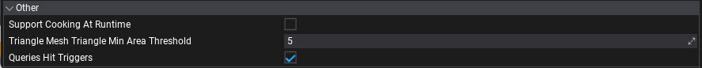

# Physics Settings

**Physics Settings asset** is used to specify the initial physics simulation configuration. In fact, some of its options can be set only on physics engine startup so using that asset may be required. Hovewer, most of the physics simulation options can be adjusted at runtime using [Physics](https://docs.flaxengine.com/api/FlaxEngine.Physics.html) class.

## Create physics settings

1. Navigate to the Content directory in the *Content* window

2. Right-click and select option **New -> Settings**, specify the asset name (eg. *Physics Settings*) and hit *Enter*
    

3. Choose option **Physics Settings** and press **Create** button
    

4. Double-click on an asset to open it and edit
    

## Use physics settings

You can create as many physics settings as you want (even special versions per platform) but only one can be used during game building. Use **Game Settings** asset (always located in `Content/GameSettings.json`) to link the physics options. If your game is using more advanced configuration you can edit the game settings from code in your build script (use [GameSettings.Load](https://docs.flaxengine.com/api/FlaxEditor.Content.Settings.GameSettings.html#FlaxEditor_Content_Settings_GameSettings_Load) and [GameSettings.Save](https://docs.flaxengine.com/api/FlaxEditor.Content.Settings.GameSettings.html#FlaxEditor_Content_Settings_GameSettings_Save__1___0_) from C# API).

## Simulation options

| Property | Description |
|--------|--------|
| **Default Gravity** | The default gravity value (in cm/(s^2)). |
| **Bounce Threshold Velocity** | Minimum relative velocity required for an object to bounce. A typical value for simulation stability is about 0.2 * gravity. |
| **Friction Combine Mode** | The default friction combine mode, controls how friction is computed for multiple materials. Possible options: <table><tbody><tr><th>Option</th><th>Description</th></tr><tr><td>**Average**</td><td>Uses the average value of the touching materials: (a+b)/2.</td></tr><tr><td>**Minimum**</td><td>Uses the smaller value of the touching materials: min(a,b).</td></tr><tr><td>**Multiply**</td><td>Multiplies the values of the touching materials: a*b.</td></tr><tr><td>**Maximum**</td><td>Uses the larger value of the touching materials: max(a, b).</td></tr></tbody></table>||
| **Restitution Combine Mode** | The default restitution combine mode, controls how restitution is computed for multiple materials. Possible options: <table><tbody><tr><th>Option</th><th>Description</th></tr><tr><td>**Average**</td><td>Uses the average value of the touching materials: (a+b)/2.</td></tr><tr><td>**Minimum**</td><td>Uses the smaller value of the touching materials: min(a,b).</td></tr><tr><td>**Multiply**</td><td>Multiplies the values of the touching materials: a*b.</td></tr><tr><td>**Maximum**</td><td>Uses the larger value of the touching materials: max(a, b).</td></tr></tbody></table> |
| **Disable CCD** | If checked, CCD will be ignored. This is an optimization when CCD is never used which removes the need for physics engine to check it internally. |
| **Broad Phase Type** | Broad phase algorithm to use in the simulation. Possible options: <table><tbody><tr><th>Option</th><th>Description</th></tr><tr><td>**Sweep And Prune**</td><td>3-axes sweep-and-prune. Good generic choice with great performance when many objects are sleeping.</td></tr><tr><td>**Multi Box Pruning**</td><td>Alternative broad phase algorithm that does not suffer from the same performance issues as SAP when all objects are moving or when inserting large numbers of objects.</td></tr><tr><td>**Automatic Box Pruning**</td><td>Revisited implementation of MBP, which automatically manages broad-phase regions.</td></tr><tr><td>**Parallel Automatic Box Pruning**</td><td>Parallel implementation of ABP. It can often be the fastest (CPU) broadphase, but it can use more memory than ABP.</td></tr></tbody></table>||
| **Enable Enhanced Determinism** | Enables enhanced determinism in the simulation. This has a performance impact. |
| **Solver Type** | The solver type to use in the simulation. Possible options: <table><tbody><tr><th>Option</th><th>Description</th></tr><tr><td>**Projected Gauss Seidel Iterative Solver**</td><td>The iterative sequential impulse solver</td></tr><tr><td>**Temporal Gauss Seidel Solver**</td><td>Non linear iterative solver. This kind of solver can lead to improved convergence and handle large mass ratios, long chains and jointed systems better. It is slightly more expensive than the default solver and can introduce more energy to correct joint and contact errors.</td></tr></tbody></table>|

> [!TIP]
> When Continuous Collision Detection (**CCD**) is turned on, the affected rigid bodies will not go through other objects at high velocities (a problem also known as *tunnelling*).

## Framerate options

| Property | Description |
|--------|--------|
| **Max Delta Time** | The maximum allowed delta time (in seconds) for the physics simulation step. |
| **Enable Substepping** | Whether to substep the physics simulation. |
| **Substep Delta Time** | Delta time (in seconds) for an individual simulation substep. |
| **Max Substeps** | The maximum number of substeps for physics simulation. |

## Layers Matrix options

Flax physics simulation supports layer-based collision detection. You can specify collisions mask for each layer that will be used to describe if objects from that layer can collide with objects from the other layers.

This uses the global layers settings and shows them as a layers matrix. Use checkboxes to define the layers collision mask.

## Other

| Property | Description |
|--------|--------|
| **Support Cooking At Runtime** | Enables support for cooking physical collision shapes geometry at runtime. Use it to enable generating runtime terrain collision or convex mesh colliders. |
| **Triangle Mesh Triangle Min Area Threshold** | Triangles from triangle meshes (CSG) with an area less than or equal to this value will be removed from physics collision data. Set to less than or equal 0 to disable. |
| **Queries Hit Triggers** | If checked, any [raycast](raycasting.md) or other scene query that intersects with a collider marked as a trigger will returns with a hit. Individual raycasts can override this behavior. |
