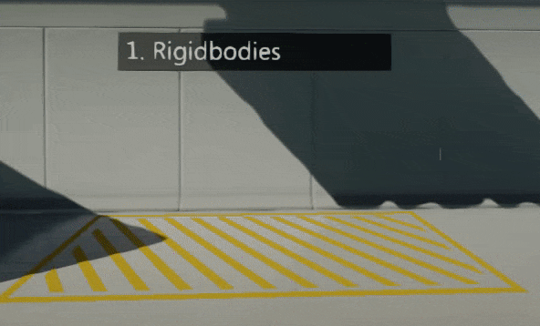
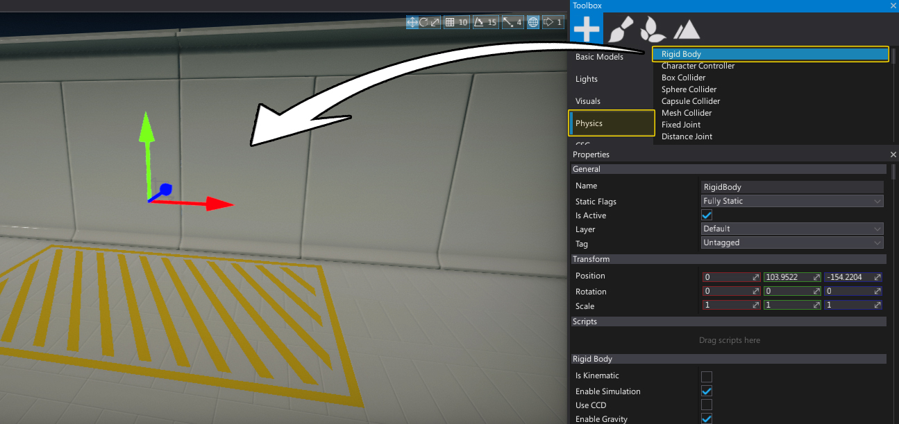
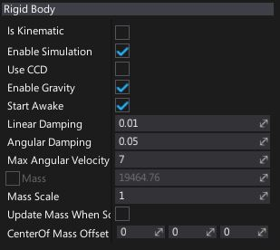

# Rigid Bodies



**Rigidbodies** are dynamic objects that can collide and provide physical behaviour. Their movement is based on physical forces, such as gravity. In general rigidbodies are good choise for objects that can be moved or pushes like boxes, furniture, and obstacles. Rigidbodies use attached [Colliders](colliders/index.md) to define their physical *shape*.

## Create a rigidbody

You can easily spawn a rigidbody actor right inside the editor using a *Toolbox* window or a context menu i the *Scene* window.



You can also spawn rigidbodies from C# code at runtime. Here is an example that spawns a bullet and shoots it:

```cs
var ball = RigidBody.New();
var ballCollider = SphereCollider.New();
var ballModel = StaticModel.New();
ballModel.Model = SphereModel;
ballModel.Parent = ball;
ballCollider.Parent = ball;
ball.UseCCD = true;
ball.Transform = Transform;
ball.LinearVelocity = Actor.Direction * 600.0f;
Destroy(ball, 5.0f);
```

## Properties



| Property | Description |
|--------|--------|
| **Is Kinematic** | If checked, enables kinematic mode for the rigidbody. See [Kinematic rigidbodies](rigid-bodies.md#kinematic-rigidbodies) section down below. |
| **Enable Simulation** | If checked, simulation and collisions detection will be enabled for the rigidbody. |
| **Use CCD** | If checked, Continuous Collision Detection (CCD) will be used for this object. |
| **Enable Gravity** | If checked, object should have the force of gravity applied. |
| **Start Awake** | If checked, object should start awake. Otherwise it will be initially be sleeping. |
| **Linear Damping** | Used to slow down an object. The higher the drag the more the object slows down. |
| **Angular Damping** | Used to slow down the rotation of an object. The higher the drag the more the rotation slows down. |
| **Max Angular Velocity** | Used to clamp the angular velocity of rigidbodies to avoid numerical instability with fast rotating bodies. Because this may prevent intentional fast rotations on objects such as wheels, you can override this value per rigidbody. |
| **Mass** | The object mass value is computed from the density and attached colliders (taking into account other parameters like *MassScale*). Use may override it by enabling *OverrideMass* and providing a custom value. |
| **Mass Scale** | Per-instance scaling of the mass. Used only for auto computed mass, not the overriden value. |
| **Update Mass When Scale Changes** | If checked, mass will be updated when actor scale changes. Used only when mass is not being overriden. |
| **Center Of Mass Offset** | Custom offset for the center of mass of this object, from the calculated location. In actor local space. |

## Kinematic rigidbodies

Kinematic rigidbodies are special dynamic actors that are not influenced by forces (such as gravity), and have no momentum. They are considered to have infinite mass and can push regular dynamic actors out of the way.Kinematics will not collide with static or other kinematic objects.

Kinematic rigidbodies are great for moving platforms or characters, where direct motion control is desired.

> [!NOTE]
> Kinematic rigidbodies are incompatible with CCD.


