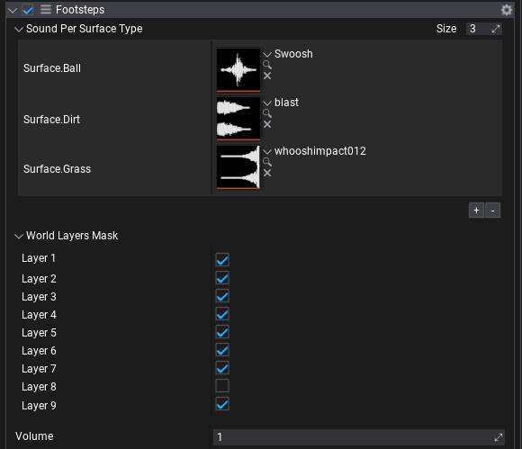
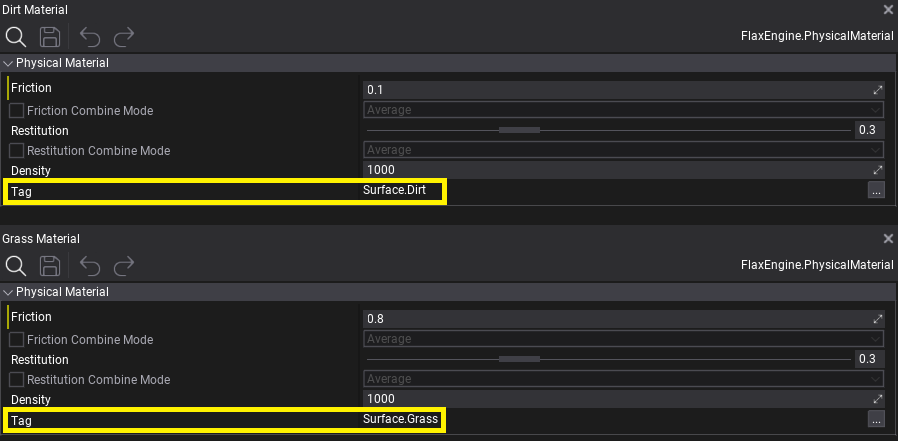

# HOWTO: Play footsteps on different surfaces

In this tutorial, you will learn how to create a script that will play different footstep sounds for the player depending on the surface type underneath. It uses raycasting down the player's feet to detect the physical material under the player and play matching sound effect. Script utilities `Tag` which improves readability of gameplay components (relation between physical material type and sound effect).

## 1. Create a script

Firstly we need to write a script (named for example `Footsteps`). It will handle the logic that detects the surface type and play the proper sound. To learn more about creating scripts see [this page](../../scripting/new-script.md).

```cs
using System.Collections.Generic;
using FlaxEngine;

public class Footsteps : Script
{
    /// <summary>
    /// Maps surface type (Tag rom Physical Material) to the audio clip for footstep playback.
    /// </summary>
    public Dictionary<Tag, AudioClip> SoundPerSurfaceType = new();

    /// <summary>
    /// Mask with all layers of the world object - except player (to prevent raycasting itself).
    /// </summary>
    public LayersMask WorldLayersMask = LayersMask.Default;

    /// <summary>
    /// Sound volume.
    /// </summary>
    public float Volume = 1.0f;

    public override void OnUpdate()
    {
        // This can exist in AnimEvent for animated character footsteps or in player movement script
        // For explanation purpose, run on Spacebar key
        if (!Input.GetKeyDown(KeyboardKeys.Spacebar))
            return;

        // Raycast physical surface below the actor
        var feetLocation = Actor.Position;
        if (Physics.RayCast(feetLocation, Vector3.Down, out RayCastHit hit))
        {
            // Try get sound for a specific physical surface material (empty tag as a fallback)
            var tag = hit.Material ? hit.Material.Tag : new Tag();
            if (SoundPerSurfaceType.TryGetValue(tag, out AudioClip sound))
            {
                // Play sound at feet position (with auto-destroy)
                var source = new AudioSource
                {
                    HideFlags = HideFlags.DontSave,
                    Volume = Volume,
                    Clip = sound,
                    Position = feetLocation,
                };
                Level.SpawnActor(source);
                source.Play();
                Destroy(source, sound.Length);
            }
        }
    }
}
```

## 2. Setup a script



Add a script to the created player or test actor, uncheck the layer with player actor from `WorldLayersMask`, and setup `SoundPerSurfaceType` to contain various surface types. That dictionary maps `Tag` into `AudioClip`. Tag has to match tag assigned in [Physical Material](../physical-material.md). It is a common practice to use namespaces for better organization of the surface types. For example, `Surface.Dirt`, `Surface.Metal` and so on.



## 3. Test it out!

Hit **Play** button and test script by pressing `Spacebar` key to test sound when actor is above certain collider - it works with [Terrain](../../terrain/collision.md) layers too.
