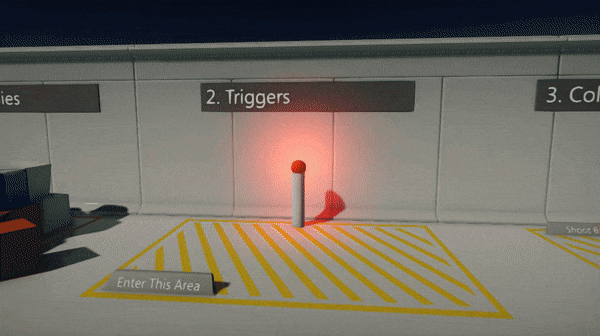
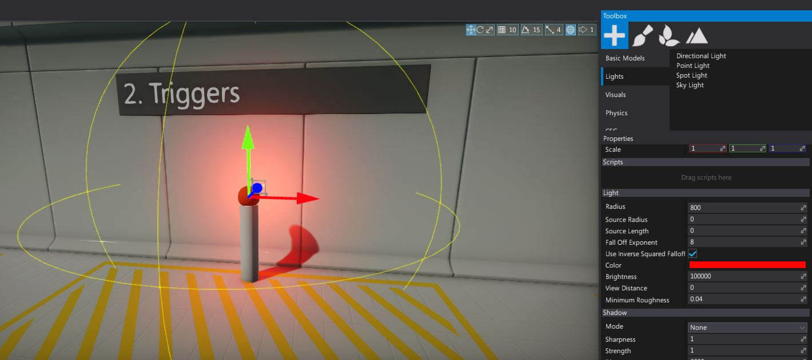
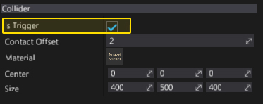
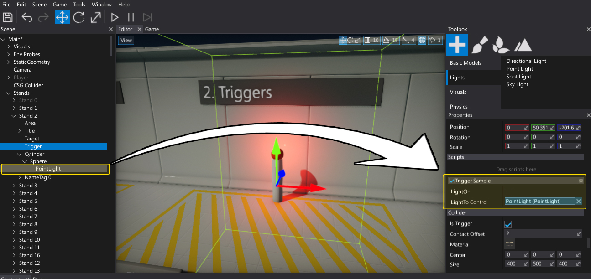

# HOWTO: Use a trigger



In this tutorial you will learn how to create and use a box trigger to switch the light color if players enters the trigger area.

See [Triggers](../triggers.md) page to learn more about triggers.

## 1. Create a light

Firstly we need to spawn a point light (it can be other type of light) and place it somewhere in the level near the trigger. So player can see the light color change.



## 2. Create a collider

Drag and drop the **Box Collider** from the *Toolbox* window (*Physics* section) and adjust it's shape to match the desired area.


## 3. Check `Is Trigger`

Created Box Collider will block objects and generate collisions. We want to just get the event from the other objects entering this volume so set the **Is Trigger** flag to `true`.



## 4. Create a script

Next step is to write a C# script (name it `TriggerSample`). It will handle the trigger event and implement the desired logic. To learn more about creating scripts see [this page](../../scripting/new-script.md).

```cs
public class TriggerSample : Script
{
    [Serialize]
    private bool _lightOn;

    public Light LightToControl;

    [NoSerialize]
    public bool LightOn
    {
        get { return _lightOn; }
        set
        {
            _lightOn = value;
            if (LightToControl)
                LightToControl.Color = value ? Color.Green : Color.Red;
        }
    }

    public override void OnStart()
    {
        // Restore state
        LightOn = _lightOn;
    }
    
    public override void OnEnable()
    {
        // Register for event
        Actor.As<Collider>().TriggerEnter += OnTriggerEnter;
        Actor.As<Collider>().TriggerExit += OnTriggerExit;
    }
    
    public override void OnDisable()
    {
        // Unregister for event
        Actor.As<Collider>().TriggerEnter -= OnTriggerEnter;
        Actor.As<Collider>().TriggerExit -= OnTriggerExit;
    }

    void OnTriggerEnter(Collider collider)
    {
        // Check for player
        if (collider is CharacterController)
        {
            LightOn = true;
        }
    }

    void OnTriggerExit(Collider collider)
    {
        // Check for player
        if (collider is CharacterController)
        {
            LightOn = false;
        }
    }
}
```

## 5. Setup a script

Add a script to the created Box Collider and attach a reference to the light (edit **LightToControl** property).
You can also test if it works by using the **LightOn** checkbox.



## 6. Test it out!

Hit **Play** button and enter you player character right into the trigger to see the light changing its color.


