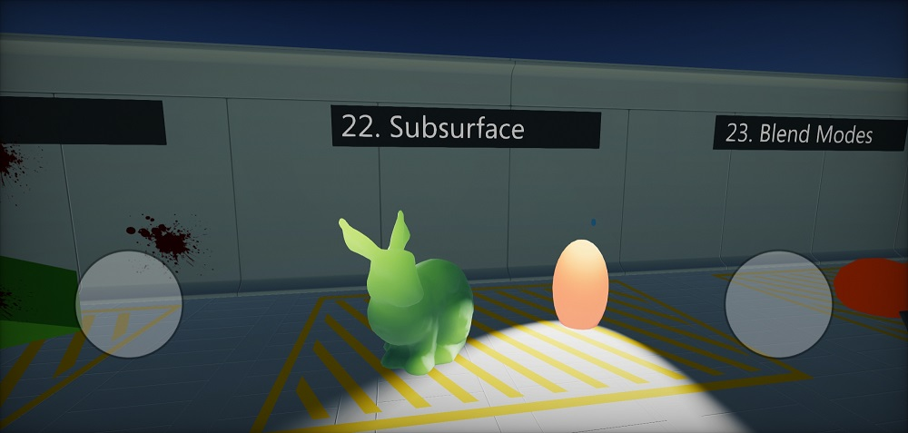

# Android



## Technical information

Flax is compiled for Linux platform using **Android NDK** and build with **Android SDK**. Supported are system version Android 7 or newer (platform API level 24). Flax uses **Vulkan** for rendering graphics on Android (min. Vulkan 1.0).

## Android Setup

Follow these steps to setup your development PC for building game for Android platform. In case of problems, please follow official documentation of Android platform.

* Download and install **Android Studio** ([https://developer.android.com/studio](https://developer.android.com/studio))
  * Install **Android SDK** within Android Studio setup.
  * Set `ANDROID_HOME` env var to SDK location (typically `C:\Users\USERNAME\AppData\Local\Android\android-studio\sdk` on Windows)
* Install **NDK**
  * via Android SDK Manager: *Android SDK -> SDK Tools -> NDK (side by side)*
  * or manually via [https://developer.android.com/ndk/downloads/index.html](https://developer.android.com/ndk/downloads/index.html) and set `ANDROID_NDK` env var to install location
* Install **Java**
  * use in-built from Android Studio: set `JAVA_HOME` env var to `<android-studio>\jbr`
  * or download manually from [https://jdk.java.net/19](https://jdk.java.net/19) and set env var `JAVA_HOME` to jdk root folder
* Install **.Net Android Workload**
  * Run `dotnet workload install android` via command line
  * More info: [https://learn.microsoft.com/en-us/dotnet/core/tools/dotnet-workload-install](https://learn.microsoft.com/en-us/dotnet/core/tools/dotnet-workload-install)
* (when using Flax from Launcher) Install Android Platform Tools for Editor installation via Flax Launcher

### Troubleshooting

* Ensure to [accept software licenses](https://stackoverflow.com/questions/39760172/you-have-not-accepted-the-license-agreements-of-the-following-sdk-components) from Android SDK
* Verify that environment variables are properly set:
  * On Windows: `echo %ANDROID_HOME%`, `echo %JAVA_HOME%`
  * On Linux/Mac: `echo $ANDROID_HOME`, `echo $JAVA_HOME`
* If you're getting the error `Missing NET SDK runtime for Android ARM64.` then install Android workload for dotnet (as mentioned above). It contains .Net libs and runtime for Android required to run C#.

## Build options

See *Game Cooker* window.

| Property | Description |
|--------|--------|
| **Output** | The built game output folder (relative to the project). |
| **Show Output** | If checked, after building the output folder will be shown in an Explorer. |
| **Configuration Mode** | Game building mode. Possible options: <table><tbody><tr><th>Option</th><th>Description</th></tr><tr><td>**Release**</td><td>The release build ready for shipment.</td></tr><tr><td>**Debug**</td><td>The debug build for testing and profiling. Most of the code optimizations are disabled for the best debugging experience.</td></tr><tr><td>**Development**</td><td>The development build for testing and profiling but is more optimized for runtime than Debug build.</td></tr></tbody></table>|

## Platform settings

See *Android Platform Settings* asset.

| Property | Description |
|--------|--------|
| **Package Name** | The application package name (eg. `com.company.product`). Custom tokens: `${PROJECT_NAME}`, `${COMPANY_NAME}`. |
| **Version Code** | The application version code (eg. 1, 12, 123). |
| **Minimum API Level** | The minimum Android API level (eg. 20, 28, 34). |
| **Target API Level** | The target Android API level (eg. 20, 28, 34). |
| **Permissions** | The application permissions list (eg. `android.media.action.IMAGE_CAPTURE`). Added to the generated manifest file. |
| **Default Orientation** | The default screen orientation. |
| **Textures Quality** | The output textures quality (compression). |
| **Override Icon** | Custom icon texture to use for the application (overrides the default one). |

## C\+\+ Debugging

* Install `C++ Android development tools` via Visual Studio Installer
* Build game for android to `.apk` and install it on the device
* Regenerate scripts projects files
* Set startup project to one named `Android`
* Edit that project properties: `Debugging -> Package To Launch` set your apk path in `Package to Launch` and set `Additional Symbol Search Paths` to game cooker output location folder with `libFlaxGame.so` file for the target arch ARM64 (`<output>/app/jniLibs/arm64-v8a`)
* Run the Android project with a debugger on an device

Optionally you can install apk manually and attach to it with
* Use `Debug -> Attach to Android Process`
* Once debugger is attached you can insert breakpoints and debug the game code

To fix some problems with `gdb` debugger inside Visual Studio do:
* Add environment variable on Windows `HOME=C:/Users/yourusername` where `yourusername` is your Windows username
* Restart Visual Studio (if opened)
* Create `.gdbinit` file in that `HOME` directory with the contents:
```
handle SIGXCPU SIG33 SIG35 SIG36 SIGPWR nostop noprint
```

## Android adb logs collecting

Debug and Devlopment builds are using low-level Android logger to output engine and game logs directly to the `adb`.
Use `.\adb.exe -d logcat Flax:I *:S` to listen for game logs on device.

## Vulkan debugging

* Build Debug build
* Copy `libVkLayer_khronos_validation.so` (optionally other validation libs) from `NDK/sources/third_party/vulkan/src/build-android/jniLibs/arm64-v8a` or from [official website](https://developer.android.com/ndk/guides/graphics/validation-layer) to output Gradle project libs folder (`<output>/app/jniLibs/arm64-v8a`)
* Monitor adb output log with Vulkan Validation layer logs
* Note that game performance will be lower (esp. CPU) due to additional validation of the GPU commands

## Additional notes

- Flax exposes Gamepad for Android device at index 0 which can be used to vibrate the device or read the Back key pressed by the user during gameplay
- To enable device vibrations add `android.permission.VIBRATE` to the permissions list in Android Platform Settings asset
- To enable device network state reading add `android.permission.ACCESS_NETWORK_STATE` to the permissions list in Android Platform Settings asset


