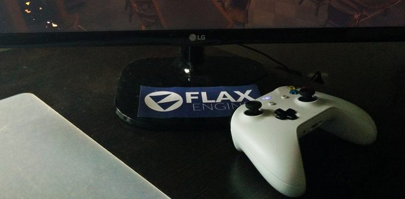

# Platforms

Flax is a **cross-platform game engine**. It means you can create your game once and deploy to many platforms at once. The engine itself takes care of platform differences, graphics backends, and scripting environment. This helps with games development and it one of the essential parts of the game engines.

This section covers the specific information for different aspects of each platform.

## Supported platforms

* [Windows Desktop 7, 8, 10](windows.md)
* [Universal Window (UWP)](uwp.md)
* [Xbox One](xbox-one.md)

> [!TIP]
> To check on which platform game is running use [Application.Platform](https://docs.flaxengine.com/api/FlaxEngine.Application.html#FlaxEngine_Application_Platform). You can also use [preprocessor variables](../scripting/preprocessor.md) in your code.

## Supported graphics backends

* DirectX 10, 11, 12

