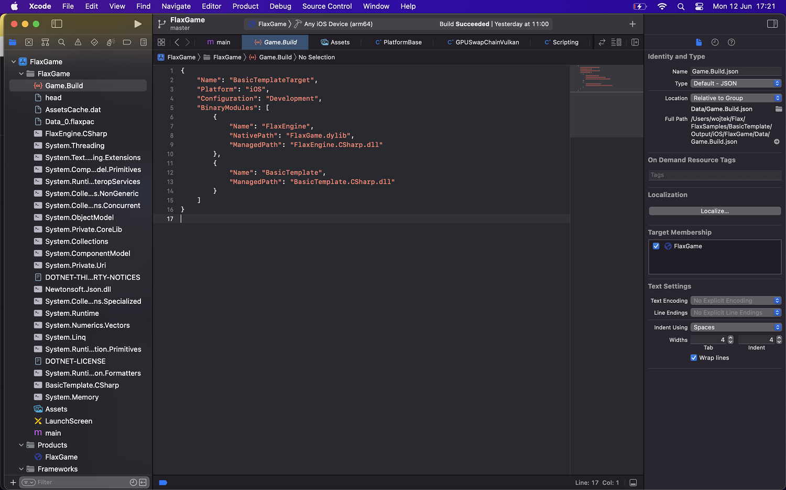
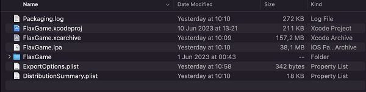

# iOS

## Technical information

Flax supports **iOS 14 or newer**. For graphics rendering Vulkan is used via MoltenVK to run on Metal.

iOS doesn't allow dynamic code execution thus Flax uses [AOT](../scripting/restrictions.md) in order to precompile C# code into native.

## iOS Setup

Follow these steps to setup your development PC for building game for iOS platform. In case of problems, please follow official documentation of iOS platform.

* Setup [Apple Developer](https://developer.apple.com/) account (including certificates and provision profiles for a game)
* Install **XCode**
* Install **.Net iOS Workload**
  * Run `dotnet workload install ios` via command line
  * More info: [https://learn.microsoft.com/en-us/dotnet/core/tools/dotnet-workload-install](https://learn.microsoft.com/en-us/dotnet/core/tools/dotnet-workload-install)
* Build and run Flax Editor on Mac ([https://github.com/FlaxEngine/FlaxEngine](https://github.com/FlaxEngine/FlaxEngine#mac))

### Troubleshooting

* If you're getting the error `Missing NET SDK runtime for iOS ARM64.` then install iOS workload for dotnet (as mentioned above). It contains .Net libs, tools and runtime for iOS required to run C#.
* To access game logs you can easily run the app from XCode project and insect the process output (from `NSLog`).
* iOS doesn't allow dynamic code execution thus Flax uses AOT in order to precompile C# code into native.

## XCode Project

When building a game for iOS, Flax will compile game code and cook content files into the XCode project that can be used to deploy and test on iOS devices. If *Skip Packaging* option is disabled in [Build Settings](../editor/game-settings/build-settings.md), then the Editor will also archive and export the game into a `.ipa` package which can be uploaded to the App Store for distribution.

To learn how to set up Apple Developer for the app building, testing, and distributing see the [official documentation](https://developer.apple.com/documentation/).

## Build options

| Property | Description |
|--------|--------|
| **Output** | The built game output folder (relative to the project). |
| **Show Output** | If checked, after building the output folder will be shown in an Explorer. |
| **Configuration Mode** | Game building mode. Possible options: <table><tbody><tr><th>Option</th><th>Description</th></tr><tr><td>**Release**</td><td>The release build ready for shipment.</td></tr><tr><td>**Debug**</td><td>The debug build for testing and profiling. Most of the code optimizations are disabled for the best debugging experience.</td></tr><tr><td>**Development**</td><td>The development build for testing and profiling but is more optimized for runtime than Debug build.</td></tr></tbody></table>|

## Platform settings

| Property | Description |
|--------|--------|
| **App Identifier** | The app identifier (reversed DNS, eg. com.company.product). Custom tokens: `${PROJECT_NAME}`, `${COMPANY_NAME}`. |
| **App Team Id** | The app developer name - App Store Team ID. For example: `VG6K6HT8B`. |
| **App Version** | The app version number (matches `CURRENT_PROJECT_VERSION` in XCode). |
| **Export Method** | The app export mode (if automatic packaging is not disabled via Build Settings, otherwise export app manually via XCode project). |
| **Supported Interface Orientations (iPhone)** | The UI interface orientation modes supported on iPhone devices. |
| **Supported Interface Orientations (iPad)** | The UI interface orientation modes supported on iPad devices. |
| **Override Icon** | Custom icon texture to use for the application (overrides the default one). |
