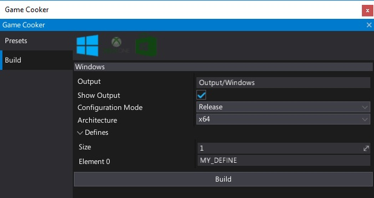
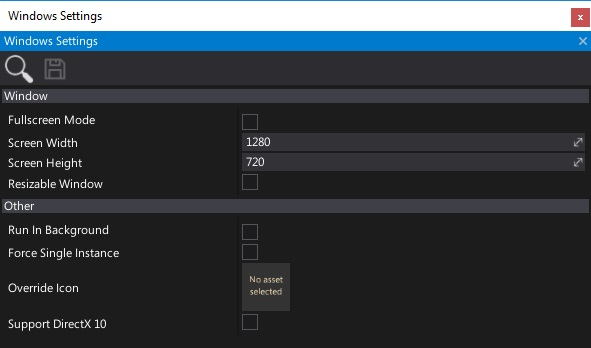

# Windows

## Technical information

Flax is compiled for Windows platform using Microsoft Visual C++ compiler. It uses **v140 toolset** (VC\+\+ 2015) and **Windows 10 SDK** (or Windows 8.1 SDK) with Multi-Threaded DLL runtime.

> [!Note]
> Flax requires **Visual C++ Redistributable for Visual Studio 2015** to be installed on Windows in order to start.

## Build options

| Property | Description |
|--------|--------|
| **Output** | The built game output folder (relative to the project). |
| **Show Output** | If checked, after building the output folder will be shown in an Explorer. |
| **Configuration Mode** | Game building mode. Possible options: <table><tbody><tr><th>Option</th><th>Description</th></tr><tr><td>**Release**</td><td>The release build ready for shipment.</td></tr><tr><td>**Debug**</td><td>The debug build for testing and profiling. Most of the code optimizations are disabled for the best debugging experience.</td></tr><tr><td>**Development**</td><td>The development build for testing and profiling but is more optimized for runtime than Debug build.</td></tr></tbody></table>|

## Platform settings

| Property | Description |
|--------|--------|
| **Window Mode** | The default game window mode. Possible options: <table><tbody><tr><th>Option</th><th>Description</th></tr><tr><td>**Windowed**</td><td>The window has borders and does not take up the full screen.</td></tr><tr><td>**Fullscreen**</td><td>The window exclusively takes up the full screen.</td></tr><tr><td>**Borderless**</td><td>The window behaves like in Windowed mode but has no borders.</td></tr><tr><td>**Fullscreen Borderless**</td><td>Same as in Borderless, but is of the size of the screen.</td></tr></tbody></table> |
| **Screen Width** | The default game window width (in pixels). |
| **Screen Height** | The default game window height (in pixels). |
| **Resizable Window** | Enables resizing the game window by the user. |
| **Run In Background** | Enables game running when application window loses focus. |
| **Force Single Instance** | Limits maximum amount of concurrent game instances running to one, otherwise user may launch application more than once. |
| **Override Icon** | Custom icon texture to use for the application (overrides the default one). |
| **Support DirectX 12** | Enables support for DirectX 12. Disabling it reduces compiled shaders count. |
| **Support DirectX 11** | Enables support for DirectX 11. Disabling it reduces compiled shaders count. |
| **Support DirectX 10** | Enables support for DirectX 10 and DirectX 10.1. Disabling it reduces compiled shaders count. |
| **Support Vulkan** | Enables support for Vulkan. Disabling it reduces compiled shaders count. |
