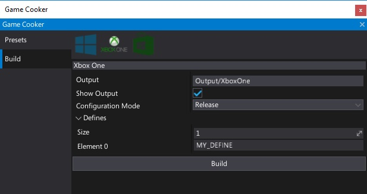
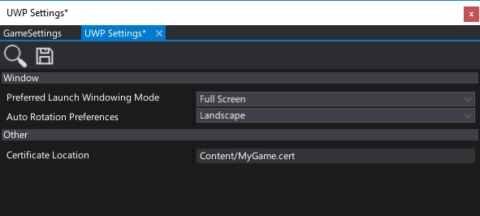

# Xbox One

## Technical information

Flax is compiled for Xbox One (via UWP) using Microsoft Visual C++ compiler. It uses **v141** (VC\+\+ 2017) toolset and **Windows 10 SDK** with Multi-threaded DLL runtime. All dependent libraries are used via static linking by the Flax Engine binary.

## Build options

| Property | Description |
|--------|--------|
| **Output** | The builded game output folder (relative to the project). |
| **Show Output** | If checked, after building the output folder will be shown in an Explorer. |
| **Configuration Mode** | Game building mode. Possible options: <table><tbody><tr><th>Option</th><th>Description</th></tr><tr><td>**Release**</td><td>The release build ready for shipment.</td></tr><tr><td>**Debug**</td><td>The debug build for testing and profiling. Most of the code optimizations are disabled for the best debugging experience.</td></tr><tr><td>**Development**</td><td>The development build for testing and profiling but is more optimized for runtime than Debug build.</td></tr></tbody></table>|
| **Defines** | Array of custom script defines to use during source code compilation. |

## Platform settings

| Property | Description |
|--------|--------|
| **Preferred Launch Windowing Mode** | *Not used on Xbox One. Always fullscreen mode.* |
| **Auto Rotation Preferences** | *Not used on Xbox One. No screen rotation.* |
| **Certificate Location** | The location of the package certificate (relative to the project). |

## Deployment

Building you game to support Xbox One platform is rather straighforward process hovewer you will need to have an acess to Xbox One or Xbox One S device that has Developer Mode activated. Follow these steps to build your game for Xbox One:

- Prepare you game to support Xbox One (remove or fix platform dependant code and verify gamepad support)
- Prepare you Xbox Developer account and Xbox Dev Kit
- Learn about Xbox One development by following the official Microsoft guidelines and documentation [here](https://docs.microsoft.com/en-us/windows/uwp/xbox-apps/getting-started)
- Ensure to have the newest **Windows 10 SDK** installed
- Open *Game Cooker*, and start **Build**
- Application certificate generator window will popup, Flax uses Windows SDK toolset to generate a temporary certificates that you can use for your app. Every store app needs to have a valid own certificate for code signing required by Microsoft policy
- Enter your game certificate password (note: you can use a custom certificate if you need, just specify its location in build settings)
- Wait for game cooking end (please note that Xbox One does not support runtime code generation so Flax needs to perform AOT on all C# assemblies including your game code)
- Open generated UWP project solution located in the build output directory
- Ensure to use `Debug` configuration mode (`Release` mode is not supported now due to dynamic libraries merging by the toolchain not maintained by Flax)
- Build solution (optionally perform Rebuild)
- Pick Xbox One device for remote deploy (connect your PC to the same network as Xbox One, eg. via WiFi). Follow Microsoft guidelines and documentation in this area.
- Press **Remote Machine** to start the app on device

After editing project content or source code, the amount of data to rebuild is relatively slow so your iteration times should be fairly good if you are porting your game to support Xbox One. Remember to follow Microsoft guidelines and documentation.

