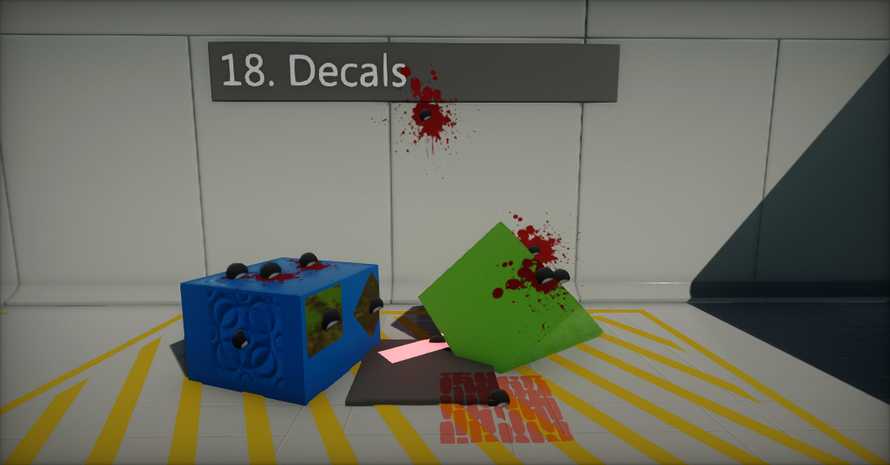

# Flax 0.1 release notes

## Highlights

### Decals

We've added a new material type: **Decal** and new **Decal Actor** which can be used to draw decal materials on top of the surface of the scene geometry. It's a very common and easy way to add special effects like blood drops, footsteps or more. Draw calls rendering is very optimized and fits needs of most of the games. To learn more about decals see the related documentation [here](../../graphics/decals/index.md).

### C# 7.2 support

Now you can use the newest **C# 7.2** features including:
* local functions
* binary literals
* digit separators
* pattern matching
* `out` variables
* expression bodied members
* `ref readonly`
* `private protected`
* and more...

The current Flax version includes [Roslyn](https://github.com/dotnet/roslyn) compiler and supports using the newest C# language version in your scripts.

### Editor Options

Now you can modify the editor options and keep the globally for all installed engine instanced. You can adjust scripts recompilation logic, change the interface, modify the selection outline colors and more.

## Changelog

### Version 0.1.6157 - 7 June 2018

* Added **Editor Options**
* Added scroll bar to tabs menu in Toolbox window
* Added live preview for the color picker
* Added caching expanded actor nodes in Scene Tree
* Added `Font.Asset` to get font object parent asset
* Added new event `Scripting.Exit` to handle engine closing
* Added calling Start function if Script is enabled for the first time from code at runtime
* Added support for Matrix parameter type for Materials
* Added dedicated MatrixEditor
* Added Depth node to Materials (linear distance of the pixel/vertex to the camera)
* Added Mask nodes to Material/AnimGraph to get swizzle values like X,Y or XY, ZW
* Added dragging the Material/AnimGraph parameter into the surface
* Added creating Material Instance from Material in Content Window
* Added spawning surface parameters getter node via context menu
* Added showing scene filename on a Scene Tree node name
* Rotate decal actor in Material Preview (easier to use on Plane model)
* Support importing TIFF files with extension `.tif`
* Improve Material/AnimGraph parameter renaming with left mouse double click
* Improve selecting actors in editor (don’t pick colliders if Physics Debug mode is off)
* Improve texture format auto-detection
* Improve gizmo and camera usage with Alt to orbit and move objects
* Improve internal C++ calls to prevent crashes in invalid object usage cases
* Improve C# assemblies debug symbols loading (don’t use pdb2mdb tool)
* Improve editor status strip message to use the editor state messages
* Improve filtering property name labels (cut common prefixes, share memory)
* Improve GPU and I/O async tasks cleanup and cancellation on exit
* Fix crash for Copy Bone if skeleton has only a single bone
* Fix crash when sampling material pixel shader surface properties in vertex shader
* Fix importing 1x1 texture with mipmaps generation turned on
* Fix crash when reimporting binary asset to the different type
* Fix crash when spawning in editor model with more than 300 meshes
* Fix drawing gizmos, editor primitives and debug shapes in debug render modes
* Fix setting scene modified flax on actor spawn
* Fix rare errors when reimporting the asset
* Fix `Camera.Viewport` property (invalid size)
* Fix removing tag from the actor
* Fix minor memory leaks
* Fix crash for empty PostFx/GUI material which is not using constant buffer

### Version 0.1.6156 - 1 June 2018

* Added **Decals** support
* Added **C# 7.2** support
* Upgrade to **Mono 5.12**
* Added SGen for C# Garbage Collection (multi-threaded GC)
* Added support for catching StackOverflowException
* Added Decal actor
* Added Material types: Decal and GUI
* Added selecting the material preview mesh (cube, sphere, plane, cylinder or cone)
* Added `atan2` function to materials
* Improve initial asset registry building (faster files discovery)
* Improve managed objects performance (don't pin persistent managed objects)
* Optimize scenes reload on scripts reload (keep data cached in memory)
* Optimize draw calls sorting performance (for 2k+ draw calls)
* Support `Position Offset` in layered materials
* Support sampling material layer that is using material layer input
* Support copy/paste files and folders in the Content Window
* Support calling Update/LateUpdate/FixedUpdate in editor for scripts marked with ExecuteInEditModeAttribute
* Improve materials compilation
* Optimize DirectX 11 backend state changes
* Swap Roughness with AO in GBuffer
* Use `CreateDXGIFactory1` on DirectX 11 backend (min Win7 support)
* Added scripts define `FLAX_X_Y_Z` for scripting to include patches
* Added tooltip to Visject Surface graph nodes with the node type
* Added C# API to copy folders and files with a system clipboard
* Fix Combobox text clipping
* Fix Character Controller collisions filter
* Fix many crashes on scripts reload in editor
* Fix C# various internal structures serialization
* Fix scriptis builder events sending
* Stability improvements related to meshes rendering
* Minor fixes

### Version 0.1.6155 - 20 May 2018

* Added feature to center the imported model geometry
* Added feature to copy/paste/cut/duplicate nodes in Material and Anim Graph editors
* Added support for range selection in Content Window with Shift key
* Changing Actor.Parent does not preserve the object world transformation (use Actor.SetParent(value, true) to keep it, otherwise local transform will be unchanged)
* Use editor viewport grid for the objects placement
* Implement ExecuteInEditModeAttribute
* Script events in editor (during editing) are now executed only for types with [ExecuteInEditMode] attribute assigned
* Support importing folders with contents
* Improve Env Probes usage with Auto Bake option set
* Improve startup on Windows 7 systems
* Improve spawning Visject Surface nodes via drag and drop
* Use First Person camera in the Collision Data asset editor
* Fix local transformation issue when using undo after reparenting actor
* Fix mouse pos when no capture
* Fixes for importing various model files
* Fixes for scripts that have base class other than Scritpt type (eg. Actor)
* Fix crash when updating the Collision Data asset
* Fix Animated Model update when offscreen (better sync and stable looping)
* Fix RayCast with layer specified
* Fix ShadowsMode deserialization for the meshes
* Fix black screen issue in a builded game
* Fix error when trying to create a new folder in a project root folder
* Fix Game Cooker progress reporting to be more thread-safe
* Serialize Sky.SunDiscScale
* Fix sampling textures in material’s vertex shader
* Fix initial OpenAL warning
* Fix error when dragging and dropping actors in tree structure

### Version 0.1.6154 - 15 May 2018

Initial release. We're getting started...
