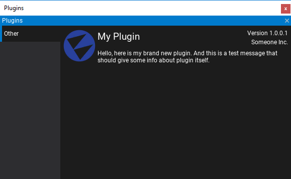
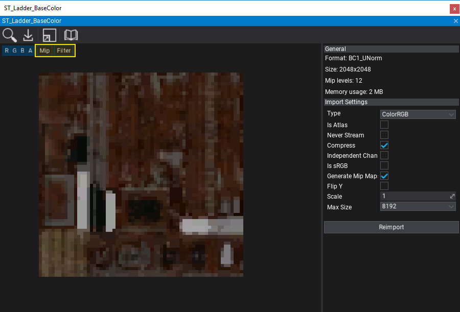

# Flax 0.2 release notes

## Highlights

### Nested Prefabs

We've added a new asset type: **Prefab**. It is used to build archetypes of actors and scripts to reuse them in games. The prefab acts like a template or an archetype which you can spawn in the scene. Any edits made to a prefab asset are immediately reflected in all instances produced from it but you can also override components and settings for each instance individually. This helps with creating advanced gameplay content. Also, **Flax supports nesting prefabs inside the prefabs out of the box!**

To learn more about prefabs see the related documentation [here](../../get-started/prefabs/index.md).

### Plugins

Now, Flax supports **Game Plugins** and **Editor Plugins**. Developers can also easly include .Net libraries to be used in game scripts. Flax plugins system allows adding custom functionalities and extending engine features. See the dedicated page [here](../../scripting/plugins/index.md) to learn more about creating and using plugins.

### Texture arrays and volume textures in materials

New material parameter types and improve render targets C# API enable developers to create and use 3D textures and texture arrays. Also, `GPUContext` has been updated to support rendering PostFx material to a single texture slice. New C# API allows creating advanced visual effects for your games such as volumetric clouds or water flow simulations on a GPU.

### Texture mipmap preview

Texture windows and Cube Texture windows contain now dedicated widgets to preview a single texture mipmap and an option to selected a sampler (point or linear). This helps with advanced game development and working with the textures content.

Also, many editor windows contain a dedicated button to the related documentation (opens a browser with Flax documentation).

### Scene serialization changes

Starting from this version scenes and actors collections will serialize scripts inlined in the actors data list, instead of inside parent actor. It is related to the scene objects serialization changes introduced during prefabs system implementation. The new engine version will still load scenes in the older format but serialized scenes will match the new design.

## Changelog

### Version 0.2.6167 - 2 September 2018

* Add **plugins support**
* Add `GamePlugin` class
* Add `EditorPlugin` class
* Add plugins manager window in Editor
* Add support for custom data stored in project cache
* Add loading plugin assemblies from the project and build game
* Add `Debug.Write` for direct message write to log
* Add support for accessing custom game settings at runtime
* Add helper C# API for editing custom game settings in editor
* Add `JsonAsset.CreateInstance<T>()` for easy settings object casting
* Add support for JsonAsset object from any loaded assembly
* Add support for  restoring custom editor windows on scripts reload
* Add `ScriptsBuilder.Compile` to build a custom solution
* Add support for **showing all files from Content directory** in editor
* Add support for renaming selected file in Content Window with F2 key
* Add `Version` editor
* Add a reference to FlaxEditor assembly for game scripts in Editor
* Add showing tooltip with full type name in add script popup
* Add support for adding scripts from all loaded assemblies (including plugins)
* Add `EditorIcons` container for faster editor icons caching
* Optimize logging by managed code
* Optimize control and script types searching in editor
* Fix too frequent editor cache saving
* Fix typos

### Version 0.2.6166 - 28 August 2018

- Add support object ids mapping inside scripts (use `ObjectIdModifier` on deserialization)
- Add `ISceneObject` interface to unify various functionalities for both Scripts and Actors
- Add `TextLayoutOptions.Scale`
- Improve text layout
- Improve Mono backend performance
- Improve object references handling in scripts in prefabs
- Improve reverting changes to prefab for ISceneObject references
- Increase **default editor update rate to 60 FPS** and reduce physics update
- Remove deprecated `Globals.LocalizationFolder` and `Globals.ConfigFolder`
- Fix rare crashes on prefabs apply
- Fix Script callback searching (better method signature query)
- Fix using Script callback methods in base classes that use generic parameters

### Version 0.2.6165 - 26 August 2018

Contributors: klukule, stefnotch

* Add **Nested Prefabs**
* Add creating, editing and using prefab assets
* Add restoring prefab instance changes or per property value
* Applying prefab instance change to the prefab asset
* Add `PrefabManager` (use `SpawnPrefab` to instantiate prefab)
* Add prefab thumbnails rendering
* Add dedicated prefabs editing window
* Add `Editor.GetActorEditorBox` and `Editor.GetActorSphere`
* Add `Vector3.Distance2D` and `Vector3.Distance2DSquared`
* Add `Actor.ScriptsCount` and `Actor.GetScript(int index)`
* Add `Actor.GetScriptInChildren` and `Actor.GetScriptsInChildren`
* Add `SceneRenderTask.FrameCount`
* Add Actors query methods to get child actors and scripts via C# type (except generic methods)
* Add `TextRender.UpdateLayout` to sync vertex buffer and bounds manually after modification
* Add `Tangent Vector` and `Bitangent Vector` node types to materials graph
* Add *lazy init* for C# objects for Actors
* Add methods to Render2D to draw texture/sprite with point sampler(except of linear)
* Add support for volume render targets and render target arrays
* Add material parameter types: **RenderTargetArray**, **RenderTargetCube** and **RenderTarget3D**
* Add *Pi* node to material and anim graph
* Add C# API to clear per render target mip or array/depth slice
* Add C# API to render PostFx material to a texture mip or array/depth slice with configured viewport
* Add C# API for the render target surface views
* Add functionality to create a new node in Visject when creating a new connection
* Add support for sampling texture arrays and volume textures in materials
* Add showing texture mip map in editor window
* Add showing texture using point sampler in editor window
* Add showing mip, custom channels mask or changing filter for cube texture preview
* Add UseVSync option to Graphics Quality Window in Editor
* Add changing scene preview brightness per editor viewport
* Add support for custom sampling Cube Textures in materials
* Add sync for lightmap textures set streaming
* Add using mipmaps from lightmap
* Add using script folder location to namespace of the created script in Editor
* Add highlighting the mesh when dragging a material over it
* Add `Int2` and `Int3` types to math library
* Add `Decal.CreateVirtualMaterialInstance` utility function
* Add F6 shortcut in Editor to pause/resume play in editor
* Add extension methods for random streams and collections utilities
* Add help buttons in editor with links to documentation
* Add logging inner exception via Debug
* Add `GraphicsDevice.NativePtr`
* Add more invalid characters filtering for renaming assets validation
* Add reference to Newtonsoft.Json library for game code scripts (Assembly and Assembly.Editor)
* Add throwing Null Reference exception when using deleted object
* Add selecting dockpanel tab in editor via drag and drop
* Initialize UIControl and UICanvas during Actor Init rather than BeginPlay event
* Refactor Scripts and Actors to be treated as unified Scene Objects by more Engine parts
* Refactor Scripts serialization in Scene files (inline Scripts in the scene objects collection and use ParentID for parent actor linkage)
* Rename `UIControl.AddChild<T>()` to `UIControl.AddChildControl<T>()` to prevent overlapping with the Actor class method
* Improve actors deserialization performance
* Improve baked lightmaps post processing to reduce artifacts
* Update Newtonsoft.Json to 11.0.2
* Use models instead of DebugDraw for TransformGizmo parts drawing
* Modify Render2D draw methods with alpha blending
* Optimize C# GUI
* Optimize Decals projection model complexity
* Optimize `Actor.Scripts` getter if actor has no scripts
* Optimize Scene Graph building in Editor
* Reduce memory allocations during rendering
* Improve content loading and streaming threads responsiveness
* Disable auto connecting in Visject
* Modify objects disposing service to collect more objects per frame if needed
* Rename `Actor.ChildCount` to `Actor.ChildrenCount`
* Fix AO Intensity serialization issue
* Fix crash related to model asset material slots count
* Fix lightmap mip maps generation
* Fix lightmap textures binding when streamed
* Fix TextRender bounds before transform update
* Fix FocalDistance deserialization issue
* Fixed a up/down arrow key bug in Visject context menu
* Fix crash when importing some FBX models
* Fix material instance parameters synchronization with base material
* Fix positioning spawned point and spot light in editor via drag and drop
* Fix rare NaN in Depth Of Field shader
* Fix various typos in documentation comments
* Fix various DirectX 12 rendering issues and support MSAA
* Fix high CPU usage  by using Condition Variables by thread pool threads
* Fix various crashes for huge amount of tasks cancellations
* Fix textbox control transparency
* Fix crash when casting float4 to float in materials
* Fix lightmap texels filter to reduce negative coefficients and improve texels blurring
* Fix lightmap mipmaps generation and usage
* Fix typos
* Fix many bugs and crashes
