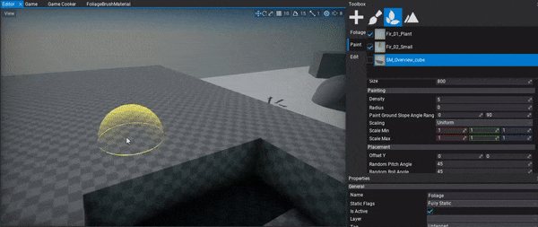
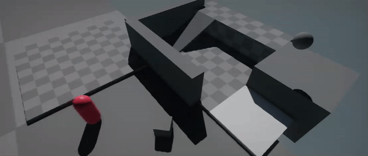
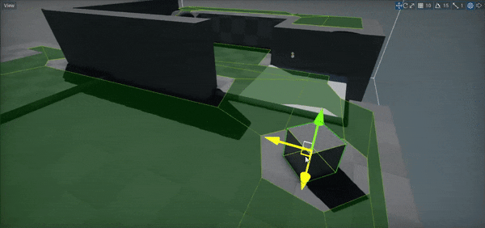
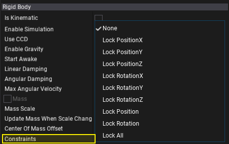

# Flax 0.4 release notes

## Highlights

### Foliage

New **Foliage** system will definitely improve open world games development and complete the recently added terrain system. The most important purpose of the foliage system is that it can easily scale and result in very solid performance. If your game needs huge open worlds full of trees, grass, and rocks then you definitely need to use foliage system. It supports placing and rendering hundreds of thousands of foliage instances in the level with no performance drop.

Each foliage actor contains a list of predefined foliage types and a collection of foliage instances. Each foliage type defines the model asset to use for rendering, placement properties, and painting properties. Each foliage instance contains information about what type it uses and the actual placement transformation in the world. Both instances and types collections are encapsulated inside the foliage actor internally to improve performance.

Flax Editor contains ready to use tools for creating and editing foliage however the whole system can be used directly from code to generate procedural foliage at runtime in your game.

To learn more about foliage see the related documentation [here](../../foliage/index.md).

### Nav Mesh and Navigation

We've added **Navigation** support and pathfinding utilities for various types of games. You can use navigation system to control how AI characters and other objects navigate around the game environment without colliding with the walls and avoiding obstacles.

Navigation system uses **Navigation Meshes** (shorten as navmeshes) which are polygon surfaces that define the 'walkable' area of the scene. They are used to query paths for objects to navigate around the game level.
Flax supports both runtime generated navmesh and prebuild in Editor. The navmesh building process is asynchronous and does not block game logic thread. Progress reporting is also supported.

To learn how to use it in your game see [this section](../../navigation/index.md).

### Custom AnimGraph nodes support

**AnimGraph** has become a fully features evironment for creating various types of animated objects. While we keep adding new nodes and improving performance of the existing ones there will be always a need to extend the default behaviour. Now, we would like to introduce a **Custom Nodes** support for Anim Graph! Using this feature you can easily define and implement own Anim Graph nodes to implement literally anything for animations processing.

This feature can be used to fetch data from external animation source such as live-rig, or to implement custom IK solver. Also, plugins can contain custom nodes to be reused across different projects.

We've prepared a sample tutorial about custom nodes usage [here](../../animation/anim-graph/custom-nodes.md).

### Null Renderer

**Null Renderer** is a feature which allows you to run the engine without rendering backend. If you are doing your game builds in a cloud using command line you can pass flag `-null` to disable GPU rendering. This can be used to improve the performance when graphics rendering is not required (also for server builds).

### Locking Rigidbody positon/rotation axis

Now, Flax supports **rigidbody constraints**. This feature can be used to lock the object rotation or position on a certain set of axes. If you want to allow player to slide a box only over single axis and prevent its rotation just use this feature to freeze the rigidbody movement to a certain level freedom.

### Rendering quality and performance improvements

We always keep working on Flax Renderer. This time we've:
* Added **Subpixel Morphological Antialiasing (SMAA)**
* Added **Temporal Antialiasing (TAA)** - preview
* Improved **Screen Space Reflections (SSR)** - more stable and in HDR
* Improved **Screen Space Ambient Occlusion (SSAO)** - better quality on far distance
* Improved rendering flow

## Changelog

### Version 0.4.6179 - 26 February 2019
* Add **Foliage** system
* Add various foliage tools for **spawning and editing foliage**
* Add utility method for finding actors and scripts by type
* Add **Custom Anim Graph nodes** support
* Add support for custom nodes in visject surface (from game scripts and plugins)
* Add bone to node mapping for skinned model skeleton (in c# api)
* Add skinned model skeleton nodes c# api
* Add **rigidbody constraints** support
* Add showing skinned model nodes hierarchy in editor window
* Add Linearize Depth node to materials
* Add `InputEvent.Dispose`
* Add `Show Selection Outline` editor option
* Add **Navigation** system
* Add *Nav Mesh Bounds Volume* actor type
* Add *Nav Link* actor type
* Add navigation mesh building and related tools
* Add helper events to SceneEditingModule for easier extending Editor
* Add `BoxCollider.OrientedBox` getter
* Add *Navigation Settings* asset for navmesh configuration
* Add more **Debug Draw** rendering features (wireframe, solid, transparent, triangles, vertex indexing)
* Add orthographic projection support for editor viewports
* Add setter to `Camera.MainCamera`
* Add *StaticFlags.Navigation*
* Add separate `DebugDraw.DrawWire*` methods for wireframe debug shapes rendering and `DebugDraw.Draw*` methods for solid debug shapes rendering
* Add alpha blending support for DebugDraw shapes rendering
* Add context menu to debug window log entries
* **Improve Screen Space Reflections quality** (better temporal reconstruction filter and HDR)
* Add helper Vector3 distance method with ref input but return result
* Add profile events for drawing foliage and terrain (cpu events)
* Add GetNodeByName and GetBoneByName to SkinnedModel
* Add profile events support for DirectX 12 backend
* Add queries support for DirectX 12 backend
* Add improved Visject nodes connections updating when changing type of variable type node
* Add **Snap to ground** feature for editor gizmo (with End key)
* Add `AlphaBlendMode` to engine C# API and `Mathf.InterpolateAlphaBlend`
* Add more value interpolation methods to Mathf library
* Add `IDrawable`
* Add explicit casting methods for Int2/3/4 structures to float vectors
* Add error if material uses too many textures
* Add **Temporal Antialiasing** support (preview)
* Add jitter projection matrix support
* Add anti-aliasing method option to PostFx Volume
* Add **Subpixel Morphological Antialiasing (SMAA)** support
* Add setter for `Script.Actor` for easy reparenting scripts
* Add F, 1, 2, 3 shortcuts to Scene Tree window
* Add support for zooming in Editor viewport with mouse scroll without pressing mouse
* Add warning when user tries to add generic type script to the actor (not supported)
* Increase Shader Resources binding limit to 32
* Increase default Env Probe near plane to 10
* Expand `SkinnedModel` C# API for editing skeleton from code (user can modify both nodes and bones hierarchy)
* Refactor actors and other objects intersection methods to output hit normal vector
* Optimize rigidbodies transformations synchronization
* Focus scene search box on Ctrl+F
* Optimize drawing shapes using DebugDraw
* Implement serialization for all basic types in Visject Surface
* Skip editor primitives when spawning item in viewport via drag and drop
* Rename Flax.Build to Flax.BuildLogger
* Disable restore windows layout button if no layouts are saved
* Remove `Input.ScanGamepads` as engine will always automatically scan for gamepads change
* Disable clamping screen space reflections color and use HDR format for resolve pass
* Remove `PostFxVolume.Center` property
* Show all assets in content window (even in-build flax types)
* Refactor editor viewports View widget to use subcategory for showing things
* Fix adding and rigidbodies and editing them right after (deferred adding queue was an issue)
* Fix `AddRelativeForce` and `AddRelativeTorque` issues
* Fix and improve PostFx volume editing via gizmo handles
* Fix CapsuleCollider and CharacterController bounds drawing in debug view mode when using scale
* Fix Control.Defocus when one of the children has focus
* Fix showing context menu when it gets hidden on start
* Fix using animation speed as param
* Fix using custom postFx with inheritance for Render method
* Fix showing decals in env probes
* Fix SSAO artifacts near camera when using high radius
* Fix handling fields in editor that are declared with `readonly` keyword
* Fix C# scripts assembly reload crashes
* Fix using all parameter types in Anim Graph
* Fix infrequent directional light shadows issues
* Fix importing with Restore Materials on Reimport option enabled
* Fix CustomEditor values synchronization up on editing structure member
* Fix Visject surface scroll when menu is opened
* Fix creating terrain from heightmap/splatmap using format `R11G11B10_Float`
* Fix Visject context menu highlights drawing when score mark is visible
* Fix `Actor.AddChild` with *worldPositionStays* set to `false`
* Fix game scripts caching when initial compilation fails
* Fix directional light shadows on distance from world origin
* Fix clamping character controller Contact Offset if set to 0
* Fix invoking DebugDraw for scripts attached to Scene actor
* Fix removing state machine state (break incoming transitions)
* Fix texture mipmaps generation if texture uses alpha channel
* Fix PhysX crash when using negative scale on terrain
* Fix importing sRGB textures
* Fix using renderer cache for scene rendering during nested scene rendering
* Fix calling OnDisable on unlinking script from actor and OnEnable when link it back
* Fix crash when calling Destory on script during Start/Awake events
* Fix scrolling debug logs if none is visible on adding (eg. due to filtering)
* Fix UICanvas Enable/Disable events handling
* Fix opening files in Visual Studio (use proper view kind option and use project items search)
* Fix changing enum value to one of the subflags (eg. chaneg actor static flag from FullyStatic to Transform only)
* Fix preserving selected objects on play mode enter/exit in Editor
* Fix materials constant buffer binding (skip if not used)
* Fix game hiccups when scanning for gamepads update on Windows platform (it is done in a background now to prevent game logic stalls)
* Fix SSR when UseColorBufferMips is disabled
* Fix ScreenSize node in GUI material to return valid viewport dimensions
* Fix crash on play mode start when CSG brush was attached to rigidbody
