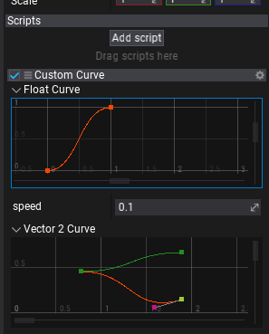
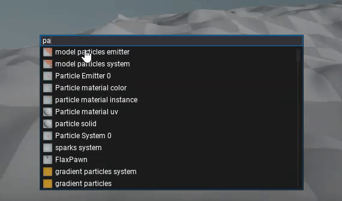
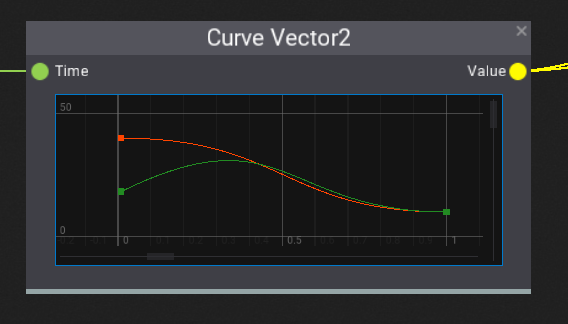
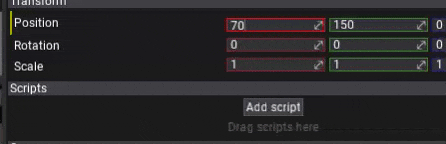

# Flax 0.5 release notes

## Highlights

### Particles

The major feature of this update is **particle support**. Particles are one of the most essential parts of modern games. Every time you see a fire, smoke, explosion or dust, you can be sure – those are particles. However, nowadays gamers and game developers are more demanding so we put lots of effort to create the particles system that will be able to bring more awesomeness to the games.

To do so Flax supports seamless **CPU and GPU particles simulation**, **high performant rendering** and provides a set of **great tools for content creators**. We know that visual effects are a major aspect of every game so we wanted to allow game developers to easily create particle emitters, define the simulations and construct everything from simple effects to complex particle systems.

See the related documentation to learn more [here](../../particles/index.md).

### Vulkan support

Now, Flax supports rendering graphics with **Vulkan**. Adding Vulkan backend enables us to move towards cross-platform gaming and better performance.

The current implementation supports full graphics pipeline and compute shaders (only stream-output and counter buffers are missing). We use descriptors pool manager to reuse descriptor set layouts and optimized pipeline binding to reduce API calls. The pipeline state objects are cached on request and reused later which reduces memory usage. Also using ring-buffer for uniforms data reduces descriptors changes due to dynamic offset assignment that is more efficient.

You can read more about on the [blog](https://flaxengine.com/blog/flax-facts-25-vulkan/).

### Curves editing

This update features many new additions to the scripting. This includes a new **Curve&lt;T&gt;** type and related editor tools. You can easily add curve object to your script and use it to animate objects or for general purpose. This comes very handy during game production and is now in-build engine feature.

### New script events

Our C# scripting keeps evolving. During this update, we refactored the script events and improved their execution performance. Firstly, deprecated `OnTriggerEnter/Stay/Exit`, `OnCollisionEnter/Stay/Exit`, and `OnJointBreak` events have been removed as using `Collider.TriggerEnter/Exit`, `Collider.CollisionEnter/Exit`, and `Joint.JointBreak` is more performant and allows developers to register for multiple colliders events in the same script instead of adding a script to collider actor. Secondly, we added the **virtual methods to Script base class** which makes it easier to override the proper method and get proper documentation right in the IDE. The simplified script events callbacks are easier to use and match better our engine design vision. Note: calling base methods of Script class is not required and can be skipped to safe performance.

Also, we updated the Flax Documentation and Flax Samples to include these changes. To help you upgrade your existing code please take a look at the improved documentation about script events [here](../../scripting/events.md).

### Content Finder tool

One of the greatest features added to Editor is **content finder tool**. This little dialog allows you to very quickly navigate around the whole project by simply pressing **Ctrl+O** anywhere and typing the search query. It can be used to browse through the content assets but also the scene actors so you can find literally anything.

This feature has been implemented by [JimiVacarians](https://github.com/JimiVacarians). Thanks!

### New command line options

As Flax is often used in various scenarios and we want to keep very agile here is a list of new command-line options added to the engine:
* `-vulkan` - use Vulkan rendering backend
* `-skipcompile` - skips the automatic C# scripts compilation on startup
* `-mute` - disables audio system (engine will use Null Audio backend)
* `-nvidia` - hints to use NVIDIA GPU if available
* `-amd` - hints to use AMD GPU if available
* `-intel` - hints to use Intel GPU if available
* `-mononolog` - enables advanced debugging for Mono runtime

Additionally, the startup command-line arguments are exposed to C# API via `Application.CommandLine` for your applications.

### New material nodes

Materials system is constantly growing every update. This time we extended the standard nodes collection by adding new useful nodes such as:
- Append - appends vectors and scalars
- Sample Gradient - linear color gradient sampling with preview
- Curve - float/vector2,3,4 curves editing and sampling
- Degrees/Radians - angle units conversion tool (works with vectors too)
- Bitwise operations - integer math operations set
- Boolean math - boolean math operations set
- Comparison nodes - an easier way to compare values
- Branch - picks a value based on a condition
- Flipbook - samples sprite sheet
- Depth fade - implements soft-particles and transparency

### More Editor features

Flax Editor is already a great tool. However, every update makes it even more outstanding. This time we wanted to add lots of usability features including: **Auto Save** (configurable via options), **Undo for Visject** (materials, anim graph, particles graphs), **parsing input fields** (just type `2 + 2 * 2` and editor will calculate result), **custom editor options** (editor plugins can add own settings to editor UI), **input shortcuts settings** (define own bindings for keyboard).

Many of those changes will improve your game development and editor usage experience. To learn more just look at the complete update changelog.

### Actors type serialization

The scene objects (actors and scripts) have now fully unified type serialization and class meta caching that improves the performance and standardizes the design. From now on, every actor will use *TypeName* for its type info instead of old *TypeID* ( `"TypeID": 1` -> `"TypeName": "FlaxEngine.StaticModel"`). This change will be visible in scene and prefab files saved with the newest version. We will continue supports the old format of scenes in next engine updates for at least a year.

### Third-Party libraries updates

The new Flax version is the first shipped update that uses our brand **new build system**. We put a lot of effects to make it more performant and fit our development. This was also a great opportunity to update most of the dependency third-party libraries that we use.

* Update Mono to 5.20.1
* Update Assimp to 5.0 RC 1
* Update DirectXMesh to April 26, 2019
* Update DirectXTex to April 26, 2019
* Update UVAtlas to April 26, 2019
* Update freetype to 2.10
* Update curl to 7.64.1
* Update fmt to 5.3
* Update OpenAL to 1.19.1
* Update PhysX to 4.1
* Use static linking for PhysX on Windows
* Use static linking for Mono on Windows
* Use AOT for C# assemblies on UWP platform

To learn more about Flax.Build see [this blog post](https://flaxengine.com/blog/flax-facts-26-build-system/).

## Changelog

### Version 0.5.6186 - 27 September

* Update ofbx
* Fix Lerp in Anim Graph and CPU particles graph
* Fix importing skinned models from fbx (invalid offset matrix calculations)

### Version 0.5.6185 - 5 September 2019

* Add UpdateMesh and UpdateTriangles methods to Mesh that use List&lt;T&gt;
* Add `Collider.ComputePenetration`
* Add `CollisionData.CookCollision` from custom geometry buffers
* Add default value attributes to actors properties
* Update ofbx library
* Remove SceneRenderTask.Flags and SceneRenderTask.Mode (use View structure)
* Optimize CollisionCooking to allocate less memory in certain cases
* Fix using Assert library from FlaxAPI
* Fix Sky shader to place pixels always on max depth
* Fix mouse position issues in locked cursor mode in editor
* Fix FirstScene setting in Game Settings
* Fix crash when using physics overlap test with too many results
* Fix errors when editing material instance parameters
* Fix parsing values on different system language settings

### Version 0.5.6184 - 19 August 2019

Contributors: JimiVacarians, stefnotch

* Add **Particles**
* Add *Particle Emitter* asset
* Add *Particle System* asset
* Add *Particle Effect* actor
* Add **Vulkan** support
* Add `-vulkan` command line to use Vulkan rendering backend
* Add showing documentation tooltips for Visject Surface nodes
* Add tooltips support for Visject surface elements
* Add explicit editors for Vector2/3/4 to modify all components of default value for input box
* Add support for reading particle attributes in materials (Particle shader type)
* Add support for unsigned integer connection types in Visject Surface
* Add Flipbook node to materials
* Add **support for Visual Studio 2019**
* Add Text Wrapping to the Text Box control
* Add DirectX 10 and 11 support options for UWP
* Add support for UWP builds to run on Xbox One
* Add x86 builds support for Windows
* Add `OnEnable` and `OnDisable` events to script template
* Add more extendibility to SelectionOutline in Editor API
* Add support for `-headless` flag in cooked game on Windows
* Add support for Windows Server
* Add **Curve&lt;T&gt;** type to C# API
* Add undo support for enable/disable script
* Add support for native Scripts and Actors (engine source requried)
* Add command line switches for picking GPU device by vendor
* Add `-skipcompile` cmd line to skip automatic scripts compilation on startup (useful when launching engine from IDE)
* Add `-mute` cmd line to disable audio
* Add option to disable audio in build game
* Add **content finder tool** to Editor (use **Ctrl+O**)
* Add postFx for LightBuffer view mode
* Add OnUnDirty to CustomEditor
* Add Curve editing and sampling for all Visject graphs
* Add `Panel.AlwaysShowScrollbars`
* Add read-only depth buffer to the graphics backends
* Add fallback to dummy white texture if material wants to sample scene depth buffer but cannot
* Add **Depth Fade** node to materials
* Add support for sampling scene depth in particle and transparent materials
* Add support for serialization of Editor's IUndoActions
* Add Degrees and Radians functions to Visject math library
* Add Bitwise operations, Booolean math and Comparisons nodes groups to materials
* Add VectorX and IntX modulus operation support
* Add DisabledTint property to Image control
* Add Timeline control to Editor UI library
* Add helper popup with info if no shader source to show
* Add Sky Light support for transparent materials
* Add option to search in the Content Window by asset ID
* Add Branch node to all Visject graphs
* Add Append node to all Visject surface types
* Add Shunting Yard algorithm **parser for input value fields** for easier usage (eg. type 2 + 2 * 2 to set 6)
* Add `GameWindowMode` option for Windows platform to specify game window mode
* Add pausing game time progression if game logic is disabled (eg. has no focus and game should not run in a background)
* Add Sample Gradient node to all Visject graphs (particles, materials, animations)
* Add `CreateAndSetVirtualMaterialInstance()` to Decal, Animated Model and Static Model actors
* Add auto-save feature to editor
* Add showing Skinned Model bounds in properties window
* Add AutoWidth to Label
* Add vertical scroll to selected entry in debug log window
* Add support for custom editor options for plugins
* Add logging FlaxAPI build version on startup
* Add support for custom editor options for plugins
* Add helper Json serialization methods for objects of unknown type
* Add **Visject Surface undo support**
* Add undo support for materials editor
* Add content items rename validation to popup
* Add moving nodes inside comment when moving comment
* Add `Add SurfaceNode.DepthFirstTraversal()`
* Add VisjectSurfaceWindow and refactor Visject surface editing windows
* Add Force Script Compilation On Startup to editor options
* Add Mouse Sensitivity to editor options
* Add editor options for viewports defaults
* Add StartupSceneMode to editor options
* Add DebugLogTimestampsFormat to editor options
* Add HighlightColor to editor options
* Add custom editor fonts options
* Update Mono to 5.20.1
* Update Assimp to 5.0 RC 1
* Update DirectXMesh to April 26, 2019
* Update DirectXTex to April 26, 2019
* Update UVAtlas to April 26, 2019
* Update freetype to 2.10
* Update curl to 7.64.1
* Update fmt to 5.3
* Update OpenAL to 1.19.1
* Update PhysX to 4.1
* Use static linking for PhysX on Windows
* Use static linking for Mono on Windows
* Use AOT for C# assemblies on UWP platform
* Improve UWP builds stability
* Disable distortion pass for transparent materials that don't use Refraction to optimize performance
* Don't write to C# project files if nothing changes
* Remove `Mathf.Clamp01` - use `Mathf.Saturate` instead
* Rename `CustomRenderTask.OnRender` to `CustomRenderTask.Render`
* Copy deploy pdb files for AOT assemblies in Debug builds
* Implement proper graphics backend selection and win platforms settings
* Improve material shader padding members generation
* Remove Flax copyright note from generates material shaders
* Disable setting Update/Draw/Physics fps to 0
* Improve Visject Surface style and user interface
* Improve rendering performance
* Move ContentDomain enum to editor assembly
* Improve Visject Surface rendering and input handling
* Rename `Control.CanFocus` into `AutoFocus`
* Use unscaled game time in materials
* Disable Rotation node in Material graphs (not supported)
* Rename `Object.id` to `Object._internalId` to prevent name collisions in scripts
* Refactor FlaxAPI assemblies location (no need to rebuild engine to change from Release to Debug assembly)
* Refactor Visject surface comments to be nodes
* Remove Left/Right shift and control keys (not supported)
* Improve default terrain creation dialog options
* Improve asset and actor types registration
* Refactor serialized actor/script type id to be full type name
* Refactor script events
* Refactor material properties
* Ensure that state machines and states have unique names
* Optimize scene objects deserialziation
* Optimize script types caching
* Optimize UTF16 string serialization to Json
* Optimize physics events processing and sending
* Fix crash when disposing AudioClip after audio system shutdown
* Fix crash when using transparent material for skybox
* Fix picking objects in editor in ortho camera mode
* Fix scene rendering when using orthographic projection
* Fix serialization of protected/private properties with SerializeAttribute in script
* Fix arguments order in `ContentEditingModule.CloneAssetFile`
* Fix Null backend usage with shaders cache preloading
* Fix rare window cleanup crash
* Fix Panel to handle proper scrolling of child controls with scale or rotation
* Fix negative minimum range value for scroll bar
* Fix panel scrollbars in various cases
* Fix showing tooltips for Visject Surface controls
* Fix VerticalPanel and HorizontalPanel spacing insertion
* Fix Visject input box initial state for boolean values
* Fix rare Anim Graph transition crashes
* Fix Game Cooker thread crashing on 2nd build
* Fix crash on `Actor.Direction = Vector3.Up`
* Fix shader assets building on graphics platform options change
* Fix error when changing control size with AnchorStyle set Center without parent control
* Fix material params binding when no constant buffer is in use
* Fix typo in Skybox
* Fix Camera Depth Fade node in materials to clamp result between 0 and 1
* Fix crash when editing null Version type value in Custom Editor
* Fix transparent materials texture slots usage
* Fix settings PostFx material in PostFx volume actor
* Fix EditorViewport to ignore mouse events passed outside the viewport control
* Fix using Alt+Tab and fullscreen mode
* Fix engine version macros in game build compilation
* Fix `Render2D.FillRectangle` with 4 colors and alpha blending
* Fix Bias and Scale node to handle various input valeu types
* Fix namespaces for Editor types (GUI mostly moved from Engine assembly)

