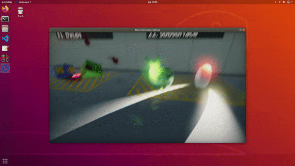
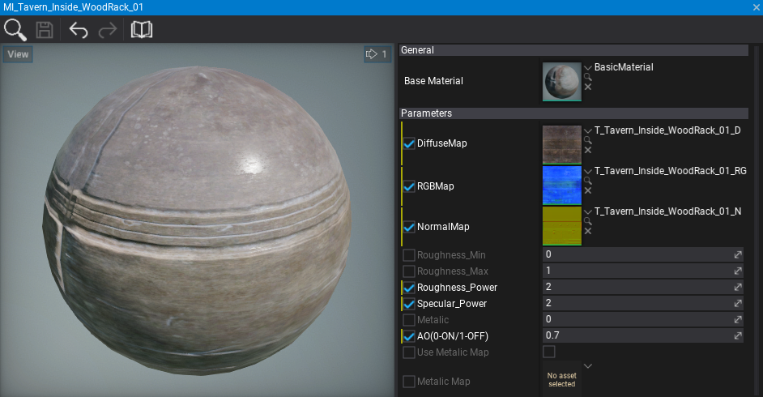
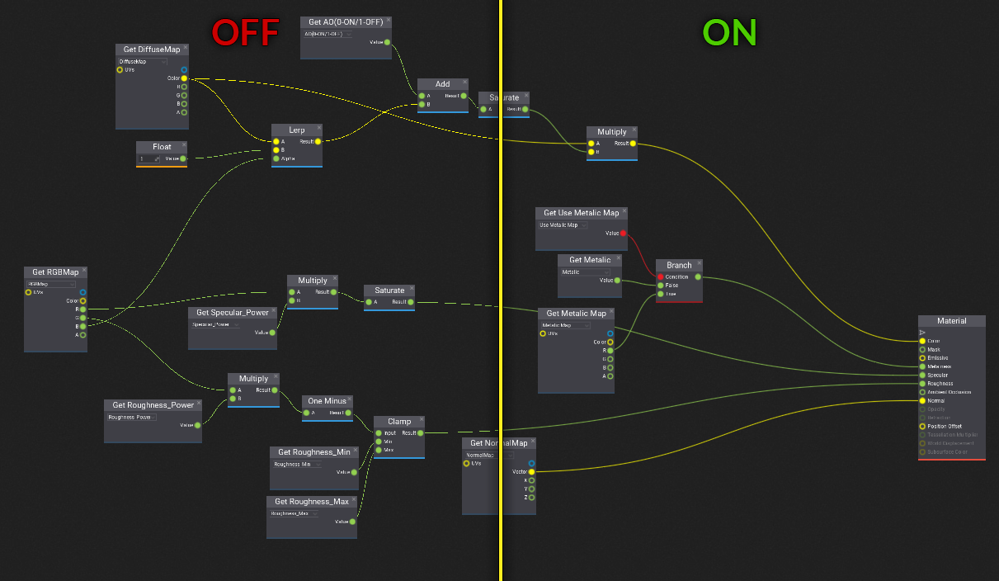
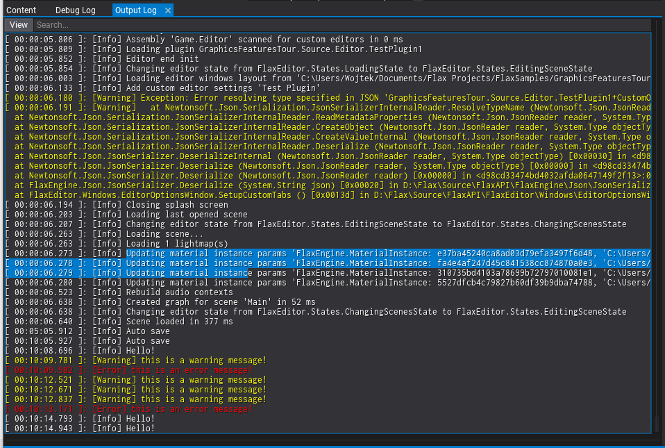
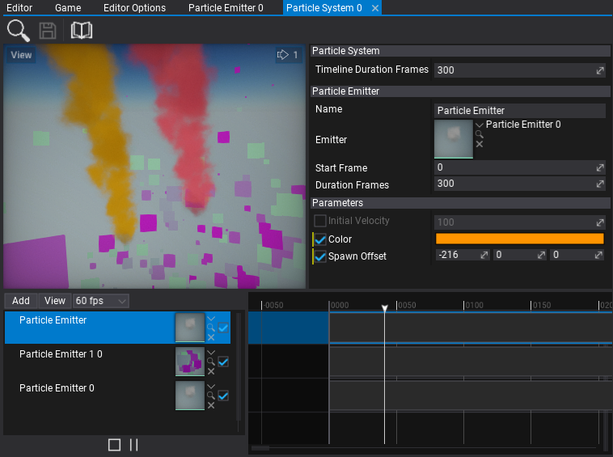

# Flax 0.6 release notes

## Highlights

### Scene Animations

One of the major features we are bringing to Flax in this update are **Scene Animations**. It is an in-build tool that is used to animate objects on the scene. For instance, to create cut-scenes, game objects animations, UI animations, etc. Flax provides various tools to develop and use scene animations inside game projects. This enables developers to easily animate anything on the scene (actors, scripts) and all of their properties including creating camera shots and audio playback as well as event tracks. This can be extended to implementing various gameplay mechanics based on time, like boss fights.

You can read more about on the [blog](https://flaxengine.com/blog/flax-facts-28-scene-animations/).

### Linux support

Starting from this update we will support Linux platform and distribute Flax binaries for game developers to deploy their games to support desktop gaming on Linux or use special build options to run a game in the cloud for multiplayer and streaming purposes.

To learn more about it see the [announcement](https://flaxengine.com/blog/flax-for-linux/).

### Materials workflow improvements

Every engine update brings new features and improvements for content creators. This time we wanted to improve materials workflow. Specifically, we added per-parameter material overrides support and the ability to use other material instances as a base for inheritance. This makes using uber-material shaders much easier and improves the overall workflow for technical artists. Editor will also highlight the modified parameters (use right-click to copy or restore default value).

### DirectX 12

Flax supports DirectX 12 since 2015 but it was used only for Xbox One builds. Now you can try it out in Editor and in Windows builds. Simply pass `-d3d12` command line argument to use DirectX 12 rendering backend if available (required Windows 10). Also, you can specify the supported rendering backend when building a game for a given platform (for instance Windows supports DirectX 10, DirectX 11, DirectX 12, and Vulkan).

### Anti-Aliased lines rendering

Flax 0.6 offers more improvements for text rendering quality. We also wanted to enhance the visuals of the editor UI by adding an anti-aliasing filter for line rendering. Now, working with Visject Surfaces (Anim Graph, Material, Particle Graph) is more visually appealing. Also, game UI that uses `Render2D` drawing subsystem will get more smooth lines without blocky artifacts like it used to be before.

### Editor features

Editor features highlights in release notes starts to be a regular section as every update brings lots of cool features. This time we've added many great ones such as:

* High-DPI support
* Output Log window
* Exporting terrain heightmap
* Pilot actor mode
* Custom editor caption
* Improved editor text quality. Better fonts rasterization options.

### Output Log window

For advanced Flax developers, we've added a new dedicated window to Editor for easier debugging their games: **Output Log**. It displays the current engine log contents with color-coded messages, searches support, filtering support and customization options (available to tweak in Editor Interface settings). Also, you can load previous log files or logs gathered from a distributed build or from the console during development.

To make this possible we've drastically improved text rendering performance including more Font API in C# to access. You can also use new controls *RichTextBox*/*RichTextBoxBase* to implement fancy stylized text rendering in your game UI.

### Particle Parameters Editing

To make particle systems editing even easier we've added particle emitter parameters overrides that are saved in the system. This enables developers to use multiple different particle emitters inside one system and adjust custom properties for each of them.

## Changelog

### Version 0.6.6191 - 23 December 2019

* Add support for `FlaxEngine.Object.New<GPUTexture>()`
* Add using async calls for content loading in editor
* Add warning with missing custom node typename
* Add output log window auto focus on game build fail
* Add `Actor.Children` getter
* Add ctrl+tab navigation for dock panel tabs
* Add ctrl+w shortcut for closing selected dock window
* Improve range for postFx intensity options max range
* Improve Asset.WaitForLoaded
* Change live relaod to be disabled by default for prefab editors
* Fix loading custom node in Visject without any custom nodes in project
* Fix deadlock in Asset::WaitForLoaded when asset load task fails
* Fix specular for area lights source length is non zero
* Fix crash on `AutomaticAverageLuminance`
* Fix rare crash on engine exit in DirectInput gamepads scanning thread on Windows
* Fix text culling in RichTextBoxBase
* Fix duplicating actors in prefab editor
* Fix exception when moving actors in prefab editor
* Fix custom editor window title bar on High-Dpi display
* Fix Desaturation node elements positioning
* Fix Border control drawing

### Version 0.6.6190 - 17 December 2019

Contributors: stefnotch, JimiVacarians

* Add **Scene Animations**
* Add actors searching popup to actor reference picker
* Add `Control.PointFromParent(ContainerControl parent, Vector2 location)`
* Add Screen Fade Color to fade screen via postFx settings
* Add AutoFitText option to Label
* Add **Linux** support
* Add resolution scale slider to editor viewports
* Add **High-DPI** screens support
* Add `-lowdpi` command line to use default DPI
* Add fonts upscaling for high-DPI monitors
* Add PerlinNoise to FlaxEngine
* Add Octaves to PerlinNoise
* Add DelayLoad to Assimp DLL to improve editor startup time
* Add support for shwoing getter only properties with the `ShowInEditor` attribute
* Add support for DirecxtTex lib on UWP and XboxOne
* Add **Output Log window** to Editor
* Add support for enums editing for visject node values
* Add Render2D.DrawText without layout formatting
* Add Rich Text Box to UI library
* Add C# API for Font and Render2D to use text substring with TextRange
* Add emitter parameters overrides support to particle system
* Add `Time.StartupTime`
* Add caching FPS and Navigation show widgets option
* Add `Texture.FromFile` and `Texture.LoadFile` for loading images from files in game
* Add Copy asset ID option to content window context menu
* Add Flax icon to engine textures
* Add native memory allocations profiling
* Add Output Log window to the default windows layout
* Add **terrain exporting** feature
* Add navmesh updating support when editing terrain
* Add High DPI support to Editor
* Add guard to block editing scene hierarchy on other threads
* Add kerning table caching support for Font
* Add support for **hinting and flags to font** asset
* Add index buffer support for Render2D
* Add drag and drop support for ParticleSystemTimeline
* Add AddPostFxMaterial and RemovePostFxMaterial methods to PostFxVolume
* Add `GPUContext.CopyTextureRegion`
* Add **histogram-based eye adaptation** effect
* Add Limit parameter to Bloom settings
* Add ToneMappingMode and use optimized ACES approximation instead of customizable options for curve
* Add feature to **pilot actor in editor** scene viewport
* Add **DirectX 12 support** (use `-d3d12` command line switch)
* Add GPU memory logging on Vulkan
* Add `Font.ProcessText`
* Add ViewFlags.DebugDraw
* Add **anti-aliased lines rendering support to Render2D**
* Add Render2D.DrawLine with separate start/end colors
* Add `FLAX` define to game scripts project
* Add `Editor.CustomData` for editor plugins to cache persistent data during session
* Add default values to material properties
* Add fade out distance parameters to SSR
* Add easier terrain creating via toolbox
* Add missing System libraries from .Net Framework
* Add `Actor.HasTag`
* Add printing object ID for invalid actor/script type on scene load
* Add support for taking screenshots in build game
* Add support for receiving directional light shadows for transparent and particle materials
* Add assets dependencies collecting C# API (`Asset.GetReferences`)
* Add material parameters override support
* Add custom title bar to editor window
* Add GPUResource and GPUTexture
* Add GPUResourceMapMode
* Add Add GPUResourceUsage
* Add Add GPUTextureDescription
* Add GPUTexture.Description getter
* Add Half constant to Vector2 and Vector4
* Add *Set Root* action to prefab editor
* Add support for loading missing Visject nodes
* Add support for baking lightmaps for terrain
* Add support for baking lightmaps for foliage
* Add Visject Surface editing improvements for keyboard aka *fast typing*
* Add exponential height fog to transparent and particle materials
* Add support for local lights in transparent and particle materials (point/spot lights)
* Add support for material instance used as a base for another instance
* Add draw time on GPU and drawing stats to the main profiling data access API
* Add support for particles and transparency shadows
* Add MSAA support for D3D12
* Add Fixed Axis facing mode for particles
* Add `DrawPass` masking support for better rendering configurability
* Add support for HideInEditor attribute used for enum items
* Add support for EditorDisplay attribute used for enum items
* Add fade out to last model LOD on hide
* Add fallback to default project scene if nothing saved in the cache on editor startup
* Add FontTextureAtlas type to C#
* Reduce maximum nested prefab nesting level to 8 per object
* **Rename game scripts Assembly to Game** (and Assembly.Editor to Game.Editor)
* Refactor and optimzie scripting backend
* Refactor PostProcessSettings
* Refactor eye adaptation
* Refactor engine native memory allocator
* Refactor scripting system (C++ scripts support from native modules)
* Refactor managed types caching (multitheraded support)
* Refactor engine workspace
* Refactor lightmap entries to be stored one per StaticModel (instead of one per mesh)
* Refactor some engine logs to use logger instead of DebugLog
* Refactor FontReference into structure
* Refactor LogType
* Refactor log startup time to count from actual game start, not the log start
* Refactor ScrollBar to make it more reusable for other UI
* Refactor render targets pool (use shared pool for C++ and C# scripting)
* Rename Application to Platform (matches C++ API)
* Rename GraphicsQuality to GraphicsSettings
* Rename GraphicsDevice to GPUDevice
* Rename TextureFlags to GPUTextureFlags
* Improve exponential height fog and fix volumetric fog density
* Improve Visual Studio 2019 detection
* Improve geometry instancing performance
* Improve draw calls sorting performance
* Improve model and skinned model windows previews
* Improve viewport gizmos tick (use update delegate)
* Improve particles vertex processing performance by using index buffer for sprites
* Adjust default MinScreenSize for models to be lower (less aggressive culling)
* Remove `StaticModel.HiddenShadow` (use draw modes option)
* Remove ContainerControl.OnChildControlResized
* Remove `RenderTask.Create<>`, use `Object.New<>`
* Remove `Mathf.Deg2Rad`/`Mathf.Rad2Deg`, use `Mathf.DegreesToRadians`/`Mathf.RadiansToDegrees`
* Remove FlaxEngine.Rendering namespace from scripting
* Remove RenderTarget (use GPUTexture)
* Remove Depth, GBuffer and MotionVectors pass from defaults for particles
* Remove `DebugDraw.DrawSphere` with center and radius (use method with BoundingSphere)
* Disable error message boxes on engine error messages
* Optimize GPU memory usage when not using shadowed lights
* Optimize light buffer format
* Update C# API assemblies version to match the engine version
* Use OnDestroy rather than Dispose for controls cleanup
* Use reference when passing InitData to TextureBase.Init
* Change CPUInfo to contain CPU cache sizes (not cache counts)
* Change default box brush size to 100
* Change default SunDiscScale to 3
* Change default brightness for Point, Spot and Directional lights to 8
* Change editor sprites rendering to not be affected by the scene lighting and post-processing
* Change default for RestoreMaterialsOnReimport to true
* Change default near plane to 10 and far plane to 40k
* Change Vector3.NearEqual epsilon param to float and add default value to it
* Fix undo for editing UIControl control properties
* Fix error when changing UIControl type with undo
* Fixes for audio playback with seeking
* Fix actor scene tree node expand when it has all children hidden
* Fix AudioSource.GetTime for audio clips with streaming
* Fix usage of streaming audio
* Fix missing MonoPosixHelper library
* Fix Panel ScrollBars changing
* Fix selecting CSG brushes
* Fix particle rotation when using Face Camera Position
* Fix material Opacity input enabled state
* Fix CSG selecting after rebuild
* Fix editor Highlight Material
* Fix handling Anchor Styles when resizing UI control
* Fix crash on ExtractDataFloat when using 16bit audio
* Fix `EnumElement.EnumTypeValue` getter
* Fix crash when calling stop on disabled AudioSource
* Fix timeline tracks reorder
* Fix error when using Scene Texture parameter in material
* Fix scene graph event unregister
* Fix deadlock on GPUTask cancel before sync
* Fix ShadowsDistance to be calculated from the point/spot light bounds instead of position
* Fix sorting postFx volumes
* Fix culling last model LOD with MinScreenSize
* Fix culling skinned models with MinScreenSize
* Fix timer queries and profiling GPU on D3D12
* Fix rare crashes after scripts reload
* Fix tooltip for long description text (wrap words)
* Fix `Scripting.InvokeOnUpdate` to be thread-safe
* Fix updating rigidbody bounds when it has no colliders
* Fix D3D12 support, improve performance and stability
* Fix AnimatedModel not visible in game build if not using Anim Graph
* Fix custom RigidBody mass serialization and override mass flag in Prefabs
* Fix using Guid value in custom anim graph nodes
* Fix error when closing material window after using color pickup dialog
* Fix crash when custom editor options object deserialization fails
* Fix terrain rendering on Vulkan (and improve buffers uploading)
* Fix skylight baking (no sky clipping, no using sky light during its baking)
* Fix Render2D.DrawLine to apply thickens on line caps and apply current transformation scale to it too
* Fix managed classes cache to be thread-safe
* Fix reporting GPU memory on DirectX backends
* Fix DebugLog sending from native code for multiple threads
* Fix Editor splash screen title for long project names
* Fix RenderOnlyWithWindow Brightness apply to not use alpha
* Fix error when selecting terrain with missing patches on editor reopen
* Fix _dirtyNodes lock to prevent race conditions
* Fix navmesh building with terrain
* Fix RootNodeName default value
