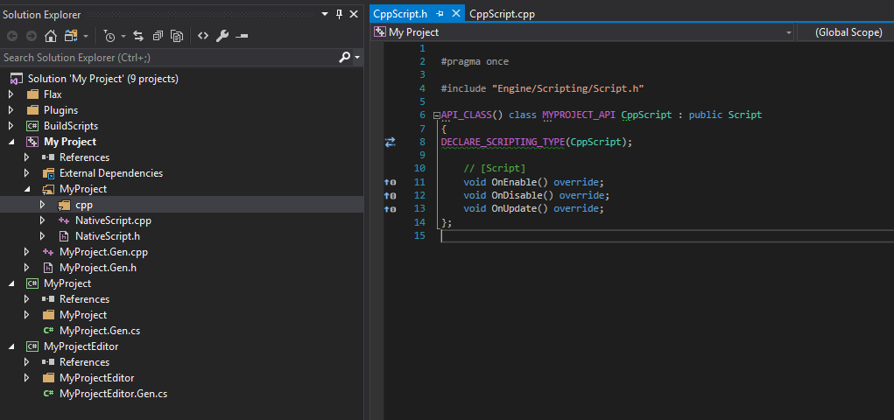
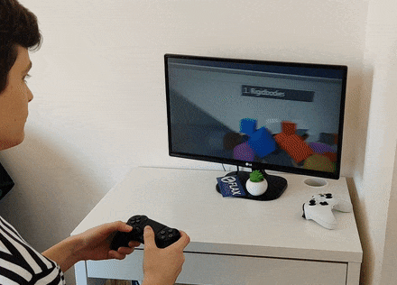
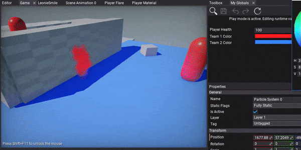
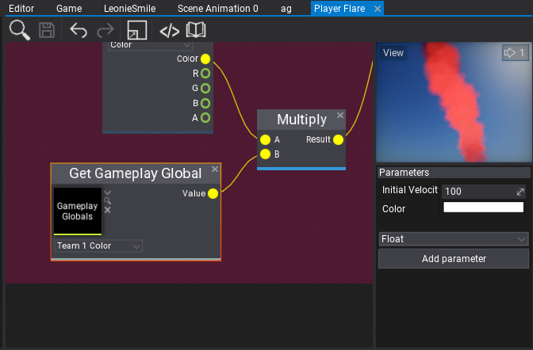
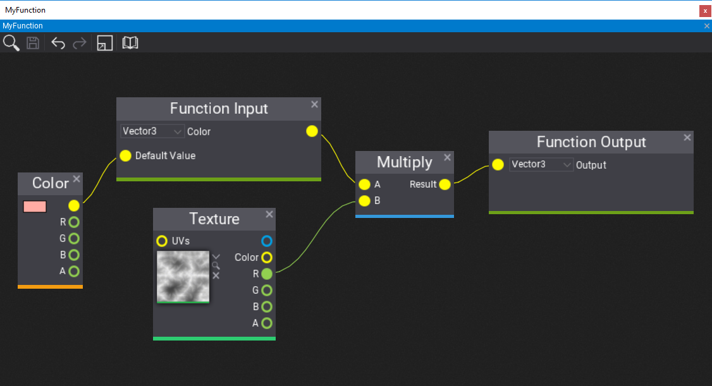
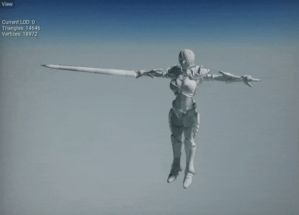
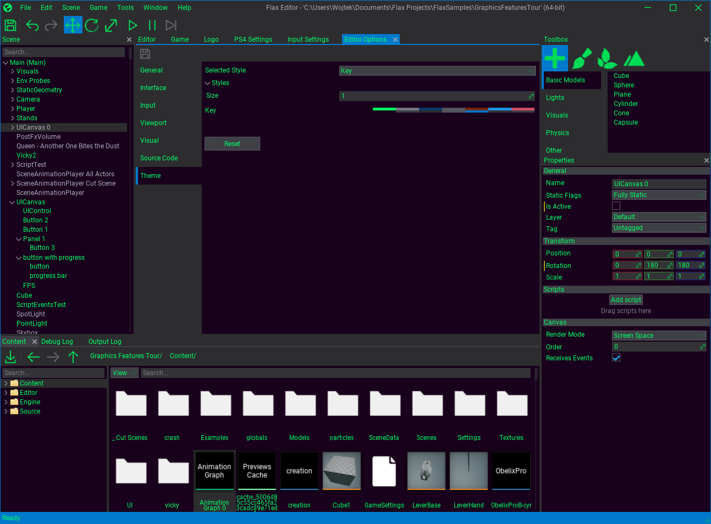

# Flax 0.7 release notes

## Highlights

### New Project Format


One of the most important changes before releasing 0.7 update was to modernize Flax project format and layout to ensure they will be able to scale in the future. Old *Project.xml* descriptor was replaced with **&lt;project_name&gt;.flaxproj** file that is in Json format and conatins all basic project information as well as **project references** which makes it possible to use external plugin projects in your game. We've also added [scripting modules](../../scripting/index.md) so your game code can be modular (similar to Flax Engine codebase).

Flax Editor will **automatically upgrade old projects** and ask to perform a **safe backup** before any operations so all your data will be secure.

If you download the new Flax Launcher or update the own you have it will allow you to open Flax Project files with a double-click and use the context menu to generate scripts project files.

### C++ Scripting



It finally happened! You can use **C\+\+ in Flax** games to script gameplay. Starting from this update we will distribute engine header files and build tools to compile and run native code in Flax. All you need to do is to install platform-dependant toolset with compiler and you are ready to go!

Flax supports **seamless C\+\+ and C# scripting**. We've created an open ecosystem where you can mix both languages and leverage Flax tools to create great projects. We've managed to write **automatic C# bindings generator** in [Flax.Build](../../editor/flax-build/index.md), create **hacking native objects vtables for virtual calls**, and support **hot-reloading C\+\+ and C# in Editor**.

To learn more see the official documentation [here](../../scripting/cpp/index.md).

New C\+\+ scripting support required to modernize the existing game building pipeline. As a result, build logging has been improved, the build process has more customizable events as well as custom files deployment is supported. Shaders can also be cooked with additional debug data or without optimizations to debug them at the target device (eg. PS4 DevKit).

### PlayStation 4 and Xbox Scarlett support



Every update moves Flax towards the AAA-ready engine. This time we've ported the engine to **PlayStation 4** and upcoming **Xbox Scarlett** (aka. Xbox Series X). With Flax power, you can create amazing experiences and easily ship them to the multiple platforms.

Support for PlayStation 4 and Xbox Scarlett platforms in Flax is NDA-protected. If you want to develop your game on PS4 please contact (available only for developers approved by Sony with access to PS4 SDK).

### Graphics Programming with Shaders


Flax already has great tools for shaders creation with Material Graph but we wanted to move it even further. In this update, you can user our low-level graphics abstraction layer that supports using GPU directly in your C\+\+/C# code. You can create and use GPU resources such as textures/buffers and create graphics commands.

Another step was to add full **HLSL** shaders support in game and plugin projects so you can write own shader libraries and use them in games. We've shipped our Shader API library with the engine sources which contains lots of utilities to create fancy shaders. You can write Pixel, Geometry, Hull, Vertex, and Compute Shaders to perform any GPU computing. We've exposed low-level drawing API so you can create own geometry and render it with own shaders or extend the existing in-build rendering. Finally, shaders support now automatic hot-reloading in Editor (when source file gets modified or any of the included files).

To start creating own shaders see our documentation and tutorials [here](../../graphics/shaders/index.md).

### Gameplay Globals



When creating more complex game systems that rely on the content or when creating technical art it’s often useful to give global parameters that can affect the whole gameplay. For example, player team color, wind direction, wind speed or other weather parameters. **Gameplay Globals** asset contains a list of named parameters that can be accessed globally in the project including materials, animations, and particles. Their values can be set by the artist in the editor or driven from code. This vastly improves production speed and gives game developers a great tool to enrich the content of their games.



### UI Anchors and Offsets


We've mdoernized UI positioning and anchors system to be mroe flexible (or *flax*ible). The controls have now anchor min and anchor max properties which can be set manually or via *Anchor Presets* editor. The control anchors are normalized (to range 0-1) position in the parent control that the upper left and bottom right corners. This can be used to dock control inside the parent container so control location/size can depends on parent container bounds.

### Material, Particle Graph and Anim Graph Functions



When creating complex materials, animation graphs, or particle systems often you need to reuse the same part of the graph multiple times. For instance, the tri-planar mapping calculation could be reused in multiple terrain shaders without copy-paste. To achieve this we've created new set of assets: **Material Functions**, **Anim Graph Functions**, and **Particle Graph Functions**. They can contain a custom set of input and outputs with graph that implement a certain logic. Then you can reuse that function in many other assets and Flax will automatically handle reloads and live content editing to make your game development process even smoother.

To start [here](../../graphics/materials/material-functions.md) is a tutorial about Material Functions.

### Blend Shapes support

Flax supports importing and using Blend Shapes (aka. morph targets) for skinned models. This can be useful to implement character  face emotions or lipsync during dialog scenes. When importing asset check **Import Blend Shapes** option. Then you will be able to preview the blend shapes in the skinned model window (each channel is adjustable under Blend Shapes group). Then you can control blend shapes appearance at runtime from code using [AnimatedModel](https://docs.flaxengine.com/api/FlaxEngine.AnimatedModel.html) class methods *SetBlendShapeWeight* / *GetBlendShapeWeight* / *ClearBlendShapeWeights*.

### Inverse Kinematics


This update contains new AnimGraph nodes: **Two Bone IK** that performs inverse kinematic on a three nodes chain (eg. player hands picking a gun) and **Aim IK** that rotates a node so it aims at a target (eg. for player header look at). We've also improved skeleton nodes transformations in the graph as a result it runs faster with better stability.

### Automatic Model LOD



Another exciting feature is the automated model LODs generation during source asset importing. When importing model file simply check **Generate LODs** property (under *Level Of Detail* group) and adjust the settings. The imported model will contain simplified LODs that will gracefully improve the performance of your game. This option works for skinned models too. Flax will also pick better screen-sizes for switching the LODs so players won't notice LODs transitions (*Dithered LOD Transition* option in material helps to hide popping artifacts). Also, lower LODs can use different materials - eg. more optimized with fewer textures used so you can develop even more performant games.
We use: <https://github.com/zeux/meshoptimizer> lib for mesh simplification and optimization of generated geometry. Part of the log from importing this model:
```
Generated LOD1: triangles: 7100 (48% of base LOD), verteces: 3052 (16% of base LOD)
Generated LOD2: triangles: 3352 (22% of base LOD), verteces: 1153 (6% of base LOD)
Generated LOD3: triangles: 1516 (10% of base LOD), verteces: 484 (2% of base LOD)
Generated LODs for 3 meshes in 17 ms
```

### More Editor Features


Every update brings more stability, performance and shiny features to Flax Editor. The most interesting ones are:
* **Custom Editor Themes** support (made by *stefnotch*)
* Model TexCoord, LightmapUVs preview
* Geoemtry vertex colors and lightmapUVs density debug views
* Search tab for spawning custom actors
* Opening shader assets in editor
* Tooltips for models/textures with asset info
* **Automatic materials and textures import** from models
* View options in Content Window



### The Last Refactor

Finally, we've modified the C# scripting API (FlaxAPI repo won't receive new sources). This is related to the new automatic bindings generator we use and major projects refactor. Since this update, we've started preparing for the first stable 1.0 version so we're waiting for your feedback (especially on new C\+\+ scripting). After Beta version end, API changes won't break existing code between minor updates and any old code will be marked as deprecated. Also, we will keep the automatic conversion code for old assets for at least a year to ensure no one loses its data. In case of problems with upograding your existing Flax projects let us know. Finally, we've updated our [Flax Samples](https://github.com/FlaxEngine/FlaxSamples) so you can check it out.

## Changelog

### Version 0.7.6194 - 5 July 2020

- Fix crash when importing fbx model with invalid material
- Fix building and using C#-only projects without Windows 10 SDK installed
- Fix project files generation for C#-only projects (skip native projects and toolchain checks)
- Fix crash when converting invalid UTF-8 string to UTF-16

### Version 0.7.6193 - 3 July 2020

Contributors: stefnotch, devjarmo

* Add **new projects format**
* Add **modules support for scripts**
* Add Flax.Build integration with game projects
* Add full-support for C++ scripting (requires engine source)
* Add support for **overriding C++ objects virtual functions in C#** (via vtables)
* Add support for hiding scripts from picking in editor via HideInEditor attribute
* Add support for **custom actors in C#**
* Add `Search` tab to Toolbox for spawning any object with search box
* Add more funny quotes to the splash screen
* Add automatic Visual Studio project files generation on file open if solution is missing
* Add BoxVolume actor class for navmesh bounds actor and posFx volume actor
* Add support for creating scripting objects via C# object constructor
* Add checking if Visual Studio has Flax.VS installed (skip generating special C# projects if extension is missing)
* Add **Xbox Scarlett support** (Xbox Series X) - experimental
* Add new DirectX Shader Compiler support for *Shader Model 6* for D3D12
* Add `ForDistribution` option to Build Settings
* Add Remap to math lib
* Add custom **color grading LUT** support
* Add support for creating generic json assets from any class
* Add gray out sequence indication to play if game is not playing in editor
* Add bindable input shortcuts for dock windows navigation and closing
* Add SetViewportAndScissors to GPUContext
* Add more GPUBuffer C# API
* Add showing shaders source code in Editor
* Add support for adding new shader files from editor
* Add support for using **shaders in game**/plugins projects
* Add project file dialog when opening editor without project path specified
* Add tooltip for texture/model items with metadata
* Add Maximize/Restore options to dock window context menu (also via double click)
* Add skipping adding CSG actors if not using CSG
* Add Scenes Build feature to build all scenes data at once
* Add **GPUShader to C# scripting API**
* Add model UVs and Lightmap UVs preview to Model Window in editor
* Add Draw event to scripting for custom rendering
* Add `RenderToTextureControl`
* Add support for automatic materials and textures import from model files
* Add support for opening project with project file path specified instead of directory
* Add `LightmapUVsDensity` debug view
* Add `VertexColors` debug view
* Add area-weight-based coordinates space placement and rect-pack to allocate more space for bigger meshes in the model lightmap chart
* Add low-level GPU programming to C# API
* Add opening shader sources in code editor
* Add support for collecting native code crashes (stacktrace, memory dump, log)
* Add `-GenProjectFiles` command line option
* Add option to reset view flags
* Add generating scripts project files in a background
* Add logging parent actor name for missing objects when loading scene
* Add support for C++ scripting in editor content workspace
* Add support for hot-reloading C++ game modules at runtime in Editor
* Add always showing extension for script items in content window
* Add **PlayStation 4 support**
* Add automatic hot reload for shaders based on their includes
* Add output log window auto focus on game build fail
* Add support for auto compiling shaders for game cooking when included file gets modified
* Add **Gameplay Globals**
* Add tooltips for UI enums
* Add Visject surface parameter renaming validation
* Add support for undo recording for dictionary
* Add **Anchors and Offsets** to UI Controls
* Add View options to Content Window (iles extensions showing, view scale field, items filters picking and view list mode)
* Add tooltips support for content items
* Add NoOptimizeShaders option to Build Settings
* Add ShadersGenerateDebugData build option to generate debug info for shaders
* Add **custom editor themes** support
* Add more splash screen quotes
* Add highlight for selected node connections in Visject
* Add prioritize for Visject node search matches where the text starts with the text you're searching for (e.g. prevents sin from showing asin and cosine before sine)
* Add bringing the context menu for spawned nodes into view when typing in Visject
* Add CanOpenUrl and OpenUrl to Platform
* Add NetworkConnectionType to Platform
* Add error on invalid material param type setting instead of crashing
* Add support for **overriding particle emitter parameters** in edit-time (with values preview)
* Add **new C# bindings generator**
* Add check to prevent resizing texture if texture size doesn't change
* Add support for NDA-protected platforms usage in Engine and Editor source codebase
* Add GPUDevice.VideoOutputModes
* Add Content.GetAllAssetsByType
* Add **Material, Particle Graph and Anim Graph Functions**
* Add terrain and particle materials preview
* Add AdditionalAssets and AdditionalAssetFolders to build settings
* Add Platform Switch node to surface graphs
* Add FlipNormals option to model import settings
* Add support for panoramic skyboxes
* Add **automatic LOD generation** for static models
* Add support for skinned models LOD
* Add event Content.AssetReloading
* Add option for showing current LOD and it's stats in model window
* Add support for asset Dependencies in binary assets
* Add random values generation nodes to Anim Graph
* Add **blend shapes support**
* Add caching skinned models data on CPU
* Add hiding too deep nodes in profiler events table-tree
* Add auto-detection for hdr textures on import to pick proper format by default
* Refactor game build configuration options
* Refactor engine services
* Refactor shader includes
* Refactor shader cache invalidation on includes editing and improve hot-reload
* Refactor high-level rendering API
* Rename SceneManager to Level
* Rename Keys to KeyboardKeys
* Move ProfilingTools from Editor module to Engine (available in Debug and Development builds)
* Disable sorting particles for shadow map renderign views
* Remove engine version postfix from asset cache file
* Remove calling OnDebugDrawSelected for full actors hierarchy
* Remove double-click for renaming actor in scene tree (use `F2` shortcut or properties window or right-click context menu)
* Remove showing scripts compilation errors/warnings in Debug Log window (use Output Log window for more detailed info)
* Remove Version from GameSettings (use value from project file)
* Remove Plugin Exporter - now plugins can be placed in plugin projects referenced by game modules
* Rename attribute MemberCollection to Collection
* Refactor UI controls system to support more flexible anchors
* Merge GPU shader constant buffers into objects to reduce dynamic memory allocations
* Change default plane to be 100x100 and rotated with proper axis
* Optimize surface shaders tangent frame passing from vertex to pixels shaders (use less registers)
* Optimize scissor rectangles to match viewport bounds to improve GPU perf in rendering code
* Improve asset file unlock on removing file with very slow HDD in use
* Improve model previews camera location
* Improve dictionaries editing in object properties
* Improve performance and memory usage when importing fbx models
* Improve debug drawing wire volumes
* Improve picking wire volumes
* Fix camera check if Scene Render Task
* Fix Alt+F4 on Windows
* Fix sRGB textures importing
* Fix scroll bars usage after undock
* Fix calling C# events from Actor::OnTransformChanged event
* Fix opening some source files in Visual Studio via Flax connection module
* Fix discarding shader cache if asset was modified externally
* Fix Windows 7 support (due to CreateDXGIFactory2 func missing)
* Fix maximizing editor tool windows
* Fix D3D11 object leak on read-only depth buffer handle
* Fix draw calls sorting for particle emitters that use World simulation space
* Fix crash when starting baking lightmaps when the lightmap textures are not fully loaded
* Fix text render flushing geometry buffers every draw
* Fix directional light shadow map pass view position
* Fix collecting asset references from nested state machine in Anim Graph
* Fix depth buffer view to cover full view distance
* Fix missing SkyboxMaterial in cooked game build
* Fix RichTextBoxBase bug with text hit testing
* Fix animated model LOD picking for aniamtion update frequency
* Fix ShaderProfile entries naming for DirectX
* Fix Windows file system watcher in some cases
* Fix moving the window when the context menu is open in Visject (no more zooming off into infinity)
* Fix showing connection line in Visject when right clicking after starting a connection
* Fix crash when extracting Audio Clip data that is not yet loaded
