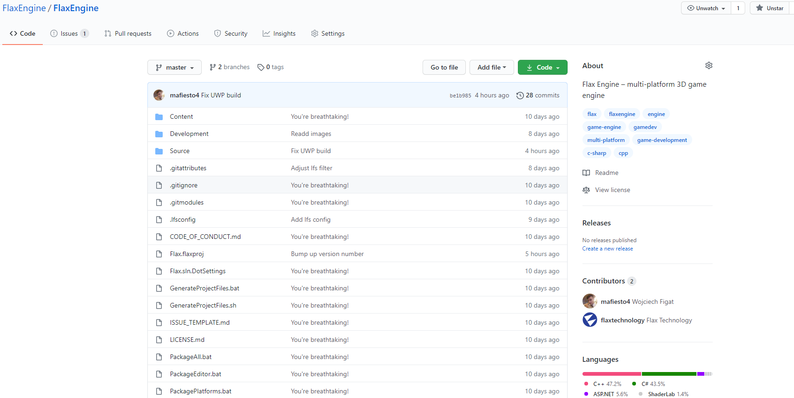
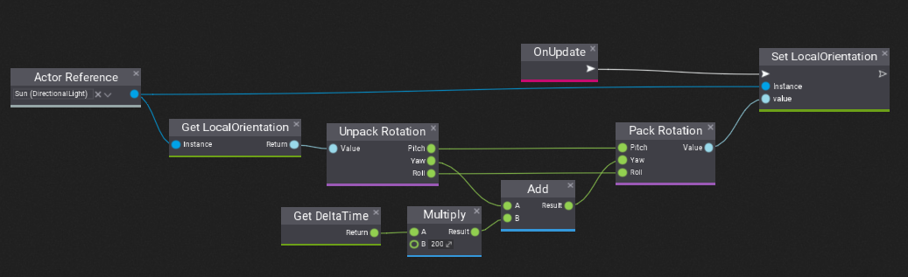
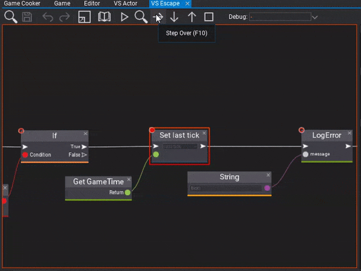
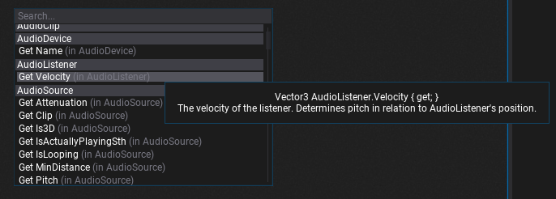
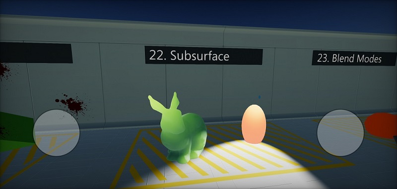
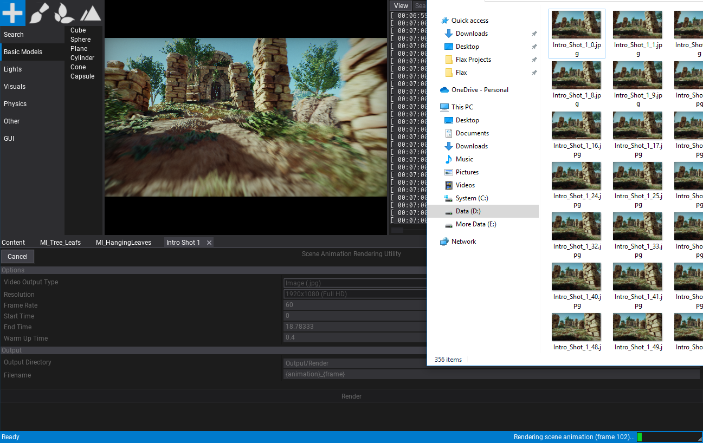

# Flax 1.0 release notes

## Wake up Samurai. We have Flax 1.0 to see!

<iframe width="750" height="421" src="https://www.youtube-nocookie.com/embed/_KCl_m1IGp4" frameborder="0" allow="accelerometer; autoplay; clipboard-write; encrypted-media; gyroscope; picture-in-picture" allowfullscreen></iframe>

## Highlights

### Full Source Code Release

We did it! We've released the full source code of the Flax Engine including **C++ core** and **C# editor** with all tools and platforms. The sources are available on [Github here](https://github.com/FlaxEngine/FlaxEngine). This repository is using *Git LFS* and is a mirror of our internal server. From now on, the previous FlaxAPI repo will be deprecated and we encouruge you to report issues on the new FlaxEngine repo. Also, we're open for Pull Requests so **feel free to contribute**!

Of course, Flax Engine source can be used just like binaries we distribute via Flax Store. It's licensed under our [EULA license](https://flaxengine.com/licensing). For teams that want to use a custom version of the engine feel free to fork it and customize it (helper docs [here](../../editor/advanced/custom-engine.md)).

### New licensing

Along side 1.0 update and source code release we've increased the minimum limit for Flax revenue share from $3,000 to $25,000. Which means that if your game earns $25,000 (or less) per calendar quarter you don't have to pay for using Flax. All sales above it are using 4% revenue share. More info about licensing [here](https://flaxengine.com/licensing).
This change makes Flax cheaper for solo and indie developers.

### Visual Scripting

One of the key features in this release is a brand new **Visual Scripting** system. Visual Scripts can implement gameplay logic with custom properties just like C# and C++ scripts. This makes game prototyping a lot easier and the engine more accessible for non-programmers.

The editor supports debugging Visual Scripts execution with breakpoints, debugger stepping, local variables, and stack trace.

We also improved the context menu for Visject Surface that is used for materials, particles, animation, and now visual script editing. It runs faster and offers more tooltips for developers.

### Android support

During this year we've added support for many new platforms such as Linux, PS4, and Xbox Series X/S. Now we're happy to announce **Android platform** support. This includes all engine features: C++, C#, Visual Scripting, **Vulkan** renderer, stereo audio, **multi-touch** input, high-dpi UI, single-click deployment, and much more.

To learn more see the official documentation about [Android platform](../../platforms/android.md).

We've updated all Flax Samples projects to support touch display input and run smoothly on Android devices.

### Vertex Painting

Editor toolbox just got the vertex painting utility for **coloring models vertices** on the scene. By using it artists can easily enrich the level content for instance by using vertex color masking in the materials. Flax already supports importing vertex colors model meshes.

### Height Layer Blend

The material graph contains now a new node for easier blending between two material layers using the height map which **improves the transition quality**. This can boost the terrain materials quality.

### Foliage Shading Model

When working on the new Flax showcase video we've developed a new shading model shader for **foliage materials**. It improves the look and lighting for thin leaves of bushes, trees, and grass.

### Contact Shadows

Another exciting feature is **Contact Shadows rendering** which gives more quality to small objects by adding more precise local shadowing. It's implemented using depth buffer raytracing and works similary to a technique used in Cyberpunk 2077.

### More Editor features

Every update brings even more features and tools to Editor. This time we did a great job of adding even more of them. Some examples of new useful stuff:
* cut-scenes rendering
* timeline editing improvements
* animation asset tracks editing
* custom scripting languages support
* output log window errors/warning coloring
* undo support for timeline editor
* *BC7* and *BC6H* texture formats importing support (compressed HDR)
* curves editing improvements.

To learn more see the detailed changelog (but it's long as always).

## Changelog

### Version 1.0.6215 - 6 January 2021

Contributors: jb-perrier, DaveTheGameDev, stefnotch, dragonCASTjosh, Galbi3000, bolognatic, klukule, VNNCC, jfaz1, seapulse

PRs merged: 34

* Add support for Visual Studio Code Insiders
* Add logging offset for Json parsing errors
* Add IconsScale to editor interface options
* Add additional check for twice plugin initialization in case of error
* Add support for hexadecimal values in editor value fields
* Add support for using unsigned integer input fields in Visject Surface editor
* Add `IgnoreMissingDocumentationWarnings` option into generated csproj files
* Add `Generate collision data` from Model context menu
* Add returning focus to the previous control when closing a context menu
* Add support for active logging of the process output on Windows
* Remove TAA rendering implementation
* Reimplement Motion Blur
* Remove deprecated and unused OpenGL graphics backend
* Change maximum window size to 4096
* Update DirectXShaderCompiler to 1.6
* Fix null character at shader sources at during game cooking
* Fix using AssetRefEditor for editing asset reference on Guid property
* Fix PlatformSettings typedef on Android
* Fix PCF shadow uvs vector trunc warning
* Fix Editor title bar on High DPI
* Fix compiler errors with Vulkan 1.2
* Fix crash on scripting reload when using Anim Graph with custom nodes
* Fix context menu positioning for child menus when flipping the direction over Y axis
* Fix editing overridden particle emitter parameter in particle system window
* Fix editor viewport camera glitch on first frame when using camera orbiting
* Fix flashing tooltips
* Fix GamePlugin only used in PlayMode/Cooked game
* Fix undo redo flags in play mode
* Fix preserving Editor undo actions during play mode
* Fix link to Github issues page
* Fix build scenes toolstrip button enabled state
* Fix inverted Y Gizmo Rotation
* Fix Editor features usage enable when no scene is loaded
* Fix crash when in `ScriptingObject::ToString()` when class is missing
* Fix more dpi issues
* Fix shortcuts (F5, F6, F11) in play mode in editor
* Fix removing namespace from nodes in imported model files
* Fix `GPU timer query detected` warning to be single-time
* Fix speed change scrolling being wonky
* Fix preventing loading 'null' style in Editor
* Fix C# methods lookup for method signatures with output structure parameter passed as reference
* Fix DockHintWindow drag offset if it was invalid when initializing on initial mouse click
* Fix comparing String with StringView
* Fix logging process output on Windows
* Fix using unsigned integer properties in Visual Script editor
* Fix `Length` node in Visual Script
* Fix renaming files to same name with different case
* Fix double extensions when user specifies one during asset creation
* Fix wrong engine path with RegisterEngine script as admin
* Fix error when running Flax dev scripts without Nuget installed (or in different location)

### Version 1.0.6214 - 17 December 2020

* Add **Visual Scripting**
* Add class tooltips to type picker
* Add TypeReferenceAttribute for class picker customization
* Add support for custom scripting languages types in Editor
* Add support for custom scripting binary modules
* Add `FlaxEngine.Object.FullName` property to get object full typename
* Add custom events to scripting bindings generation in Flax.Build for custom languages support
* Add **Android** platform support
* Add support for ARM processors
* Add **touch input** support
* Add child controls culling for UI
* Add `GPUContext.NativePtr`
* Add main thread tasks scheduler for async tasks
* Add orange focus border to Visject Surface during play mode in editor
* Add Plugins support for Flax.Build
* Add context menu with search box to new Visject parameters adding
* Add automatic tooltips for all unmanaged methods in C# API
* Add SubTitle property to Visject node archetypes
* Add camera speed change with mouse wheel to work without Shift key down
* Add **automatic native objects serialization** via `API_AUTO_SERIALIZATION` tag
* Add automatic internal class as a friend for scripting types for easier protected members exposing to API
* Add Guid to debugger natvis file
* Add **Foliage shading model**
* Add object type check to FindObject utilities
* Add **Height Layer Blend** node to materials
* Add automated deps building for `Netwsoft.Json` library
* Add tooltip to FlaxObjectRefEditor with actor/script hierarchy path
* Add forward declarations for Json serializations headers to improve compilation time
* Add optimize for material layers blending if alpha is one or zero
* Add Enter to open first matching item in Content Finder
* Add `Object Size` node to materials
* Add Platform::InterlockedCompareExchange and Platform::AtomicRead/Write for 32 bit
* Add support for manual scene animation ticking
* Add `Time.SetFixedDeltaTime` for fixed game update/draw
* Add editor options to auto-focus output log window on compilation error or game build error
* Add highlights for code compilation warnings and errors in Output Log window
* Add logging d3d debug layer messages
* Add preview parameters tab to Particle Emitter window
* Add direct Debug Log messages logging with level and message to logger
* Add `Bokeh Brightness` param to control bokeh shapes intensity
* Add randomization for new Visject comments color
* Add `FLAX_GAME` define to C# scripting API when compiling code for game
* Add support for extracting embedded textures from imported fbx files
* Add `SERIALIZE_EPSILON` for serialization epsilon constant
* Add param to get AnimatedModel nodes pose in world space
* Add `Collider.ContainsPoint` helper method
* Add clamping blur render target in Render2D to match GPU device limits
* Add outline in Game View for the selected UI Control bounds
* Add soft return instead assertion in TextBox.Draw for missing font issue
* Add `PixelNormalOffsetRefraction` option to materials
* Add dynamic performance scaling to lightmaps baking
* Add proper crashes handling on out of memory in HeapAllocation
* Add Scale In Lightmap parameter per Foliage Type
* Add in-memory lightmap textures init instead of temporary file
* Add caching and restoring Lightmaps Baking state in case of GPU driver crash
* Add using read-only depth buffer for editor sprites rendering
* Add logging for GPU device removed event reason
* Add ArrowDown32 icon in Editor
* Add tooltips for terrain carve modes UI
* Add Copy Preview Value action to timeline tracks context menu
* Add timeline buttons for easy navigation between keyframes
* Add option to show the selected 3d position track in editor viewport as bezier curve
* Add `DebugDraw.DrawBezier`
* Add option to reset curve keyframe tangents
* Add Space key to play/pause in timeline
* Add **undo support for timeline editor** (scene animations and particle system editors)
* Add Revert Parameters button toolstrip button to material instance editor
* Add skipping tooltips generation for C# API bindings in Release builds
* Add **Scene Animation movie rendering feature** to editor
* Add support for custom, external code project generators in Flax.Build
* Add visualization of the Animation Graph flow in surface editor for the debugging
* Add options to hide or change default game splash screen
* Add tab with animated model preview properties to test in Animation Graph editor window
* Add support for viewing and **editing Animation asset via timeline editor**
* Add Edit All Keyframes option to curve/keyframes editor
* Add auto-scroll to track when using arrows navigation in timeline tracks panel
* Add AutoGenerateScriptsProjectFiles option to Editor for automatic scripts projects updating
* Add `SceneObject.GetNamePath` for easier objects identification for logs
* Add support for using single character as a default value for API function parameters
* Add limit for GPU lightmaps baking of 2gb of GPU memory
* Add NearEqual to Vector3, Quaternion and Transform C# API
* Add profile events for timeline loading
* Add support for Android SDK and NDK in `Flax.Build`
* Add `PLATFORM_ARCH` define for platform architecture identification in engine code
* Add automatic native delegates support as events in scripting API via **API_EVENT**
* Add `VCEnvironment.CscPath` to Flax.Build
* Add `IgnoreMissingDocumentationWarnings` option to scripting api build options
* Add additional Visual Studio project generation for debugging on Android
* Add logging temporary dir path
* Add `GetScreenOrientationType` to Platform for device screen orientation support
* Add support for custom input devices
* Add Switch On Enum node
* Add Branch On Enum node
* Add Sequence node
* Add mono debugger server debugging if MonoLog arg is set
* Add support for extracting TextureData from TextureBase assets data
* Add support for converting texture format for a target platform during game cooking
* Add support for extending the assets cooking in the game project code (custom assets cooking)
* Add support for editing material that failed to compile the shader
* Add error messages on missing shader graph parameter
* Add inputs casting to vec4 in Custom Code material node
* Add logging per-asset cooking stats
* Add TryGetScript and TryGetChild to Actor
* Add scrolling to ContextMenu item on key down (easier to pick option from long lists)
* Add keyboard navigation to context menu items
* Add **Contact Shadows** support to all light types
* Add support for lightmaps compression
* Add two-sided lightmap sampling for foliage
* Add GTAO multi-bounce to lightmap indirect lighting
* Add support for using Content Finder to search asset/actor by object id
* Add support for **BC7** and **BC6H** textures importing as HDR with compression
* Add support for **GPU texture compression** for BC7 and BC6 formats (DX11 only)
* Add waiting for renderer resources ready before lightmaps baking
* Add Single Click option to foliage brush for single paint tap
* Add Density Scale to foliage brush for more control over painting
* Add support for loading assets on main thread during Asset.WaitForLoaded call to reduce game stalls
* Add support for immediate saving of staging textures via Screenshot API
* Add BeforeLayout and AfterLayout events to inject custom UI into CustomEditorPresenter
* Add support for custom resolution to `RenderOutputControl` and aspect ratio preserve mode
* Add `saturate()` for Z component reconstruction to prevent NaN issues on some normal maps
* Add sorting Visject Context Menu groups by name
* Add default value editing for Color/Quaternion/Enum in Visject input boxes
* Add tooltips for Visject nodes in surface context menu
* Add `-printPlugins` command line arg to Flax.Build
* Add Ray as Common Value type
* Add **Variant** type to C++ API as generic any-value container
* Add infinity to scalar value input fields parsing in Editor
* Add generic To String node for printing anything to string in a graph
* Add undo support when removing Visject nodes with delete button
* Add NodeFlags.NoSpawnViaPaste to Visject nodes flags
* Add Enum Value, Enum AND and Enum OR nodes to Visject
* Add *Alt+Click* to break connections to Visject Surface box
* **Xbox Scarlett** port with fully-featured support
* Add SkipPackaging to BuildSettings
* Add String constant node to Anim Graph and Visual Script Graph
* Add support for creating scripting objects from typename
* Add Mono profiler setup with options via `MONO_ENV_OPTIONS` env variable
* Add navigation to selected type in TypeEditor on mouse double-click
* Add settings to actor General properties group
* Add option to Invert VisibleIf rule
* Add ClickableLabel to Editor GUI
* Add support for attributes for API functions parameters
* Add NodeSpawned/NodeDeleted/NodeEdited events to VisjectSurface
* Add TypeDefaultValueEditor for default values editing for input boxes of Type type
* Add support for overriding Collision/Trigger events in custom collider actor types
* Add `MaxUpdateDeltaTime` to Time Settings
* Add state disabled visuals for FlaxObjectRefEditor
* Add `IsRendering`, `DefaultWhiteTexture`, `DefaultBlackTexture` and `CreateBuffer` to `GPUDevice` C# API
* Add some more splash screen quotes from LOTR saga
* Add additional sorting score to Visject Surface context menu for full-matches
* Add `Object.NewManaged` for C# objects creation (eg in Visual Script)
* Add breakpoints support to the Visual Surface
* Add support for parsing defines values in headers for API bindings
* Add support for fixed-size arrays as structure fields in API bindings
* Add NoArray tag for fields in API to inline fixed-size array data into structure instead of using allocated array
* Add STDCALL calling convention for virtual API functions
* Add **Visual Scripting debugging** support to Editor
* Adjust editor FPS control logic
* Move IsEditor from Platform to Engine
* Improve DX11 strides/offsets checking for vertex buffers
* Update glslang to 11 (SPIR-V version: v2020.6)
* Hide `x86` architecture option on Windows/UWP Game Cooker as it's not distributed with Editor
* Rename Input/Output in ISerializable to DeserializeStream/SerializeStream
* Rename CompilerSpcific.h into Compiler.h
* Remove RestoreDefaults from postFx settings (use init and reset via constructor)
* Remove log for material instance params sync
* Refactor libraries linking (in Flax.Build) and fix linking for unix toochain
* Refactor Editor scripting types utilities to support Visual Scripts and custom languages
* Refactor Surface parameters to support any Script Type
* Refactor Custom Editors system to use ScriptType instead of raw System.Type
* Refactor Visject Surface editor connections and variables to support any type and any object value
* Refactor `CommonValue` into `Variant`
* Refactor Quaternion equality epsilon to 0.000000001 (from 0.0000001)
* Refactor Delegate to be thread-safe and more optimized with single invocation list allocation
* Refactor NDA platforms location to support sebarate repo submodules
* Refactor C# Matrix API
* Refactor `Curve<T>` in C# API to `BezierCurve<T>` and `LinearCurve<T>`
* Refactor ContainerControl layout performing
* Refactor serialization system
* Refactor engine Core headers code style and code documentation
* Refactor InputBox default value editors to be extensible
* Refactor C# Collision to reduce dynamic array of contact points allocations
* Refactor scene objects spawning and deserialization
* Refactor generated C# bindings code location to be per-build configuration in Cache folder instead of side-by-side with sources
* Optimize Guid parsing from text
* Optimize ItemsListContextMenu performance when searching
* Optimize C# bindings glue code for class types lookup to use TypeInitializer in native code
* Optimize timeline UI loading for Editor
* Optimize and refactor C# events sending from native code by using API_EVENT
* Optimize Visject surface context menu nodes searching
* Optimize Editor UI rendering when using huge scene tree hierarchy
* Optimize AssetReference and WeakAssetReference to not use asset lock on set/unset (Delegate is thread-safe now)
* Optimize single foliage instance editing undo
* Optimize lightmaps baking performance
* Optimize GPU lightmaps baking memory usage
* Optimize PerformLayout in ContainerControl
* Optimize RectPack insertion by checking reaming slot space before recursion call
* Fixes for scenes and prefabs serialization
* Fixes for prefabs editing and usage
* Fixes for lightmaps baking to improve GI quality
* Fixes for motion vectors rendering pass
* Fixes for Quaternion API docs
* Fixes for timeline editing
* Fixes and improvements for Button pressing logic
* Fix curve keyframe smooth tangents option
* Fix setting tangents for curve to linear/smooth to modify only selected keyframes
* Fix missing Spot Light angles setters and radius setter
* Fix lightmaps baking for terrain
* Fix UAV texel buffer in Vulkan for lightmaps baking
* Fix crash when canceling lightmap bake during render task run
* Fix hidden mouse cursor when closing editor viewport
* Fix crash when removing asset that existing in loaded events queue
* Fix editing terrain if there are other objects on its surface (improve selecting)
* Fix distortion pass to use read-only depth buffer
* Fix motion vectors rendering check
* Fix capsule collider positioning with scaled position offset from parent rigidbody
* Fix loading old material instances that weren't using explicit parameters overrides
* Fix for only x64 arch support for UWP
* Fix building C# only project for PS4
* Fix `Building module XXX` message to be verbose instead of info (in Flax.Build)
* Fix double-click on content item if tooltip covers it
* Fix timeline time axis labels display as seconds to limit the decimal places
* Fix audio track visualization to match the actual audio playback in scene animation
* Fix removing keyframes from curve inside scene animation track
* Fix scene animation timeline play position if player was stopped
* Fix issues on Visject nodes copy pasting due to incorrect enum values serialization
* Fix cascaded shadow mapping blending between cascades
* Fix Output Log scroll bar placement in the bottom right corner to prevent overlapping
* Fix selecting text in Output Log when cursor goes outside the line bounds
* Fix rare crashes on parallax mapping if for some camera angles (loop break issue)
* Fix instanced meshes quality by using float value for transformation matrix data instead of half type
* Fix main-thread stall during AtmospherePreCompute service init waiting on shader load
* Fix logging error during logging to prevent stack overflow
* Fix building C#-only game project with engine sources available
* Fix using C# classes in scripting without namespace
* Fix UI scale for high-dpi displays
* Fix assertion in DX_SAFE_RELEASE_CHECK to be a check
* Fix Text Render font scale on high-dpi displays
* Fix editor FPSCamera zooming when using mouse wheel for cam speed during rotation
* Fix MeshCollider having collision data not loaded on play start
* Fix crash when enabling actor during script onAwake event
* Fix tessellation usage crash in Vulkan if device has limit of max 4 descriptor sets bound
* Fix updating TextRender drawing chunks on material edit
* Fix typos in doc comments
* Fix scripts project regeneration on source file editing in Visual Studio
* Fix issue with missing references when loading scene asset in cooked game
* Fix shadow pass issue if object was sampling depth buffer
* Fix depth of field without bokeh
* Fix mesh colliders geometry shape update when cooking collision data at runtime
* Fix sorting multiple PostFx volumes by priority
* Fix UICanvas size in ScreenSpace mode
* Fix any SR left overs in GPU context before rendering draw calls
* Fix calling scripts compilation on play mode if option for auto reload was disabled in editor options
* Fix using nested anim graph functions
* Fix play mode enter without auto-scripts rebuild
* Fix one frame stepping in editor
* Fix anim graph state transitions if state uses transformation nodes after animation sampling nodes
* Fix shader compilation error when using Parallax Mapping node in Vertex Shader
* Fix hiding Add button in timeline if not tracks can be created
* Fix opening `Flax.flaxproj` project in editor
* Fix taking screenshots on d3d12
* Fix opening another project via Editor menu
* Fix resetting scrollbar in Visject Context menu on show
* Fix missing UAV handles for d3d12 textures
* Fix disabling drawing invisible windows (fixes perf issues after using dockable windows)
* Fix undo for reparenting actors in editor
* Fix spawned objects placement with a mouse
* Fix painting foliage
* Fix crash on scripting reload due to Mono finalizer thread invalid invocation
* Fix new scripts location check to prevent new scripts in invalid locations
* Fix crash when rebuilding navmesh with scene unload due to scripts reload
* Fix crash on exit when using custom c++ script in prefab
* Fix material instance parameters overrides to be enabled by default only for public parameters
* Fix UWP platform to not check for Windows SDK 10.0.17763.0 version only
* Fix content view scale to reduce aliasing of some characters
* Fix nested material functions with multiple chained inputs
* Fix material/particle/animation functions surface clipping with a toolstrip
* Fix Rectangle Intersects to include edges
* Fix various cases in query text filter
* Fix popup location for TypePickerControl
* Fix collision data in OnCollisionEnter
* Fix binary modules support for monolithic builds that use C++ scripting
* Fix generated binary module code to be always located in that project
* Fix MSVC v141 and v142 toolsets check when searching for install locations
