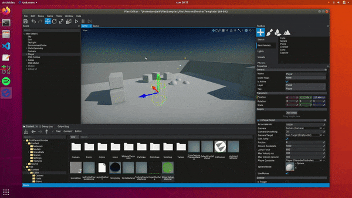
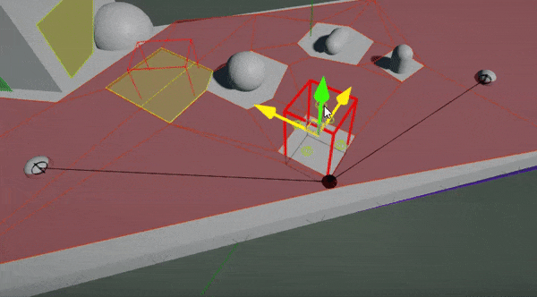
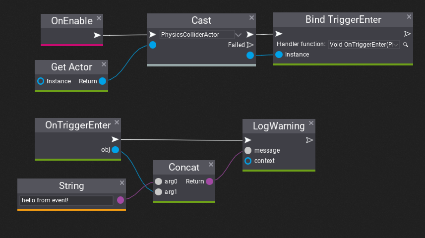
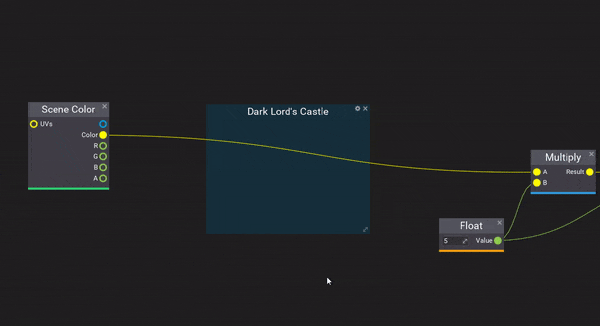
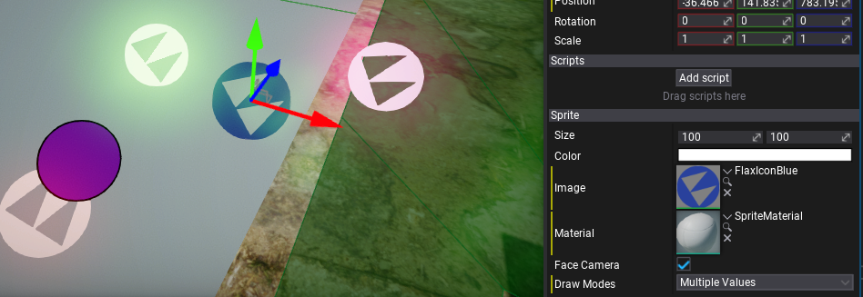

# Flax 1.1 release notes

## Highlights

### Editor for Linux

One of the major features in this release is full support for the **Flax Editor on Linux**! It runs great on Ubuntu and contains all the features such as live scripting with C++/C# hot-reload, Visual Code integration, scenes editor, game cooking, terrain editing, foliage editing, and much more. It has feature parity with Editor on Windows to enable game developers on Linux to create great projects with Flax!

To learn more about how to use it see [Get Started](../../get-started/linux.md) section. We use **Vulkan** for rendering (old *OpenGL* GPUs won't work).

\*It has been tested on *Ubuntu 18* and *Ubuntu 20* (both *LTS* versions).

### Splines

When creating games programmers, level designers and artists often need more robust tools for object placement and scene dressing. That's a great example where new **Spline tools** come in. Spline is a Bezier curve made of 3D points with tangents that is very easy to create and set up in Editor. Those can be used to create objects following the path (as shown above), draw the model over the spline curve, build roads and rivers, or create dynamic gameplay components like a chain (as shown below).

To learn more about splines see dedicated [documentation with tutorials](../../graphics/splines/index.md).

### Low-level Networking

One of the most important features we want to work on during this year is **networking** support in Flax for multiplayer games. We've already supported networking in C# API via .NET library. Now we're adding low-level sockets implementation that is cross-platform and will be used as a foundation for Low Level and High-Level networking solutions built-in Flax.

The goal is to have fully-featured multiplayer support in the engine within this year. Right now you can already create client/servers in Flax with a new `Network` API (from `Engine/Platform/Network.h`) that comes up with methods to create and manage sockets and send or receive data over the net.

### Navigation Features

As we're starting to see more and more projects using Flax, we strive to improve various engine areas. This time we've added lots of goodies into the Navigation system such as:
* multiple navmeshes support
* navmesh modifier volumes
* nav agent properties and queries
* rotated navmeshes
* more navmesh queries types (`TestPath`, `FindRandomPoint`, `FindRandomPointAroundCircle`)
* nav agents masking (eg. for nav bounds volumes)
* dynamic navmesh updates at runtime

### Visual Scripting Features

After 1.0 release update that introduced Visual Scripting tools in Flax, we've seen massive adoption of it. This lead to adding even more goodies into visual scripting in Flax.

Now, you can bind into **Events** int Visual Script to handle trigger volumes or collision events as shown below (see [tutorial](../../scripting/visual/events.md)).

Another features are **automatic node formatting** which arranges nodes to make them more organized (use *Format node(s)* button in context menu) and **reroute node** for connections organization (double-click on connection to insert it).

### Third Person Shooter sample

[Flax Samples](../../samples-tutorials/samples/index.md) is a great collection of projects to pick up on at the beginning of the journey with Flax. Recently we've added a new shooter project with 3rd person camera (community contribution). Can be used as a base for your future game project. Try it out!

### Editor Improvements

For most of the time between 1.0 and 1.1 updates, we worked on **improving quality** and **usability** of the Editor. This includes tons of issues fixed (over 140 bugs fixed), improved stability, better gizmos, better UI editing, better prefabs tooling, better everything.
Things important to highlight are:
* **Rider IDE** integration
* **UI editing** support **in Prefab** Editors
* Full debug log stack traced in Debug Log (with double-click to navigate)
* **New UI Transformation editor**
* Script members display based on declaration order (see Editor options)
* **Live particles preview** in Scene viewport
* Converting existing actor int odifferent type
* **Copy/paste of all script properties**
* Build button configuration in options
* Optimized hot-reloading of C#/C++ code performance (via caching scripting API reflection data)

### Sprite Renderer

New in-built actor that can draw sprites in 3D or 2D. Highly customizable and ready to use. See docs [here](../../ui/sprite-render/index.md).

### Volumetric Fog Particles

One of the important aspects of the Volumetric Fog is the ability to adjust its density and color in local parts of the scene. To achieve it we've added a new drawing module to particles called: Volumetric Fog Rendering. It draws particles into the volumetric fog and they can modify the fog Albedo, Density, and Emission. See documentation [here](../../graphics/fog-effects/volumetric-fog.md) to learn more.

## Changelog

### Version 1.1.6217 - 28 March 2021

Contributors: mafiesto4, VNNCC, DaruBrub, jb-perrier, stefnotch, honzapatCZ, iliyalesani, SilentCLD, intolerantape, Evildea, Vizepi, GoaLitiuM, MinhCT, W2Wizard, Down-s, Erdroy

PRs merged: 68

* Add `API_INTERFACE` to scripting API bindings for implementing interfaces
* Add support for loading JsonAsset instance objects if they implement ISerializable interface
* Add **NavMesh Modifier Volume** actor type
* Add `NavAgentProperties`
* Add `NavMeshProperties`
* Add `NavAreaProperties`
* Add `NavAgentMask`
* Add **support for multiple navmeshes** on a scene
* Add navmesh name to logs for better debugging
* Add support for masking navmesh agents in NavMeshBoundsVolume
* Add support for automatic DefaultValue attributes generation for fields in scripting API
* Add **support for rotated navmeshes**
* Add support for dynamic updating navmesh when moving NavModifierVolume
* Add `TestPath` utility to navigation system
* Add default spacing for CollectionEditor to 10 for cleaner UI when working with arrays and lists in Editor
* Add invoking `BoxVolume::OnBoundsChanged` after transform changed
* Add default values initialization for structures and new array entries when resizing
* Add `ScriptingTypeHandle` debugger view to flax.natvis
* Add more objects types checks and casting utilities to ScriptingObject
* Add support for using `ObsoleteAttribute` to upgrade old C# asset/script data format after refactor
* Add `Actor.HasStaticFlag`
* Add option to hide navmesh in editor debug view
* Add **low-level networking** (cross-platform sockets implementation)
* Add culling for decals (via DrawMinScreenSize property)
* Add scripting API **events in Visual Script**
* Add support for Events in Scripting API reflection in Editor
* Add `IFunctionDependantNode` for Visject nodes
* Add **Spline** actor
* Add **Spline Model** actor (draws model over spline)
* Add **Spline Collider** actor (creates collision over spline)
* Add **Spline Rope Body** actor for ropes, chains and cables physics
* Add Deformable material domain (for spline models)
* Add default Deformable material for splines
* Add auto-select for spawned actors in the level
* Add Add/Subtract methods to Transform
* Add support for copy/paste/rever values for groups in Custom Editor (eg. array editor)
* Add `Transform.LocalToWorldVector` and `Transform.WorldToLocalVector`
* Add first derivative calculation utilities for Curve
* Add Build Actions option to editor settings for build button configuration
* Add `DebugDraw.DrawWireTriangles` for wireframe geometry debug drawing
* Add `SoftObjectReference` for lazy references to assets and objects
* Add support for custom defines for build system via `Flax.Build` command line
* Add support for custom SceneGraphNode to handle delete with undo
* Add support for custom duplicate of SceneGraphNode
* Add support for using other VC++ toolset for Window and add cmd arg for selecting compiler manually
* Add an info group for selected Rigidbody in play mode (display speed, velocity, angular velocity, etc.)
* Add support for mapping objects in SceneAnimationPlayer to reuse it for different objects
* Add support for copy/pasting script properties
* Add more utilities to SceneReference
* Add more utilities to LayersMask
* Add **Volumetric Fog particles** to modify local fog
* Add skipping textbox scrolling if it has no selection
* Add WriteJsonDiff support for JsonConverter for custom object diff serialization
* Add more documentation comments improvements
* Add `F` to focus camera view in asset previews
* Add `WorldSpaceFaceCamera` mode to UICanvas
* Add mouse centering in Editor Viewport if initial location is too close to the edge
* Add separation in ContainerControl for Self/Children drawing code
* Add ContainerControl as a base for Common GUI controls (Border, Button, ProgressBar, TextBox)
* Add UICanvas culling (for 3D rendering)
* Add support for spawning Collision Data as Mesh Collider in viewport drag&drop
* Add improvements for objects spawning in editor viewport
* Add support for debug shapes preview in prefab editor window
* Add support for viewport icons rendering in prefab editor window
* Add `Add mesh collider` option to Static Model context menu
* Add reusing created collision data for model when UI requests it
* Add layers and tags updating
* Add support for borderless window style on Windows that supports system docking and aero shadow
* Add editor window outline color to match the status bar color
* Add more features for platform impl on Linux
* Add more support for window system features in Linux (X11)
* Add support for C++ scripting on platforms that don't support referencing executable file when linking shared library (eg. Linux)
* Add support for C++ scripting on Linux
* Add support for Clang 8, 9 and 10 when building for Linux
* Add clipboard support on Linux
* Add support for resizing textures with stb in TextureTool
* Add support for importing textures with options in TextureTool with stb
* Add separate `Platform::GetStackTrace` and `Platform::GetStackFrames`
* Add support for capturing stack trace of called DebugLog from C++
* Add newest `dbghelp.dll` lib
* Add support for using `Level.SpawnActor` to add scene from code
* Add integration with **Rider IDE**
* Add `FindRandomPoint` and `FindRandomPointAroundCircle` to the navigation utilities
* Add `BoundingSphere::Transform` method
* Add support for accessing Game Settings and related assets in C# API in game build
* Add Absolute and Negative to Vector3 C# API
* Add **Sprite Render** actor for sprites drawing
* Add Render Layers to Camera and Render View for masking objects during rendering
* Add `DebugDraw::DrawText` for drawing 2D debug text on a screen
* Add `DebugDraw::DrawText` for drawing 3D debug text in the world
* Add support for updating particle effects in editor view when editing
* Add `Mask ZW` node to all Visject surfaces
* Add Particle Radius to in-built particle attributes
* Add `EditorScene` for using gameplay logic in editor preview windows
* Add support for audio clip playback preview in editor window
* Add `SceneGraphNode.OnContextMenu` for customizations
* Add profiler events to LocalExecutor thread workers in `Flax.Build`
* Add `-shaderdebug` cmd line switch to Editor for shaders debugging
* Add support for `mutable` keyword on `API_FIELD`
* Add support for caching scripting API bindings during build
* Add MaxConcurrency and ConcurrencyProcessorScale options for Flax.Build cmd line
* Add `SceneRenderTask.PreRender`
* Add check for C++ bindings generator for property getter and setter method value types to match
* Add virtual to Camera GetMatrices for custom cameras
* Add support for parsing exponential (scientific) notation numbers in input fields
* Add Any node to material
* Add All node to material
* Add Sign node to material
* Add Blackbody node to material
* Add bringing editor window to front on focus
* Add safety checks for particles data to prevent division by 0
* Add support for UICanvas preview in Prefab Viewport
* Add UIControl outlines drawing in Prefab window
* Add virtual memory allocation utilities
* Add exception instead of crash when using `DebugDraw.DrawLines` with uneven amount of lines
* Add `FLAXENGINE_API` macro to class `JsonAsset`
* Add `Level.GetActors` and `Level.GetScripts`
* Add some defaults to `Quaternion` helpers
* Add and refactor several extension methods for Random
* Add `Render2D.DrawTexturedTriangles`, `Render2D.FillTriangles` and  `Render2D.FillTriangle`
* Add `ScriptingTypeHandle` debugger view to `flax.natvis`
* Add `Convert` feature for actors in Editor scene tree context menu
* Add RGB & HSV conversion nodes to material graph
* Add more separators to `TextBoxBase`
* Add allowance for overriding most of the methods in `TextBoxBase`
* Add auto serialization by default in C++ script template
* Add optional icons to `DockWindow`s
* Add icon for Content window
* Add icon for Debug Log window (based on last unseen logs severity)
* Add WarningOnce, ErrorOnce, InfoOnce, VerboseOnce to Flax.Build logger
* Add colored icons for Debug Log entries (and adjusted entry height)
* Add Render2D tint color layering support
* Add **retoute nodes to Visject**
* Add arrow key navigation to Visject
* Add support for binary modules with native-code only
* Add improved dll import/export attributes injection when building binary modules
* Add support for using ThirdPartyModule in game/project scripting
* Add `StringBuilder::ToStringView()`
* Add write barriers for Mono GC in bindings glue code
* Add support for overriding most of the methods in `TextBoxBase`
* Add `ClampLength` to Vector2/3/4
* Add `StringUtils::ConvertUTF162UTF8`
* Add support for using automated codesign for binaries in deployment
* Add passing custom compiler switch when invoking child Flax.Build process during deployment
* Add DrawCylinder and DrawWireCylinder to DebugDraw
* Add *Shift+Home* shortcut to Text Boxes
* Add support for vertical and horizontal panels to arrange children based on the child anchor
* Add per-monitor/per-window DPI support
* Add **new UI Control transform editor**
* Add more descriptive "no scene" message
* Add automatic rename to UIControl
* Add constructor to BoundingBox for single point empty box construction
* Add Mouse Wheel Sensitivity option to Editor
* Add selecting prefab root objects first in Editor
* Add error check to prevent changing parent of the Scene actor
* Add focus on acto with `F` key in editor viewpo (improvements)
* Add better support for orthographic projection in Editor viewport controls
* Add option to order script fields/properties in Editor UI based on declaration order (Editor option)
* Add splash screen quote
* Add support for Custom Defines in Game Cooker for build scripts configuration
* Add support for custom defines for build system via `Flax.Build` command line
* Optimize and improve ActorChildNodes handling
* Optimize build tool
* Optimize `MAssembly::GetClass(MonoClass* monoClass)` search via assembly image early out
* Optimize automatic navmesh rebuild in editor for navmesh relevant actors only
* Optimize Serialization.h to have separate SerializationFwd.h for more lightweight types serialization impl
* Optimize DebugLog stack trace formatting
* Optimize `Texture::DownloadData` for staging textures
* Optimize Blend Normal Node
* Optimize compilation time on Windows
* Optimize scripting API bindings generation if loaded API from valid cache
* Optimize DrawCall to pack indirect draw arg and graphics draw data with union
* Refactor navigation system to support multiple navmeshes with more options and API
* Refactored lots of logic in UI to fix various reported issues (eg. vertical and horizontal panels usage has been improved a lot and might behave different than it used to be)
* Refactor game settings to support using API bindings
* Refactor PhysicalMaterial to use API bindings
* Refactor draw calls and instancing logic to be more modular
* Refactor material shaders generator to use modular features as extensions
* Refactor Collider base class to improve code sharing across collider shape types
* Move Curve data serialization to binary format into `CurveSerialization.h`
* Move ScreenToGameViewport from Engine to Screen (update doc comments)
* Remove Unlink from asset reference
* Remove deprecated and unused `ISceneObject` and `ITransformable`
* Improve tokens preprocessor for scripting API headers
* Improve Visual Studio Code solution generation for C# projects
* Cleanup and optimize `StringUtils::ConvertUTF82UTF16`
* Move Actor static flags helper methods to be manually implemented (less bindings)
* Update stb lib
* Update Recast navigation lib to `e75adf86f91eb3082220085e42dda62679f9a3ea`
* Fixes for UI control sync
* Fixes for Editor layout element containers
* Fixes for scripting objects
* Fix and code cleanup for Flax Storage types
* Fix `PathRemoveRelativeParts` for rooted paths
* Fix C# assembly Guids to use cross-platform hashing for stable values
* Fix collecting binary modules for targets with Modular linkage
* Fix Debug Log stack trace collecting in Editor
* Fix importing models with custom UnitScaleFactor
* Fix crash on exit when loading storage file fails
* Fix some minor issues with materials previews in Editor
* Fix debug shapes leftovers update in editor after playmode
* Fix using Scripts in async
* Fix crash on close when using Vulkan/D3D12 rendering backend with async task being canceled
* Fix material Sphere Mask node if radius is specified as integer
* Fix sampling particle position/velocity in material for emitters simulated in Local space
* Fix placement and usage of the new instance creation button in GenericEditor
* Fix `MAssembly::GetClass(MonoClass* monoClass)` for generic classes
* Fix loading game assets in cooked build via path relative to the project folder
* Fix particles view information in Editor when Game window is unused
* Fix `findRandomPointAroundCircle` in Detour lib to return points inside circle
* Fix adding items in Array/List editors if element type is reference (eg. class)
* Fix `Color` struct doc comments
* Fix not using hardcoded order for showing Actor main properties in editor
* Fix loaded asset verification error for json assets that have the scripting type
* Fix crash when using Physical Material with missing instance
* Fix default field value parsing to skip whitespaces
* Fix crash on GPUDeviceVulkan dispose if compute queue was using graphics queue
* Fix using dynamic libraries resolving path on Linux
* Fix some editor UI controls visible in Visual Scripting
* Fix MAssembly classes dictionary cache allocation to be during assembly load
* Fix Dictionary to call ctor/dtor for Buckets when needed
* Fix right-click context menu for Visject Nodes
* Fix crash when using Find/FindLast on empty String
* Fix calling OnParentChanged in Actor load
* Fix compilation warnings
* Fix showing shader source code window over a calling window
* Fix Quaternion comparison epsilon to reduce error rate
* Fix using Bezier curve for Transform (Scale tangents issue)
* Fix for serialization problems with custom structures
* Fix using nested types in scripting API
* Fix navmesh tiles set resizing issue
* Fix saving assets with path containing invalid slashes
* Fix Vertical/Horizontal panels issue with anchored child controls
* Fix updating Label layout after font change when using automatic size
* Fix scripting reload without scenes loaded
* Fix UI not being updated with particular panels used when changing child control anchors
* Fix Scene Queries to lock scene access
* Fix DebugDraw DrawTriangles crash
* Fix *PhysX* header usage in public API
* Fix missing UICanvas linkage in prefab preview
* Fix skipping UICanvas diff serialization for Size property if render mode is ScreenSpace
* Fix UIControl location deserialization when using prefabs and anchors
* Fix control Offsets margin diff deserialziation
* Fix possible issue for prefab reference value for default value object that might be deleted on prefab apply
* Fix editor viewport camera orbiting issues
* Fix missing selection type in CustomEditorPresenter
* Fix assertion on engine close due to rare invalid storage object refs count
* Fix using scale mode Gizmo
* Fix Rename Popup direction near screen edges
* Fix exception in Custom Editors UI due to invalid reference value processing
* Fix updating UICanvas when using World/Camera Space
* Fix control Offsets updating for control bounds when changing anchors
* Fix bug with Vector Parameters in Animation Graph
* Fix crash on Actor deserialization if parentId is missing but actor already has a parent
* Fix synchronizing ActiveInTreeChanged property with event after prefab changes apply
* Fix crash during Mono GC when object has missing vtable
* Fix painting foliage on inactive objects
* Fix InputText length reset
* Fix scaling rotated objects in world space
* Fix HorizontalPanel children layout
* Fix HorizontalPanel and VerticalPanel auto-sizing if child control is using anchors
* Fix conversion to degrees in Vector3.Angle
* Fix drawing UI Control outline in Game Window
* Fix BlurPanel rendering
* Fix error on starting task to continue if it has been canceled
* Fix font character and hit location calculations with line spacing
* Fix tooltips generation for native properties to reflect getter and setter docs
* Fix crash when changing prefab root object
* Fix issue of deleting non-existent folders from the editor
* Fix FindActor and FindScript in Level
* Fix properties names formatting for UI with 2 character words
* Fix some prefabs editing issues
* Fix code style in C# code
* Fix using `get_Control` getter method from UIControl in Visual Script
* Fix error when spawning prefab with rigidbody
* Fix layer matrix order in ediotr UI
* Fix double-click mouse event not setting mouse button down
* Fix default frame rate for fbx imported clips to 14
* Fix Graphics module warnings to be sent once
* Fix updating prefab object reference values after apply in prefab editor
* Fix updating UI layout when adding control
* Fix Editor timeline editor controls API visible in Visual Scripting
* Fix using value sliders when on secondary monitor that is one the left side of the primary monitor (virtual desktop)
* Fix UWP build setup messing with FlaxGame target output type
* Fix automatic tooltip generation error
* Fix tooltip background when using custom theme colors in Editor
* Fix tree nodes mouse hovering logic
* Fix crash in motion blur code when screen size is very small
* Fix rare crashes due to *rgctx* trampolines cache not cleared on assembly reload
* Fix auto-importing materials and textures from model file with invalid path characters used in name
* Fix crash when loading string property in json that is not a string
* Fix missing terrain bounds update after modifying terrain
* Fix updating input fields on editing end without changes
* Fix missing CharacterController bounds if controller is missing
* Fix MaterialParams sync bug
* Fix CSG build crash
* Fix TextBox caret and selection size with custom DPI
* Fix Label auto-height and auto-width when text overflows the lines and it's wrapped
* Fix text not getting clipped in Label with negative margin
* Fix UTF-8 and UTF-16 encoding support usage in Json resources
* Fix deserialization of UTF-8 string for C# object properties
* Fix mouse jittering when pressing both mouse buttons simultaneously
* Fix editor dock panel to always focus tab on click
* Fix UIControl invalid showing in prefab window using nested prefab with UI
* Fix crash for empty text in Text Render
* Fix possible exception in actor editor bounds getters
* Fix memory leak for Mono image refs
* Fix various memory leaks on exit
* Fix ParticleSystemWindow overlapping text bug
* Fix invalid Timeline layout UI when opening timeline data
* Fix crash on prefab sync on instance with missing objects
* Fix Label text alignment in auto size text
* Fix synchronizing nested prefabs when adding new `ObjectsLookupIdMapping`
* Fix actor layer editor setup
* Fix UICanvas state synchronization when working with prefabs
* Fix fullscreen mode on D3D11 and D3D12
* Fix crash in navmesh builder when scene gets unloaded after navmesh tile gets dirty
* Fix preserving objects order in prefab instances on apply (based on the prefab)
* Fix updating UI layout after changing control order
* Fix crash on using Space char in font with no font atlases initialized
* Fix `IncrementNameNumber` in Editor for Unicode strings (wrong inversing method)
* Fix marking asset as edited when using Multi Blend node positions in Anim Graph
* Fix crash when calling navigation system before navmesh init (eg. in build)
* Fix exception when loading Android NDKs with invalid version folder
* Fix AssetPicker buttons usage without mouse down click over the control
* Fix low-level `WindowsPlatform::Log` to not print invalid characters
* Fix VS debugger config for Dictionary and HashSet to show only Occupied buckets
* Fix ResizeAuto in SurfaceNode to include custom controls
* Fix C# assemblies id generation to use cross-platform hash code impl
* Fix exposing Mono API when using dynamic linking
