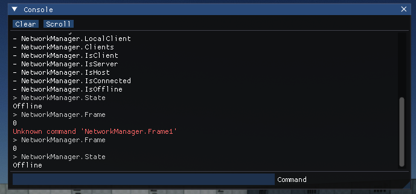

# Flax 1.10 release notes

## Highlights

### New Bloom


**Bloom effect** uses a new smother rendering that provides **more realistic results**. It features mipmap-based dual filtering with configurable soft knee. New visuals are softer, more stable, and have wider diffusion that spreads naturally when looking at bright spots.

### Multi Blend Editor Improvements


New Multi Blend 2D editor will visualize triangulated blend space with gradients and highlights to better understand how animations are being interpolated. This accurately represents the logic that's running under the hood for animations blending.

### New Meshes Vertex Format


One of the biggest changes in this release is **complete refactor of vertex buffers used by the meshes**. Static and skinned meshes won't use fixed vertex formats anymore. Instead, they will allow for more flexible and fully customizable data. This has been achieved by adding new `GPUVertexLayout` and removing fixed format dependency in Vertex Shaders (see *Migration Guide*).


There are multiple benefits of that change:
* more optimal model assets data (stripping unused attributes at import time),
* vertex data quantization (each mesh can use different precision for vertex position or uv values),
* support for up to `4` texture channels,
* support for up to `65535` bones in skinned models,
* support for vertex colors on skinned models,
* support for non-standard mesh data formats used by game.


### New Animation Retargeting


We've made a significant improvement to **animation retargeting**. In the above gif there are various characters from Synty that use different skeletons (from various asset packs) and play the same animations correctly. To learn more about this feature see [animation retargeting docs](../../animation/animation/retargeting.md).

### Networking Optimizations

We're seeing more and more games made with Flax that use in-built networking. This lead us to working on significant performance optimizations for networking system such as:
* Object IDs and TypeNames used by RPCs and Replication are now using optimized 32-bit keys,
* Quaternions are using quantization which cuts average transfer rate by 56% (eg. `Identity` value is just 1 byte instead of 16 bytes),
* Replication system will check if object data changed before sending replication message.

Those improvements reduced network transfer by a lot. For example, on [Arizona Framework Sample](https://github.com/FlaxEngine/ArizonaFrameworkSample) with 1 Host and 1 Client the network send rate from server went down from 36kB/s to 5kB/s.

### Debug Commands


New **Debug Commands** system lands in Flax 1.10 with a new console inside Output Log window. `DebugCommand` is an attribute that can be placed on classes, fields, methods, and properties to expose them for configuration, modding, or tooling.

[Output Log](../../editor/windows/output-log.md) is Editor window that displays the full log. Now, at the bottom of that window, there is an input command field that can be used to run commands. You can type commands with an automatic search popup that displays similar commands based on the entered value. Use arrow keys to navigate around that popup list. The tab key can be used to autocomplete commands based on the best-found match. Finally, when input is empty you can use the arrow up key to navigate around the command history and re-try one of them again.

For in-game console, we've added one via ImGui system inside [Arizona Framework](https://github.com/FlaxEngine/ArizonaFramework).



Complete documentation available [here](../../scripting/advanced/debug-commands.md).

### Button Attribute


We did it! Finally, `Button` attribute comes to C# and C++ scripting for quick function annotations to expose them in the Editor Properties window for users to click on. This is very handy when prototyping procedural level generation systems or other randomziation/code-based algorithms. It works with both static and member methods at edit-time or during play-mode.

### Curve Editing Improvements


This update brings various fixes and improvements to **curve editor**. Finally, stable zooming and panning for more robust editing.

## Migration Guide

### GPU Vertex Layout

Vertex Shaders don't need to use `META_VS_IN_ELEMENT` anymore. Now pass `GPUVertexLayout` to Vertex Buffer via `GPUBufferDescription` while creating buffer from code. You can get vertex buffer layout via `GPUVertexLayout::Get` to define vertex structure layout from code that matches data passed to those buffers. Shaders don't need to rely on a specific data format anymore, which gives more flexibility.

Example usage of vertex structure defined in code with buffer creation that matches data type of vertex elements (the same API exists for both C++ and C#):

```cpp
struct Vertex
{
    Float3 Position;
    Color32 Color;
};

auto layout = GPUVertexLayout::Get({
    // type, slot, offset, instanced, format
    { VertexElement::Types::Position, 0, 0, 0, PixelFormat::R32G32B32_Float },
    { VertexElement::Types::Color, 0, 12, 0, PixelFormat::R8G8B8A8_UNorm },
});
```

### Mesh Data

`Model` and `AnimatedModel` assets support variable vertex format with new data streams instead of fixed vertex structures. This gives more flexibility to mesh importing for more optimized data layouts with quantization. To provide easy read/write access over mesh data new `MeshAccessor` API was added (both C++ and C#):

```cs
var assessor = new MeshAccessor();
if (assessor.LoadMesh(mesh)) // Get mesh data
    return;
var positionStream = assessor.Position(); // Access vertex positions data stream
if (!positionStream.IsValid)
    return;
var count = positionStream.Count;
for (int i = 0; i < count; i++)
{
    var position = positionStream.GetFloat3(i);
    // modify data...
    positionStream.SetFloat3(i, position);
}
assessor.UpdateMesh(mesh); // Write back to mesh
```

`MeshAccessor` supports all vertex element formats and can perform auto-convertion for ease of use. For example, mesh data can be stored as `R10G10B10A2_UNorm` but code can access it as `Float4`.

### Other Changes

* C++ `Nullable<T>` has been refactored to be more consistent. Update your code that use it.
* C++ `Vector3::Angle` now returns value in degrees instead of radians, just like C# API.
* 9-slice texture/sprite brushes have been fixed to properly calculate border size, which will break existing usage in assets.
* When loading assets (eg. scene or prefab) that uses deprecated data format, Editor will auto-save it to upgrade data to the latest format. Asset and object deserializers can use `ContentDeprecated::Mark()` to indicate such need.

## Changelog

### Version 1.10.6705.0 - 17 April 2025

Contributors: mafiesto4, GoaLitiuM, xxSeys1, Tryibion, tecnessino, ldkuba, amir9480, ConsumerJunk, mtszkarbowiak, alcoranpaul, envision3d, TheStripyCat, GaryMcWhorter, Chikinsupu, GasimoCodes, Duroxxigar, davevanegdom, MrCapy0, Muzz, anton-makarenko, Zode, ThePhantomMask, ZaPx64

PRs merged: 149

* Add **new Bloom rendering** (wider and more realistic)
* Add smooth shadows blending between directional light cascades (via Graphics settings)
* Add displaying asset failed text if it occurs
* Add `SystemName` and `SystemVersion` to `Platform` API
* Add `Script::IsEnabledInHierarchy`
* Add utility operators for `LayersMask` bit operations
* Add `HighestSetBit` and `LowestSetBit` utilities
* Add logging CPU name on Windows
* Add `DriverVersion` to `GPUAdapter` for checking on old GPU drivers
* Add `GPUTexture::DownloadData` to C#
* Add profiler zone for native library loading
* Add **leaderboards support to Online interface**
* Add Visject per-node custom search and use it for Multi Blend nodes to filter animations used
* Add `Base Model` to Animation Window to preview animation via a different base skeleton with retargetting
* Add `AutoAttachDebugPreviewActor` option to editor for quick debugging anim graphs on dynamically spawned player
* Add `Edit GUI` option to Game Window
* Add absolute snapping option to transform gizmo
* Add rubber band select to scene editor viewport for selecting multiple actors
* Add using `c:` in search filtering to find control types
* Add showing `No parameters` text when no parameters to be displayed in Preview tab
* Add better selection bounds for multi axis transform gizmo
* Add search operator tooltip to scene tree search bar
* Add option to quickly create box, sphere, convex or triangle mesh collider for the selected static model
* Add improvement to script compilation failed warning to be a bit nicer
* Add visual feedback on ranged value slider knob hover
* Add wait on asset load when accessing material parameter values directly
* Add safety check to exit game in Release mode when running with graphics debugger attached
* Add `GPUVertexLayout` to graphics backends
* Add **support for up to 4 texture channels when importing meshes**
* Add support for **vertex colors for skinned models**
* Add option to copy/paste skeleton retargetting between models
* Add progress indicator in editor for assets loading
* Add optional direction option to context menu
* Add editor windows to quick actions via Content Finder tool
* Add **debug commands to Output Log** window in Editor
* Add `GetFields` and `GetMethods` to binary module api
* Add `ToSpan` for `MemoryWriteStream` and simplify code with it
* Add **content deprecation system that auto-saves assets** in Editor that use old data format
* Add network keys table to optimize ids and names sending over network
* Add object replication data cache and send via `Reliable` channel to reduce data transfer
* Add `Quaternion` quantization for network stream
* Add `Task::WaitAll` with a span of tasks and wrap around profiler macro
* Add `SystemName` and `SystemVersion` to `Platform` api
* Add `Slice` to `Span` and use it to make code cleaner
* Add `PixelFormatSampler` utility to quick read/write operations on various data formats
* Add **support for up to `65536` skeleton bones in skinned meshes**
* Add mesh vertex layout and GPU memory size display in model window
* Add total mesh vertex stride display in editor panel
* Add content deprecation system that auto-saves assets in Editor that use old data format
* Add content deprecation upgrades support to prefabs and scenes when loading levels in Editor
* Add serialization of game settings for proper upgrade when loading deprecated data
* Add logging first scene asset id in cooked game
* Add engine fatal error types handling
* Add general out-of-memory handling
* Add improved GPU crashes reporting
* Add safety memory buffer for crash or out of memory handling
* Add logging memory usage by external apps on crash
* Add Program Size Memory and Extra Development Memory access and log on start
* Add `Engine::ReportCrash` event for custom crash reporting or handling
* Add **named terrain layers**
* Add warning when used param is being deleted in surface graph
* Add `ButtonAttribute` to display methods in editor properties panel
* Add support for curves in C++ scripting api
* Add displaying whole curve in properties panel upon show
* Add adding keyframes to curve on double-click
* Add zooming in curve editor relative to the mouse cursor and adapt to curve size
* Add splitter bar for resizing curve editor inside properties panel
* Add `F` key shortcut to show whole curve in editor view
* Add `Alignment` option to Vertical and Horizontal Panels
* Add being able to obfuscate text in a text box with a character
* Add **support for Vector3, Float3, Double3, and Quaternion mutliselect value changing**
* Add support for multi-control editing
* Add support for .NET 9 SDK and runtime
* Add C++ version and compiler path into VS Code project files
* Add handling C++ curly brace field default values for code gen to C#
* Add support for C++ trailing return C# generation
* Add hanglind nameless C++ function argument support for C# generation
* Add multi-line string literal parsing inside custom api code injection blocks
* Add scrolling to the new script after adding it
* Add **.aab bundling for Android**
* Add **Android emulation options to Game Cooker**
* Add **Android devices listing and quick deploy/log tools**
* Add invert options for texture imports for Red, Blue, and Alpha channels
* Add re-enabled scale center gizmo
* Add improved debug message on incorrect ray direction length
* Add support for creating Json Assets in editor out of structure type
* Add nested prefabs editing buttons inside Prefab Window
* Add UI Mode switch to Prefab Window
* Add `ControlReference` for **easier UI referencing in code**
* Add double-click customization for Scene Tree nodes (focus, rename, open prefab)
* Add context to object reference control to narrow finding actors and scripts (for prefab editing)
* Add game plugin template
* Add `DebugDraw.DrawCapsule` and deprecate `DrawTube`
* Add support for searching actors and scripts by interface
* Add audio volume and muted in game panel tab rmb menu
* Add `Actor.Clone` for actors duplication at runtime (including scripts and children)
* Add `Double4x4` for higher precision matrices operations
* Add `GPUResourceUsage.Staging` for both CPU read/write access
* Add `Shift HSV` and `Color Blend` material nodes
* Add new triplanar node to materials for normal maps sampling
* Add option for local-space triplanar mapping
* Add warnings on incorrect `GPUBuffer` or `GPUTexture` usage when binding to `GPUContext` (in non-release builds)
* Add warning if wrong type while setting material/animation parameter
* Add import path UI and button to open folder in asset import settings
* Add runtime input mapping helpers
* Add support for displaying `Multiple Values` info to object reference pickers
* Add double clicking an object reference in a prefab to select the object within the prefab
* Add RMB menu entry to show item in Content Window if there is a search
* Add anchor and pivot drawing for UI Gizmo
* Add grey-out color for read only textbox
* Add a confirmation dialog for editors when the reset button is clicked
* Add `No parameters` UI to particle effect and animated model
* Add debug draw clear to game and editor panel (if in use)
* Add drag drop to `FilePathEditor`
* Add `root` parameter to `Level.GetScripts`
* Add rotate position shape as particle module
* Add snapping to grid with Ctrl key when moving keyframes in curve
* Add focus selection to curve editor and apply margin around shown curve section
* Add caching and restoring curve height in properties panel
* Add Debug Log and Output Log color customization
* Add SIMD support for `rapidjson` when processing `json` data
* Add improved AndroidNdk detection to handle versions folder in env var location and fallback to automatic
* Add debug draw clear method
* Add blend space drawing in Multi Blend 2D editor
* Add stencil support in PSO on DX11
* Add the option to ignore specific warnings during build of C# scripts
* Add check and warn user if asset is being moved between the content to source folders
* Add preserving existing Model Prefab objects when reimporting asset
* Add reloading existing scene if opened again
* Add maintaining vehicle wheels ordered in properties when sorting an invalid list
* Add cache to asset references graph for faster displaying data
* Add button in GameCooker window to open output build folder
* Add disabling add script item if it is not being added to a required actor
* Add gravity to `CharacterController::AddMovement` for proper movement when using Root Motion
* Add getter for WheeledVehicle throttle
* Add more scripting templates
* Add hotkey for parent to new actor (`Ctrl+G`)
* Add highlight when actor reference is single clicked
* Add `File` menu option to open game project folder
* Add improved delete assets confirm dialog
* Add a hint to the Output Log if there are no messages shown because of filters
* Add invalidating build rules assembly when files added, moved or renamed
* Add hiding unrelated properties in Material properties for Decal, PostFX or GUI materials
* Add expanded play mode game window focus options by a focus back option
* Add missing particle parameters overrides when duplicating emitter track
* Add `Vector3.SignedAngle` utility method
* Add option to reverse winding order of imported model
* Add renaming surface comments with F2 key
* Add support for `Quaternion` in GPU particles graph
* Add support for using `API_TYPEDEF` macro on `using` typedefs
* Add support for using template type inside `MarshalAs` tag value
* Add grey out gizmo in Editor during play mode when editing static actor
* Add XCode version parsing
* Optimize terrain debug shape drawing by caching lines into a vertex buffer
* Optimize network transform replication
* Optimize NavMesh to not allocate tile memory twice and add safelock to asset data
* Optimize blend weights to use 8-bit per bone (instead of 16-bit)
* Update `Microsoft.VisualStudio.Setup.Configuration.Interop.dll` from `3.4.2244` to the latest `3.11.2177`
* Update `rapidjson` to latest version
* Update engine core collection types code
* Update code signing to support sign with identity on Windows
* **Refactor meshes format to support custom vertex layouts and new flexible api to access mesh data**
* Refactor `Nullable<T>`
* **Refactor UI Control initialization to keep layout locked while loading hierarchy**
* Refactor `Dictionary` and `HashSet` to use shared base class
* Refactor and improve collections code
* Refactor `Globals` exit/error state to be in `Engine` class
* Refactor Multi Blend animations sampling length to fix blend spaces with anims of different length
* Refactor models and meshes to share more code in a base class
* Refactor read and write data stream api to use the newest format
* Rename Vertex Shader input semantic of`BLENDWEIGHT` to `BLENDWEIGHTS`
* Remove deprecated asset data upgrades and old model vertex structures
* Remove pixels sampling from `TextureTool` (moved to the new `PixelFormatSampler`)
* Refactor Bezier splines drawing and editing to property evaluate value and match curve evaluation
* Refactor models and meshes to share more code in a base class
* Simplify capacity presetting for Dictionary to handle memory slack scale internally as users care about items count only
* Fix log file spam and limit size to 1GB
* Fix CanvasScaler's minResolution and resolution curve to the minimum amount
* Fix scroll bars when using negative content area (eg. curve editor)
* Fix game UI root control to properly raycast over 3D canvases
* Fix showing splash screen window when running Editor in headless mode
* Fix actors grouping to make shared parent at the cenetr of the group
* Fix collecting referenced asses from `Animation` asset
* Fix `Quaternion` error tolerance to be more reasonable due to math optimization enabled in compiler
* Fix scene tree menu options being enabled when not supposed to be
* Fix curve editor showing whole curve in a view
* Fix curve editor zoom to be relative to the curve size
* Fix curve editor panning to be stable
* Fix logging missing ref duplicates
* Fix drawing editor primitives later in the pipeline to draw gizmos on top of world-space canvas
* Fix incorrect dummy GPU Buffer format when binding missing resource to Vulkan descriptor
* Fix C++ `Vector3::Angle` to return value in degrees just like C# API (instead of radians)
* Fix `Platform::GetCacheLineSize` to be deprecated in favor of existing `CPUInfo.CacheLineSize`
* Fix editor tables rows coloring to start with darker one
* Fix missing casting from scalar Variant types to Enum
* Fix proper handling of `Scripting.InvokeOnUpdate` if called within that callback
* Fix pasting or duplicating Multi Blend nodes
* Fix Visject Surface search to check nested surfaces (such as State Machine graphs)
* Fix root animation in blend spaces when one of the animations doesn't use root motion but animated root node channel
* Fix raw scripting object pointers auto-serialization
* Fix locked Properties window after scene change
* Fix object reference dropdown icon to be hidden for `ReadOnly` references
* Fix scale gizmo to correctly do two axes
* Fix issue with re-loading scene and toolstip not updating
* Fix collection removal option to be disabled when marked with attribute option
* Fix importing last frame from animations to correctly loop
* Fix spatial and non-spatial, mono and multi-channel audio sourcs playback on OpenAL
* Fix audio artifacts when importing 32-bit IEE `wav` files
* Fix game-build version of `DebugDraw` for C# but without xml docs
* Fix displaying double vectors in Visject constant fields
* Fix particle sim shader compilation warning on Vulkan
* Fix shadows sampling error in shader due to incorrect sampler used
* Fix incorrect scene object memory leak printing if some objects are destroyed during game plugin shutdown
* Fix UI Controls layout auto-resizing to always use pivot-relative logic
* Fix custom GUI material writing depth when it's not needed
* Fix text box shift not working when selection start is at the text length
* Fix Rich Text Box ascender usage in line breaks for correct images placement
* Fix  set order in parent for spawning actor with a parent in editor
* Fix exception in object editor does not show inner exception
* Fix new messages being cut off in Debug Log
* Fix actor adding context menu in the scene tree
* Fix Windows detection to use correct system version it was build for (eg. Win10 or Win7)
* Fix parsing floating point values with `.` separator instead of `,`
* Fix mouse cursor when opening state in animation state machine
* Fix asset reference window showing temp assets
* Fix scripts reload to auto-save any modified assets in editor windows
* Fix showing Content Search window to properly use context window
* Fix collision proxy not updating on sequential mesh changes
* Fix incorrect result array memory copy from native to managed code
* Fix scripting AssemblyLoadContext not getting unloaded
* Fix new terrain debug drawing of collision lines
* Fix shadow maps rendering regression bug
* Fix LOD Preview regression due to new instancing logic
* Fix missing material instance load failure when parameters load fails
* Fix actor reference select in prefab editor
* Fix `LOG_FLUSH` to flush only when automatic mode is disabled
* Fix parsing nested template types in scripting type inheritance
* Fix `TypeUtils.GetTypeName` for nested generic types
* Fix `Version` marshaling as parameter
* Fix packaging issues to properly read asset data after it's serialized with a new format
* Fix output log window to properly handle copy and other input events
* Fix context menu to resize instead of flash when showing while already visible
* Fix `LoadAssetTask` to properly dereference asset loading task pointer when asset init fails
* Fix scale not being applied to physics center
* Fix duplicated newlines on Github Action output on Windows
* Fix output log scroll reset on new log entries addition bug
* Fix game deployment if output name contains invalid path characters
* Fix project files generation to skip unsupported platforms/architectures in referenced targets
* Fix duplicate root node values changed handler bug on the `BehaviorKnowledgeEditor`
* Fix `ComputeShapeSqrDistanceToPoint` on PhysX with Large Worlds
* Fix `MUtils::GetClass` for `Float2`
* Fix passing object reference as out parameter in scripting method invoke
* Fix NetworkManager not resetting LastUpdateTime
* Fix stencil usage in Vulkan
* Fix blend states and blend factor usage on Vulkan
* Fix rotation of UI size handles
* Fix UI Control anchors to clamp between `0` and `1`
* Fix ` .exe` being deleted when using the `Run cooked build` option
* Fix Android build on .NET 9 and use DotNet version that is found by build tool path
* Fix `Edit Prefab` button no longer change Content window folder 
* Fix UI Editor Gizmo to select control with raycast-first for more precise usage
* Fix editor orthographic viewport in top or bottom view
* Fix typo for error message when trying to load a project file that does not exist
* Fix various asset windows shutdown when editor is disposing during crash
* Fix content item text scale with content view scale
* Fix editor error in Actor node `IsActive` fails
* Fix new colider transform when using `Add collider` option
* Fix perlin and simplex noises to return normalized value to range 0-1
* Fix showing whole curve if its empty
* Fix curve editor scroll bars to be hidden when not enabled
* Fix curve tangents reset on drag start
* Fix curve tangent handles to maintain size relative to the current view scale
* Fix curve tangent colors to match editor style
* Fix curve tangents editing to have stable movement no matter the view scale
* Fix float precision issue when drawing curve or timeline time axes
* Fix capturing empty project icon when Editor viewport was never rendered
* Fix selection still showing when text box is not focused
* Fix `Platform::GetCacheLineSize` to be deprecated in favor of `CPUInfo`
* Fix spline node to support prefab editor
* Fix `RenderToTextureControl` to render correctly when using different texture size than control size
* Fix sprite and texture 9-slice rendering brush to properly calculate border size
* Fix scene tree selection for dropped actors that are reparented
* Fix `SnapToGrid` to skip when grid component is `0`
* Fix anim graph state transition title to auto-fit
* Fix .NET SDK detection when only the runtime is installed
* Fix missing C#-only project configurations when platform SDK is missing
* Fix not defined localized strings to use fallback instead of empty text
* Fix incorrect motion vectors for material that uses position offset
* Fix rare crash while debugging scripting unload
* Fix error when no valid .NET SDKs were found 
* Fix error in LocalizationSettingsEditor after adding new locales
* Fix playing mono audio sounds with panning
* Fix Visject gradient stops to update graph only on sliding end
* Fix error in XML docs processing
* Fix memory leak in Video player on Windows
* Fix memory leak in particle buffers recycling
* Fix triplanar texture mapping when using Large Worlds
* Fix `DebugDraw.DrawWireArc` with Large Worlds enabled
* Fix large worlds rendering of meshes
* Fix editor grid gizmo when using Large Worlds
* Fix actor hierarchy initialization when it gets modified by a script on the fly
* Fix missing masked terrain rendering
* Fix game viewport size to not include DPI scale (screen-space uses it)
* Fix text clipping behind the button in Behavior Knowledge Selector editor
* Fix selected spline points to be drawn relative to the view for greater readability
* Fix failing Windows Test CI if `FlaxTests.exe` fails
* Fix scripting bindings codegen for `SoftTypeReference` and `SceneReference`
* Fix .NET runtime and SDK compilation issues with newer runtime
* Fix C# projects not compiling in VS with native code plugins present
* Fix code project files generation to properly handle path slashes and ignore binary modules without exports
* Fix Visual Studio solution nested project names on Unix systems
* Fix collision cooking for skinned models that use different vertex format
* Fix incorrect prefab serialization to correctly handle diff on object references to prefab objects
* Fix error when applying prefab changes with missing (deleted) nested prefabs
* Fix objects creation to ensure managed object ctor is always executed
* Fix HRTF audio to be disabled due to common audio problems
* Fix shaders parsing to skip comments in between special macros
* Fix vertical axis and blend points center in Multi Blend space editor
* Fix `Forward` and `Backward` in `Matrix` and `Matrix3x3`
* Fix Collection value containers to use correct value assignment
* Fix invisible Game window on play start when it was hidden
* Fix parsing scripting type inheritance with generics
* Fix potential exception in UIControlEditor by checking if value is valid
* Fix crash in CPU profiler on conversion to `ulong`
* Fix crash in animations system when assets gets loading/unloaded while async jobs are active
* Fix crash in particles system when assets gets loading/unloaded while async jobs are active
* Fix crash in OpenAL audio backend on context rebuild
* Fix crash on leftover UI Canvas linked in Prefab window after reload
* Fix crash on incorrect light shadow state after shadowmap resizing failure
* Fix crash due to alive reference to old asset validator
* Fix crash while initializing OpenAL
* Fix crash when curve zoom was too high
* Fix crash when boxing native non-POD structure into managed data
* Fix crash when reading object value from `BehaviorKnowledgeSelector`
* Fix crash when setting C# property of value-type from native code
* Fix crash when spline actor gets removed
* Fix crash when applying prefab with missing scripts in use
* Fix crash when importing fbx model with convex polygon with duplicated vertices
* Fix crash when using physics overlap tests with Collider outputs that catch Terrain
* Fix crash on Vulkan when binding dummy buffer as missing uniform buffer
* Fix crash on incorrect MultiBlend2D triangles memory
* Fix crash when using different values in various math nodes in Visject
* Fix crash when loading cloth that has different paint data size than mesh
* Fix crash when importing large audio file
* Fix crash when cooking game without game settings asset
* Fix crash when using audio playback and playing editor meanwhile
* Fix crash when using anim graph asset after it's reloaded (after editing)
* Fix crash on shadows when using D3D10
* Fix crash when using `ref struct` reflection in managed api
