# Flax 1.11 release notes

## Highlights

### Custom Shading Models

Now, Flax supports adding **custom shading models** for lighting calculations **without a need to modify engine source**. Making custom toon shading for a stylized game or realistic anisotropy shading is easier than ever. Video above shows a simple Cell Shading with outlines that react to world-lighting changes implemented within a material graph. To learn more about see dedicated [tutorial here](../../graphics/shaders/cel-shading.md).

### Decal Layers

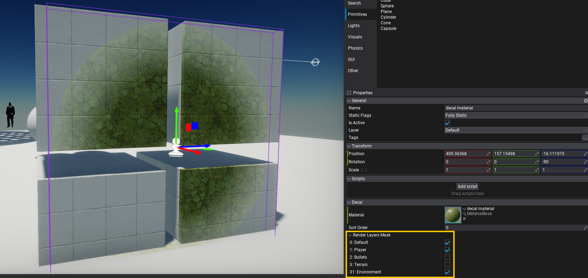

Another big feature in this release is a per-pixel objects masking in shaders via stencil buffer. This gives us ability to **mask decals based on the object undermeath**. Such feature allows to draw bullet hole decals only on environment, detail terrain surface with wet puddle decals that won't affect other nearby objects by using masking. Post Process shaders can access this data too for creating object outlines or highlights.

### New Memory Profiler

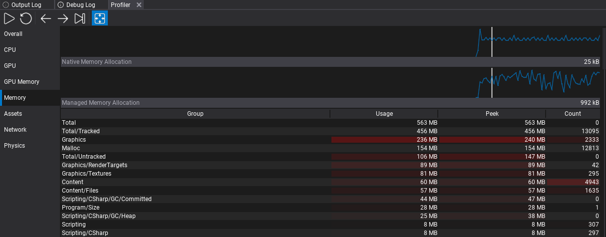

Flax has now a new **low-level memory tracking** tools that can register and track any memory allocation done by engine or game. Allocations are grouped into hierarchical categories to provide a better overview and insights about various systems such as graphics, physics, or scripting. This powerful system come very handy when porting game to platforms with limited memory capabilities such as mobile or handheld consoles.

This feature comes with a set of great tools, such as Editor's Profiler integration that groups categories in a table with hot highlights and charts. New `ProfilerMemory.Dump` command dumps the memory allocations stats (grouped) into the log for quick investigations.

### GPU Particles Performance Improvements

<video src="media/flax-game-particles.mp4" autoplay muted loop width="100%"></video>
| Game made with Flax running on Nintendo Switch

If your project utilizes GPU particles then on 1.11 it should run a lot of faster! Both rendering and simulation have been refactored to scale better across different hardware. GPU particles sortings run parallel and has very fast-path for small emitters (less than `2048` particles). Finally, GPU execution has been improved by using **UAV overlaps and more optimized memory barriers**.

### Particle Emitter Debug Draw

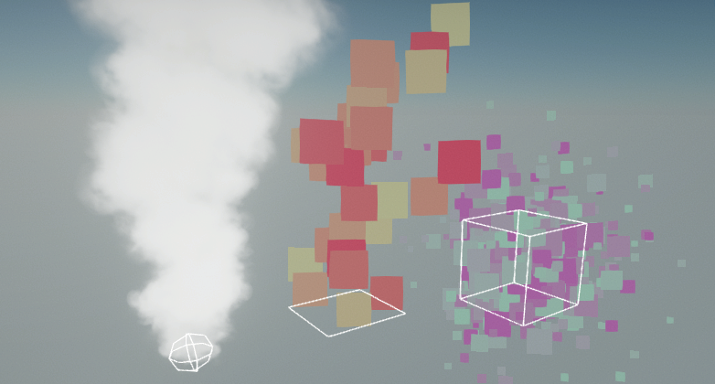

Particle Systems will now display debug draw shapes for `Set Position` modules. You can hide this by unchecking the `Show Debug Draw` checkbox on the particle system actor.

For more advanced effects new Layout tab in Particle Emitter editor displays layout and memory info of the particles.

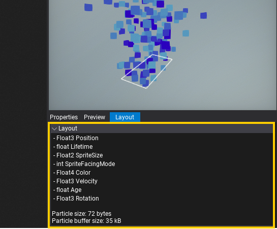

### GPU Profiler in Tracy

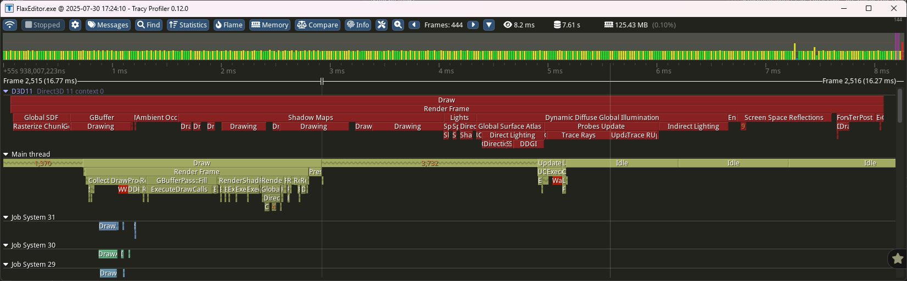

For this release, we added integration of GPU profiling with [Tracy](../../editor/profiling/tracy.md) profiler. D3D11, D3D12 and Vulkan graphics APIs are supported in GPU performance timeline. Integration automatically inserts timer queries to calculate duration of various events. Additionally Tracy provides functionality to show CPU section that corresponds to the given GPU work event. This can be used to profile rendering performance on connected devices (incl. mobile and console devkits).

### Visject Improvements

<video src="media/node-formatting-tools.mp4" autoplay muted loop height="400"></video>
| New node formatting options

Flax has its own graph editing tools, called Visject. It is used in many areas of the engine, from materials and particles to animations. In 1.11, a lot of new features were added and a lot of already existing ones were improved, making assets that use Visject **even quicker and easy to edit**.

Notable changes:
* Additive and subtractive box select,
* New node formatting and alignement options,
* Node socket connections can be moved with a mouse drag,
* Time node contains now both scaled and unscaled time values,

### Viewport Icons Scaling

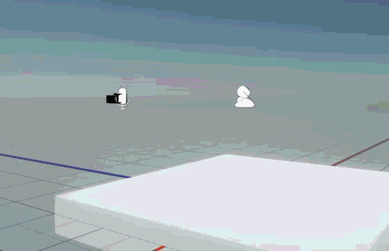

Viewport icons now change their size based on their distance to the camera. This vastly improves their visibility when they are far away from the camera. 

### New Keyboard Shortcuts

Using your mouse for everything can slow you down a lot. That's why we **added a bunch of new keyboard shortcuts**. Now, you can switch between windows in the editor by pressing *Control + Number* or quickly access the debug console text input with *Control + Backquote* (`~` key). Debug View Modes and some of the commonly used View Flags also got their own shortcuts (*Alt + Number* for View Modes and *Control + Shift + Number* for View Flags). Using those is much quicker than selecting the view mode via `View -> Debug View`/`View Flags` in a viewport.

Of course all of these shortcuts **can be customized in the editor settings** (speaking of which: you can now access them by pressing *Control + Comma*).

### Async Scenes Loading

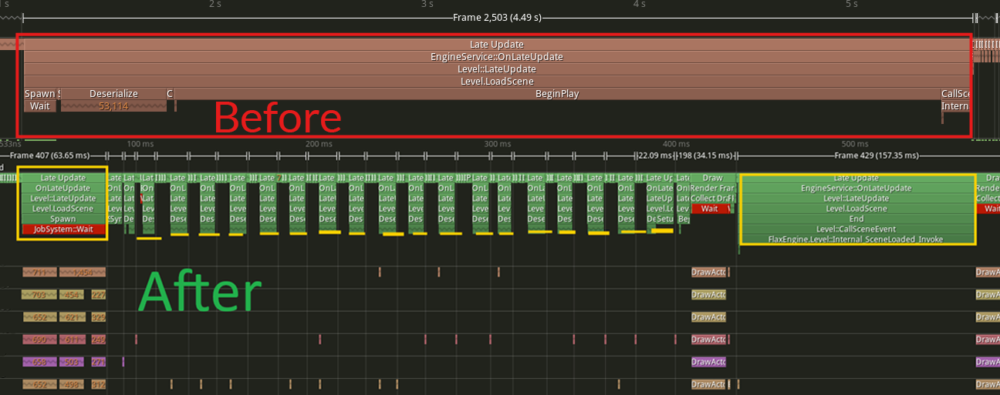

Scene loading has been refactored to use a **time budget (per frame)** via time-slicing. It's configurable and **removes hitches when opening maps or streaming levels**. This smoothens loading large levels, and more parts of that code are running in async now. By default, it's configured to use max 30% of the total frame time (eg. 4.8ms at 60fps) to ensure the game remains smooth.

### Layers Matrix Highlights

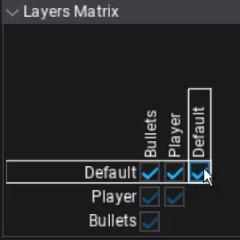

The layers matrix could become quite hard to read when there are lots of layers in the project. That's why in Flax 1.11 we added highlights to the row and column of the checkbox that the mouse is currently hovering over.

### Threading Improvements

<video src="media/falling-boxes.mp4" autoplay muted loop width="100%"></video>
| 10,000 falling boxes

We've improved many engine parts to use multi-threading more often. Especially, physics simulation results processing, content streaming processing, particles and much more. In the sample falling boxes project, the lowest FPS ancounted when all `10,000` boxes collide went up from average `47fps` to `75fps`. This shows how **engine scales better in large projects** were object count grows exponentionally to meet visual fidelity.

### GPU Texture Preview

<video src="media/gputexture.mp4" autoplay muted loop height="200"></video>

When exposing a `GPUTexture` to the Properties Panel it will now show a preview as long as something is rendered to it.

### UI Editor Resolution Preview

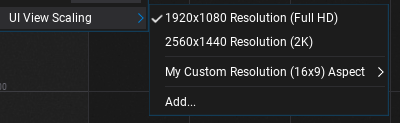

You can now **preview the UI you make in the widget editor in different resolutions**. Especially useful for mobile development. It also allows you to add custom resolutions as preset.

### Prefab Diff Improvements

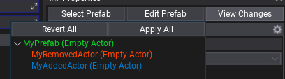

The **prefab changes view now shows added and removed actors**. You can also apply the changes to the prefab via the *Apply All* button, just like any other change you make to your prefabs in the scene editor.

### Wheeled Vehicle Improvements

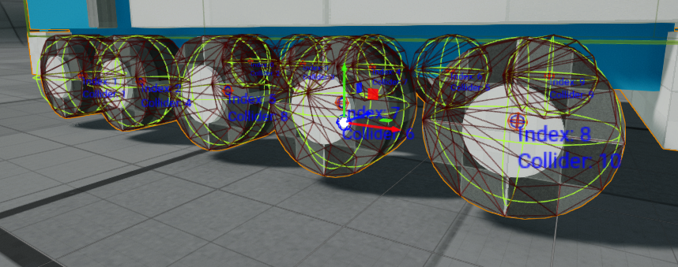

Flax can now **display the names and indexes per wheel** of a Wheeled Vehicle. This makes assigning and debugging wheels and their colliders a lot easier.

There are also new methods to access handbrake, brake, and steering values.

## Migration Guide

### Stencil Buffer

Default depth buffer format has been changed from `32-bit` depth-only to `24-bit` depth with `8-bit` stencil. Now, stencil contains per-pixel bit mask, where the first 5 bits are used to store Object Layer value (0-31). The last 3 bits remain unused for now (can be used by game). This change might reduce depth quality - adjust camera near/far planes to solve any Z-fighting artifacts.

### Lambertan Diffuse Change

Diffuse shadowing has been fixed to not bias `NoL` (`N` vector dot with `L`) inside lighting equation to draw more accurate shadows. Adjust shadow bias if needed to compensate shadow precision artifacts.

### `ISceneRenderingListener` Async

`ISceneRenderingListener` events are not guarded by mutex anymore. Now, those can be called on any thread at any time, thus lock your data for proper access (eg. when asset streaming updates scene objects). This change enabled improved engine performance for Global SDF and DDGI when streaming large worlds.

### `CreateAndSetVirtualMaterialInstance` Change

[Material Instance](../../graphics/materials/instanced-materials/index.md) initial parameters has been changed to not override base values by default, except explicitly specified via value setter. This improves workflows in complex projects as well as helps with dynamically created instances from code that should inherit base parameters by default and override only specific ones.

### Platform Updates

We've updated minimum versions of various platforms to support the latest features and stability:
* Windows - version `10`,
  * Minimum CPU architecture requirement is `SSE4.2`,
  * 99.78% support on PC according to [Steam Hardware & Software Survey](https://store.steampowered.com/hwsurvey/),
* macOS - version `13`,
* iOS - version `15`,
* Linux - Clang version `14` (tested on Ubuntu 24 LTS),
* Switch - version `20.5`.

## Changelog

### Version 1.11.6802.0 - 29 October 2025

Contributors: mafiesto4, GoaLitiuM, xxSeys1, Tryibion, zetcom89, Weyzu, alsed, fibref, will11600, Zode, Swiggies, GasimoCodes, IceReaper, MineBill, ZaPx64

PRs merged: 129

* Add **new memory profiler**
* Add suport for Tracy profiler on Mac
* Add integration with Tracy profiler to plot main memory categories
* Add new Arena Allocator for optimized dynamic memory allocations with a shared lifetime
* Add memory alloc profiling for virtual pages (on Win32)
* Add process memory stats for Apple platforms
* Add version to game settings
* Add variable DDGI probe size in debug view based on cascade
* Add **GPU profiling support to Tracy integration**
* Add debug tool detection for Nsight Graphics
* Add explicit GPU resource transitions, memory and compute barriers
* Add logging missing instance layer on Vulkan
* Add debug name for PSO catching on D3D12/Vulkan during profiling incl. Development builds
* Add `Platform::Yield`
* Add `PLATFORM_CONSOLE` define and fix desktop to be as Windows/UWP, not Win32
* Add support for using custom memory allocator in lambda bind to `Function`
* Add `GPUResourceMapMode.NoWait` flag to control buffer data reading
* Add `nvapi` third party module (NVIDIA driver extensions)
* Add `AGS` third party module (AMD driver extensions)
* Add `nvapi`/`AGS` libs to D3D11 for efficient UAV writes overlaps on NVIDIA/AMD GPUs
* Add automatic periodic Vulkan Pipeline State Cache serialization
* Add red color to Tracy profiler zones that cause CPU waiting to improve profiling
* Add time slicing to Deserialization stage of async scenes loading to avoid hitching
* Add higher level streaming time budget in frame based on idle time
* Add `UseLogInRelease` to engine config to disable logging in Release builds
* Add **new Custom Lit shading model for custom lighting** in materials (eg. **Cel Shading**)
* Add resizing to Custom Code nodes in Materials
* Add improved way of ColorValueBoxes drawing transparent colors
* Add support for building engine without logging
* Add label/button text to string convertion for better debugging
* Add `CharacterController.Resize` for quick crouching implementation for characters
* Add option to change Character Controller capsule origin to start at feet location
* Add `SCOPE_EXIT` macro
* Add `PositionFormat` and `TexCoordFormat` to model import option for mesh data encoding
* Add `GPUDevice.VideoOutputs` with a list of attached monitors
* Add stencil buffer usage with object layer information
* Add new scene textures `SceneStencil` and `ObjectLayer` to sample Stencil buffer
* Add **render layer mask to decals**
* Add `ReadWriteLock` to platform api
* Add support for large 16kb page sizes on Android
* Add Android native crashes caching
* Add new `PreIntegratedGF` with 80% smaller memory but more accurate data
* Add hot-reload support for material feature template sources on material generation
* Add and use `Max Mesh Position Error` to Build Settings for automatic mesh vertex positions storage
* Add improved import path UI
* Add `LayoutElementsContainer.Image` with `IBrush` for Editor
* Add new `UIBrush` that uses `UIBrushAsset` json resource with a brush data
* Add hotkey to quick focus debug console input (`Ctrl+~`)
* Add highlighting to layers matrix editor to improve UX
* Add node alignment formatting options to Visject
* Add highlight to the Visject socket with context menu and improve button texts
* Add additive (box) and subtractive selection to Visject surfaces (with Ctrl to add or Shift to remove from selection)
* Add shortcuts for View flags and Debug View modes in Editor
* Add shortcuts for windows in Editor
* Add accent colors to Content Finder tool
* Add wrap scrolling items list with arrow keys and simplify scrolling logic
* Add `GetOrAddButton` utility for `MainMenu`
* Add `GPUTexture.UploadData` for changing texture contents via `TextureData` container
* Add `Texture Size` node to particles
* Add option for debug shapes drawing for particle emitters
* Add option to show vertices and triangles of collision model in a collider data window
* Add unscaled time to Material Time node
* Add support to move Visject socket connections
* Add **skybox rotation feature**
* Add model import options auto-restore from model prefab
* Add more color gradiant node stops (count from 8 to 12)
* Add particle data layout debugger tab
* Add editor option for disabled transform gizmo brightness
* Add showing added and removed Actors from Prefab Diff menu
* Add collection item duplication via context menu
* Add Editor option to auto resize Properties List splitter bar based on longest text
* Add custom Editor splash screen image (import texture `SplashImage` inside project `Content` folder)
* Add shortcut for editor settings
* Add controls and filter to actor Toolbox search
* Add option to add capsule in add colliders menu
* Add more Editor options for windows and tabs behaviour/logic
* Add new APIs to Animated Model for more control over custom nodes
* Add slider with time position to Audio Source editor
* Add `ClipStarted` and `ClipFinished` events to Audio Source
* Add option to create a new projects from within the Editor
* Add support for parsing inheritance with preprocessor blocks inside it
* Add support for Visual Studio 2026 and v145 MSVC toolset
* Add drawing RigidBody center of mass and attached colliders
* Add a info message on Debug Log pause on error
* Add a broken link icon (used in actor scale editor)
* Add a better way of displaying transparent colors in color properties
* Add `InvokeOnUpdate` to C++ scripting api
* Add more utility methods for Layer Mask api
* Add initial work on **nuget package support**
* Add shift selection for tree nodes in Editor
* Add VSCode organization for project plugins into own folders
* Add maximum supported .NET SDK version to 10
* Add prefab UI viewport scaling
* Add surface formatting option to straighten node connections
* Add Visual Script editor method override context menu searchable
* Add Visject editor panning with RMB over nodes
* Add options for viewport icons
* Add preventing autosave when using editor context menus
* Add Output Window console to show all commands on spacebar
* Add editor option for build configuration when using cook and run
* Add support for using shadow maps from linked scene rendering (eg. for 1p weapons)
* Add shader header proxy for easy `.hlsl` files creation within Editor
* Add support for negative Fog Cutoff Distance on fog to draw it in front of the camera Far Plane, no matter the setup.
* Add actor name to prefab diff view
* Add quick toggle to debug window group buttons
* Add Tag editor quick expand with `Shift` key
* Add ability to unfold folded categories when scrolling with keyboard in dropdown list in Editor
* Add better keyboard navigation to Content Finder and fix right click clearing search
* Add button to quickly jump into Localized String Table that contains it
* Add viewport icons scale relative to the distance and editor control over it
* Add utility for if in play mode that returns true for shipped applications (`Engine::IsPlayMode`)
* Add auto selecting first item in item list context menu if no selection and the user presses enter
* Add better logging of unsupported .NET version in tools
* Add Import/export warning message boxes
* Add `SortOrder` to Environment Probe
* Add exception and crashes catching with processing on iOS/macOS
* Optimize asset references to support direct registration to reduce `Delegate` memory allocations and overhead
* Optimize editor profiler allocations when capturing data
* Optimize actors registration in `SceneRendering` to track free items
* Optimize async scene loading to run in separate stages with time-slicing
* Optimize physics simulation with higher limit of `8` threads
* Optimize physics transformation updates propagation in async via Job System
* Optimize updating actor rendering entry with better thread locking that support async writes on actor update
* Optimize `Actor::DestroyChildren`
* Optimize `ContainerControl.DisposeChildren`
* Optimize CSharp scripting runtime to use arena allocator per-assembly
* Optimize dynamic memory allocations for managed runtime interop collections with a new Arena Allocation
* Optimize `ProbesRenderer` to  use time-slicing for cubemap faces rendering and filtering
* Optimize `SpriteRenderer` to lazy-init
* Optimize Particles drawing to use a whole `RenderContextBatch`
* Optimize GPU Particles simulation to perform memory buffer copies/updates before dispatch
* Optimize GPU particles Bitonic sort to use separate buffers for indices and keys to avoid additional buffer copy
* Optimize GPU particles simulation, sorting and drawing with better resource transition barriers
* Optimize GPU particles simulation by scheduling larger sims first to overlap more work
* Optimize compute shader pipeline binding on D3D12 and Vulkan when unchanged
* Optimize sorted particle indices format to 16-bit for small emitters
* Optimize environment probes filtering shader
* Optimize foliage rendering with concurrent arena allocator
* Optimize textures/buffers uploading on Vulkan with page allocator
* Optimize GPU textures and buffers uploads with a batched memory barrier
* Optimize Global SDF dispatches with UAV write overlaps
* Optimize DDGI probes update to overlap both irradiance and distance data dispatches at once
* Optimize Debug Draw performance of splines to use frustum culling
* Optimize Debug Commands name building and support nested classes with name hierarchy
* Optimize `Asset::GetPath` in cooked build
* Optimize Spline debug rendering far from camera
* Optimize particles drawing to run in async jobs
* Optimize scripting objects spawning on AOT platforms
* Optimize Audio streaming to reduce lock contention
* Optimize Color Grading LUT to be cached if unchanged from the previous frame
* Optimize memory allocations in text rendering related functions
* Optimize debug drawing of terrain shape in Physics Colliders view mode
* Optimize slow Tree expansion/collapsion with large amount of tree nodes
* Optimize decals rendering with depth test
* Optimize memory alloc on Animated Model init
* Optimize memory allocation when reading animated model pose by cloth
* Optimize NavMesh builder when updating a large number of tiles
* Optimize PhysX work dispatcher to be shared by all scenes
* Update Tracy to `v0.12`
* Update OpenAL to `1.24.3`
* Update `volk` to version `1.4.304`
* Update to the latest Nintendo Switch SDK version `20.5`
* Update minimum Windows version to `10` (to match .NET 8)
* Update minimum CPU arch requirement on Windows to SSE4.2
* Update minimum macOS version to `13` and iOS to `15`
* Update minimum Clang version `14` for Linux
* Refactor material instance to not override all public parameters by default (need explicit set)
* Refactor level actions to support time budget and time slicing
* Refactor Color Grading LUT rendering to have config for 2D/3D mode
* Refactor specular lighting to properly map specular as reflectance in BRDF
* Rename `Prefetch` to `MemoryPrefetch`
* Remove `ConcurrentSystemLocker` and use `ReadWriteLock` instead for better threading synchronization
* Fix memory leak on sequential mesh buffers update
* Fix missing `BoundsScale` usage on `AnimatedModel`
* Fix various margins and spacings between UI elements in Editor to be consistent
* Fix profiler memory propagation (in events hierarchy)
* Fix camera view matrix calculations to use double vector types if Large World enabled
* Fix output log console to remove executed command from history no matter the placement
* Fix output log console to resize width to contain whole item text
* Fix missing sphere bounds update for splines
* Fix support for nesting classes inside other scripting classes
* Fix `AutoFocus` on `ContainerControl` to be `false` by default
* Fix game UI focus loss when hiding focused control to maintain gamepad navigation in Editor
* Fix memory leak on material instances when updating layout of Text Render
* Fix draw calls batching to ignore distance in opaque passes for better draw calls instancing
* Fix reflection probes capture seams on cube face edges due to volumetric fog
* Fix shader asset path in debug name in cooked build
* Fix `Asset.WaitForLoaded` to yield or sleep thread for proper multithreading on some platforms
* Fix `MClass::GetNamespace` typo that returned name instead
* Fix .NET version to use selection for consoles with fixed setup
* Fix missing `TypeConverter` support in AOT build
* Fix AOT libs rebuild when corlib was modified to avoid version mismatch
* Fix game splash screen to wait for texture to be streamed in, not just allocated
* Fix `GPUBufferDX11::Map` to wait on data to avoid missing data when reading staging buffers
* Fix PSO init to release old data on recreation
* Fix profiler tables to use column headers aligned to center
* Fix Vulkan descriptor sets pooling
* Fix debug command type detection when it's used with argument
* Fix deadloop in `HtmlParser` when parsing text with incorrect tags
* Fix `ManagedDictionary` cache to be cleared on hot-reload
* Fix `ConcurrentSystemLocker` to guard for a single writer at once
* Fix incorrect image buffer usage in Render Output Control
* Fix fullscreen borderless window on macOS
* Fix bug in `CustomEditorWindow` usage
* Fix scroll bars not updating when dragging items
* Fix GUI input when edit GUI option is false and game is being played
* Fix crammed color grading editor value boxes
* Fix tree nodes drawing in Editor
* Fix trying to add scene to actor group
* Fix `atan2` node to use default box value
* Fix deprecated asset saving to skip temporary or virtual assets
* Fix crash on invalid particle data to be a soft check instead
* Fix new asset file creation dialog button if asset can't be created
* Fix newly created skeleton mask to be able to open
* Fix json guid parsing to check for correct hex characters
* Fix timeout calculation in `Task::Wait`
* Fix loading models with no meshes
* Fix particle emitters to wait for used textures to be loaded and streamed in for proper usage in a graph
* Fix automatic collision importing from mode to remove unused material slots
* Fix transparency-related material options when using material with deferred shading
* Fix animation preview bounds scale
* Fix scene lightmaps removal clearing actors linkage to lightmaps
* Fix missing default value of localized string in editor
* Fix scroll to selected actor in view when emptying out search box
* Fix zoom behavior when zooming in and out in Visject surface editor
* Fix Visject surface select with Control to toggle selection of the node
* Fix node delete button not checking if the user is performing certain actions on the surface
* Fix focusing on custom actors in editor that have missing bounds
* Fix particle emitter editor source code button enable/disable itself
* Fix performing layout after changing selected tab
* Fix scroll to node on selection in Prefab editor
* Fix Content window search to be cleared when selecting asset picker asset
* Fix skipping scene tree scroll to node when play is starting or ending
* Fix panel scroll bars update to be performed once again if controls are gets changed during layout
* Fix prefab diff in Editor on mesh reference
* Fix prefab instance root name to never apply from scene instance
* Fix missing Physics Colliders view if Debug Draw is disabled
* Fix fog to draw Fog Cutoff Distance via a plane, not sphere test
* Fix changing CharacterController center at runtime to maintain actor placement
* Fix duplicating json assets to properly remap object IDs
* Fix issue with toolstrip not updating on scene reload
* Fix terrain collision debug draw flickering when moving camera in Large Worlds
* Fix Terrain shader error when using Position Offset
* Fix vector and quat equality checks to use exact component value
* Fix Android NDK version parsing when using beta build
* Fix `BitArray` bit indexing
* Fix `Array::RemoveAt` to move element and avoid data copies
* Fix hot-reload files not getting cleaned up during startup
* Fix infinite loop on rich text box tag parsing with incomplete end of tag
* Fix edge case for anim event on min or max frame when looping
* Fix anim event playback when is reversed
* Fix using material VS to PS node directly within material input
* Fix saving skinned models with blend shapes
* Fix minor artifacts on terrain normals
* Fix sampling textures in decals to use custom mip-level
* Fix shadow bias artifacts on Low shadows quality
* Fix motion vector stability on Large World origin changes
* Fix SSAO artifacts with `flat normals` look
* Fix Motion Vectors rendering skipping when not needed by SSR
* Fix memory leak on recast objects when building NavMesh tile
* Fix missing/incorrect toolchain exception to log only once
* Fix incorrectly rendered transparency in Physics Colliders view mode
* Fix not attaching updated collision data to rigid body
* Fix `CheckBox` to display check state when created in game without editor icon atlas
* Fix `HashSet::Add` returning incorrect value
* Fix reverting prefab object reference in nested prefabs
* Fix duplicate and remove options being clickable on non-resizable collection editors
* Fix editing UI Brush in prefabs
* Fix prefab window to use UI Mode for empty UI Control prefab
* Fix prefab root name and transform being changed when applying local changes of sub-object
* Fix object ids remapping inside nested prefabs
* Fix debug drawing wheeled vehicle in prefab viewport
* Fix incorrect Lambert Diffuse shadowing to use just `N dot L` for accurate lighting
* Fix model import scale on nodes that could be applied multiple times on the same mesh
* Fix Blend Poses nodes to smoothly blend back when transition goes back
* Fix Content Window navigation bar to expand toolstrip for proper scroll bar display
* Fix Output Window console to resize pupup window
* Fix Editor undo on collection properties that return different object on get
* Fix script fields prefab diff showing and reverting with undo
* Fix warning when cloning actor from prefab that is not a root
* Fix scene object pointer serialization in C++ to use correct serializer
* Fix scaling for TextRender
* Fix rich textbox vertical alignment
* Fix Volumetric Fog flicker on camera cuts
* Fix missing Volumetric Fog affecting transparent materials
* Fix sun shadows when direction is perfectly vertical
* Fix view distance light property from affecting brightness all of the time
* Fix importing emissive, roughness, metalness and wireframe properties of materials with Assimp
* Fix terrain exporting to properly calculate size and sample positions
* Fix particle effect parameter to apply overrides when emitter is changed and when activated in the tree
* Fix particle material compilation error when using position offset
* Fix sky rendering in ortho and oblique projection
* Fix missing root motion copy when using input skeleton pose (eg. IK node)
* Fix loading projects that have similar path to engine folder
* Fix terrain physics error on end play when it's disabled
* Fix changing Rigid Body center of mass offset
* Fix duplicating splines with parents
* Fix font hit test on multi-line text past the line end character
* Fix using enums as Scene Animation Event parameters
* Fix crash when rendering bloom or lens flares in too small viewport
* Fix crash when existing engine while content streaming is active
* Fix crash on invalid GPUBuffer vertex layout in empty buffer
* Fix crash when memory stream reading fails and perform soft error handling
* Fix crash when using material instance that has more parameters that base due to material error
* Fix crash when importing mesh with incorrect triangulation
* Fix crash when importing model as prefab and handle duplicated object names
* Fix crash on stack overflow exception in shader graph recursion to be detected
* Fix crash in GPU Memory profiler if resource went null
* Fix crash on memory access in Vulkan descriptor set data
* Fix crash on particles sorting memory access
* Fix crash when prefab root object failed to deserialize
* Fix crash when unloading texture with leftover streaming task that was idle
* Fix crashes of scripting backend on Android
