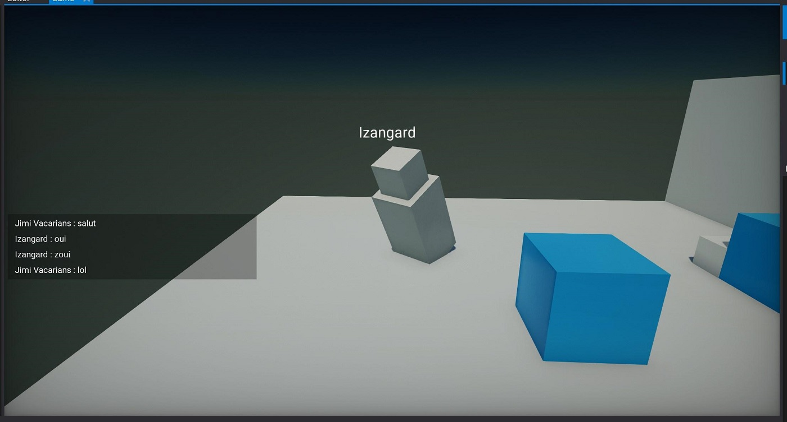
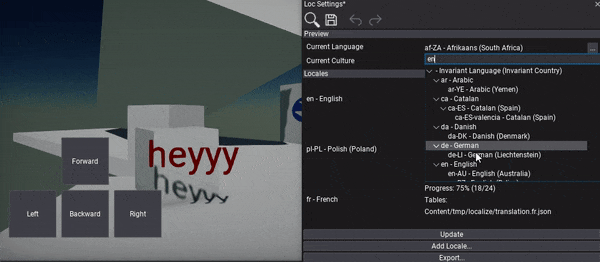
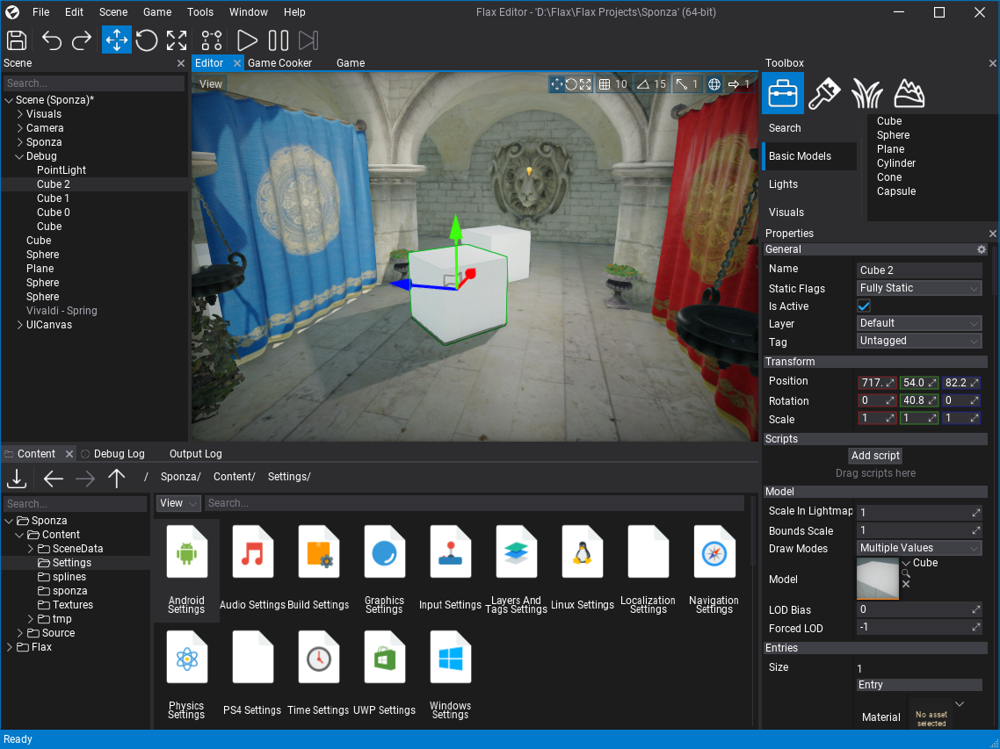
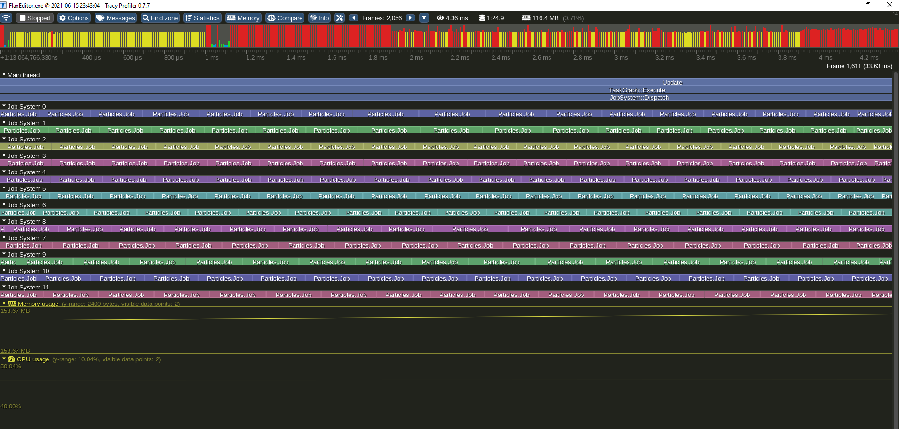
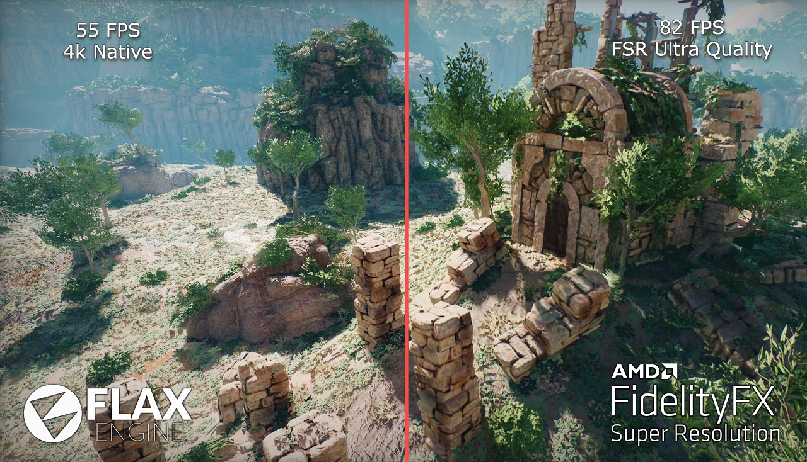
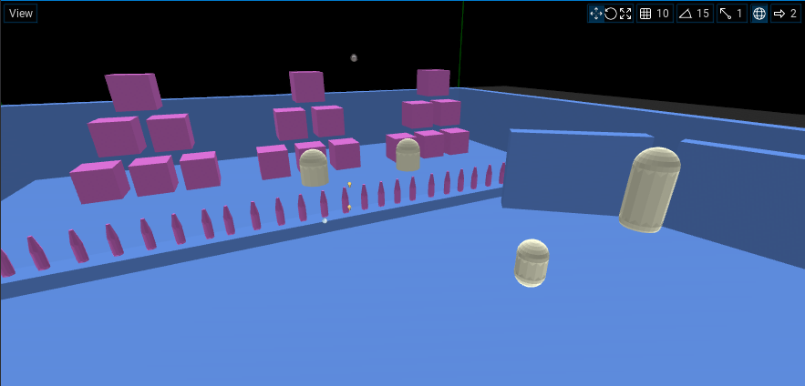

# Flax 1.2 release notes

## Highlights

### Vehicles

This release includes support for **Vehicles**. Now, you can create cars with a custom physical shape, wheels, and engine setup. We're using Nvidia PhysX to drive the simulation and expose lots of highly configurable properties to tweak the vehicle. It can be used to make simple cars or even advanced realistic racing games. Also, unofficially cars in Flax drive better than in Cyberpunk 2077.

As always we're preapred a complete documentation and tutorial how to use this new feature [here](../../physics/vehicles.md).

### Nintendo Switch Support

We're happy to announce that we're working on Nintendo Switch platform support. Very soon Flax will be available for Switch developers. We will inform you once it's ready via our dev blog. Stay tuned, we're almost ready.

### Low-level Networking

In this release, we're bringing more features into **networking** for multiplayer games. We've implemented a low-level networking system featuring Network Peers for creating multiplayer sessions with network messages transportation layer. The default network driver uses ENet with the possibility to use any library you want (like ValveSockets, SteamRelay, SteamP2P, Photon Realtime, etc.).

Together with this, we've released an open-source [Network Sample](../../networking/network-sample.md) project to help you start making multiplayer games in Flax. It features a game server-client with the game session, chat and players lobby. We have also a simple [step-by-step tutorial](../../networking/tutorials/network-client-server.md) to help you start using networking in Flax.

### Localization

Creating games that target the global market and support multiple languages can be a challenge. In 1.2 we shipped new **localization tools** for games internalization. This includes UI language localization, values culture (numbers, currency, and date formatting), and creating a translation for different languages. We've added new Localization Settings that is a dashboard with lots of utilities such as adding new locales, searching localized string is code or content. As shown on a gif above, Editor has a live-preview option of the current locale.

Follow [this documentation](../../editor/localization/index.md) to learn more.

### New Editor icons

The very first thing that you will probably notice after launching 1.2 update is that Flax Editor has new icons. We've **improved resolution and style** of the icon set to make it crisper. The new UI just *feels better*.

### Job System and Task Graph

The latest 1.2 update brings a **massive performance boost for large worlds**. Here is an example of 5,000 animated models playing animation and being rendered at stable 60 FPS (tested on mid-price i5 CPU). To achieve this level of performance we've created a **Job System** that runs a worker thread per CPU core to run extensive computations in asynchronous. For more advanced calculations used by gameplay systems or engine systems, we're implemented **Task Graph**. It can be used to parallelize  game even better plus it supports dependencies between async systems.

During this update, we've converted all major engine systems into async Task Graph Systems to ensure the higher parallelization of the engine code (streaming, animations, particles, etc.). It can be further extended by game-specific systems in your code. To see how to do it see [this tutorial](../../scripting/advanced/multithreading.md). Both Job System and Task Graph can be used in C#, C++, or Visual Scripting.

### Tracy Profiler

In order to optimize engine or game the developers need proper profiling tools. The in-built profiler helps with this but for more advanced optimizations we needed something more powerful. Now, Flax supports an open-source [Tracy](https://github.com/wolfpld/tracy) profiler for CPU instrumentation and performance analysis. It can profile both game and editor, supports remote profiling, and can be used to capture profiling sessions for comparison. Also, Flax will automatically insert profile zones for C# and Visual Script methods so gameplay performance profiling is even easier now.

To help you get started with Tracy we've created a dedicated [documentation page](../../editor/profiling/tracy.md). Also, for C# developers we have a tutorial for [dotTrace profiler](../../editor/profiling/dot-trace.md) usage.

### Textures Streaming

Another exciting feature is **textures streaming configuration**. The new Streaming settings asset contains **Texture Groups** for managing textures quality and streaming options at runtime (every texture asset can define the texture group it belongs to).

It can be used to strip textures resolution when cooking for mobile/Switch or to implement dynamic texture quality settings in game menu. Also, Flax will reduce quality of textures that are not rendered for some time (configurable) to improve game performance and reduce GPU memory usage. Additionally, we've added a new API to query current streaming stats and content stats which can be used to implement a loading screen as showcased in a [tutorial here](../../scripting/tutorials/loading-screen.md).

### AMD FidelityFX Super Resolution

[AMD Fidelity FX Super Resolution](https://gpuopen.com/fidelityfx-superresolution/) is a cutting edge super-optimize spatial upsampling technology that produces impressive image quality at fast framerates. We've released an open-source plugin for Flax Engine that implements FSR effect and can be easily integrated into Flax games. Visit [this repository](https://github.com/FlaxEngine/FidelityFX-FSR) to learn more.

### More features

Every update brings many large features but also tons of smaller things that matter. We continued working on **improving quality** and **usability** of the Editor. Here is a list of notable ones:

* **9-slicing support for UI** (gif above)
* New C++ docs and tutorials (see docs in [this section](../../scripting/cpp/index.md))
* Ability to show/hide GUI and DebugDraw shapes inside Game viewport
* **Daily source builds** from `master` branch ([here](https://github.com/FlaxEngine/FlaxEngine/actions/workflows/cd.yml) or via Launcher)
* Optimized editor/game CPU usage when idle
* **Delay node** for Visual Scripting
* Faster scenes opening (in general both engine and editor are faster)
* Animation asset preview with playback debugging (play/pause/seek/slowmo)
* Support for C# objects and structures as Visual Script or Anim Graph parameters
* Tons of new APIs for easier games scripting (see changelog to learn more)
* Both Vulkan and D3D12 rendering backend are way more stable now in large worlds
* Modular animated characters support
* New **Temporal AA** with less ghosting
* Change default Update rate to 60
* Debug view for collision geometry (see image below)

## Changelog

### Version 1.2.6223 - 8 August 2021

Contributors: mafiesto4, Erdroy, thallard, marynate, blep

PRs merged: 3

* Add warnings when cooking collision with empty mesh data
* Add `CookingData` for C# editor to extend the cooking process
* Add build preset and target names to access for Game Cooker extending
* Add option to change order of items in Content View
* Add support for creating custom BoxVolume type in C#
* Add creating Scene Graph nodes for actors inheriting from some shared custom types
* Fix compiling C#-only game scripts without native platform tools installed
* Fix editor crash on startup when Rider 2021.1 is installed
* Fix CharacterController minimum size checks to prevent crashes if values are too small
* Fix startup failure on older CPUs that don't support invariant TSC
* Fix potential runtime error from `locale::global`
* Fix creating prefab in Editor from selection in Prefab window
* Fix undo for missing actor children and scripts when doing Convert action
* Fix crash when spawning C# object that inherits from abstract C++ class
* Fix crash when cooking collision data for multi-mesh models
* Fix missing mesh collider vertices transformation for navmesh building
* Fix crash on startup when 2 Rider installations are detected

### Version 1.2.6222 - 5 August 2021

Contributors: mafiesto4, honzapatCZ, GoaLitiuM, W2Wizard, jb-perrier, stefnotch, Crawcik, Vizepi, MiheevN, LCRW, VarvatosVex, herocrab, artkez, Erdroy, brbrmensch, thallard

PRs merged: 62

* Add **Nintendo Switch support** (coming soon to registered developers)
* Add support for separate data and code output directories in Game Cooker
* Add initializer list support for arrays in C++ scripting
* Add **Vehicles support**
* Add error log when trying to load bytes from file data that is too big
* Add MeshBase as shared impl part for Mesh and SkinnedMesh
* Add support for generating Collision Data from Skinned Models
* Add warning when using Triangle Mesh collider under RigidBody
* Add support for masking Material Slots when cooking Collision Data
* Add support for `string` constants as defaults in scripting API
* Add **Localization** support and tools
* Add support for importing `.po` files
* Add `LocalizedStringTable` asset type
* Add `LocalizationSettings`
* Add `LocalizedString`
* Add `CultureInfo` to C++ API
* Add `GOLDEN_RATIO` constant
* Add **new editor icons**
* Add byte array deserialization from base64 encoded string
* Add support for importing assets into custom formats with `AssetsImportingManager`
* Add support for custom asset type factory in game code
* Add support for nesting Array inside Dictionary in scripting API
* Add support for using generic class value types in scripting API bindings code
* Add importing `.po` files with strings localization
* Add searching for localization strings in C#/C++ code
* Add searching for localization strings in scenes and prefabs
* Add exporting localization into `.pot` file for translation
* Add `CultureInfo` editor with picker
* Add undo support for Json Asset editor window
* Add string localization API
* Add LocalizedString support for UI
* Add `CreateSearchPopup` to editor utils
* Add` LocalizedString` to `TextRender` for localized text
* Add support for using animated model with anim graph using different skinned model
* Add `FindClosestNode` to Animated Model
* Add `Keyboard.IsAnyKeyDown`
* Add missing name some for GPU resources
* Add **Low-Level Networking**
* Add depth test for point/spot lights rendering to optimize far lights rendering
* Add `HasTypedUAVLoad` to GPULimits (use for GPU lightmaps support baking detection)
* Add DRED and optional GPU-Based Validation for D3D12
* Add UAV slots dimensions to cache for D3D12 validation
* Add Bokeh DoF rendering on D3D12 (works fine after fixes)
* Add background color in collections (better readability for nested collections)
* Add support for `NotNullItems` option in collections editors
* Add support for using pointers in scripting API events
* Add support for using references in scripting API events
* Add **Delay node** to Visual Scripting
* Add timeline position synchronization with animation playback in Editor preview
* Add profiler Sleep event to Editor sleeping phrase when out of focus
* Add `Nameof` helper utility for C++
* Add automatic Game Settings setup after adding new settings asset for the first time
* Add **Streaming settings** with texture groups configuration
* Add support for stripping textures quality when cooking game (per-platform)
* Add **dynamic textures streaming based on visibility**
* Add support for using per-texture group sampler in Materials
* Add `GetStringAnsiView` to json value
* Add option to open all selected assets in content window
* Add support for loading C# dictionaries in native json reader
* Add `Category` attribute for types grouping in editor dialogs
* Add texture groups preview to Graphics Quality window in editor
* Add support for editing texture group in editor (without reimporting)
* Add support for **programmable samplers in shaders**
* Add `AnimationUpdated` event to Animated Model
* Add `SetCurrentPose` to Animated Model
* Add `SetMasterPoseModel` to Animated Model for modular characters
* Add digit check for scripts renaming
* Add **Tracy profiler** support
* Add `SceneTicking` to engine API
* Add `-debugwait` cmd line arg to wait for C# debugger attach on engine start
* Add physics queries for convex meshes
* Add editor option to customize the default location for new editor windows
* Add automatic profiler events for C# methods invocation
* Add automatic profiler events for Visual Script methods invocation
* Add automatic tooltip for ComboBox based on selected item tooltip
* Add option to hide GUI in Game Viewport
* Add `MapTrack` to SceneAnimationPlayer
* Add GPU profiler events to ProbesRenderer
* Add helper `FindScript<T>` and `FindActor<T>` to `Actor`
* Add `NoUndo` attribute for properties without undo usage
* Add option to show Debug Draw shapes in Game Viewport
* Add option to copy/paste value from Visject box via context menu
* Add support for using library-style includes for build tool includes cache
* Add **9-slicking support for UI** to draw sprites and textures
* Add skipping generating structure fields accessors for private fields in scripting
* Add option to use Point sampling when drawing textures and sprites in UI via Brushes
* Add `Int16` and `Uint16` scripting/serialization support for Visual Scripting
* Add preserving package output directory across sequential package builds
* Add `-play` cmd line arg for Editor to play game (optional scene id arg value to play certain level)
* Add support for custom package output directory for engine deploy
* Add support for custom build configurations for engine deploy
* Add **daily master branch builds** as Continuous Deployment on Github Actions
* Add more indentation to scene tree items to make it more readable
* Add support for custom drag & drop into level/prefab viewports from custom asset items
* Add focus to game window on play
* Add **Job System**
* Add Foliage Density Scale option to Graphics Quality Window in Editor
* Add support for `Function<>` as method parameter in scripting
* Add order for Margin properties
* Add `SceneNavigation` for scene data for navigation system
* Add **Task Graph**
* Add option to use seconds for timeline/media duration
* Add `Engine::UpdateGraph` for async engine/game update
* Add async animations updating via Task Graph
* Add async particles updating via Task Graph
* Add support for allocator type in `Dictionary`
* Add idle Sleep between frames to save CPU cycles when inactive
* Add logging Windows build number
* Add `RingBuffer` template
* Add support for allocator type in `Dictionary`
* Add `Stopwatch` instead of` DateTime.Now` for increased accuracy in *Flax.Build* profiling tools
* Add keyboard shortcuts to viewpoints (numpad)
* Add `PLATFORM_THREADS_LIMIT` for maximum concurrency limiting
* Add MemoryCompare, MemoryClear and MemoryCopy for direct memory access in C#
* Add ignoring memory allocations from profiling tools in Editor Profiler
* Add intermediate data folder removing on build tool clean command
* Add `Actor.RotateAround`
* Add automatic namespace usings collecting when generating scripting bindings glue code for csharp
* Add automatic slider speed for float value input fields with limits specified
* Add Alpha Panel control
* Add Draw Indirect support for Vulkan
* Add GPU Particles support for Vulkan
* Add support for rendering into 3d textures on Vulkan
* Add support for Geometry Shaders on Vulkan
* Add incremental actors naming when spawning them in viewport
* Add Network impl for PS4
* Add safety checks to material constants binding code to prevent invalid memory access
* Add `GPUContextVulkan::CopySubresource`
* Add more profiler events for performance tracking
* Add `Content.Stats` for assets statistics (replaces `Content.AssetCount`)
* Add `Streaming.Stats` for resources streaming statistics
* Add view snapping mode to Directional Light shadows for better stability
* Add preloading initial Editor scene to improve startup performance
* Add support for custom background brush to Button
* Add `DebugDraw::DrawTube`
* Add `Rectangle.Distance`
* Add option for preview a single mesh UVs
* Add memory usage info to Animation details
* Add more helper methods for batched debug shapes drawing
* Add **Physics Colliders debug view** mode to display physical world shapes (solid)
* Add `UpdateSpeed` to Animated Model for playback speed scaling
* Add widgets for animation preview play/pause and speed changing
* Add support for creating virtual Anim Graph at runtime for a single animation playback
* Add Terrain physics collision debug drawing support
* Add faked lighting to improve Debug Draw solid shapes rendering readability
* Add preview panel with skinned model to the Animation window
* Add support for **rendering percentage scale with upscaling** to backbuffer
* Add culling and render mask check for models rendered via Custom Actors list
* Add warning log in build tool when target is missing
* Add `JsonSerializer.ParseID` with return value
* Add support for bundling custom assets by `GamePlugins`
* Add `CustomUpscale` postFx to replace upscaler with a custom script
* Add `ClosestPointPointLine` for Vector3 to C#
* Add more documentation to FlaxDocs
* Add support for Rider 2021, use latest detected version of Rider
* Add using the latest detected version of Rider
* Add support for moving object with transform gizmo when mouse moves outside the viewport during usage
* Add `BoundingBox.MakeScaled`
* Add using immediate DebugDraw for animated model skeleton drawing in Editor preview
* Add support for `Vector2/3/4` and `Quaternion` constants for default value attribute in C# scripting api
* Add option to show bounds of the animated model in Editor preview
* Add option to show bounds of the model in Editor preview
* Add support for AssetPreview to use debug drawing if needed
* Add support for focusing on foliage instance bounds when editing it
* Add support for focusing on model when painting its vertices
* Add support for object reference wrappers usage in hash maps and dictionaries
* Add serialization improvements for `Int2/3/4`
* Add constructors `Vector2/3/4` <=> `Int2/3/4`
* Add operators for `Int3/Int4`
* Add common funcs for `Int2/3/4`
* Add some more splash-screen quotes
* Add optional location for Plugin Icon to be inside plugin project root
* Add `MeshDataCache` utility for async mesh data caching
* Add buttons for play/pause/stop Animation timeline in editor window
* Add tint to timeline navbar buttons
* Add bone icon for Anim Graph connections with local skeleton nodes pose
* Add support for using structures as Visual Script and Anim Graph parameters
* Add support for object and enum properties in Anim Graph
* Add support for disabling Vulkan timer queries per-platform via define
* Add option to preview model meshes Normals and Tangents in Editor preview
* Add `AddForceAtPosition` to Rigidbodies
* Add full documentation tooltip to Visject new parameter type picker list
* Add support for `VisibleIf` on value editors using group panel
* Add support for importing assets into custom formats with `AssetsImportingManager`
* Add strong typed *This* node output in Visual Script
* Add super smooth quaternion editing in Editor UI
* Add support `int64` values in EnumComboBox
* Add support for custom value propagation in CustomEditor
* Add `LocalLocation` to UI controls
* Add support for cooking collision data from model asset on main thread and fix issue if mesh is during streaming
* Add support for Is Null, Is Valid, As, Is and Type Reference nodes in Anim Graph
* Add `C++ Json Asset` and `C++ Function Library` templates
* Add better support for control anchors editing with bounds preserving and pivot setting (Shift and Control modifier keys))
* Add loading info text when opening scene animation window
* Add support for reusing `UIControlControlEditor` and `AnchorPresetsEditorPopup` in Editor plugins
* Add the namespace of a field from another module support in C# bindings code
* Add sorting for used namespaces in bindings and include nested types checks
* Add missing includes in headers
* Add UI Control location editing to be relative to the Pivot point
* Add `DefaultQueryExtent` to navmesh properties
* Add option to Delete Sprite in Editor
* Add automatic resizing for the timeline track preview values for better readability
* Add support for Pack/Unpack Structure nodes and Enum constant in Anim Graph
* Add support for OnSerializing, OnSerialized, OnDeserializing and OnDeserialized callbacks for C# types serialization with Json
* Move default AllocatePages/FreePages impl from Unix to PlatformBase
* Move JsonConverters to a separate file
* Rename AnimationManager to Animations and expose to public
* Reimplement **Temporal AA with less ghosting** and better quality
* Improve detection of Rider installations
* Implement DownloadDataCPU for Mesh and add result entries count
* Improve animation preview usability for debugging
* Improve tooltips generation for scripting types
* Improve timeline frame labels displaying
* Increase scroll bars size for easier usage
* Increase items limit for Visject secondary context menu before scroll bar usage
* Optimize building C#-only projects references
* Optimize UI for complex timelines with many tracks
* Optimize Vulkan Framebuffer when not using color blending
* Optimize Profiler window update to refresh only visible tab UI
* Optimize Profiler window UI
* Optimize Debug Log window new entries adding (manual placement instead of full layout)
* Optimize `BoundingSphere::FromBox`
* Optimize Debug Draw for large amount of single-frame debug shapes and lines
* Optimize Debug Draw wireframe sphere to use auto-LOD
* Optimize Streaming service with Task Graph to use async update on a Job System
* Optimize Vulkan shader compiler memory allocation
* Optimize ContentStorageManager with Task Graph to use async update on a Job System
* Optimize memory allocations in Vulkan backend
* Optimize flushing active transform of physically simulated actors
* Optimize physics simulation collisions pair cache
* Optimize Foliage instances serialization by using raw json value write
* Optimize various engine code
* Optimize `Foliage::OnFoliageTypeModelLoaded` to rebuild only single foliage type clusters
* Optimize String usage with StringView for basic file paths operations
* Optimize C# script compile times by using Roslyn C# compiler server on Windows
* Optimize C# method invoke in bindings via direct Mono invoke
* Optimize managed memory allocations
* Optimize includes in `ThreadLocal.h`
* **Optimize Scene Rendering** (data caching and more)
* Optimize CPU particles sorting with Radix sort
* Optimize C# `Actor.GetChildren<T>()` and `Actor.GetScripts<T>()`
* Optimize Animated Model bones matrices buffer update
* Optimize scripting object data deserialization
* Optimize Foliage with quad-tree clustering per foliage type
* Optimize Foliage rendering with manual instanced draw calls batching
* Optimizations in various parts of the engine
* Optimize renderer memory allocations with `RenderListAllocation` (mem pooling)
* Remove unused `WindowsManager::CalcCenteredWinPos`
* Remove UI Controls from Json Asset picker dialog
* Remove unused `DictionaryInitialSize` from `MAssemblyOptions`
* Refactor focusing on selection logic in Editor
* Refactor `FontReference` to reference type (class)
* Refactor base types initialization to be done during API processing
* Refactor AnimGraph to support asynchronous execution
* Refactor CPU Particles to support asynchronous execution
* Refactor FileSystemWatcher interface to make it simpler
* Refactor AnimGraph debug flows to use scripting API event (faster)
* Refactor Variant type ManagedObject serialization to be usable for Visual Scripting
* Change default Update FPS in time settings to 60
* Change profiler samples length to 10s at 60hz
* Change all Flax Samples to 60 FPS
* Change to not log computer/username in log files
* Change `CalculateTangents` to false as default and calculate normals/tangents by default if missing
* Change `WindowBase` to allow for better code sharing for platforms without advanced windowing
* Update `fmt` to version 6.2.1 (9 May 2020)
* Fix dummy locale on Linux
* Fix using TextBoxBase with child controls
* Fix format string errors assertions into soft checks
* Fix natvis display for string views
* Fix handling spacing in collection editors to align label in a proper way with margin
* Fix `JsonAssetProxy.IsProxyFor`
* Fix stack overflow when using recursion with nested scene animations
* Fix escaping backslashes in generated tooltip descriptions
* Fix build settings limits
* Fix reparenting actors in editor to preserve world position
* Fix bounding box calculations for Animated Models
* Fix tooltips to be constrained by monitor bounds instead of virtual desktop or parent window bounds
* Fix Is Null and Is Valid nodes in Visual Script to handle managed instances comparison
* Fix crash when unloading scene that has been already unloaded
* Fix Label text positioning when using Auto Fit
* Fix creating reroute nodes in Visject during debugging
* Fix missing `mipIndex` when clearing lightmap textures with a buffer on baking start
* Fix error when actor from unloaded scene is selected
* Fix showing Game Plugins in editor plugins window
* Fix disabling VertexSnapping for 3D UI rendering
* Fix Editor UI tree control click to handle selection update before
* Fix camera position when changing Editor view orientation
* Fix gizmo in top down view on Z-axis movement (and other combination of perpendicular views)
* Fix showing context menu in Scene Tree window with scroll used
* Fix paths in plugin projects root nodes in Content Database
* Fix crash when importing model mesh with multiple materials but no mapping on a Geometry
* Fix CharacterController still colliding after being disabled at runtime
* Fix exception in Editor UI is model has invalid material slot index assigned
* Fix gizmo stability when using single axis
* Fix text processing with wrapping enabled if layout bounds width equals the line width
* Fix `Control.GetChildAtRecursive` with overlapping controls
* Fix crash when reading empty string from stream
* Fix adding particle emitter to a system timeline to have full duration
* Fix naming native threads on Linux and Android
* Fix crash when reloading virtual asset
* Fix false-positive of Surface node value modification
* Fix handling invalid asset in AssetPicker instead of throwing exception
* Fix buffer overrun crash in `ForwardShadingFeature`
* Fix drawing shadows for particles that use Depth Fade node
* Fix importing model animations curves with scaled local bone TransformBuffer
* Fix missing operators and constructor in `Pair`
* Fix asset paths to be from project rather than packages
* Fix loading native dependencies for binary modules from other folders than engine binaries or project root
* Fix auto-focus for dock window on right-click to prevent Game Window mouse steal when using context menu
* Fix `String::Resize` to support buffer growing
* Fix catching mouse focus in Editor play mode with game is paused
* Fix out of bound access to `RichTextBoxBase` internal buffer
* Fix POD structure check in scripting api if contains array field
* Fix some profile event names
* Fix crash on Font invalidate
* Fix C# profiler events from other threads
* Fix renaming selected actor in scene tree after creation and use editor shortcut
* Fix minor warnings in shaders
* Fix locale on Linux
* Fix file dialogs from changing the working directory (on Windows)
* Fix compilation on specific system locale configuration (build tool issue)
* Fix synchronization for dbg symbols on Windows
* Fix using fixed array initializers in scripting API field
* Fix error in context menu search on fail
* Fix `ThreadLocal` to use atomic operations and prevent rare race conditions
* Fix running Flax on Windows with STD console output
* Fix undo errors in editor on Margin property serialization
* Fix checking paths when opening Visual Studio project items to prevent dummy files creation
* Fix base method calls handling in scripting vtable overrides
* Fix game plugins initialization order in Editor play mode to mock the standalone game
* Fix checking min engine version for referenced projects too
* Fix loading game binaries in Editor if they are still missing are recompile
* Fix rare crash when passing array to managed world with object refs inside structures
* Fix calling base class of overridden scripting object via vtable entry for method that has multiple parameters
* Fix AnimatedModel bounds calculation to use skeleton bones locations
* Fix range selection in Tree to skip invisible nodes
* Fix deserialization of C# dictionaries for prefabs
* Fix Script deserialization if `ParentID` is not specified in stream
* Fix changing prefab root
* Fix undo for custom serialized objects (eg. LocalizedString)
* Fix missing asset register for new json resources
* Fix `API_AUTO_SERIALZIATION` usage if base type is not serializable
* Fix case sensitivity check for `StartsWith` and `EndsWith` in `StringView`
* Fix using `Delegate<>` in API event
* Fix `TypeSearchPopup` showing types that base type is hidden
* Fix script template not complain about doc warnings
* Fix tooltip attribute generation for multi line xml doc comments
* Fix Transform Node/Bone in replace mode when transform is identity
* Fix `protected internal` access modifier usage
* Fix textbox bugs
* Fix editor viewport input when using ScreenSpace canvas in a prefab
* Fix `ScreenSpace` UICanvas prefab preview activate/deactivate
* Fix order when pasting UI Controls
* Fix ScreenSpace UICanvas order in Prefab preview (move back to prevent editor widgets occlusion)
* Fix Visual Script method override node auto-size
* Fix descriptors bindings to shaders on D3D12
* Fix missing UAV barriers on D3D12
* Fix GPU synchronization on D3D12
* Fix D3D12 resource state transitions barriers
* Fix lightmaps baking on D3D12
* Fix using custom allocator on array field in scripting class
* Fix UI after editing Dictionary key value
* Fix various Editor UI icons issues to improve reliability and design
* Fix `Asset::ToString()` to not depend on refs count and look simpler
* Fix generating includes list in c++ glue code for script (non-pod and variant wrappers can produce additional includes)
* Fix Blend Space 2D to use corrected additive blending
* Fix texture streaming minimum mips to load for block compressed textures
* Fix spline model visibility after enable if was disabled on start
* Fix default value generation for numbers and enums in scripting api
* Fix parsing doc comments in scripting api with inlined summary tag
* Fix scripts projects opening to support async open when using Editor menu option
* Fix using Keyboard and Mouse objects in C# scripting
* Fix cached font usage to use proper unmanaged object validation check
* Fix selecting multiple different UI controls in Editor
* Fix crash due to `SamplesBuffer::Add` bug
* Fix errors when changing UIControl type in prefab
* Fix crash with too big blur strength used in Render2D
* Fix `WeakAssetReference` handling asset unload
* Fix very rare cases of deadlocks in `Asset::WaitForLoaded`
* Fix terrain normal mapping issue
* Fix using nested types in Visual Script
* Fix crash when reimporting sprite atlas
* Fix sprite atlas serialization after editing
* Fix naming new sprites in Editor
* Fix models uvs preview drawing
* Fix synchronizing ActorTreeNode order after actor duplicate
* Fix missing rotation parameters in capsule physics queries
* Fix BitonicSort constant buffer size error on Vulkan due to structure padding
* Fix structured UAV/SRV buffer usage on Vulkan
* Fix crashes during deserialization of invalid data
* Fix getter only properties not showing in Editor
