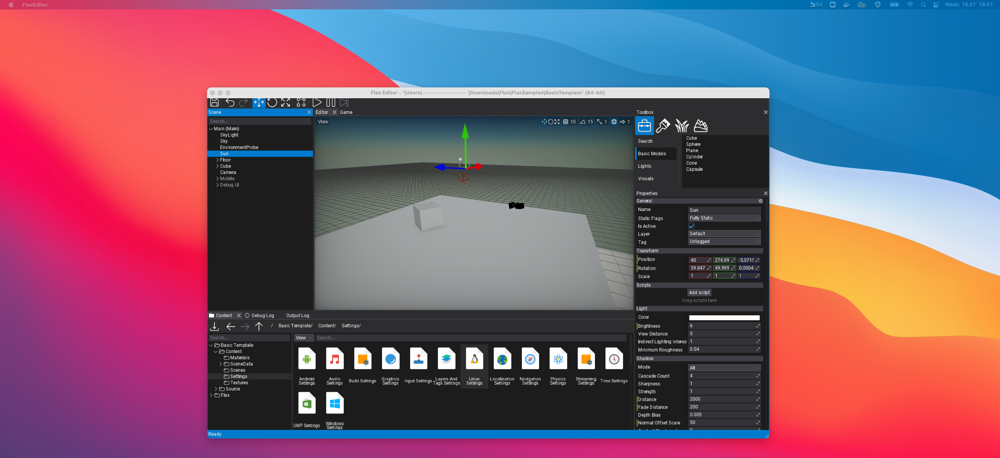
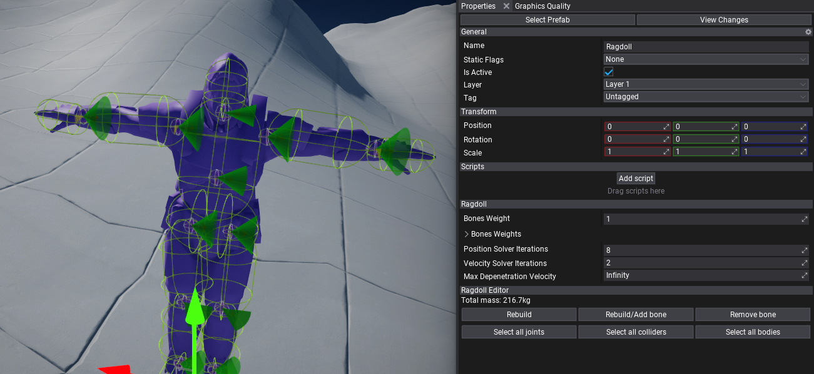
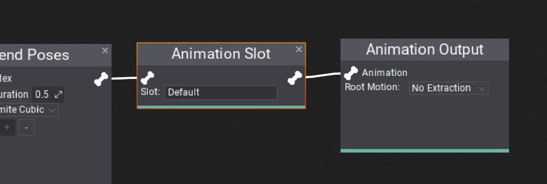
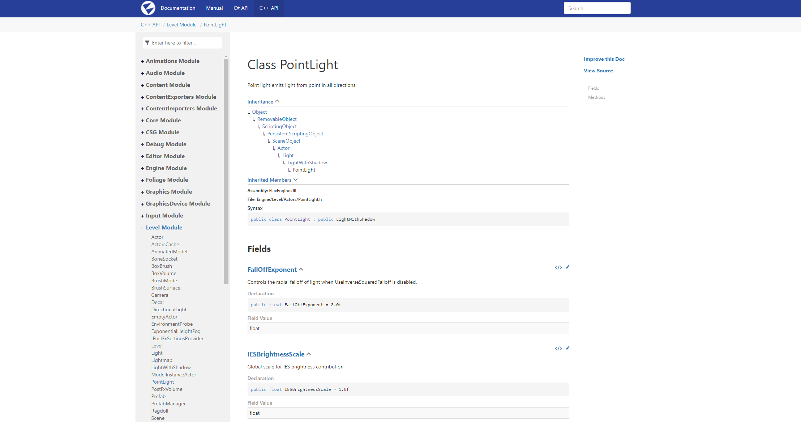
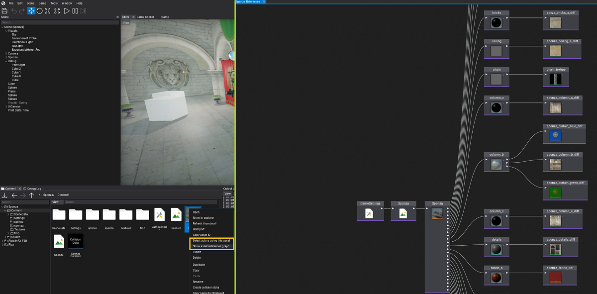
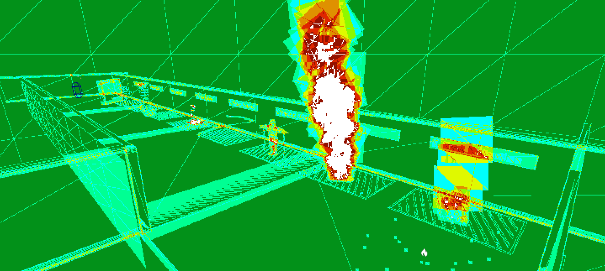

# Flax 1.3 release notes

## Highlights

### macOS Support



This release includes initial support on **macOS** for both Editor and games publishing! Now, you can run Flax on macOS 10.14 or higher. All engine features are implemented including running Vulkan graphics on top of the Metal with the power of MoltenVK.

We're preapred a documentation and tutorial how to use [Flax on Mac](../../get-started/mac.md).

> [!Warning]
> We're just started to support macOS so it might include some bugs. Feel free to report them on our [Github](https://github.com/FlaxEngine/FlaxEngine/issues).

Known issues:
* Incomplete multi-monitor support
* Mouse cursor positioning issues
* Drag&drop within a window


### Ragdolls


Ragdolls are a common feature in games used to generate procedural death animation of the characters or to simulate parts of the skeleton that should behave more procedural (eg. tail). This update contains runtime support for simulating large amounts of ragdolls and in-built tools for Editor to quickly generate ragdolls for characters. 
Editor now has ragdoll generator and editing tools. Ragdolls can be used in prefabs for characters creation.



### Animation Features

We constantly improve workflow, tools, and features for the animation systems. In this release, we've added Animation Slots, Animation Event tracks, and instanced scene animations.

#### Animation Slots



**Animation Slots** can be used to play animations in Anim Graph from code. The slot can be placed anywhere in the graph or even in the graph function and then triggered from game script via `PlaySlotAnimation(...)`. Learn more in [docs](../../animation/anim-graph/animation-slots.md).

#### Animation Events


**Animation Events** can be added to the animation assets on a separate track to be triggered during animation playback to play VFX, SFX or implement custom gameplay logic related to animations (eg. playing footsteps sounds or spawning foot decals when walking over snow). Learn more in [docs](../../animation/animation/anim-events.md).

#### Instanced Scene Animation in Prefab

Editor supports animating objects from Prefab window. Scene Animation created that way can be played on prefab objects on a level which makes it easily reusable. Learn more [here](../../ui/tutorials/ui-prefab-animation.md).

###  C++ Scripting Features

#### C++ API Doc



**C++ API docs** are now live! Full engine and editor scripting API reference, nicely browsable and searchable just like C# API. It contains some great features like: utility button to quickly navigate to the actual engine source on Github, file header path to include for copy/paste, and classes inheritance hierarchy with inherited members list. Also, Flax Docs have C++/C#/VS code examples shown in tabs to easily focus on your chosen scripting language.

Checkout it [here](../../../api-cpp/index.md).

#### Interfaces

`API_INTERFACE` is now fully supported in C# and Visual Script. This allows to declare an interface in C++ and use it in-game scripting for greater extensibility in your code. What's so great about it is that an interface can be implemented in C++ or C# and used cross-language (eg. C++ can call C# interface methods - works the opposite way too, including overriding C++ interface implementation in C#). Learn more [here](../../scripting/cpp/interfaces.md).

```cpp
#pragma once
#include "Engine/Scripting/ScriptingType.h"

API_INTERFACE() class GAME_API IMyInterface
{
DECLARE_SCRIPTING_TYPE_MINIMAL(IMyInterface);

    // Interface virtual method
    API_FUNCTION() virtual float GetSpeed(const Vector3& v) = 0;
};
```

#### Enums

`ScriptingEnum` is a new small utility for C++ scripting to easily convert enums to string and back:

```cpp
API_ENUM()
enum class PlayerStates { Idle, Running, Swimming, };

#include "Engine/Core/Log.h"
#include "Engine/Scripting/Enums.h"

String stateName = ScriptingEnum::ToString(PlayerStates::Running);
PlayerStates state = ScriptingEnum::FromString<PlayerStates>(stateName);
LOG(Info, "Player state: {0} = {1}", stateName, state);
```

#### Lamdas

**C++ lambda expressions** can be now used with Flax delegates and functions. You can use them to simplify your game code by capturing local or member variables into the lambda scope:

```cpp
int32 myVariable = 10;
Engine::Update.Bind([&myVariable]
{
    LOG(Info, "Counter: {}", myVariable++);
});
```

### Visual Scripting Improvements

Aside from C# and C++ we've added lots of goodies to Visual Scripting too! Now, you can use **arrays** in VS, change parameter type and the **graph execution performance** has been greatly improved.


Docs about [arrays in Visual Script](../../scripting/visual/arrays.md).

### UI Navigation


Flax UI systems gets **UI Navigation** to perform focus navigation around the user interface with input actions such as keyboard arrows or gamepad keys. This feature is essential for console games or others with gamepad support which aim to give full UI usability without mouse input nor touch input from the user. This has been implemented as well in Editor to provide `Tab` key navigation. Learn more [here](../../ui/ui-navigation.md).

### Online Platforms

One of the main new features in the latest 1.3 update is **Online Platforms support**. This makes a notable step towards making your games more connected with the online services. Inside the engine we've added a new `IOnlinePlatform` interface designed for online platform providers for communicating with various multiplayer services such as **player info, achievements, game lobby or in-game store**. Each Online Platform implements this interface and is provided via plugin which can be used by your game project:
* [Steam](https://github.com/FlaxEngine/OnlinePlatformSteam)
* [Xbox Live](https://github.com/FlaxEngine/OnlinePlatformXboxLive)
* Platform-specific (PlayStation, Switch) for registered developers

Learn more [here](../../networking/online/index.md).

### Multiple Physics Scenes

Physics system got a significant refactor under the hood and a new `PhysicsScene` feature that allows to create **multiple physics scenes and simulate them separately** as submited in [this Pull Request](https://github.com/FlaxEngine/FlaxEngine/pull/673). Now, PhysX implementation is hidden behind `PhysicsBackend` interface so it will be easy to plug-in another physics engine (eg. Havok or JoltPhysics).

### Editor Tools

Literally every update brings tons of improvements to the Flax Editor. This time it happened again.

#### Asset References



**Asset References Viewer** window (via context menu in *Content Window*) shows the graph with assets that reference this asset and it's own dependencies structure. Can be used to analyze content usage in a project (eg. check what textures given model uses, or what models are used on a scene).

#### Debug View



New **Quad Overdraw** debug view mode (as shown above) colors pixels based on the overdraw of the triangles rendered with 2x2 quads on a GPU. Another new mode **Material Complexity** colors the screen pixels based on the approximated rendering cost (shader size, textures usage, tess or depth usage, etc.). Both view modes be used to profile and optimize scenes.

#### Visual Studio 2022

After Microsoft launched Visual Studio 20222 we've added support for using it in Flax Editor and in our build system. Go ahead and use it for your games development. Keep in mind that due to heavy breaking changes compared to previous versions we were unable to provide [Flax.VS](https://marketplace.visualstudio.com/items?itemName=Flax.FlaxVS) plugin for C# debugging in VS2022 yet (the latest version works with VS17 and VS19).

#### Timeline and Curve Editors Improvements

We've added significant amount of improvements to increase usability and stability of timeline and curve editors. Now, creating cut-scenes and animations is even easier and faster.

### Platform Updates

Flax 1.3 adds **initial PlayStation 5 support** (unofficial, private port). We've added many improvements to other platforms as well. Such as:
* **gamepads support on Linux**,
* added user profiles API on Switch,
* added login API with GDK (Xbox One and Series X/S),
* updated Xbox Scarlett and Xbox One support to ver *GDK 2021.04 QFE5*,
* added Vulkan in Githib daily builds,
* added automated unit tests running with Github Actions (or push or PR).

## Changelog

### Version 1.3.6224 - 2 March 2022

Contributors: mafiesto4,  jb-perrier, Zbyl, ScottLongley, stefnotch, honzapatCZ, nove1398, intolerantape, Vittek1978, ricochhet, GoaLitiuM, Erdroy, nothingTVatYT, stefnotch, xKamuna, iainmckay

PRs merged: 46

* Add **macOS support** for Game and Editor
* Add improvements for joints editing with debug shapes
* Add D6 Joint motions editing in Editor properties panel
* Add Gordon Ramsay quote to Editor Splash Screen (very important feature)
* Add **support for interfaces in Scripting API** (cross-language support C++/C#/VS)
* Add preserving timeline position when zooming with a mouse wheel
* Add scrolling timeline horizontally with Shift+Wheel
* Add timeline view panning with right-mouse button even over keyframes editor or curve editor
* Add resizing feature to timeline curve tracks
* Add shared rectangle selection for all timeline tracks to select keyframes
* Add shared selected keyframes moving ability for timeline tracks
* Add copy/paste feature to keyframes and curves editors
* Add keyframes editor to proxy keyframes from subtracks on object track
* Add epsilon clamping for keyframes adding in timeline
* Add live-preview option for editing scene animation
* Add timeline tracks duplicating option
* Add timeline tracks sorting option
* Add timeline keyframes selection via timeline background
* Add support for changing target actor for scene animation actor track
* Add support for multiple media events on audio, postfx and camera tracks in Scene Animations
* Add curve/keyframes select or copy all keyframes option
* Add timeline undo actions batching
* Add option to delete media from Timeline
* Add **C++ lambda support** for `Function<>` and `Delegate<>`
* Add option to compile C#-only scripts on Linux when cooking for Windows
* Add option *Select actors using this asset* to content menu
* Add `ContentItem.OnContextMenu`
* Add option to make `AssetPicker` a read-only
* Add explicit operator for Color32 to Int4
* Add `Level::ScriptsReloaded` event
* Add `CollisionMeshesPrefix` option to import collision data from model asset
* Add additional `UploadMipMapAsync` for `GPUTexture` update with custom row/slice pitch
* Add `ClearUA` to GPUContext to clear texture with float values
* Add `Content.GetAllAssets` to get all asset ids in project
* Add setter to `Control.Center`
* Add missing memory profiler events to Unix platforms
* Add **Ragdoll support** and ragdolls generation utility to Animated Model context menu
* Add missing support for some formats in TextureTool
* Add `bc7enc16` encored for BC7 texture compression on Linux
* Add `Platform.Users` to handle users per-platform
* Add minor tweaks to math types
* Add `Joint.SetJointLocation` for easier joints setup
* Add `Joint.SetJointOrientation` utility
* Add physics colliders selecting in `PhysicsColliders` debug view
* Add **Animation Slot** node for playing animations from code in Anim Graph
* Add `EnableAutoAnchor` to Joint for automatic target anchor setup
* Add `Quaternion::FromDirection` to C++
* Add bitangent vectors debugging to Model preview
* Add `Finished` event to `MeshDataCache`
* Add `SoftAssetReference` type
* Add Ragdoll example to Physics Sample project
* Add **PS5 platform support** (unofficial)
* Add error code logging to navmesh tiles adding issues
* Add double-click to edit timeline media properties
* Add assets loading progress to Editor status bar
* Add Vulkan pipeline cache serialization
* Add **Animation Events**
* Add json serialization utils for objects to save/load from raw bytes
* Add `ScriptingObject::NewObject` utility for scripting objects spawning in C++
* Add Loading text info for particle system and animation timelines
* Add timeline media selection and editing to be global in sync with keyframes editors
* Add `Level::ScriptsReloadRegisterObject` for easier scripting objects refreshing during hot-reload in code
* Add tire wheel tire friction scale parameter for Wheeled Vehicle
* Add easier game or plugin settings asset usage with `SettingsBase`
* Add GameCooker events for game files deploy and packaging
* Add `StringAnsi` serialization
* Add support for custom settings asset creation
* Add **Online system** with online backends for Steam, Xbox Live and PlayStation Network and Switch
* Add improvements for objects spawning and snapping in Editor to include object bounds
* Add decals spawning in editor for drag&drop
* Add option to throw exception in build tool process utility
* Add support for overriding Anim Graph output for Animated Model
* Add support for passing the object reference as scripting function output result
* Add ToString for some packed vector types
* Add timeline media `Start` time editing in properties popup in seconds if using this view mode
* Add option to disable timeline Media resizing by the user
* Add `SuppressFaceRemapTable` option for collision cooking
* Add `CollisionData.GetModelTriangle` to retrieve source geometry triangle index from the raycast hit info
* Add `FaceIndex` to `RayCastHit`
* Add support for `PrefabObject` tracks and automated animation instancing with `UsePrefabObjects` enabled
* Add `Mathf.Frac` to C# api
* Add **support for Visual Studio 2022**
* Add assertions to String index operator to prevent invalid memory access
* Add soft failing to NetworkPeer creation and INetworkDriver initialization
* Add NetworkDriver object pointer to NetworkConfig to be used as custom interface implementation
* Add support for compiling and running engine without C# scripting
* Add setter for `ResidentMipLevels` on GPU Texture for C# scripting
* Add support for parsing negation in scripting api preprocessor
* Add `ScriptingTypeHandle::IsSubclassOf`
* Add automatic preserving of basic joint properties when converting between types in Editor
* Add DotNet targets building
* Add tests running on Github Action as CI
* Add Vulkan to automated Github CD builds
* Add macOS to automated daily `master` builds on Github
* Add option to automatically generate mips for textures created from code
* Add `GetPixels` and `SetPixels` to `TextureBase` for easier textures data editing
* Add arrows navigation for Visject surface nodes
* Add `Hidden` attribute to scripting fields/properties/methods/events
* Add keyboard navigation for `ItemsListContextMenu` (used by pickers in Editor)
* Add option to export a single localized string table to .pot file
* Add notification text to Editor status bar after saving to improve user awareness
* Add option to export a single localized string table to .pot file
* Add `FallbackTable` for localized strings table to redirect missing texts into other language
* Add support for older Android devices that don't support `R11G11B10` texture format
* Add features flags for Custom Editors presentation
* Add gamepad camera control for editor viewports
* Add `Rectangle.Distance` for distance between rectangle and a point
* Add `NodesConnected` and `NodesDisconnected` events to Visject surface API
* Add `OnParamEdited` callback to Visject surface parameters API
* Add Visual Script parameter access editing (public or private)
* Add option to change Visual Script parameter type
* Add **Arrays to Visual Scripting**
* Add better support for Arrays in Variant for C# Scripting
* Add Array constant node to Visual Script and Anim Graph
* Add support for exporting pdb files for D3D12 shaders if debug data is enabled
* Add **C++ scripting API docs** to online Flax Docs
* Add scripting enums as ScriptingType
* Add `ScriptingEnum` utility with useful features for C++ scripting
* Add Variant to string for Enums to use scripting enum items names
* Add support for array initializers as default values for scripting fields
* Add automatic Setup when added patches to empty Terrain
* Add **UI navigation** system
* Add **Tab navigation for Editor** UI
* Add `F11` shortcut to maximize Game window during play-mode in Editor
* Add preserving selection of the created new folder in the Content window
* Add ability to create an Actor by dragging it to an empty space in the Actor hierarchy window
* Add drag&drop to prefab hierarchy panel for easier usage
* Add `F2` shortcut for renaming item in files import dialog
* Add `Split Objects` object to split imported meshes/animations into separate assets
* Add batching the same function inputs in Anim Graph for better usability
* Add implicit casting to single types from vector types in Variant
* Add particle emitter and anim graph functions docs
* Add localization quality improvements
* Add `DefaultFallbackLanguage` to the localization settings
* Add split-view for C++/C# code snippets in documentation
* Add support for passing back value via reference to C# scripting event
* Add context menu and tooltip to asset items in Content Finder tool
* Add constructor to Function for lambda
* Add Code Docs module for Editor tooltips
* Add **managed assembly xml docs parsing for tooltips in Editor**
* Add doc tooltips for actor types in Toolbox windows
* Add tooltips to actors in scene tree and to properties General panel header
* Add support to Dictionary for movable value types with no copy constructors
* Add `Math::SinCos`
* Add profile events for Editor modules events and startup
* Add overload of `Task::StartNew()` to support member functions that return `void`
* Add option for drawing audio clip preview with time offset
* Add improved Android NDK detection and prevent exception
* Add margin to TilesPanel tile
* Add `ScrollBarsSize` to Panel
* Add `ScriptingTypeHandle::IsAssignableFrom`
* Add `JsonAsset::GetInstance<T>` for easier access to C++ json asset data
* Add `Render2D::DrawTexturedTriangles` variations with vertex colors
* Add Shift for range-based selection in curve and timeline editors
* Add double-precision vectors (`Double2`, `Double3` and `Double4`)
* Add Orientation option to Content Window
* Add `DebugDraw.DrawCone` and `DebugDraw.DrawWireCone`
* Add `DebugDraw.DrawArc` and `DebugDraw.DrawWireArc`
* Add `ScriptingObject::ToInterface` and `ScriptingObject::FromInterface`
* Add context menu for group panels in properties editor for resetting values
* Add value auto-select when focusing or clicking on input field in Editor
* Add check to prevent inheriting from static or sealed class in scripting
* Add showing Visject context menu group when it's title has a filter match
* Add GDK platform support (potential for Windows support via GDK, base for Xbox consoles)
* Add more options for `MicrosoftGame.config`
* Add missing flaxengine api tags
* Add filesystem watcher implement for Linux
* Add `PROFILE_CPU_ASSET` for asset related profiler scoped zone
* Add `TryGetToolchain` to build platform
* Add `Utilities::CountBits`
* Add more profiler events and naming for particles/animations jobs events
* Add logging content database init start time
* Add clamping for AA and shadows quality to prevent crashes on invalid usage
* Add LOD Preview debug view mode
* Add **Material Complexity debug view** model
* Add `GPUContext.ClearUA` for buffer and texture with `uint` format
* Add deploying `FlaxEditor.pdb` for Development configuration to improve crash reporting
* Add **Quad Overdraw debug view** mode
* Add profiler events to shader compiler
* Add support for using `DEPRECATED` to mark scripting API as obsolete
* Add `PRAGMA_DISABLE_DEPRECATION_WARNINGS` and `PRAGMA_ENABLE_DEPRECATION_WARNINGS` macros to C++
* Add copy/paste for group panel with multiple custom editors nested inside
* Add support for pasting hex color values into Color properties in Editor
* Add `Vector::Angle` functions to C++
* Add `ManagedBinaryModule::FindModule` utility for C# type class lookup
* Add improvements for native interfaces usage
* Add support for creating C# scripting object inheriting directly from `FlaxEngine.Object`
* Add **Gamepad support for Linux**
* Add LinuxProcess that supports workingDir, env vars and logging
* Add inlined current thread id on Linux and Android
* Add helper parent actor of missing object logging to `HandleObjectDeserializationError`
* Add caching ShowGUI and ShowDebugDraw in Game window
* Add `CookCollision` to collision data with triangles as `int32`
* Add support for `uint` as triangle indices for mesh updates API
* Add Double-precision Math library
* Add `Show in explorer` to output log context menu
* Add typename to script panel tooltip and don't inherit tooltip
* Add `LookingAt` to Actor
* Add native unit tests running
* Update Xbox Scarlett and Xbox One support to ver GDK 2021.04 QFE5
* Optimize `FindObject` and `TryFindObject` in Object
* Optimize calling `Object.FindObject` from C#
* Optimize single undo edit action to not use wrapper
* Optimize Content Finder popup
* Optimize timeline background rendering when zoom is very high
* Optimize audio preview rendering when zoom is very high
* Optimize ThreadLocal by removing size check
* Optimize utilities in `AnimationUtils`
* Optimize `String::ReserveSpace` if length doesn't change
* Optimize CPU particles impl parts
* Optimize `Asset::onAssetLoaded` if even is unused
* Optimize atomic and interlocked memory operations on Win32 (Windows and Xbox) by inlining
* Optimize `StringView` comparison operators
* Optimize Anim Graph state machine transition rule evaluation to happen before state evaluation for early rejection
* Optimize `PhysicsColliders` mode rendering in Editor
* Optimize vertex buffer writing in Debug Draw
* Optimize physics shapes debug drawing for large scenes by using culling for colliders
* Optimize `Math.NearEqual`
* Optimize UI in Editor
* Optimize file copy on Linux
* Optimize `Vector3` method to be inlined more often
* Optimize model data access during models importing
* Optimize Toolbox tooltips for scripting types to be resolved when needed
* Optimize `FlaxEngine.CSharp.dll` size by 300kB after tooltips removal (xml doc will be used)
* Optimize C# bindings in Engine code to static functions that native ABI matches managed signature
* Adjust curve and keyframes UI to be easier to use with a mouse
* Adjust curve background drawing for timeline
* Improve rigidbody warning message
* Increase default UAV slots limit to `4`
* Disable compression for lightmaps on Linux (due to low-quality alpha encoding)
* Change Content loading threads count to depend on logical cores count instead of physical (set limit to 12)
* Change NUnit to use custom build from repo instead of nuget package
* Refactor Rigidbody automatic mass calculation to include physical material Density
* Refactor Control autofocus to be handled by control type instead of as part of `base.OnMouseDown`
* Refactor SoftObjectReference to improve usage of it
* Refactor Timeline UI to use track flags
* Refactor GetChildByPrefabObjectId/GetScriptByPrefabObjectId from Actor to be private
* Refactor native core objects to simplify usage for newcomers (`PersistentScriptingObject` is now ``ScriptingObject`)
* Refactor **Xbox One platform support via GDK** instead of UWP
* Refactor default `D6JointMotion` for D6Joint to `Locked`
* Refactor UAV slots binding when rendering from PS into UAV
* Refactor `DownloadIndexBuffer` to return unsigned data
* Refactor prefab instances loading to improve refs loading between prefab objects
* Refactor `ContextMenuChildMenu` to inherit from `ContextMenuButton`
* Reenable memory allocations profiling in Editor with Tracy
* Remove insecure `autoInitialize` option from scenes loading
* Fixes for `SIMD.h`
* Fixes for compilation on Windows for x86
* Fix missing references to a new prefab objects inside other prefab objects when applying changes
* Fix various bugs in string functions
* Fix null values handling in C# Json serialization
* Fix invalid uses of `StringView::GetText()` where a null-terminated string was expected
* Fix crash with nested scene animation playback
* Fix for env probes baking in Editor
* Fix connector node creation in Visject on double-click over node
* Fix regression for actor properties diff or default value reverting in Editor
* Fix importing materials from fbx files
* Fix joints properties ranges validation
* Fix D6Joint serialization
* Fix crash when physics scene with only inactive vehicles
* Fix Tracy profiler client allocating memory by using OnDemand mode
* Fix restriction if using `I` as prefix for interface names
* Fix shadow null character in Flax.Build console command
* Fix default code editor detection in Editor to favor VSCode and Rider over system-default
* Fix bounding box size setter
* Fix automatic properties serialization bug
* Fix imported blend shape offsets from FBX file with multiple materials per-mesh
* Fix issue with Physics Layers filters being ignored for two controllers colliding
* Fix capturing stack trace from user native assemblies on Windows
* Fix typos and wording in readme
* Fix Editor crash when dragging material over CSG brush Surface
* Fix code quality issues detected by PVS-Studio
* Fix shader parsing error due to unknown macro used on shader function visibility condition
* Fix resizing textures with alpha on import to preserve transparent colors (instead of black)
* Fix blend shape dirty vertices range
* Fix structure initialization with default field value if attribute has different value HasInvalidPathChar
* Fix `CollisionsHelper::ClosestPointPointTriangle` (C++ version)
* Fix depth pitch in `UpdateTexture` on D3D11 for volume textures
* Fix potential exception in PluginManager dispose in Editor
* Fix DPI calculation on Linux for multiple screens
* Fix `MoveFile` on Linux
* Fix drag&drop on Linux with file that has spaces in a path
* Fix crash on Linux if the requested font cannot be found for message boxes
* Fix some engine API to be exposed for C++ scripting
* Fix rare crashes with debug draw in Game Window
* Fix undo modifications notify from nested `SyncPointEditor`
* Fix exporting app icons during game cooking without graphics backend
* Fix compressed textures exporting with resizing on non-Windows platforms
* Fix missing include for Xbox Live services on GDK platforms
* Fix passing `Span<byte>` to C# method thunk in generated bindings code
* Fix game cooker platform selector layout on small window
* Fix Gameplay Global usage in material with material instance error
* Fix conditional variables usage on broadcast by using a shared mutex
* Fix module libraries linking in modular build mode
* Fix Game Cooker cache when materials or particles or shaders format gets changed
* Fix loading project reference with relative path in the Editor
* Fix `TargetViewOffset` from textboxes to be hidden
* Fix shader function visibility parsing and add `USE_EDITOR` define to material shaders
* Fix Visject surface context menu to focus property the selected item
* Fix for localization dashboard
* Fix spot lights rendering on D3D12
* Fix missing `Particle Position (world space)` node for CPU particles
* Fix C# bindings for Editor for Window build on Linux
* Fix Windows Snap with borderless windows
* Fix missing object linkage when loading missing prefab objects during scene load
* Fix incorrect transformation on imported blend shapes data from fbx file
* Fix tree node navigation with key arrows to be more usable for deep hierarchies
* Fix depth of field blur artifacts on upper and left screen edges
* Fix audio playback issues in some cases with XAudio backend
* Fix audio volume and stereo on XAudio backend
* Fix showing tooltips for tree nodes in Editor
* Fix navmesh update when adding/removing navmesh bounds volume
* Fix engine ticking to catch up faster when falling behind
* Fix HSV value adjusting in Color picker to not exceed 1
* Fix import transform for skinned models
* Fix missing root motion preview in Animation preview panels (with option to disable it)
* Fix Multi Blend 1D/2D root motion extraction with blending
* Fix build tool freeze when parsing scripting header that contains invalid multi-line comment
* Fix missing blend shape data transformation on model data import
* Fix color trackball usage with undo
* Fix passing pointers as output pointer or reference in scripting api
* Fix missing blend shape refresh for Skinned Model window preview
* Fix various issues with Multi Blend 2D node
* Fix prefab changes apply crash
* Fix GUI material preview positioning in the Material window
* Fix reference to a pointer in TypeInfo for scripting bindings generation
* Fix invalid memory write in `StringUtils::ConvertANSI2UTF16` on Unix if length is empty
* Fix using object reference in Scripting API with `PersistentScriptingObject`
* Fix per-instance vertex colors uploading if data is already valid
* Fix `RunProcess` on Linux with custom working directory
* Fix scene animation warning due to missing object to be fired once per-track without a spam
* Fix support for codeless game projects
* Fix snapping rigidbodies to the floor
* Fix removing keys in Dictionary with string keys
* Fix one error when pasting Visject nodes with type modified compared to archetype
* Fix custom actor options for prefab window
* Fix generated `DefaultValue` attribute to match the field value type
* Fix possible division by zero in `Plane.Normalize`
* Fix entering play mode in Editor with pause mode on start
* Fix `Input::GetGamepadAxis` with `InputGamepadIndex::All`
* Fix missing AnimatedModel pose access if it's not initialized yet
* Fix error when using over 180 angle for joint limits
* Fix mesh tangent and bitangent vectors generation with OpenFBX backend by using `MikkTSpace`
* Fix missing copy destination offset in dynamic buffer update on D3D11
* Fix Visject param node getter breaking connection on param change to the same type
* Fix Get/Set field node in Visual Script to update Instance box accordingly for static fields
* Fix monolithic target build with native code module used by referenced plugin
* Fix possible division by zero in `BoundingFrustum::GetCorners`
* Fix mouse focus issue with Timeline background
* Fix `DefaultValue` attribute support in Custom Editors for unsigned integers
* Fix editor undo for unsigned integer types
* Fix texture refs in platform settings to be SoftObjectReferences instead of raw Guid
* Fix crash when creating C# object for native object at the same time on multiple threads
* Fix crash when applying prefab that includes both removed and added objects
* Fix crash when streaming texture with unsupported format by the GPU driver
* Fix crash when reading from RingBuffer if it's full
* Fix crash when changing mesh collider in async for not-simulated actor
* Fix crash if texture streaming fails on different texture format on Vulkan due to fallback usage
* Fix crash when spawning managed object on a detached native thread
* Fix crash when trying to read invalid Visual Script parameter from local scope during debugging
* Fix crash when model or skinned model loading fails
* Fix crash on Vulkan swapchain resize if the previous size was 0 (eg. due to window animation on Windows 11)
* Fix crash when passing function with lambda to the Job System
* Fix crash on thread end that used Mono runtime
* Fix crash with terrain in prefab window
* Fix crash on native type in JsonAsset due to scripting hot-reload in Editor
