# Flax 1.4 release notes

## Highlights

### Realtime Global Illumination

<iframe width="750" height="421" src="https://www.youtube-nocookie.com/embed/22zplE1STgU" frameborder="0" allow="accelerometer; autoplay; clipboard-write; encrypted-media; gyroscope; picture-in-picture" allowfullscreen></iframe>

**Realtime Global Illumination** comes to Flax! This was one of the most requested features and now it's available to use in games and architectural visualization projects. You can see it in action in the video above. We implemented it using **DDGI algorithm** with scrolled-probes volumes around the camera which utilizes our **custom Software Ray Tracing** solution that runs on all modern GPUs - no need to have RTX-ready GPU. Instead, we added support for Sign Distance Fields for models to rasterize them into a global volume which can be ray traced in shaders on a GPU. Together with Global Surface Cache, we can simulate the GI effect in a dynamic environment where lighting conditions are constantly changing (eg. via time of the day).

To learn more see the [Realtime GI docs](../../graphics/lighting/gi/realtime.md).

### Download Tech Demo

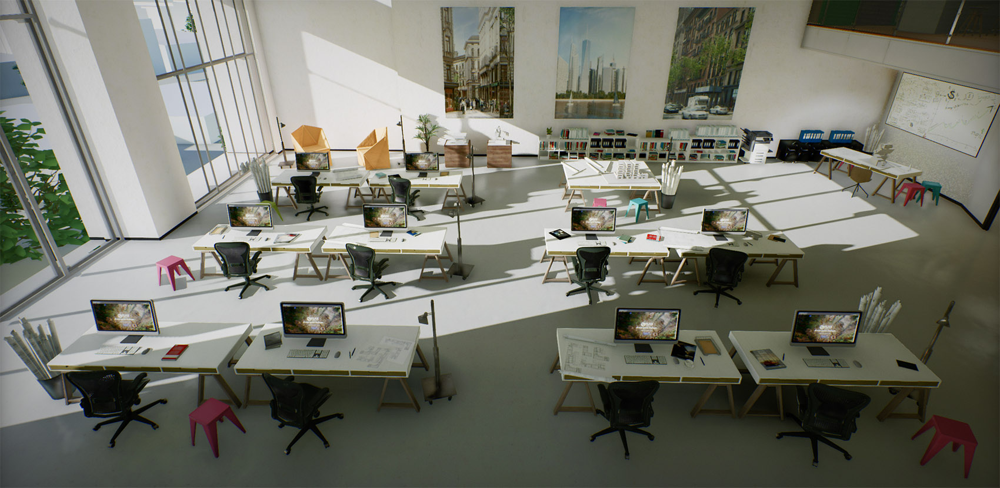

To showcase the capabilities of the new **Global Illumination** rendering we made a small demo presenting the ArchVis scene with dynamic lighting, dynamic objects, and adjustable time of the day. It's a small sandbox where you can playtest how the GI looks in an actual production project and how it performs. You can **[download it now](https://flaxengine.com/tech-demo-2022/)** from our server or get it from Steam.

<iframe src="https://store.steampowered.com/widget/2138130/" frameborder="0" width="646" height="190"></iframe>

In the demo, you can control the camera with a mouse and keyboard or play with a gamepad. Use *D-pad* or *UHJK* keys to rotate the sun and play with the time of the day in the scene to see how it affects the dynamic lighting.

### Licensing Changes

Together with a massive amount of new features coming to Flax in this update we wanted to do even more. Thus we updated our licensing terms by **increasing the minimum revenue threshold to $250k** from $25k. Now, it's free to use Flax if your game or product earns less than $250k in a calendar quarter. Any revenue above this value is using a 4% revenue share, as it was before. For example, if your game earns $300k you pay $2k, which is 4% out of $50k above that new threshold.

We believe this change will make the engine more affordable for small developers. It begins to be effective including with this calendar quarter (Q3 2022).

### 64-bit World Coordinates

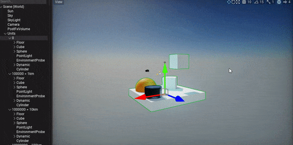

Flax Engine contains various features to create large and rich worlds such as async data streaming, different content tools (for foliage and terrain), and optimized multi-threading. In this update, we're bringing **64-bit precision support for World Coordinates** to enable building even larger worlds. Together with relative-to-camera rendering and physics scene origin shifting large worlds can be efficiently simulated and rendered which makes it possible for the game scenes to be as large as the whole Solar System while still maintaining good quality and precision.

By default, the engine still uses 32-bit floats precision which can be upgraded to 64-bits in Custom Build. To learn more see the [docs](../../editor/large-worlds/index.md).

### Global SDF

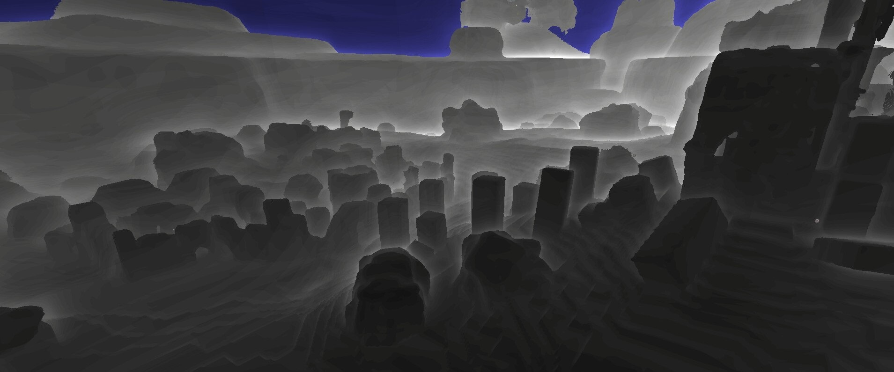

In order to implement real-time GI, we needed a **way of tracing through the scene to simulate light transport** for diffuse light bounces and specular light with reflections. Nowadays, the most common way to do it is through hardware raytracing which is limited to high-end GPUs only. We decided to use **Sign Distance Fields** which provide an efficient way for ray tracing. To do it, we rasterize model SDFs into an array of volume textures (called *Global SDF*) to provide up to 10cm precision nearby the camera at a distance of 200m or more. This gives a rough approximation of the scene geometry and can be used for **software raytracing**.

To learn more see the [Global SDF docs](../../graphics/models/sdf.md).

#### Global SDF in Content

Additionally, the benefit of maintaining Global SDF for a whole scene is the ability to use it in materials, particles, and shaders. We added new `Sample Global SDF` and `Sample Global SDF Gradient` nodes to materials and particles for sampling SDF at any position. Also, particle emitters have new modules for Global SDF collisions and Global SDF forces to drive the realistic VFX simulation.

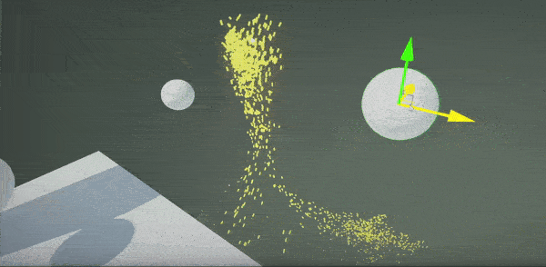

### Crowd Navigation

| Before | After |
|--------|--------|
|  | 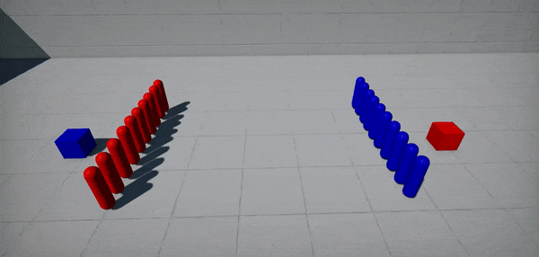 |

For game projects that use AI with NavMesh-based navigation, we've added a new `NavCrowd` system which allows to efficiently simulate pathfinding with avoidance for **crowd of agents**. Above you can see 2 groups of simple [navmesh agents](../../navigation/tutorials/path-following.md) that are colliding with each other. [NavCrowd](../../navigation/nav-crowd.md) is a navigation steering behaviors system for a group of agents. It handles avoidance between agents by using an adaptive RVO sampling calculation. It can be used to implement automatic avoidance and movement for a crowd of agents using navmesh and supports asynchronous calculations which can run on our Job System (as shown in docs).

### Rich Text Formatting

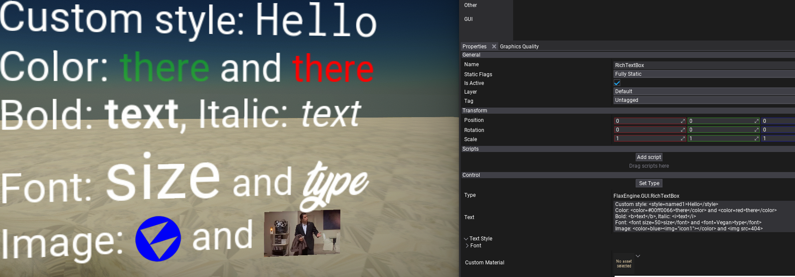

For this release, we improved [Rich Text Box](../../ui/controls/rich-text-box.md) GUI control by adding HTML tag formatting with styling, layout, and inlined image support. This notably makes it easier to style text in UI and create more elegant content. Our simple HTML parser is very extensible and can use custom tags (eg. defined by plugins). Follow the [documentation](../../ui/controls/rich-text-box.md) to learn which tags are supported and how to use them in your projects.

### Visual Scripting improvements

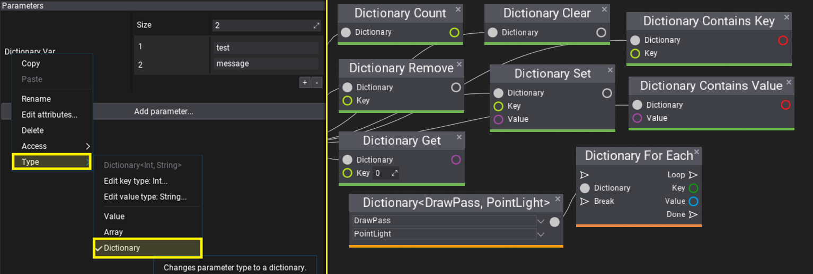

Every update, we bring many features and improvements for Visual Scripting users. Our goal is to make it a very extensible and usable solution for gameplay scripting. This time we added **Dictionaries** support, new editor features for easier script editing, as well as, Finder tool. **New Finder tool** allows you to quickly search anything in the graph or even in all scripts in projects (bring it via `Ctrl+F` in all graph editors). This can be also used to search for something in all materials, particles, and animation graphs in a whole project (eg. to search usages of a certain texture or method).

Finally, **Reroute node got more usability** and now can be easily connected to other nodes including multiple inputs/outputs (depending on the type). This will improve reusing graph parts and help organize visual scripts or material graphs.

## Screen Space Reflections for transparency

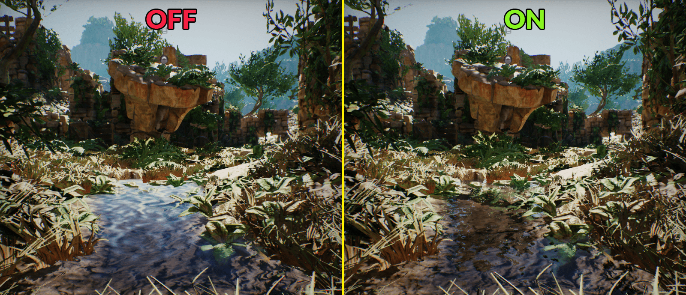

Transparent materials have new options for performing per-pixel depth-buffer raytracing to render reflections which improve the realism of water surfaces like puddles. Also, transparency can sample new Global Illumination and/or use Non-Directional Lighting mode which is useful when creating smoke, fog, or dust particle materials (shown below).

## Nested Animations

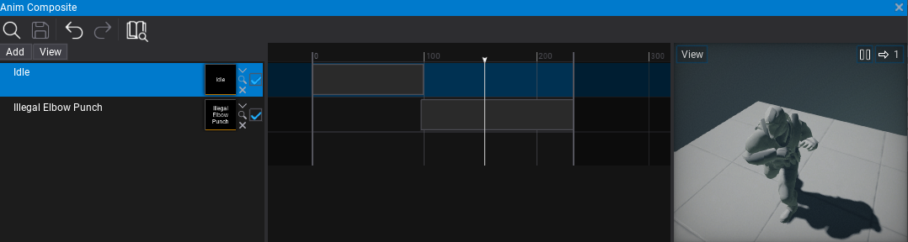

Animations can have nested animations inside to create sub-clips or composites (aka montages). This allows to easily reuse existing animation assets (eg. single reload gun animation duplicate 3 times for each gun shell).

## Noise utilities

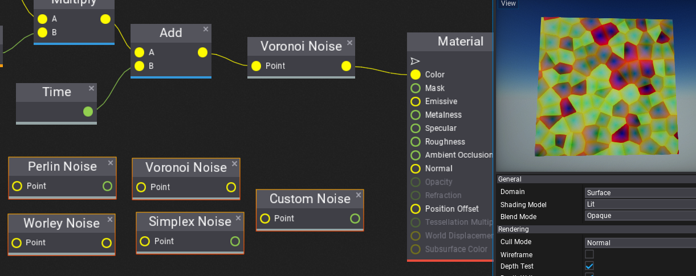

Now, Flax contains various utilities for different noise functions such as: Perlin, Simplex, Worley, Voronoi, Custom. Those can be accessed via scripting `FlaxEngine.Utilities.Noise` static class and used to enrich procedurally generated worlds and content.

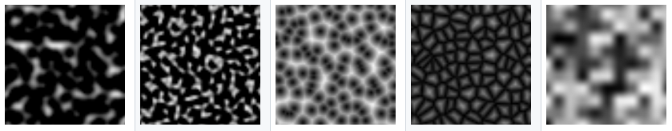

All visual graphs (materials, particles, animations) can sample noise functions both on CPU and GPU to enrich the content. All noise functions return normalized results in the range 0-1. Some of them return more noise components, such as Voronoi Noise where `X=minDistToCell`, `Y=randomColor`, `Z=minEdgeDistance`. Depending on the context only one or even all components can be used. Follow the tooltip with documentation for every node.

## Migration Guide

### Scripts initialization order

We refactored actors' `PostLoad`/`PostSpawn` methods into `Initialize` and changed the script `OnAwake` event to be called during this initialization phase - before any `OnStart`/`OnEnable` logic. This helps to create gameplay systems in a scheme of manager+objects where the manager can use `OnAwake` to initialize properly, and `OnEnable` can be used to register objects to the manager. This change has no performance impact but might be important to address in existing Flax projects.

### Plugins scripting changes

For this update, we've added support for implementing Game Plugins in C++ scripts - previously it was C#-only feature. For this change, both `GamePlugin` and `EditorPlugin` has been slightly modified:
* `Description` getter is read-only and your plugin can fill `_description` field in the constructor to set up plugin info.
* `OnCollectAssets` has been renamed to `GetReferences` and returns the list of Guids with referenced assets.
* `DeinitializeEditor` new method for Editor plugins to pair with `InitializeEditor` and match Editor lifetime.
We've updated docs, code examples, and all official plugins to reflect those changes.

### Large Worlds

Adding 64-bit precision to the world coordinates to the Flax was a challenge. Both Engine and Editor have very complex and mature systems with tooling thus we wanted to make this transition seamless and stable. One of the goals was to don't bloat memory by just doubling every floating-point value but instead upgrade world-coordinates-related data to support very large worlds. For instance, 32-bit float gives us enough precision to represent object rotation and scale thus we upgraded only `Translation` (aka `Position`) of the `Transform` to a 64-bit double vector. Also, the UI system, mesh data, textures converter, and other engine features were changed to keep explicitly *Float* vectors for performance reasons.

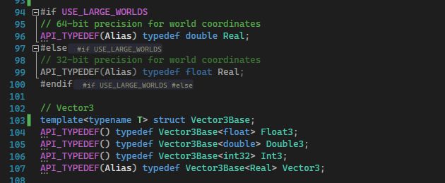

Regarding data compatibility, we did automatic upgrade support for the older projects, as well as, an implicit conversion between 32-bit and 64-bit vector types to ensure gameplay code can be easily updated to the new engine version. Finally, this Large World Coordinates feature can be enabled via engine configuration parameter (see `Flax.flaxproj`). If your game needs 64-bit floats then you can use a custom engine build ([docs](../../editor/large-worlds/index.md)) and enable that feature.

Important changes regarding this feature:
- Refactored Vector types Float/Double/Int to have float/double/int as data and Vector to have a float or double (typedef as `Real` based on `USE_LARGE_WORLDS` define at compile time)
- Refactored UI to use `Float2` explicitly instead of `Vector2` (UI doesn't need 64-bit precision)
- Refactored rendering to use `Float3` explicitly instead of `Vector3` (GPU support for 64-bit coordinates is limited and due to performance reasons we continue to use 32-bit precision but the scene rendering is relative to the large world chunk thus enables using large worlds)
- Added implicit conversion between Vector<->Float<->Double<->Int vector types to make it easier for upgrade projects to 1.4 version
- Core math types that will keep 32-bit float precision: `Rectangle`, `Color`, `Matrix`, `Matrix3x3`, `Matrix3x4`, `Quaternion`, `Viewport`, `BoundingFrustum`
- Core math types that were upgraded to 64-bit double-precision: `Vector2/3/4`, `BoundingBox`, `BoundingSphere`, `OrientedBoundingBox`, `Plane`, `Ray`, `Triangle`, `Transform` (only translation, orientation, and scale will use 32-bit precision as it's enough to represent rotation and scaling)
- Mesh API has been changed to explicitly use `Float2/3/4` for mesh vertices data (instead of `Vector2/3/4`) - old API has been deprecated but will still work
- Collision Data and Physics uses 32-bit precision for vertices and geometry - old API has been deprecated but will still work
- Packed vector types (eg. `FloatR10G10B10A2`, `Half3`) have been refactor to use Float2/3/4 types for conversion as default instead of `Vector2/3/4`
- Material, particle, and animation graphs parameters were changed from Vector to Float (explicit type) but with new support for Doubles
- Gameplay Globals entries of `Vector2/3/4` has been changed into `Float2/3/4` and added `Double2/3/4` if more precision is needed

Migration guide:
- BoundingBox, BoundingSphere. Transform, Ray, Triangle Plane, Vector2/3/4 types can have different memory sizes if using doubles. Ensure the serialization of data using those types will work accordingly. You can use new WriteStream and ReadStream utility methods for those data types serialization. `Variant` type will automatically upgrade existing data.
- GameplayGlobals values of vector type have been changed into `Float2/3/4` (reading vectors will need to be changed explicitly).
- User Interface and Input use `Float2` explicitly for coordinates, please update your UI code.

## Changelog

### Version 1.4.6334 - 7 September 2022

Contributors: mafiesto4, GoaLitiuM, iainmckay, PrecisionRender, mxruben, whocares77, ScottLongley, tom-weiland, Wolfos

PRs merged: 23

* Add **Dynamic Diffuse Global Illumination** with real-time irradiance probes
* Add `JobSystem.Execute` utility for quick jobs running
* Add **Global Sign Distance Field** rendering
* Add Distance to box/point for Bounding Box
* Add `LineHitBox` to `Collisions.hlsl`
* Add flip presentation mode and tearing support to D3D11
* Add `MeshAccelerationStructure` utility for robust triangles geometry queries
* Add more utilities for using `Matrix3x3`
* Add `IsSingleFrame` to `RenderView` for thumbnails/pre-render views drawing without temporal effects and LOD transitions
* Add `DynamicStructuredBuffer` and `DynamicTypesBuffer` utilities
* Add automatic group panels hiding if all properties are hidden by `VisibleIf` rule
* Add utilities for Model SDF generation (on import, in editor window, or batch for all models on a scene)
* Add **Sample Global SDF** node to materials and particles
* Add `Collision (Global SDF)` particle module
* Add `Conform to Global SDF` module to GPU particles
* Add `Position (Global SDF)` module to GPU particles
* Add utility `Copy` option for various labels in  assets editors
* Add `ISceneRenderingListener` for using scene information in the renderer cache
* Add utility to editor CodeDocs for tooltips from C# types and members
* Add `CustomBuffers` for injecting custom state into `RenderBuffers`
* Add support for implicit casting from Quaternion to other types in shaders
* Add `Rotate Vector` node to Visject Surface graphs
* Add **Screen Space Reflections for transparent materials**
* Add `Array Add Unique` node to Visual Scripting
* Add support for sampling Scene Color in transparent materials (forward pass)
* Add keyboard key navigation to Content View based on items name first character
* Add `JsonAsset.Instance` for C# asset object
* Add `Delegate::BindUnique`
* Add **Dictionaries to Visual Scripting**
* Add support for array of Visual Script objects
* Add support for `constexpr` fields in Scripting API
* Add **World Triplanar Texture node** to materials
* Add playback speed option for Scene Animation rendering
* Add Smoothstep and Step material nodes
* Add preserving existing value of the Visual Script parameter when changing its type
* Add `View Size` node for GUI materials
* Add additive scene opening in Editor via drag&drop into Scene Tree window
* Add `Custom Global Code` node to materials for injecting custom code, includes or constants
* Add `loopCount` to `PlaySlotAnimation` for looping slot animation
* Add `Color.FromRGBA`
* Add confirmation dialog for Scenes Data building in Editor toolbar (prevent misclicks)
* Add cursor clipping (for RTS, MOBA games)
* Add `Double2`, `Double3`, `Double4` to C# scripting API
* Add **Large Worlds support for 64-bit world coordinates** (enable `UseLargeWorlds` in custom engine build)
* Add relative-to-camera rendering for large worlds
* Add support for the latest Windows 11 SDK (22H2)
* Add support for Physics Scene origin shifting
* Add support for Double2/3/4 for native storage in `Variant`
* Add custom floats formatting to prevent scientific notation
* Add selectable Environment Probes resolution (in Graphics Settings or per-probe)
* Add support for dispatching jobs within jobs in JobSystem
* Add **Transparent Lighting Modes for material** with option to use non-directional shading
* Add  Global Illumination sampling option to transparent materials (eg. particles)
* Add utility buttons to check/uncheck all Material Instance parameters overrides in Editor window
* Add separate GBuffer view modes in Editor viewport widget
* Add **real-time environment probes** support
* Add support for baking env probes in cooked game
* Add new trace mode to Screen Space Reflections for DDGI Scene tracing
* Add showing model screen size in the Model Preview
* Add editor camera speed up for gamepad right trigger
* Add `GamepadDPadX`/`GamepadDPadY` input axes for gamepad DPad
* Add `Engine.FocusGameViewport` to implement game menu with camera focus gather
* Add **HTML tags processing in Rich Text Box**
* Add `HtmlParser` to engine utilities (with unit tests for it)
* Add option to disable text clipping in text boxes
* Add option to disable selecting text in text box
* Add utility for parsing Color from text (hex or named color)
* Add `Content.GetEditorAssetPath`
* Add `EditorPlugin.DeinitializeEditor` to properly cleanup Editor extensions on exit
* Add support for generic types in Scripting API with `Template` flag
* Add waiting for model to be loaded in `SetMaterial`
* Add `NavCrowd` for navigation steering behaviors system for a group of agents
* Add support for renaming GPU resources (development builds only)
* Add new `API_TYPEDEF` metadata for Scripting API types instantiation (with `Alias` option)
* Add `FLAX_BUILD_BINDINGS` define for Scripting API parser to be used if needed
* Add various improvements for C# math library
* Add **Content Search** window to searching Visual Scripts and other assets
* Add `Find references` utility for graph parameters and methods
* Add public events for Editor play mode flow
* Add setting timer resolution to lowest possible value in all Windows systems
* Add support for main view information in Surface materials during subpass rendering (eg. shadow depth)
* Add support for font size and color in `Header` attribute
* Add `TypeReference` attribute to actors/scripts searching utilities for easier type picking in Visual Script
* Add support for setting C++ version for build module compilation
* Add **Nested Animations** for compositing animation clips
* Add new **Noise** library for C++/C#/VisualScript/HLSL utilities
* Add `Default` auto-generated member to scripting structures and improve deserialization
* Add `UseAlpha` to `RenderBuffers` for pass-though renderer with alpha channel
* Add late initialization to Content Finder tool in Editor
* Add support for virtual Prefab assets created from code
* Add GPU Dispatch calls in GPU profiler draw calls collumn
* Add batching undo actions for Surface editing to prevent undo actions spam during a single edit
* Add missing pipeline barriers after Dispatch on Vulkan to prevent race conditions with UAVs
* Add support for using mipmaps with 3D textures
* Add support for  in-built color constants in Visject (eg. red/blue/violet)
* Add drawing `RenderList` if it was not batched/sorted
* Add `Actor::GetOrAddChild` to C++
* Add auto-selecting new item created in Content window
* Add shader getter to `IMaterial` interface
* Add shader reloading on header file edit for shaders with compilation errors
* Add support for Volume textures to have residency changed as regular textures
* Add events for streamable resources residency changes tracking
* Optimize empty comments parsing in Scripting API
* Optimize ProbesFilter shader
* Expose `IsDuringPlay` property for actors and scripts to use in scripting
* Improve `StaticModel` to register for Scene Rendering once the model has any LOD streamed-in
* Improve  initial name for static model collision data asset
* Improve properties display (group all parameters from the same group together)
* Improve JetBrains Rider installation detection
* Improve Linux source code editor detection (Rider and VSCode)
* Improve property names displayed in UI
* Change search boxes in Editor to stick to the top of the panel
* Update to .Net Framework 4.5.2
* Update DirectXShaderCompiler to version 1.7 (July 2022)
* Move `Actor.DestroyChildren` to C++
* Remove disabling temporal reprojection from Volumetric Fog
* Remove `FlaxException`
* Remove warning on missing initial entry state for Anim Graph state machine
* Refactor model Import Options to display only relevant properties for asset Type
* Refactor `PhysicsActor` into `Rigidbody` (use `IPhysicsActor` interface manually)
* Refactor `HashSet` to support custom allocator
* Refactor `API_INJECT_CPP_CODE` into `API_INJECT_CODE` to support code injection in other languages
* Refactor Visject reroute node to support reconnecting and have more usability
* Refactor scene objects initialization to call `OnAwake` before all `OnStart`
* Refactor engine to support double-precision vectors
* Refactor `OrientedBoundingBox` to use `Transform` for transformation instead of `Matrix` (for large worlds)
* Refactor `FlaxTests` to run as Editor with all engine services initialized
* Format engine codebase with ReSharper
* Fix `Lightmap UVs Source` not working in model import options
* Fix for macOS dylib path
* Fix text box not consuming key down event causing editor shortcuts to activate when typing
* Fix preserving Alpha channel when changing color with Value slider
* Fix Android build with NDK 25
* Fix editor options startup to not log error on a missing file
* Fix for faster models exporting
* Fix opening and editing animation with missing Anim Events
* Fix `Vector2` equality comparison
* Fix sampling Curves with keyframes that have negative time value
* Fix displaying multiple structure parameters in Visject Surface parameters panel
* Fix opening material or particle emitter in editor if shader compilation fails
* Fix picking to properly select closest triangle for meshes
* Fix Directional Light color alpha in Sky atmosphere color
* Fix CSM split point when using 3 cascades
* Fix `TextureBrush` to return valid size if texture is not yet loaded
* Fix editor viewport capturing mouse if window is not foreground
* Fix looping streamable audio clips with multiple chunks
* Fix enum operators to be `constexpr`
* Fix game ticking in editor during cut-scene rendering at edit time
* Fix `Ctrl+S` in timeline view to not split the camera shot media
* Fix debug name for DirectX resources
* Fix Surface parameter attributes editor popup location
* Fix Constant Buffer binding on D3D12 when using Graphics after Compute pass with the same constants
* Fix the Depth Of Field to be consistent no matter the resolution
* Fix borders sampling in Depth Of Field to reduce leaking artifacts on screen edges
* Fix editor error when selecting foliage type
* Fix `FlaxStorage` refs counting to be atomic
* Fix pasting/duplicating nodes in Visject to call spawn event
* Fix error when loading surface from not yet loaded asset
* Fix drag&drop into Scene Tree if move goes over valid drop target first
* Fix wrong timestamps in C# profiler events
* Fix copy pasting multi-line text into a single-line textbox
* Fix removing Gameplay Globals
* Fix Multi Blend 2D node if all blend points are on the same line
* Fix selecting Debug Log window entries with the left-mouse button
* Fix errors in Editor when editing particle emitter if effect that uses it is selected
* Fix missing Properties window focus after adding script to the actor
* Fix `ParticleEmitter.Spawn()` with default duration
* Fix `[AssetReference(typeof(typeName)]` not working for arrays of assets (fix for collection types)
* Fix PhysX crashes due to lazy actors adding by adding PhysX actors to the scene immediately
* Fix foreach loop in Visual Script to continue flow on null array or dictionary
* Fix default value in `Dot` and `Distance` graph nodes
* Fix editing `LinearCurve<Color>` in properties window (color picker window closed keyframe editing popup)
* Fix using null array of dictionary in Visual Script for init
* Fix invoking anim events for multi-blend animations
* Fix mouse hovering controls under expanded dropdown list panel
* Fix `Spline::GetSplineLength` freeze
* Fix Editor Analytics tracking option file SetupStyle
* Fix duplicated actors after reparenting actor in Prefab
* Fix Reroute node in Visual Script impulse flow
* Fix Editor play mode exit bug after closing maximized Game window
* Fix using preprocessor define values in Flax.Build bindings parsing
* Fix processing `else` and `elif` preprocessor blocks in `Flax.Build` bindings parser
* Fix parsing comments for Scripting API types that are templates
* Fix snapping object to the group in Editor to skip trigger volumes
* Fix error when double-clicking empty RichTextBox
* Fix minor issue with Visual Script set parameter node calling flow during debugger value evaluation
* Fix uploading volume texture data to GPU in D3D12
* Fix shader source code encoding error on a compilation error
* Fix font rendering and alignment with custom DPI scales
* Fix `Dictionary::Remove` return value if empty
* Fix error in Forward Shader Feature when rendering directional light shadow map
* Fix ParticleEffectEditor issues after emitter editing if selected
* Fix `UsedSRsMask`/`UsedUAsMask` when binding arrays to the shader
* Fix normal map when importing materials for model files
* Fix sorting items in various contextual list popups in Editor
* Fix `InstanceOrigin`, `PerInstanceRandom` and `LODDitherFactor` to not use interpolation between shader stages
* Fix `Multiply` (and similar) nodes result value in Visject if the first input is disconnected
* Fix highlighting the first error/warning from the Output Log message text
* Fix opening particle emitter editor window if shader compilation fails
* Fix invalid Rigidbody bounds if it has no  shapes  attached
* Fix crash if D3D device gets `DXGI_ERROR_DEVICE_REMOVED` during init
* Fix crash with Vulkan when using Blur Panel in Screen Space canvas
* Fix crash on macOS due to Vulkan timestamp queries error
* Fix crash due to GPU Particles define not used in some headers
* Fix crash when setting up recursive Material Instances inheritance
* Fix crash when changing actor scene
* Fix crash on opening skeleton mask window
* Fix crash in scripting init if current localization is null
* Fix crash on API event in C# after Editor hot-reload
* Fix crash on Linux with empty log message
* Fix crash when spawning prefab without scenes loaded
* Fix crash when loading empty json for Variant structure data
