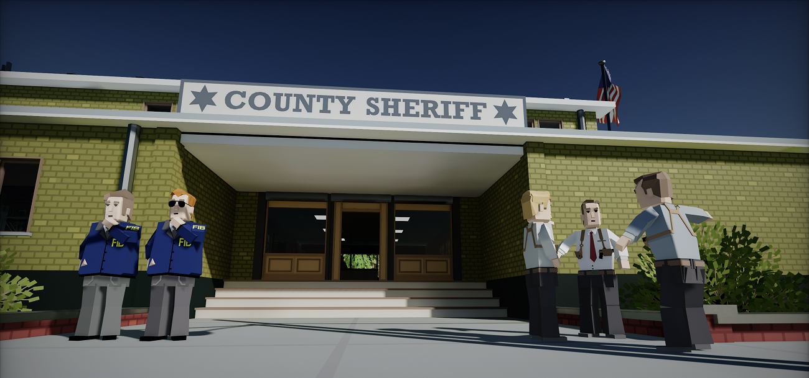
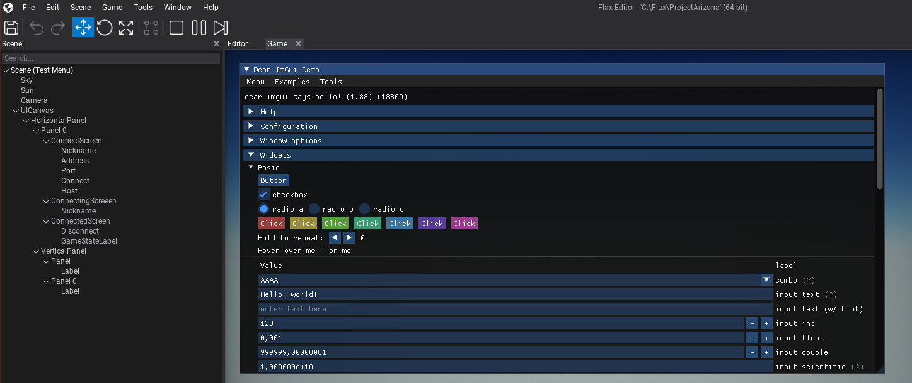
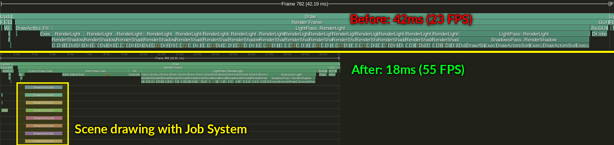
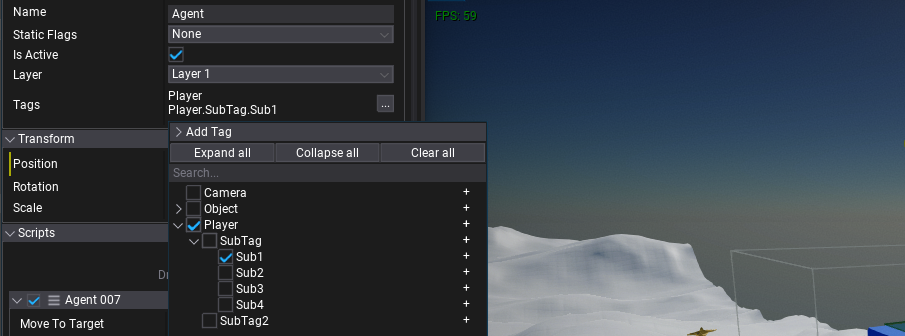
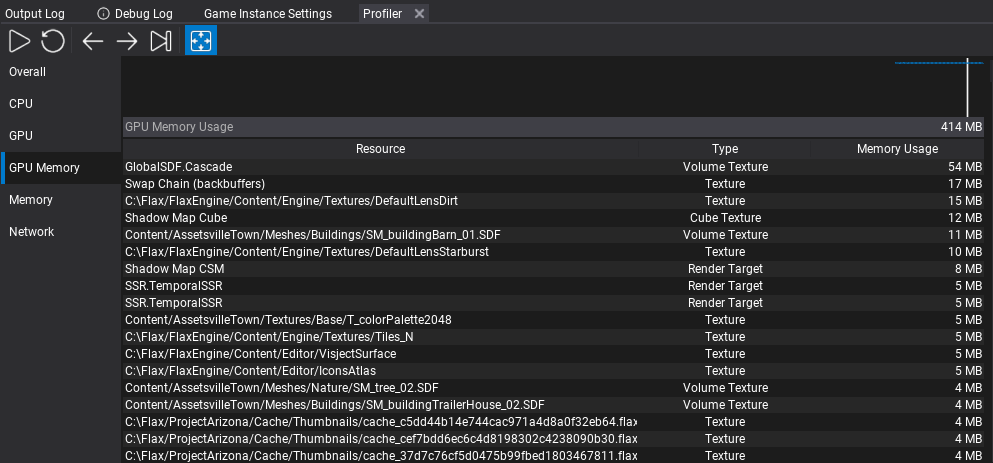

# Flax 1.5 release notes

## Highlights

### High-Level Networking

Complete **multiplayer support** comes to Flax! This was one of the most awaited features and now it's ready to be used in games. In this update we've implemented *High-Level Networking* layer which includes **objects replication** over the network, Remote Procedure Calls (**RPC**), concepts of **object ownership**, and server authority model.

New networking components allow to quickly create multiplayer games in server-client architecture (including self-hosted games). Flax networking layer will automatically handle connections setup, data replication, and objects spawning over the network (eg. spawn player prefab to all clients). Both C++ and C# scripting support new `NetworkReplicated` attribute (marks field/properties for automatic replication), `NetworkRpc` attribute (marks function as RPC), and `INetworkObject` interface (for customizations to networked object lifetime).

To learn more about High-Level Networking see new [documentation here](../../networking/high-level.md).

### Arizona Framework

**Arizona Framework** is ready to use, open-source framework for creating games in Flax available on [Github](https://github.com/FlaxEngine/ArizonaFramework). It's created as a plugin and can be added to your game project. Arizona Framework features core game architecture concepts commonly used in games such as `Game Mode`, `Game State`, `Game System`, `Player State`, `Player Pawn`, `Player Controller`, `Player UI`, and more. It's easily extendable and contains in-built support for multiplayer (both high-level networking and local coop).

To showcase this framework's example usage, we've created a sample first-person shooter game project [Arizona Framework Sample](https://github.com/FlaxEngine/ArizonaFrameworkSample). If you plan to create a multiplayer game with Flax feel free to use it as the foundation for a new project.

### ImGui Plugin

[Dear ImGui](https://github.com/ocornut/imgui) is a bloat-free graphical user interface library for C++ which is commonly used in gamedev for tools and debug interfaces creation. We've created and released an [official plugin](https://github.com/FlaxEngine/ImGui) for Flax-games to integrate ImGui and use it in C++/C# scripts. See the repository readme to learn how to use it in your game project.

### Performance Optimizations

Every Flax update brings various performance improvements. This time we've focused on CPU optimization of the game rendering. Now, renderer uses **multi-threaded draw calls** collection (via *Job System*), material shader constants are separated into *per-view* and *per-draw* data, **shadows rendering is batched with main view**, meshes drawing is faster, and much more. This resulted in a massive performance boost for large scenes (10k+ meshes) or in levels with many shadowed lights. Scene rendering is fully multi-threaded with bigger throughput. Also, existing graphics features such as [DDGI](../../graphics/lighting/gi/realtime.md) or [Global SDF](../../graphics/models/sdf.md) have been optimized for bigger game productions.

Above you can see an example view from Tracy's profiler with CPU frame time of the Library demo (arch vis scene) that has 30+ fully shadowed lights and 10k meshes.

### Hierarchical Tags

New gameplay tags come to Flax! **Hierarchical tags** with namespaces can empower gameplay programming. Now, Actors have a list of those tags which makes them more usable. Also, the new editor supports easy tag picking which can be used in other gameplay systems (eg. player weapons, animations, or abilities setup). Tags are a lightweight and scalable solution for well-organized game productions.

Important feature of this new system is new API such as `Tags.Get`, `Tags.HasTag`, `Tags.HasAnyExact`, `Tags.HasAll`, and so on, which improve usability in code.

### DLSS Plugin

[NVIDIA DLSS](https://www.nvidia.com/en-us/geforce/technologies/dlss/) is a revolutionary breakthrough in AI-powered graphics upscaling technology that massively boosts performance. To ease the integration of this technology into Flax-games we've released an official plugin with DLSS integration for developers. [DLSS for Flax Engine](https://github.com/FlaxEngine/DLSS) is available on Github and supports *DLSS 3.1*.

### Editor improvements

Flax Editor is under constant development towards making it the best game editor, this time we notably worked on:

* **GPU Memory** profiler - allows inspecting graphics memory usage for each resource. Double-click to open related asset (eg. texture or model that created resource), use tooltip to inspect resource description (eg. buffer flags or texture format).
* **Assets profiler** - shows all loaded assets, including per-resource memory usage (cpu-mem, estimated), type and references count. Right-click to inspect asset (eg. select actors using it or show references graph), double-click to open in editor. This can be useful when profiling performance and memory usage.
* **Improved Gizmo tool** - bigger readability and scale tool with 2-axis mode.
* **New Actor Icons** - editor viewport icons has been redone to have clean and consistent style.
* **Improved Properties panel groups** - now group panels in Editor have an outline, bigger header and expand state icon which improves usability and makes UI more intuitive.
* **Editor usability** - lots of Quality Of Life improvements to help developers use Flax Editor (eg. reorganized context menus)
* **Custom game viewport sizing** - can be used to test mobile displays or fixed game screen aspect ratios when developing cross-platform games.

### Upcoming .NET 7

Recently we've [started updating](https://github.com/FlaxEngine/FlaxEngine/pulls?q=is%3Apr+NET7) to the latest [.NET 7](https://devblogs.microsoft.com/dotnet/announcing-dotnet-7/) for C# scripting. You can already test it on [dotnet7](https://github.com/FlaxEngine/FlaxEngine/tree/dotnet7) branch and preview the progress on a [roadmap](https://trello.com/c/xgS3TphU/351-net-7). Hopefully, it should be ready for the next `1.6` update which means that:
* .Net Framework support is deprecated now and we will migrate to the latest .Net 7
* Visual Studio 2017 and 2019 won't be supported (due to.Net 7 SDK requirements of VS 2022)
* Any 3rd party C# libs will need to be rebuilt with .Net Core/Standard
* .Net 7 SDK will be required system dependency for Editor (cooked game as standalone)

Benefits of that change:
* Far better performance (new GC, new JIT, optimized stdlib)
* Latest C# 11 support
* Ability to use mixed native/managed debugger in VS 2022
* New Editor's code hot-reload via `AssemblyLoadContext` (safer than current [custom solution](https://github.com/FlaxEngine/mono))
* Seamless support for newer .Net versions in future

## Migration Guide

### PostProcessEffect changes

For this update, we've added support for implementing `PostProcessEffect` in C++ scripts - previously it was C#-only feature. For this change, both `PostProcessEffect` and `SceneRenderTask` API has been slightly modified:
* `Location`/`UseSingleTarget`/`Order` getters has been changed into fields which can be adjusted from code (in constructor or at runtime).
* `CanRender` getter has been changed into `CanRender()` virtual method which can be overridden to provide a custom checks for PostFx render availability.
* `RemoveCustomPostFx` and `GlobalCustomPostFx` lists have been more to C++ thus use `AddCustomPostFx`/`RemoveCustomPostFx` and `AddGlobalCustomPostFx`/`RemoveGlobalCustomPostFx` to extend the rendering with custom effects. `PostProcessEffect` scripts attached to the camera actor will remain working as before.
We've updated docs, code examples, and all official plugins to reflect those changes.

### UWP platform deprecation

UWP (Windows Store) platform has been deprecated and soon will be removed. As a replacement, we will introduce Windows GDK platform (based on existing Xbox platform support via GDK) which will allow devs to develop for all Windows devices (ARM, Hololens, Xbox, etc.). We decided on this move as UWP is not well supported and not widely used (partially due to too complex tech/design decisions from the Mircosoft side).

## Changelog

### Version 1.5.6339 - 1 March 2023

Contributors: mafiesto4, GoaLitiuM, Tryibion

PRs merged: 4

* Add `FLAXENGINE_API` to platform specific classes for C++ scripting usage
* Add *Ragdoll* actor to toolbox
* Add better C++ standard library version detection on Linux
* Add `LinuxFileSystem::ShowBrowseFolderDialog`
* Add `BC4`, `BC5` and `BC7` formats decompression support on non-Windows platforms
* Add support for building Android app on Linux or Mac
* Fix `Tag` natvis debugger print
* Fix `Level::FindActors`  with `Tag`
* Fix using Vulkan SDK header from system when cross-compiling
* Fix cursor not changing from `IBeam` to default when hovering over cancel button in *SearchBox*
* Fix stability of Global Surface Atlas to smooth objects culling buffer capacity over time

### Version 1.5.6338 - 19 February 2023

Contributors: mafiesto4, realDLPS, mlavik1, iainmckay, Tryibion, Crawcik, cristhofermarques, RuanLucasGD, PrecisionRender, plemsoft, GoaLitiuM, Withaust, envision3d, Swiggies, pacyfist, W2Wizard

PRs merged: 111

* Add scaling towards mouse position in Visject surface
* Add hiding tooltip while dragging UI control
* Add `FlaxEngine` project file generation for VS Code
* Add `DontCompress` configuration to build tool
* Add support for deserialization of deprecated properties in scripting types
* Add sticky the content window search field so the search bars do not scroll with the content items
* Add **new editor icons for actors**
* Add performing layout when deleting actors and scrolling to duplicated/pasted actor when action is performed
* Add **custom game viewport sizing** in Editor
* Add scene panel to separate the tree from the search bar and made it not scroll when renaming
* Add actor virtual functions `OnDebugDraw`/`OnDebugDrawSelected`/`OnEnable`/`OnDisable` to override in scripting
* Add `TypeNameEditor` for editing typename reference as soft string value
* Add game settings assets loading (not only objects)
* Add `Cook&Run` and `Run cooked game` utilities to `Game` menu list for multilayer games testing
* Add support for editing JsonAsset data at runtime (eg. modify game settings on the fly)
* Add support for custom types/members attributes parsing in scripting bindings
* Add support for custom Action Command in TaskGraph
* Add support for `DataContainer` in scripting api bindings
* Add support for custom icons for actors in `ViewportIconsRenderer`
* Add play/pause widget and keybind for particles preview in asset Editor
* Add custom Tags for scripting api types to be used by plugins
* Add Left Click to submit text in textbox
* Add `SceneReference` to C++ scripting API
* Add `AdditionalScenes` to `BuildSettings`
* Add `ViewFlags::Sky` for conditional sky/skybox rendering
* Add `DefaultValue` support for scripting parameters
* Add `AfterGBufferPass` and `AfterForwardPass` for custom PostFx location
* Add `Renderer::DrawActors` for quick actors rendering in custom render passes
* Add simplified collider for in-built primitive meshes
* Add new UI for Drop Panels in Editor (bigger header, expandable arrow icon and guidance lines)
* Add `RenderBuffers::LinkedCustomBuffers` to reuse main game viewport rendered state (eg. GI) in sub-rendered view
* Add `GPUContext::SetBlendFactor`
* Add **SortOrder to drawable object types for transparency sorting** override
* Add support for `StringAnsi` in scripting api
* Add `NetworkTransform` component
* Add network stats API for transport layer
* Add GBuffer textures to the C# scripting
* Add Editor search fields usage on a single character query (instead of min 2 chars)
* Add `NetworkLagDriver` for lag simulation over low-level network transport layer
* Add support for different access level for scripting property functions
* Add Layer and StaticFlags from parent actor after spawnign actor in Prefab Window
* Add support for non-const ref parameters with conversion (eg. string or array) in scripting api function parameters
* Add **multi-threaded scene rendering with Job System**
* Add draw call sorting keys generation during draw calls collection (async)
* Add `WorldPosition` to postfx material scene textures for world-space position sampling at uv
* Add `GPUDevice::CreateConstantBuffer` for custom constants buffers usage
* Add option to override Custom Editor for array of type
* Add `Tag` and `Tags` for new tags system
* Add `FindActor`/`FindActors` with `Tag` to `Level`
* Add `Tag` to `PhysicalMaterial` for physical surfaces tagging
* Add unit tests for scripting features
* Add thirdparty files in the includes cache for build tool checks
* Add more test cases for various scripting bindings features
* Add bigger input value boxes to Visject Surface
* Add `UseAssetImportPathRelative` to Editor options and use it by default to store imported asset path relative to the project folder
* Add VS2022 support for building for UWP platform
* Add navmesh update on terrain sculpt undo/redo
* Add `this` to `API_PARAM` for static method extension of a type
* Add defer to navmesh update when sculpting action ends to prevent stalls
* Add support for editing path to the asset within `AssetRefEditor`
* Add **Procedural Texture Sampling** material node (stochastic)
* Add auto save reminder popup on Editor status bar
* Add `Color.FromRGBA`
* Add `RandomStream` to C#
* Add `RandomUtil.Rand` method to C# and Visual Script for quick random float in range `[0;1]`
* Add scripts compilation failed status to status bar in Editor
* Add `TargetCompiler` to `Flax.Build` toolchains
* Add centered the context menu that is created from clicking the add scripts button on an actor
* Add **C++ file includes cache serializartion to improve incremental build times**
* Add cancel button to search fields in Editor
* Add hover begin and end event to button
* Add preventing from spawning abstract Actor/Script type
* Add `RenderSetup` and allow customizing it by gameplay and postfx
* Add `RenderingUpscaleLocation` for customizing upscaler location in render pipeline
* Add scripts dragging support to scene tree for reparenting
* Add `Render2D.DrawTexturedTriangles` with index buffer
* Add `FlaxEngine.Object.FromUnmanagedPtr` for native object raw pointer conversion to managed object
* Add `ScriptingTypeHandle` support for scripting bindings as `System.Type`
* Add `WriteStructure`/`ReadStructure` utilities for `NetworkMessage`
* Add automatic network serializers generation for `NetworkReplicated` fields in C++ types
* Add better location of renaming box for Actor/Folder tree node to start at the label for better UX
* Add project-independent saved windows layouts (stored globally)
* Add better organization to Content projects tree organization for better UX (game project first, ending project last)
* Add `Mono.Cecil` to `Flax.Build`
* Add profiler events  for plugins init/deinit
* Add **GPU Memory profiler** to Editor
* Add `ViewFlags::Sky` for conditional sky/skybox rendering
* Add pooled render targets naming for easier GPU memory usage debugging
* Add `SetResourceState` and `ForceRebindDescriptors` to `GPUContext` for integration with external rendering libraries
* Add support for `CanRender` in postFx  to depend on specific render setup
* Add `GetNativePtr` to `GPUAdapter`
* Add changing mouse cursor to ibeam when editing text box
* Add `IsAnyButtonDown` utility to `Mouse` and `Gamepad`
* Add `Normalized` to `Float2` and `Vector2`
* Add support for using system-installed Vulkan SDK on Linux
* Add `FLAX_X_Y_OR_NEWER` to game code defines
* Add engine version defines to C++ game scripts
* Add **Canvas Scaler** control for resolution-independent UI
* Add dev-only name to spawned Particle System
* Add support in `GetScript` to interface types
* Add option for importing scale tracking to animation asset
* Add `BlurScaleWithSize` to `BlurPanel` for resolution-independent blur
* Add Actor Scale linking and unlinking in Properties window for uniform scaling (*right-click*)
* Add `MemoryUsage` property to Asset for estimated CPU memory pressure
* Add memory usage query for various asset types
* Add **Assets profiler** to Editor
* Add support for normal generation when using Assimp model importer
* Add side mouse button shortcuts to the Content window
* Add ability to drag maximized window in Editor
* Add **Animation Instance Data node to Anim Graph** for caching value per-model
* Add support for 32 bit indices for the terrain chunk geometry
* Add `JsonAsset.Save`
* Add **updated transform Gizmos** in Editor
* Add better support for file dialogs on Linux
* Add preferred LLVM linker over other linkers on Linux (faster link time)
* Add serialization to `PostProcessEffect` fields and expose them in a sub-group in Editor
* Add grouping for new assets creation in Content window
* Add `ContentContextMenu` attribute for custom assets creation groupping
* Add `ActorContextMenu` attribute for custom actors creation groupping
* Add `ActorToolbox` attribute for actors grouping in Editor Toolbox
* Add scroll bars and resiable window to materia;/shader source code viewer
* Add a new way for actor context menus creation (via `ActorContextMenu` attribute)
* Add to not close the child context menu on click in Editor
* Add Shift key for skeleton mask editor to affect children bones on click
* Add `KeyDown` and `KeyUp` events to `TextBoxBase`
* Add value boxes hiding cursor and returning it to its position when done
* Add caching transform snapping enables and values for main Editor viewport
* Add visual cursor changes when sliding value box or resizing docked window
* Add cursor change for moving the property splitter
* Add support for importing WAV files that contain extra format bytes in fmt header
* Add support for MSBuild in preview version Visual Studio in build scripts
* Add better items placement in Editor content view
* Add support for imported LOD meshes using `_` character (eg. `mesh LOD_1`)
* Add `aiProcess_SortByPType` to Assimp importer to reduce artifacts from multi-geometry types imports
* Add rename on left click outside the Editor renaming popup
* Add `float3` scaling to triplanar texture node
* Add improvements for Editor Gizmo draw order
* Add running Tests on Windows in Github Actions CI
* Add improvement for drag&drop tooltip hiding on operation start
* Add improvement for normal maps detection when importing FBX model files
* Add DDS files import time improvements if already compressed
* Add faster scroll speed to feel less sluggish in Editor
* Refactor `GetNonTerminatedText` into `GetText` in `StringView`
* Refactor raw data `ReadSttream` and `WriteStream` to have easier to use API with more features
* Refactor **Actor tags into hierarchical reusable Tags** system for better gameplay scripting
* Refactor material shaders to use separate constant buffer (slot 1) for shared per-view constants
* Refactor scene rendering to separate drawable actors
* Refactor enum flags with `__underlying_type` and new `EnumHasAnyFlags`/`EnumHasAllFlags`/`EnumHasNoneFlags`
* Refactor scene rendering to use batched culling for main view and shadow projections
* Refactor `ObjectsRemovalService` to skip double-buffering due to issues and complexity
* Refactor `PostProcessEffect` to support C++ scripting
* **UWP (Windows Store) platform has been deprecated** and soon will be removed
* Remove double click to rename content item
* Remove `GPUResourcesCollection` and use `GPUDevice` instead to simplify code
* Remove old `RT1_FloatRGB` and `RT2_FloatRGB` in favor pooled render targets
* Rename property `GetElementsCount` to `ElementsCount`  in C# `GPUBufferDescription`
* Rename `DepthTestEnable` to `DepthEnable` in Graphics PSO to match actual logic
* Reduce Render Targets Pool flushing frequency to prevent memory popping
* Update DefaultLensDirt and DefaultLensStarburst texturs to reduce GPU memory usage
* Upgrade GPU limits to support 16k textures
* Change the default for script members order to declaration
* Optimize Editor camera previews updating performance
* Optimize Depth Of Field effect usage of GPU memory
* Optimize `BoundingFrustum::Intersects(BoundingSphere)`
* Optimize Global SDF cascades updates intervals (max 1 cascade per frame)
* Optimize Global SDF performance on CPU when scene is mostly static
* Optimize `GPUBuffer` on D3D11 to not stall CPU on reading staging readback buffer
* Optimize various debug views performance
* Optimize GPU Resource name to prevent memory allocs when changing name frequently
* Fix context menu and tooltips on Linux to be more stable
* Fix dragging timeline ending edge with a mouse cursor
* Fix math node size
* Fix potential rare issues with material shader constants containing invalid data
* Fix `Flipbook` material node bug when frames X was different than Y
* Fix missing game scripts types when starting editor from IDE with `-skipCompile` arg
* Fix for Anchor drop down UI closing in Editor
* Fix textbox defocus on edit end
* Fix comparison operators on object reference types
* Fix the additional layers in the matrix when there is less than 4 layers in the layers and tags settings
* Fix missing `TraceMode` blending in PostFx volume for SSR settings
* Fix child menu arrow image to accommodate for the scroll bar showing when the amount of items exceeds the max
* Fix DPI query on Linux to handle value from KDE Plasma
* Fix process creation on Linux to prevent deadlock when reading process output pipe
* Fix centered window and message box locations on Linux (multi-monitor desktop)
* Fix `LinuxFileSystemWatcher` not working in sub-directories
* Fix running VC++-project build commands with Rider on Linux
* Fix compiler warnings with Clang 15 or later
* Fix error when joining exited threads
* Fix `Mesh` data downloading to support not yet streamed vertex/index data gather
* Fix linking against C#-only modules
* Fix rendering with custom feature-set
* Fix null String serialization over network via C# API
* Fix first property name letter to uppercase in Editor properties panel
* Fix temporal anti-aliasing to provide better quality output
* Fix `OnSceneUnloaded` event to contain valid scene object
* Fix `GetNativePtr` on Vulkan
* Fix leftover UI control state when it gets disabled/hidden/reparented
* Fix imported shader source last char value to prevent strange diffs in Version Control Systems
* Fix Intellisense issues with Visual Studio Code
* Fix native scripting interface method override in managed scripts on Clang-platforms
* Fix `ScriptingObject::FromInterface` to return object if the pointer is already valid object
* Fix recursive binary modules usage in scripting
* Fix reading type inheritance in bindings generation with comment at the end
* Fix Visject surface input box color for missing connection type but with type hint
* Fix Audio Source stop/play pait to properly restart streamed audio clips
* Fix missing output clear when reading text array in OpenFBX
* Fix position of child context menus when having to open left in Editor
* Fix typo fix in Graphics Settings, from 'Uee HDR Probes' to 'Use HDR Probes'
* Fix displaying Game and Editor plugins to be batched in Editor
* Fix invalid NetworkMessage usage in C++
* Fix various aspects of the prefab editor window interface
* Fix when sliding the cursor slowly to a screen edge, mouse get flipped to the other screen edge and come back again (only on Windows)
* Fix mouse get cursor flipping (some sliders that use mouse tracking also update the frame of mouse flip, causing a wrong slide delta)
* Fix using dependency module from nested referenced build in C#
* Fix custom animation clip frames range import to properly treat frame indices
* Fix bug with `Screen.CursorVisible` set in script `OnStart`
* Fix audio clips streaming to be thread-safe when audio sources play
* Fix asset registry issues when starting Editor on Windows with uppercase path if the cached was lowercase path
* Fix dragging maximized dock window in Editor to restore size
* Fix issue with `ParticleEffect` properties editor when no asset is selected
* Fix VS Code cpp include paths in generated project files
* Fix compressing on Linux /Mac (when `zip` package is not installed)
* Fix `FlaxEngine.CSharp` library file referencing
* Fix Global SDF  rasterization when loading scene
* Fix incorrect skybox cubemap caching dirty interval
* Fix overlapping VC++ and CSharp projects in Visual Studio solution
* Fix custom json asset usage for game settings if loaded before game scripting module is loaded
* Fix comparison operator on `Array` and `BitArray`
* Fix threading issues with GPU buffers mapping
* Fix default value in viewport options
* Fix `xcopy` path on Windows in `Flax.Build`
* Fix missing scripting and serialization extensions for `SceneReference` usage in scripts
* Fix particle module initialization if it reuses graph from other module
* Fix ribbon particles triangle indices ordering to prevent artifacts
* Fix bug in `DownloadMeshData` to properly access data during `Finished` event
* Fix editor values comparison in properties panel to match serializer rules
* Fix Audio Settings not applying doppler factor on play mode start in Editor
* Fix to ignore warning due to missing NDA consoles packages
* Fix `Up Direction` default value for Character Controller
* Fix using `Center` property on Character Controller
* Fix GPU Limits to be clamped to the compile-time limits
* Fix `Set Type button on UI Control to be centered
* Fix sub-context menu child popup still being open when parent context menu gets focused again by the user
* Fix missing virtual C++ function override in C# if the thunk points to vtable index at offset=0
* Fix `VisualStudioInstance.GetInstances()` to be sorted from newest to oldest
* Fix helper mouse button up event on drag drop end on Windows
* Fix passing reference types back to the native code from scripting event
* Fix assertion on thread double-free from registry
* Fix invalid `Math::RoundUpToPowerOf2`
* Fix issues when passing new unit tests with edge cases of scripting bindigns usage
* Fix crash when returning `bool` value in overriden scripting method
* Fix crash in SSAO when using very low render resolution
* Fix crash when unboxing integer value type from managed callback via generated bindings
* Fix crash when using material in PostFx global graphics settings (asset loaded before GPU init)
* Fix crash on shutdown due to custom JsonAsset C++ instance
* Fix crash on root motion extraction if source animation has no valid root node animated
* Fix crash when unbinding from `Delegate` from other thread during invocation
* Fix crash when shader cache file is empty
* Fix crash in content storage crash due to file seek operation failure
* Fix cash in input actions/axis lookups to due to use of `StringView`
* Fix crash when copying empty span of data into `DataContainer`
* Fix crash when presenting task which swap chain is not ready
* Fix crash on exit due to remaining `DefautlInstance` objects
