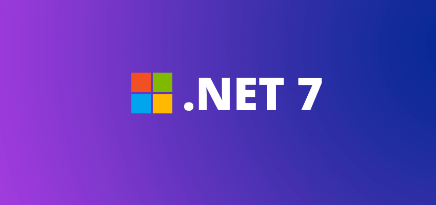
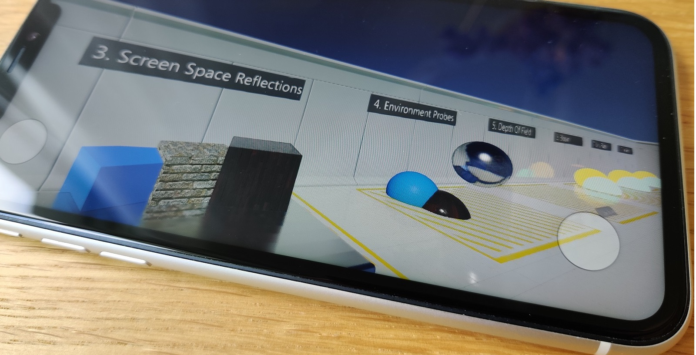
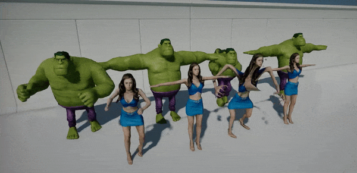

# Flax 1.6 release notes

## Highlights

### .NET 7

We did it! Flax C# scripting runs now with the latest .NET 7 runtime and includes all the new and shiny features, such as:
* Better performance (new GC, new JIT, optimized stdlib)
* Latest C# 11 support
* Ability to use mixed native/managed debugger in VS 2022
* New Editor's code hot-reload via `AssemblyLoadContext` (safer than our [custom solution](https://github.com/FlaxEngine/mono))
* Seamless support for newer .Net versions in the future (eg. .NET 8/9)
* Smaller build size (due to new stdlibs stripping)

Now, Flax Editor requires [.NET SDK 7](https://dotnet.microsoft.com/en-us/download/dotnet/7.0) to be installed on a system - both Editor and Launcher detect it and will guide new users to install it (if not already). See `Migration Guide` section below to learn more about how this affects your game projects.

### PhysX 5

Physics simulation engine was updated to the PhysX 5.1 (from 4.1) which includes exceptional stability and performance improvements as well as new GPU simulation features (that we plan on using in the future). We will add cloth and destruction support to the engine in upcoming months as in-built features to use in Flax games.

### iOS Support

With iOS platform finally arriving in Flax we're proud to announce that **Flax is truly a multi-platform engine**. We support and maintain all common gaming platforms including desktop, consoles, and mobile.

Flax uses `Vulkan` via `MoltenVK` to render high-quality 3D graphics on iOS, together with full support for  C++, C#, Visual Scripting, stereo audio, multi-touch input, high-dpi UI, single-click deployment, and much more.

We've updated all Flax Samples projects to support touch display input and run smoothly on iPhone/iPad devices. To learn more see the official documentation about [iOS platform](../../platforms/ios.md).

### macOS arm64 Support

Flax 1.6 now works on arm64 Apple devices including macOS. M1/M2 chips offer stunning performance and thus Flax Editor and Flax Games have great stability.

### Animation Retargeting

Animation Retargeting is a feature that allows **playing the same animation on different skeletons**. This can be useful when developing larger games where animations sharing helps reduce both development time and game build size. This update adds new tools for skeletons retargeting inside Editor. Also, Engine does a better job at reusing animations between skinned models. See [docs](../../animation/animation/retargeting.md) to learn more.

| Before | After |
|--------|--------|
|  |  |

### Any State in Anim Graph

**Any** state is a special node that can define transitions to states that will be always checked during state machine updates. It can improve the workflow when creating more complex character animations (for example character `Death` state that can be triggered from all states).

Additionally, State Machine transitions can define Interruption options to support **transition rule rechecking** or **instant transitions**.

### Audio improvements

Every Flax update brings new features and fixes into all engine areas. This time audio system got multiple quality improvements for better spatial sound playback and new [HRTF](https://en.wikipedia.org/wiki/Head-related_transfer_function) audio. Audio sources can now control `Pan`, `Doppler Factor`, and `Spatialization`. We've fixed the minimum audio attenuation distance and added debug sphere to visualize it in Editor.

### Network Replication Hierarchy

`NetworkReplicationHierarchy` is a new feature that allows the game to configure objects replication mechanism. It's an optional extension to `NetworkReplicator` accessible via `Hierarchy` property and can be set by game to a custom nodes hierarchy. It's used to store objects for replication in a more optimized structure (eg. grid or hierarchical tree) and it can be used to control the replication rate and target clients for each object individually.

For example, when a large game level contains 10k networked objects (eg. POIs) then replicating all of them to all connected clients would kill the performance. To solve this problem a simple replication hierarchy can be created that would control Replication FPS for each object and skip unnecessary replications for clients that are too far away. See [docs](../../networking/high-level.md) to learn more.

Additionally, we've put lots of efforts into the networking system as we see many game projects in-developments that use it. Network RPCs codegen is more reliable and supports more features.

## Migration Guide

### From Mono to .NET 7

C# scripting runtime and tools have been updated to use the latest .NET 7 SDK on all platforms (both desktop, mobile, and consoles). It brings massive performance and stability benefits but might require some users to update their code and tools. Notable changes:
* Flax Editor doesn't contain C# runtime nor C# compiler anymore but depends on system-installed .NET SDK
* Desktop platforms (Windows, macOS, Linux) use CoreCLR runtime with new JIT and new GC
* Mobile and Consoles use new [mono](https://github.com/dotnet/runtime/tree/main/src/mono) with Mono AOT (only Android uses Mono with JIT) but with the latest class library (feature compatible with CoreCLR)
* Visual Studio 2019 (and older) are unsupported by .NET 7 SDK (still can be used for programming but with less tooling)
* [Flax.VS](https://marketplace.visualstudio.com/items?itemName=Flax.FlaxVS) extension is not required anymore for C# debugging in Visual Studio - VS 2022 has inbuilt .NET 7 debugger
* Android platform requires Android .NET Workload installation via `dotnet workload install android`
* Old Mono runtime hosting code is still available in Flax codebase but is disabled and will be removed in future
* If you're using `Regex` in your code then add `options.ScriptingAPI.SystemReferences.Add("System.Text.RegularExpressions");` to `Game.Build.cs` to properly reference System Library (not used by default now)

We've updated docs, code examples, and all official plugins to reflect those changes.

### Vehicles drive direction

Vehicles has been updated to use `Z` axis as forward instead of `X` which matches the engine [coordinates system](../../get-started/scenes/world-units.md) now. Engine will automatically rotate old vehicles around the origin to match the current layout (when loading old scene or prefabs). However, please update any cars objects and driving scripts to properly work after the version upgrade.

## Changelog

### Version 1.6.6344 - 8 July 2023

Contributors: mafiesto4, GoaLitiuM, envision3d, Tryibion, Withaust, PrecisionRender, stefnotch, RuanLucasGD, Menotdan, Swiggies, MinhCT, PhyresiCompany, HydrogenC

PRs merged: 148

* Add **.NET 7** support with **C# 11** and the latest DotNet Runtime (new JIT and GC)
* Add `Platform.BuildTargetArchitecture` to build tool
* Add support for **mixed scripts debugging in Visual Studio (both C++ and .Net Core)**
* Add logging native exception stack trace on Windows when debugger is attached before going back to the crash location
* Add unit test to verify `LibraryImport` attributes usage for proper bindings
* Add **PhysX 5**
* Add **Physics Statistics and profiler**
* Add `FileSystem::GetDirectorySize`
* Add option *Skip .NET Runtime Packaging* to skip backing C# class library with cooked game (to use system-installed if possible)
* Add printing output C# files size in game cooker
* Add C# class library optimization for normal game builds (without AOT)
* Add multi-threading to AOT compilation (3x faster builds for Consoles and iOS)
* Add support for handling network events immediately in `NetworkLagDriver` when Lag is set to zero
* Add **Any State to Anim Graph state machines**
* Add **Interruption options** to State Machine transition
* Add skeleton node or bone copy context menu in Editor
* Add debug drawing selected skeleton node in Skinned Model window viewport
* Add skeleton nodes names debug drawing in Editor preview when enabled
* Add **skeleton retargeting** to play animations on different skeletons
* Add scale parameter to `DebugDraw` text drawing to rescale text without reducing font size
* Add support for importing skeleton-only as Skinned Model (eg. from animation file to have skeleton for retargeting)
* Add support for **macOS arm64 (M1/M2 chips)**
* Add logging missing asset type on failed load
* Add `Output/` folder to *.gitignore*
* Add `TaskGraphSystem.RemoveDependency` and automatically cleanup dependencies on system destroy
* Add better looking Anim Graph state machines nodes
* Add support for using `INetworkSerializable` on custom structure in C++ for networking
* Add support for spawning multiple objects over network within a single group that is not from Prefabs
* Add **Network Replication Hierarchy** for robust control over replication in multiplayer games
* Add network error log for missing network object when accessing ownership
* Add CPU profiler events to various networking functions
* Add network replication hierarchy system to Arizona Framework with settings and scripting features
* Add `NetworkReplicator::HasObject`
* Add network debugging panel to actors and scripts
* Add `INetworkObject::OnNetworkSync`
* Add default empty implementations to `INetworkObject` for easier usage in game scripting
* Add `SoftTypeReference<T>` to scripting API for lazy-load type references (via typename)
* Add **input action phases**
* Add `Camera.UnprojectPoint` method
* Add play, pause, and stop functions to the Particle Effect
* Add better tooltips for assets in Content window
* Add better organization to the style groups of UI controls
* Add better UI for linking scale values in a transform more intuitive
* Add **Pivot Relative UI Sizing to controls**
* Add support for editing dictionary keys that are structures
* Add asset reload option via context menu in Editor
* Add search actors by parent tag (`Level.FindActorsByParentTag`)
* Add `FindActor` by type and name (to actor and level)
* Add `CustomArgs` to compile and link environment in build tool for customization
* Add preferring high-performance discrete GPUs when enumerating adapters
* Add `Utilities::HertzToText` via new `Utilities::UnitsToText`
* Add `LineCast` and `LineCastAll` to physics scripting
* Add default new script name to `MyScript` and avoid naming it as `Script` to make it easier for use
* Add `Platform::GetMousePosition`/`WindowsPlatform::SetMousePosition` for unified access to screen-space mouse position on all platforms
* Add **eyedropper color picker** for Editor on Windows and Linux
* Add better usability when duplicating points of a spline
* Add various `Input` class delegates to the C#/Visual scripting API
* Add automated test for loading nested prefab with different root actor
* Add bitmap data slot of Font glyphs in `FontTextureAtlas`
* Add `Span<T>` support for scripting fields
* Add `Span<T>` to C++ debugger natvis file
* Add **HRTF Audio** support (via `OpenAL` backend)
* Add updating the main menu shortcut keys on editor options save
* Add *Copy Euler* angles to Quaternion editor context menu
* Add logging `PixelFormat` as string instead of integer value for better readability
* Add `ClampLength` functions to C++ `Vector3`
* Add *InputBindings* modifiable from plugin (in Editor public API)
* Add word wrapping on capital letters and underscores for better text rendering
* Add various changes to scroll bar to make it feel better
* Add de-selecting items in content view by clicking empty space in Editor
* Add the play icon to a stop icon and vice versa when clicked for the Profiler
* Add `Create collision data` action to be performed for each model selected in the Content Window
* Add improvements for Visject context menu interface in Editor
* Add ability to change the fps of the not focused editor window
* Add setting new material instance name to parent material name
* Add `EnumAddFlags` for easy flags appending
* Add `NetworkReplicator::EnableLog` to optionally enable verbose logging of networking
* Add `NetworkStream::SenderId` to detect message sender during object replication or RPC code
* Add `NetworkManager::GetClient` by `uint32 clientId`
* Add `NetworkRpcParams` for sending RPC to specific set of clients or to read sender id
* Add array property replication code-gen for C# networking
* Add networking replication codegen for C# array properties with object references or custom structures
* Add **LateFixedUpdate event for scripts**
* Add support for decimal values in `Font` sizes
* Add proper POD types check in C# network replication codegen
* Add support for C# array as network RPC method parameter
* Add objects ID inverse mapping from client to server for proper C# networking codegen
* Add optional replication for network object (if Rep FPS is negative)
* Add support for changing C# nullable references context build option
* Add Content importers and exporters for scripting API
* Add more usability to model/material previews in Editor
* Add option to search only active actor with `Tag`
* Add output binaries folder cleanp to build clear command
* Add support for writing UTF-8 files in `FileBase::WriteAllText`
* Add ability to unset type reference with `null` item
* Add `SpanContains` utility to C++ scripting
* Add `ReallocAligned` utility
* Add support for line-breaks in `API_INJECT_CODE` macro
* Add `eol=lf` to gitattribute
* Add removing old hot-reload files in project references on Editor startup
* Add better visuals of dragging a tree node
* Add `Unload all but this scene` to Editor scene tree context menu
* Add using parent actor's name as initial prefab name in Editor
* Add `MoveTowards` functions to C++ Math
* Add `Tags::GetSubTags` to scripting api
* Add `ViewportIconsRenderer::AddActorWithTexture` for custom actor icon per-actor
* Add inputs to Random Range nodes in particle emitter surface
* Add `==` operator for Actors and Scripts to properly perform comparison in C# scripts
* Add `AudioDataInfo.Length`
* Add audio clip preview refresh on asset reimport in Editor
* Add current playback position preview with seeking functionality to Audio Clip window in Editor
* Add OpenAL `AL_SOFT_source_spatialize` extension support for stereo spatial audio playback
* Add `AllowSpatialization` option to Audio Source
* Add `DopplerFactor` to Audio Source
* Add `Pan` to Audio Source for stereo panning
* Add editor playback utilities for Audio Source and Scene Animation Player
* Add saving and re-opening all active scenes between editor sessions
* Add ensuring prefab actors static flags match parent flags or keeps it's own
* Add logging .NET runtime version to build tool
* Add ignoring logging missing env var on Windows
* Add engine version defines for build scripts (eg. `FLAX_1_6_OR_NEWER`)
* Add automated test for strings formatting and localization
* Add content proxy modifications function and workspace rebuilding for custom asset types extensions
* Add build tool and game cooker caches clearing when opening project with different Editor version
* Add GC to run periodically in order to reduce stuttering
* Add `launchSettings.json` generation for Visual Studio 2022 with .NET 7
* Add better Texture initialization API with custom data
* Add better Visual Studio solution generation with nested C# project cross-references to properly place projects in group folders
* Improve Root Motion extraction and playback
* Improve automatic slider speed for float value fields in Editor
* Optimize `Flax.Build` performance to have even faster builds
* Optimize bindings code generation via String Builder pooling
* Optimize text formatting in various places
* Optimzie `Newtonsoft.Json` lib by removing Xml, Schema support and making it AOT-friendly for AOT game builds
* Optimize out `System.ComponentModel.TypeConverter` assembly usage to reduce cooked game builds
* Optimize profiler window assets and GPU resources sorting when the view is active only
* Optimize network replication when no client can receive object
* Optimize interface method lookup to eliminate `strlen` calls
* Optimize vectors normalization
* Optimize UI performance when destroying complex UI structures
* Optimize `Utils.InitStructure` usage in generated bindings code if structure can be zero-inited
* Optimize `CollisionsHelper::FrustumContainsBox`
* Optimize out debug symbols generation for C# stdlib in Mono AOT builds
* Update *Newtonsoft.Json* to `13.0.2`
* Update *Nintendo SDK* support to `16.1`
* Update OpenAL version to `1.23.1`
* Update dependant DotNet libraries to `dotnet7`
* Update deprecated `WebClient` into `HttpClient` in `Flax.Build` files download utility
* Update `fmt` llibrary to version `9.1` (Aug 27, 2022)
* Update Editor analytics from deprecated `Universal Analytics` to the latest `GA4`
* Update Tracy to the version `0.9`
* Update Flax `.gitignore` to skip generated code module header files
* **Changed Flax Docs license** to `CC-BY-4.0 license`
* Remove mono debugger from VS Code extensions list
* Remove shadows casting and sdf data from editor camera model
* Remove unused `Function::TryCall`
* Remove extra sleep when Editor is not focused
* Remove `EnableAdaptiveForce` from Physics settings (deprecated functionality in PhysX)
* Rename networking codegen initializer to `NetworkingPlugin` for C# netcode
* Refactor vehicles to use `Z` axis as forward instead of `X`
* Refactor platform process startup with `CreateProcessSettings`
* Refactor Editor Windows layout serialization of splitter values to prevent invalid state when loading windows
* Refactor Skeleton Mapping to be handled by Skinned Model instead of Animation asset
* Refactor `StringUtils` to simplify code
* Refactor various Editor APIs to use auto-generated bindings instead of manual code
* Refactor widowing on macOS to support screen scale and HighDpi mode
* Refactor `RootMotionData` into `Transform` to simplify code
* Refactor `Level` class to unload scenes in reversed order
* Refactor **3d audio with better spatial sound quality**
* Refactor Network RPC C# codegen to share code with data serializer
* Fix Anim Graph state machine rule graph opening after transition removal undo
* Fix actors spawning in prefab editor
* Fix bug in `StringUtils::PathRemoveRelativeParts` when going up to the Windows drive with relative path bits
* Fix deprecation compile warning in `NetworkConfig` on Clang
* Fix API code injection lines to be excluded from includes cache
* Fix warning on `Asset::WaitForLoaded` when loading failed before
* Fix AnimatedModel bounds calculations
* Fix bug with path name preventing the item to be renamed when duplicated
* Fix content window auto scrolling regression
* Fix debug draw lines to not use fake-lighting like debug draw surfaces
* Fix `Array For Each` visual script node local vars setup
* Fix OpenAL spatial audio bugs with left/right and front/back being reversed
* Fix error when using nested Visject Surface context during State Machines editing in Anim Graph
* Fix Json asset cooking to properly serialize whole asset data even if modified at runtime
* Fix collision data cooking from model asset by favoring CPU data fetching
* Fix missing Generic Json Proxy not showing up in the content context menu
* Fix codegen for C# networking when using custom structures for replication and RPCs
* Fix mouse cursor restoring from hidden state on macOS
* Fix window focus notification handling on macOS
* Fix dylib rpath id on macOS
* Fix visuals of `Blend with Mask` node in Anim Graph
* Fix visuals of the spline tangent points in Editor
* Fix Visual Studio Code jump to line argument
* Fix scene asset runtime contents when saving scene file in Editor
* Fix C# serialization of scene objects when property throws and exception
* Fix C# math sign function for value `0`
* Fix C# `Math.Remap` method as obsolete (use `Math.Map  instead)
* Fix C++ API for Vector2/3 Normalization to be the same as in C# API
* Fix `ViewportIconsRenderer` usage in game C++ scripts
* Fix `TextureMipData::GetPixels` to properly copy pixels of the same format
* Fix memory leak when exporting `png` texture via `stb`
* Fix issues when drag and dropiing actor tree in Editor
* Fix `LayersMatrixEditor` with many layers in use
* Fix right-click menu deletion to take selection into account in Content Window
* Fix content view items refresh (eg. after delete) when using search field
* Fix Visual Studio project names collision when using both C++ and C# scripting
* Fix C# serialization of reference to self (eg. script sub-object referencing owning script)
* Fix sluggish Editor Viewport camera movement with high DPI
* Fix `GridGizmo` to render before transparency in Editor viewport
* Fix invalid ability to rename Source/Content folders on content editor
* Fix custom editor window restore after hot-reload
* Fix incorrect space conversion results in `AnimatedModel.SetCurrentPose`
* Fix vehicle wheel debug orientation
* Fix missing collision events generated during `CharacterController::Move`
* Fix compile-time error in `HashSet::ClearDelete`
* Fix codegen for C++ RPS with Array param
* Fix garbage `DefaultScene` value in new project
* Fix Intellisense errors with referenced binary module structures
* Fix invoking Client RPC on Host client when it's not included in `targetIds` list
* Fix `StringUtils::ConvertANSI2UTF16` to properly handle multi-byte characters length
* Fix bug when using material instance of material that uses `GlobalSDF`
* Fix bug of the collection size changing while sliding the size number in Editor
* Fix bug with not deleting all children on folder delete
* Fix bug with automatic collision assets creation in non-asset folders
* Fix missing initial audio source volume setup for XAudio2
* Fix network RPC object id mapping back to server id when sent from client
* Fix `NetworkTransform` invalid fields sync copy-paste typos
* Fix creating localization table on blank project
* Fix bindings generation for in-built `Char` type used in `Array`
* Fix model screen size calculation in orthographic view projections
* Fix CPU profiler events extraction when buffer is full
* Fix bindings code instance object param `obj` to `__obj` to prevent name collisions
* Fix existing nested prefabs sync applying when updating base prefab changes
* Fix spawning nested prefab with different root actor
* Fix accessing object ownership info locally before object gets fully spawned
* Fix character controller up direction limit between `(-1, 1)`
* Fix typo in atmosphere precompute shader
* Fix scale link to use ratio when editing transform
* Fix hierarchical network ownership propagation to sub-objects
* Fix `NetworkManager::ClientConnected` dispatch after network state is changed to online for local client
* Fix `UIControl` linkage to Prefab window when creating UI within prefab Editor
* Fix UI Control selection highlights when using Canvas Scaler
* Fix 3D UI Canvas point conversion from parent control space to local space
* Fix syncing Custom Editor value when using it to edit value-type
* Fix spawning nested prefab with different root actor
* Fix prefab diff context menu in Editor to properly diff against arrays
* Fix prefab data build number when loading objects from prefab
* Fix Scale Transform Gizmo issue when enabling Scale Snap
* Fix looping animation in Anim Graph when using start position offset
* Fix creating C# scripts in Editor with private `ctor` method
* Fix textbox submit when it's nav focused
* Fix file lock when loading asset fails
* Fix error when unloading Visual Script item in Editor
* Fix using proper default value in scripting bindings for `IntPtr` value type
* Fix prefab files copying using `Ctrl+C`/`Ctrl+V` in editor content
* Fix RPC invoking on object with different ID but matching parent and type
* Fix `BitArray::Set` to not be `const`
* Fix output log text ranges to handle line ending
* Fix crash due to internal errors when drawing asset thumbnails in Editor
* Fix crash on engine exit when asset fails to load due to serialized version mismatch
* Fix crash when substring of `String` is assigned to itself
* Fix crash when importing model with a LOG Generation but a single LOD specified only
* Fix crash when sampling animation in Anim Graph that uses it's length to calculate start position
* Fix crash when C# type has missing empty `ctor` or it throws an exception
* Fix crash in GPU devices init when system has no valid GPU driver installed
* Fix crash when loading scene with script which type is not a scene object
* Fix crash on end play when one of the actors has been manually disabled
* Fix crash when reimporting audio clip while it's being played
* Fix crash when updating GPU texture residency to `0`
* Fix crash when using multiple audio clips streaming with XAudio2 backend
* Fix crash when starting drag&drop with invalid control state (detached from window)
* Fix crash during hot-reload when using custom assets from game code
* Fix crash due to invalid RPC codegen for enum value type variable
* Fix crash on hot-reload when using custom assets
* Fix crash when modifying animated model skeleton pose from gameplay code during update event
* Fix crash due to replicated objects leak upon system destruction
* Fix crash when window gets deleted before show/close sequence
