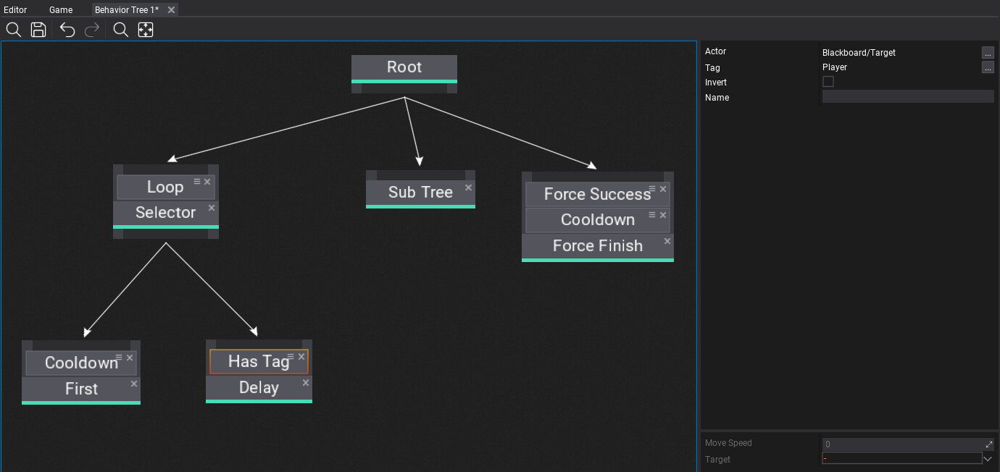
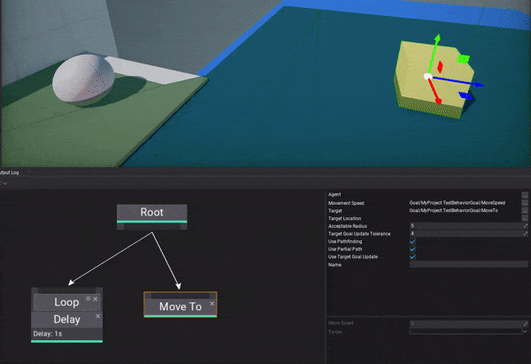
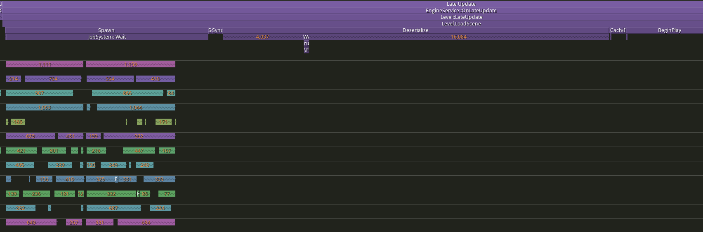
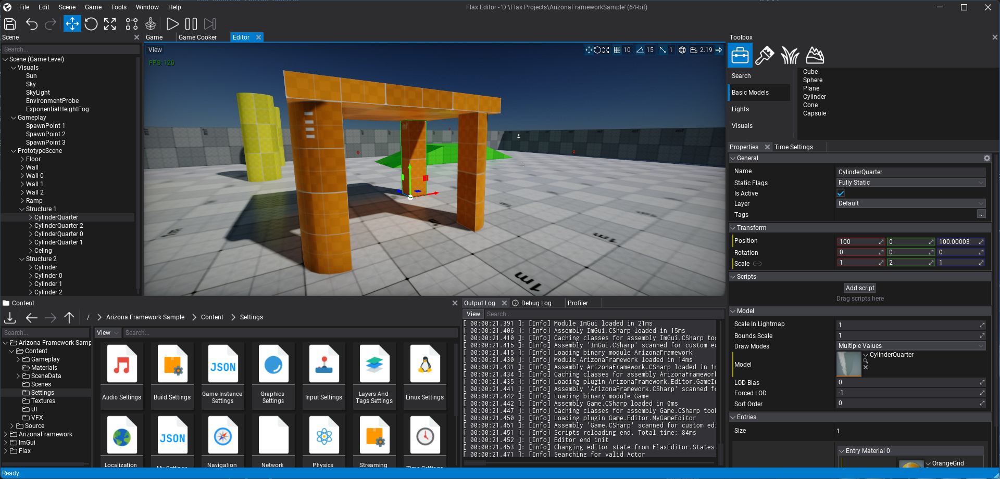
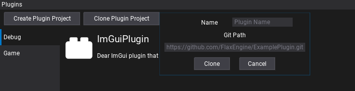
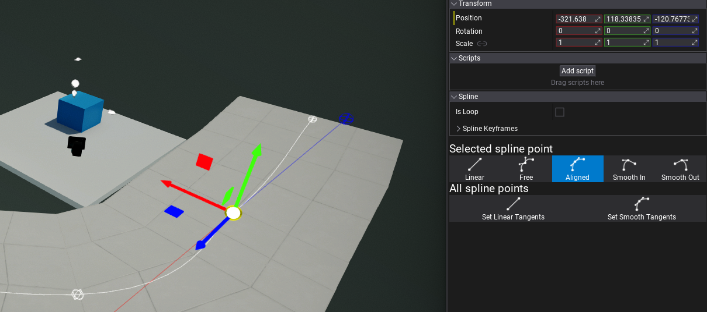
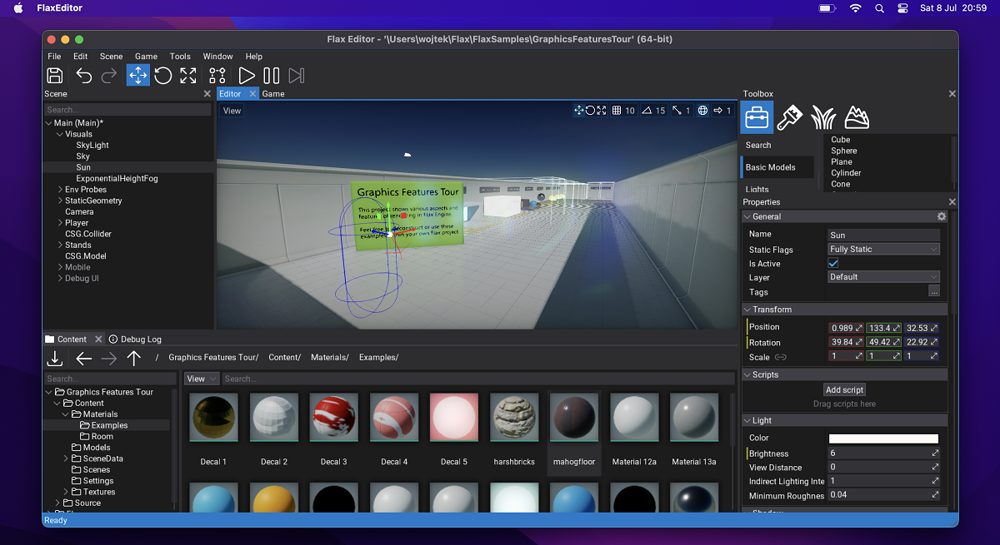

# Flax 1.7 release notes

## Highlights

### Better Licensing

Flax Engine End-User License Agreement (**EULA**) has been updated to be less strict in certain areas. We believe that the current revenue-share-based model acts well and is a fair price for the engine with the tools we provide (4% of gross revenue above $250,000 per calendar quarter). However, we wanted to **loosen licensing terms in favor of our users**. The following changes were made:

* *Removed ability to revoke or terminate the license.*

Section `Term and Termination` has been removed. We won't be able to cancel the license from anyone.

* *Added limitation on a maximum of one license modification per calendar quarter.*

Section `Amendments to this Agreement` has been updated to limit possible EULA modifications to once per calendar quarter (as opposed to an unlimited amount of amendments before). For the past 3 years, we've updated EULA only twice: both times in favor of our users. We're committed to stable licensing terms that bring more trust to our clients.

* *Added ability to keep using previous EULA version when it's amended.*

Section `Amendments to this Agreement` has been updated to allow users to continue using the previous EULA version without a need to accept the new one as long as you keep using engine and tools version from before the license update. For example, if you start developing a game with Flax 1.7 using the current EULA and the license gets modified during your project development (eg. within the next 2 years) then optionally you can stay on the latest Flax version prior to the license update and skip acceptation of the new licensing terms. This means the license is not retroactive to the engine versions. We believe this change will allow developers to easily plan longer game productions without fear of license changes that could affect business costs.

* *Added detailed explanation on advance payments.*

Section `Royalty` defines which revenue is accountable for 4% revenue share. It includes revenue from advance payments for the game such as payments from a game publisher. Royalties that you pay on advance payment of revenue for a game that is recoupable by the payer, such as a publisher, may be credited against future royalty payments that you incur under EULA for that game. This means, for example, if the publisher pays you $1,000,000 in advance payments (directly into game development), the royalty to Flax would be $30,000 (4% of the value above the first $250,000 per calendar quarter). Later, once the game generates revenue this advance payment is recoupable from the future royalties. For instance, if this game earns $1,500,000, the royalty would be $20,000 instead of $50,000 due to recouped advance payment.

### Regular Engine Updates

We've updated our [Release Policy](../../contributing/release-policy.md) to deliver more frequent engine updates in-between major releases. For the past years, Flax updates (eg. `1.4`, `1.5`) happened every ~4 months and we will continue to do so. In addition to that, we will **support the latest *stable version* with monthly patch updates** (eg. `1.7.1`, `1.7.2`). Until now we released only critical bug fixes and security updates which left large gaps in the engine roadmap timeline where most of devs used daily `master` builds that are not guaranteed to be stable.

Currently, **Flax grows quicker every day**, we have more users and contributors than ever. Because of that, we want to keep the agile nature of the project. Finally, we've set up [milestones plan](https://github.com/FlaxEngine/FlaxEngine/milestones) for long-term planning. This helps to structure daily operations and keep track of which issues will be resolved and when.

### Cloth

For this release, we added **physical Cloth simulation** with tooling. New *Cloth* actor uses vertices of the mesh as cloth particles and simulates them with physical properties, forces, constraints, and collisions. Under the hood we use `NvCloth` library and run simulation in async via Job System which results in great performance even with multiple clothes being actively simulated.

Flax Editor contains in-built cloth painting tools with per-vertex paint brush. We've added sample cloths to Physics Features Tour project in [Flax Samples](https://github.com/FlaxEngine/FlaxSamples). To learn more about clothing tools see [this documentation](../../physics/cloth.md).

### Behavior Trees

Another big feature in this release is a system of Behavior Trees used for gameplay programming. **Behavior trees** are a popular AI technique used in many computer games to design and simulate intelligent characters, agents, or objects. A behavior tree is a combination of many different AI techniques: hierarchical state machines, planning, scheduling, and action execution. The key advantage of behavior trees is that they are quite easy to understand and can be created with visual editing tools rather than code-only.

Behavior Trees were designed to be very extendable by both game and plugins. You can create custom node types and wrap any data into the [Behavior Knowledge](../../scripting/ai/behavior-trees/knowledge.md) via Blackboard or Goals (our unique concept of behavior data). Finally, Editor contains Behavior Trees editor with live debugging utilities.

To learn more see [this documentation](../../scripting/ai/behavior-trees/index.md).

### Performance Improvements

We've always been committed to great performance. This time we've focused on large-scale projects (eg. scenes with 40k objects) and polishing our custom .NET bindings code that links C# and C++ runtimes together. Physics simulation with thousands of active bodies is more stable with new physics collision events reporting and new delegate events table storage.

We've started refactoring scenes loading to run as much as possible in async via Job System. Now, in `1.7` actors and scripts are created via Job System (as shown in the picture above) which results in large performance benefits in large worlds or levels using many prefabs. For the next update (`1.8`), we plan to continue this and implement async scene objects deserialization via Job System. This will further improve performance.

### Editor Improvements

Every update brings many large features but also tons of smaller things that matter to the Editor. Here is a list of notable ones:
* New plugin project creation tool in Editor (*Plugins Window*, see picture below),
* Plugin adding utility via `git clone` (eg. adding plugin from *Github*, see picture below),
* Content browser improvements - new look, more features for sorting and items displaying,
* New Spline editing tools,
* Network profiler with object replication and RPCs stats,
* Missing script utility to quickly re-add missing scripts in Editor (eg. after renaming class),
* Automatic game settings apply when saving json file in Editor.

### Improved Editor for macOS

Flax userbase on macOS is growing fast!  In order to smooth the usability on that platform we've fixed many bugs related to .NET SDK detection, input, dockable windows usage, and much more. Starting from now **we will provide code signed Flax Editor for macOS arm64** (`.dmg` binary). It will include an engine built for macOS and iOS to easily cook games for those platforms.

We've added file watcher support to handle the hot-reloading of scripts and shaders. The graphics backend will handle proper MoltenVK runtime with the latest Vulkan SDK.

### Onboarding Experience Improvements

Due to the recent rapid growth of Flax users we've worked on improving the onboarding experience. This includes:
* Improvements to .NET SDK installation detection in Editor,
* Improvements to Visual Studio, VS Code and Rider code editors integration,
* Fix stability of Launcher downloading daily `master` builds from Github Actions,
* Release of official Editor for macOS package,
* Lots of bugfixing.

## Migration Guide

### Scripting Changes

* Scripts `OnDestroy` method is now called after `OnDisable` but before Actor's children `EndPlay` to properly handle script lifetime logic in game code.
* Scene objects (actors and scripts) are now created in async via the Job System when loading the scene:
  * This applies to objects spawning only - constructors will run in async,
  * All script/method methods like `OnEnable`/`BeginPlay` are still called in sync on a main thread,
  * Large levels loading time has been decreased significantly,
  * Soon object deserialization will run in async too to further improve performance.

### Refactoring

* C++ `Delegate` has been refactored to use `HashSet` and `CriticalSection` instead of function table with atomics:
  * All events are now unique (cannot bind the same function twice),
  * Events order is undefined,
  * Performance in large projects has been improved significantly,
  * Can be disabled in custom engine via `DELEGATE_USE_ATOMIC 1` in `Delegate.h`.
*  C++ `ArrayExtensions` has been refactored to use Flax `Function` instead of `std::function`.
* Renamed `GPUPipelineState::Description::PrimitiveTopologyType` to `PrimitiveTopology`.
* Refactor Editor splash screen quotes to be less offensive.
   * *Say goodbye to some nasty/inappropriate jokes - as Flax matures and has to well behave.*

### Other

* `Release` builds won't use assertions by default to improve the performance of the engine at the cost of undefined behavior (UB) - C++ `CHECK` macro will still be active.
* Remove unused `TIsArithmetic` templates.
* CPU and GPU profiler events are disabled by default and only enabled when using the profiler in Editor.
  * Use `ProfilerGPU.Enabled = true` to get GPU frame time from game code at runtime.

## Changelog

### Version 1.7.6404.1 - 25 November 2023

Contributors: mafiesto4, Tryibion, GoaLitiuM, mrunion, MineBill, RuanLucasGD, Tryibion, Chikinsupu, NoriteSC, Menotdan, SinnersSum, Radiangames, schmidt-florian, HydrogenC, nothingTVatYT

PRs merged: 43

* Add SetThreadAffinityMask and SetThreadPriority and thread name for Apple platforms
* Add storing shader asset includes paths in compact format for portability
* Add unit test for `HashSet` and `Dictionary` collection types
* Add debug drawing contact offset for selected collider
* Add **custom model picker in material preview**
* Add `CustomScenes` feature to draw a fixed set of scenes within `SceneRenderTask`
* Add minor improvements to reference properties
* Add more alternative titles to Surface nodes
* Add order and ordering options to comments in Surface graph
* Add `SortScore` to Visject node archetypes and use it to favor method overrides in Visual Script
* Add **Convert to Parameter** for Surface constant nodes
* Add support for unlimited window size if `MaximumSize` is set to zero
* Add spawning UI Canvas Scaler when adding new UI Canvas
* Add handling `ViewLayersMask` from camera when rendering UI Canvas
* Add copying old UI Control data to new UI Control when changing type
* Add option to limit number of items in Dropdown popup
* Add optional scrollbar to Dropdown popup list
* Add immediate game viewport sync after aspect ratio change in Editor
* Add new **light theme to Editor UI**
* Add better formatting for automatic tooltips in Editor from xml comments
* Add input bindings for game window mouse unlock and toggle fullscreen
* Add button to reload scenes via Editor menu
* Add short delay before auto-selecting editor tab on drag over header
* Add rebuilding navigation mesh after apply changes in Navigation asset
* Add dragging items support into lists and arrays in the Properties window
* Add `CalculateBoneOffsetMatrices` option to fix some animated model skeletons rendering
* Add `GetRotationFromTo` and `FindBetween` utilities to C# `Quaternion` API
* Add `GetSplineSegmentLength` to get spline segment length
* Add new material nodes: `Rectangle Mask`, `FWidth`, and `AA Step`
* Add default value for material `Sphere Mask` node to create blob gradient around UV center
* Add `SetNodeTransform` to Animated Model
* Add waking up rigidbodies when changing kinematic state
* Add name to Android main thread
* Add limits to cloth brush values
* Add support for including global configs in engine configuration options
* Add .NET SDK version `7` as forced to be used during game cooking (dotnet8 can be sued with Editor)
* Add clearing BT memory in non-release builds to make issues spotting easier
* Add better errors logging to BT nodes in case of issues
* Add soft check for null managed object value for unboxing
* Add `Style` property getter to `FontAsset` to access its style flags
* Add engine version in Editor main window title
* Add security lockers for managed typeinfo access
* Add git submodule init to git project cloning
* Add support for getter-only properties in blackboard selector access
* Add automatic show of skeleton when entering skeleton tab in skinned model editor 
* Add extended buttons support for Linux
* Add `XDG_DATA_HOME` env var usage the approved default as per specification on Linux
* Add `GetStackFrames` and `IsDebuggerPresent` on Linux
* Add `GetStackFrames` on Android
* Add decoding stack trace function names on Apple platforms
* Add always logging unhandled C# exception
* Add better support for .NET SDK and .NET 8
* Add `-dotnet=ver` command arg to `Flax.Build` to specify .NET SDK version to use for build
* Add better project files generation for Rider
* Optimize `Control.UpdateTransform` for faster UI math
* Improve Cloth usage
* Use soft asset ref to graphics settings
* Update Tracy Profiler to `0.10`
* Continue `Delegate` refactor to use single memory allocation and atomic operations for data access
* Remove `SHADOW_MAPS_FORMAT` and support fallback formats for shadow maps
* Remove actor layer auto apply via message box dialog during Play Mode
* Remove unsupported material parameter types `Quaternion` and `Transform`
* Reduce `LargeWorlds::ChunkSize` to `8192`
* Refactor `GPUResourceProperty` to cleanup code
* Refactor main editor viewport and prefab viewport to share dragging handling code
* Refactor default `ContactOffset` for `Collider` to be `2` (keep `10` for `CharacterController`)
* Refactor `HashSet` and `Dictionary` collections capacity to handle rehashing when too many elements were deleted
* Fix `DeepClone()` when used on object of different runtime type
* Fix CultureInfo to handle missing country code and fallback to outer language code
* Fix various typos and wording in docs
* Fix incorrect tabs selection handling when tab gets removed
* Fix various cases of closing window tabs when using Dock Windows in Editor
* Fix color picker dialog not staying inside the current screen
* Fix custom editor layout rebuilding when it has more editors in use
* Fix error during new json asset creation via `ContentContextMenu` if the class is missing empty constructor
* Fix various cases of closing window tabs when using Dock Windows in Editor
* Fix Output Log window to scroll log on startup properly
* Fix `CollectionEditor` to properly support editing multiple arrays
* Fix Dropdown popup to properly scale when using Canvas Scaler
* Fix common Editor tooltips with hardcoded keybindings
* Fix color editing control to properly handle mouse event
* Fix anim slot from playing animations more than 1 time based on speed
* Fix `NetworkTransform` to properly reject local simulation deltas on incoming authoritative transform data
* Fix BehaviorTree node UI after adding decorator that was already there
* Fix `BitArray::SetAll()` when the item is not multiple of `8`
* Fix some Center geometry import issues and add option to be able to shift mesh to local origin
* Fix generic types including to be recursive in C++ bindings codegen
* Fix content storage usage with relative paths
* Fix issue involving stale scripting assemblies in `FlaxEngine.Json` dynamic type resolution
* Fix incorrect directional light shadows influence on secondary render views
* Fix incorrect spline length calculation if first point is not at spline origin
* Fix missing interfaces support in `Actor::FindScript`
* Fix missing initialization of scene objects added from prefab
* Fix marking scene as dirty when creating prefab from existing actor
* Fix unpacking `Float3` and other inbuilt `Variant` types via Unpack node in Visual Script
* Fix issue with asset loading to be properly canceled when reimporting file
* Fix loading delay-loaded-dll on Windows when using project plugin with native dependencies
* Fix bug when spawning new prefab objects during scene load due to regression in async scene init
* Fix memory leak while doing drag&drop with Debug Draw in use
* Fix Visual Script parameter setter node to accept multiple input flows
* Fix scenes reload feature to check if can do it, properly use async in play mode and ask for save if scene is modified
* Fix missing script replacement if data has object id that doesn't match current parent
* Fix Mono GC threads suspend to not deadlock when attaching native threads to managed runtime
* Fix Steam AppId if settings asset is missing and force keep it in sync with `steam_appid.txt` file (Steam Online Platform)
* Fix PostFx settings in Graphics Settings to be only used when checked as override
* Fix BT logic flow when start/stopping behavior
* Fix deadlock regression when saving Visual Script in Editor with active instance objects
* Fix deadlock in editor when using snap to the group with actor that has empty bounds
* Fix `Win32CriticalSection` to use spin count of `4000` instead of just `100`
* Fix crashes in various dictionary usages caused by duplicated keys
* Fix crash when creating empty cloth
* Fix crash when trying to build navmesh with null scene
* Fix crash on negative collection capacity due to `int32` maximum value limit
* Fix crash when not clearing Online Platform in Editor before hot-reload
* Fix crash when rigidbody gets deleted during physical collision
* Fix crash on editor startup without code editor selected
* Fix crash on hot-reload in Editor due to leftover scripting events in `ScriptingEvents::EventsTable`
* Fix crash in Global Surface Atlas when dirty object is missing
* Fix crash in Multi Blend 2D node in Anim Graph when using single animation on a triangle
* Fix crash during asset loading due to potential threading issue when 2 threads load the same asset
* Fix crash when debugging BT node state while tree is not running
* Fix crash when reading`BehaviorKnowledgeSelector` value in C# when type doesn't match exactly

### Version 1.7.6404 - 31 October 2023

Contributors: mafiesto4, Tryibion, Withaust, GoaLitiuM, Rayumie, mtszkarbowiak, NoriteSC, envision3d, RuanLucasGD, wackoisgod, Walrusking16, eLeSTRaGo-Dev, FREEZX, M-3-H, MineBill, Crawcik, dector, Chikinsupu, Radiangames, stefnotch, solnem, AndrejStojkovic, Zode, davevanegdom, Arcnor, RedTheKitsune, Swiggies, Menotdan, nothingTVatYT, GasimoCodes, ontrigger, Muzz, meabefir, Vizepi

PRs merged: 233

* Add **Cloth** simulation with physics
* Add cloth painting tools to Editor
* Add async cloth simulation via Job System
* Add distance-based and frustum-based culling to cloth
* Add `MeshReference` to `ModelInstanceActor` for easy mesh referencing and its data access interface
* Add `MeshDeformation` utility for generic meshes vertices morphing (eg. via Blend Shapes or Cloth)
* Add `NvCloth` dependency
* Add copy/move ctor/operator to `Delegate`
* Add `NavMeshRuntime` to scripting api
* Add `MoveTowards` to Vector3
* Add **stencil buffer** support to `GPUPipelineState`
* Add `GPUContext::SetStencilRef` to stencil reference value
* Add `DebugDraw::DrawLine` with separate start/end colors
* Add `RenderTools::CalculateTangentFrame` utility
* Add `ReadOnly` to `CustomEditorPresenter`
* Add `Variant::AsStructure()` to comparision operator between `VariantType` and  `ScriptingTypeHandle`
* Add `SerializableScriptingObject` for easier serialization of scripting objects in gameplay or content
* Add `IPresenterOwner` to editor Custom Editor for more context and advanced interactions
* Add `GroupArchetype` to Visject nodes spawn query check
* Add `SealedNodes` feature to Visject Surface nodes
* Add `SurfaceNodeActions` for more contextual surface nodes scripting
* Add `OnPasted` to Visject Surface nodes for custom post-paste logic
* Add Visject surface boxes and connections drawing customization via style
* Add reroute node usage to Visject only if surface type allows it
* Add `AI` module to engine
* Add **Behavior Trees** editing and simulation
* Add `BehaviorKnowledgeSelector` for Behavior Knowledge unified data access
* Add `GetDebugInfo` to BT nodes for debugging
* Add Decorators to Behavior Tree
* Add concept of Goals to Behavior Knowledge
* Add animation asset input box to animation sample node
* Add `HasDepthClip` to GPU Device limits
* Add `foreach` loop support to `Span` type
* Add checking for `Alt` key pressed to expand/collapse all actors in hierarchy
* Add `IsDebuggerPresent` for macOS and iOS platforms
* Add better viewport camera settings and control
* Add `GetHash` to Vector types
* Add support for using `Revision` number in projects version
* Add support for runtime running on GPU without Compute Shaders support
* Add logging any XAudio2 backed errors
* Add `Spacebar` to toggle play/pause in Audio Clip window
* Add data sent/receive rate charts to the network profiler in Editor
* Add outputting shader source code in Editor to text file when compilation fails for debugging
* Add changing terrain brush size with `Shift + Scroll`
* Add default font bundling (optional) and setup UI Style to match editor logic
* Add preventing project file regeneration running while compiling scripts
* Add delay to compiler and project generation after large file operations in Editor
* Add `SubAssetFolder` to model import option to redirect auto-imported materials and textures location
* Add excluding GPU swapchain present time from CPU draw time in profiling tool
* Add showing full exception message in error message box for managed exceptions
* Add popup to editor options closing to remind the user to save
* Add more Editor input binding options
* Add context-sensitive node search to Visject (surface editor)
* Add automatic casting setup to Visual Script graph editor
* Add several fixes to UI sizes when fonts are larger in Editor (eg. when using custom fonts)
* Add customizable statusbar colors to Editor theme (change playmode status color to green)
* Add `View Layers` options and Reset/Disable/Copy/Paste buttons editor viewport options
* Add `RenderFlags` and `RenderView` to `Camera` actor properties
* Add tooltips to move with the mouse cursor
* Add automatic module creation via Content window context menu (in game `Source` folder)
* Add using text `Show in Finder` on macOS in Editor
* Add button to position camera to editor viewport view
* Add showing only collision wireframe in `CollisionDataWindow`
* Add Main Window to C# through `Screen` class
* Add `SmoothDamp` for `Vector2` and `Vector3`
* Add `BaseLinesGapScale` configurable for `Label`
* Add improved mouse wheel scrolling behavior in UI
* Add handling double clicking in `CheckBox`, `Button`, `Dropdown` and `DropPanel` controls
* Add the **option to import materials for a model as instances** of another material in the project
* Add support for importing embedded textures via `Assimp` importer
* Add auto-rename start when adding new actor in Scene Tree window
* Add **automatic game settings apply when saving json file in Editor**
* Add collision type to model importer
* Add bending for connections around nodes in Visject graph editor
* Add improvements to Clang compiler detection
* Add better Visual Studio project Ids preservation when regenerating script project files
* Add always generate additional Visual Studio solution files for all platforms (improves VSCode and Rider usage)
* Add building C# bindings after generating engine project files
* Add VS Code launch task for attaching native debugger
* Add remapping non-native Editor VS build configurations to native configurations
* Add Rider-specific user solution configuration files generation
* Add thread-safety to various scripting methods
* Add **better missing script handling in Editor**
* Add Game Settings open button to Edit menu
* Add input states to `InputEvent` and `AxisChanged` event to `InputAxis`
* Add `SelectionChanged` public event for `VisjectSurface` and properly invoke it only when selection actually changes
* Add ignoring types with `CompilerGeneratedAttribute` in Editor
* Add `ScriptingType` to msvc natvis
* Add `GetColliders` utility to `RigidBody`
* Add allow using `CustomValueContainer` as readonly if setter action is `null`
* Add `MarshalAs` tag to API structs/classes for custom marshaling via implicit casting
* Add `internal` access level to Scripting API members (field, properties and functions)
* Add support for accessing scripting properties via `ManagedBinaryModule` fields API
* Add double-reference support for scripting function parameters to move value
* Add `Random::RandRange`
* Add spot light inner circle debug lines
* Add light debug view flag to draw light shapes
* Add grid scale to the editor viewport settings
* Add quick `Cook&Run` button, Play in Editor actions, and customizable number of players setting
* Add locked focus to Editor (`Shift+F`)
* Add a generic version of `AssetReferenceAttribute`
* Add `NetworkReplicator::ResolveForeignObject`
* Add `Object::DeleteObjectNow` as `Object.DestroyNow` in scripting
* Add `ModelInstanceActor::GetMaterial` to get actual material used to render certain entries
* Add `ModelInstanceActor::GetMaterialSlots`
* Add showing rendering material to model entries
* Add improvements to various context menus in Editor
* Add batch creating prefabs from multiple selected actors in the scene tree
* Add scroll to selected asset/content item on asset picker select menu open
* Add pasting at same level as selected actor parent node instead of under selected node 
* Add functionality to combine similar Debug Logs into a log with a count
* Add `params` tag to `API_PARAM` for C# variadic parameters support
* Add user defined analyzers/source generators support in `Flax.Build`
* Add build option to change code optimization level in C# modules
* Add default C# code optimization in Editor development builds
* Add `sealed` tag to virtual functions in API bindings to block inheritance in C#/VS
* Add common .NET SDK preprocessor definitions
* Add skipping post processing when tonemapping and camera artifacts are disabled
* Add `HasBorder` option to `Button` control
* Add borderless window switch at runtime (Windows only for now)
* Add ability to clean terrain patch caches
* Add macOS message box with buttons
* Add versions sorting to VulkanSDK selection on macOS
* Add ignoring `.DS_Store` files in Content on macOS
* Add `FileSystemWatcher` for macOS to track file changes in Editor
* Add codesigning to macOS editor package binaries
* Add control/command/option keys handling on macOS
* Add shwoing Json Asset type on ToolStrip of Json Asset window
* Add timeline position numbers and add to GUI
* Add a way to reset an `IBrush` to null for default functionality in Editor
* Add `Method` and `Origin` to `ProgressBar` for custom progress drawing
* Add **automated plugin project creation and Git cloning** in Editor
* Add tab breaks for window tabs
* Add **new look to Content items**
* Add sorting plugin projects in content tree
* Add showing/hiding engine/plugin/misc/generated files in content tree and view
* Add slider control to UI library
* Add `InputEvent` and `InputAxis` editors with pickers
* Add `InputEvent` for `UICanvas` navigation actions
* Add shift + tab support in UI navigation
* Add ctrl+backspace support to Text Box
* Add more border options to several controls
* Add MMB Panning to Visject Surface
* Add highlighting when mouse is over slider thumb
* Add **new Spline editing tools** for Editor
* Add editor shortcuts usability when toolstrip or main menu controls are focused
* Add support for editing `WheeledVehicle` wheels config at runtime without full physics state rebuild
* Add support for editing `WheeledVehicle` engine/differential config at runtime without full physics state rebuild
* Add remove tag method to actor
* Add conditional profiling in Editor (run only when using Profiler window)
* Add `DebugDraw::DrawRay` function
* Add `WindowBase::Resized` delegate
* Add using exact C# method profiler data for profiler events in overriden thunk method callbacks
* Add support for unsubscribing from managed events multiple times
* Add missing `Particle Scale` getter node to Particle Emitter graph
* Add bigger size of clamp node to handle vector4 in Visject surface editor
* Add `PCM` (GJK-based distance collision detection system) to PhysX
* Add `SolverType` and `BroadPhaseType` to Physics Settings for simulation configuration
* Add ability to choose sloppy mesh simplification or not in model import settings for LODs (better quality Auto-LOD)
* Add `ObjectRadius` to `DrawCall` to properly cull local lights and env probes in Forward Shading
* Add objects replication and RPC stats table to Network Profiler
* Add VS folder structure for BuildScripts and FlaxEngine source files
* Add Rider support to Ediotr on macOS
* Add auto-gen script project files at startup when project Cache was cleared in Editor
* Add better `hostfxr` error messages when failed to setup .NET runtime
* Add missing marshaller methods for compatibility with .NET 8
* Add improved dotnet location search (on macOS and Linux)
* Add usage of ` xdg-open` to open file manager on Linux
* Add support for displaying all active Network Peer stats in Editor Profiler tab
* Add `android_native_app_glue.h` to be included in engine package
* Optimize `UnwindRadians` and `UnwindDegrees` from C# math lib
* Optimize `MClass::GetMethod` method iteration
* Optimize C# `UnboxValue` performance, safety and memory usage
* Optimize C# method invokers return value marshalling
* Optimize C# `MakeArrayType` results in native interop methods
* Optimize actor pasting performance with huge amount of actors
* Optimize `ManagedDictionary` types and helper methods
* Optimize `Delegate` to use mutex and hash table over atomic operations for events binding
* Optimize `PhysX` collision event handling and `onContact` callback
* Optimize `CultureInfoEditor` and `TagEditor` performance when searching entries by text
* Optimize various rendering stages to skip loading shader when effect is disables
* Optimize **scenes loading with Job System**
* Optimize `ScriptingObject` managed initialization and marshalling
* Optimize values marshallers and type storage for managed scripting
* Optimize updating scripts tick arrays
* Update `recastnavigation` lib to `1.6`
* Update CSharp script template to use non-indented namespace
* Update custom `pugixml` changes to `pugixml_extra`
* Change `Debug` to be static
* Changed `Input.ActionTriggered` event to pass aditionall `InputActionState` value
* Change default dead zone in mouse axis input to `0` (in Flax Samples)
* Disable assertions in `Release` build mode
* Rename `GPUPipelineState::Description::PrimitiveTopologyType` to `PrimitiveTopology`
* Remove unused `TIsArithmetic`
* Refactor vertex shaders to use `GPUShaderProgramVS::InputElement` for input layout data
* Refactor `FileMode`, `FileAccess`, `FileShare` enums into normal enums with docs
* Refactor Visject surface nodes cache to reuse between graphs
* Refactor Editor gizmo modes ownership to support using them in prefab window
* Refactor `ManagedHandlePool`
* Refactor scripts `OnDestroy` location to be called before actor's `OnEndPlay` to prevent issues in scripting
* Refactor splash screen quotes
* Refactor `std::function` usage into `Function` inside `ArrayExtensions`
* Refactor audio clip import settings to use auto-generated bindings via `AudioTool`
* Refactor how macOS launches processes to use ‘NSTask’ which just deals with escaped and unescaped paths better
* Fix doc comments in  `UnwindRadians` and `UnwindDegrees` from C# math lib
* Fix various keyboard handling on macOS
* Fix incoming drag drop location on macOS
* Fix showing files in the Finder on macOS
* Fix updating Content folder name when renamed in Finder on macOS
* Fix various macOS issues where the BuildTool would not properly run and compile the scripts
* Fix mouse cursor setting on macOS to properly handle screen scale
* Fix error when opening shader asset if it's not visible in Content window
* Fix missing header files in deployed engine package
* Fix nested animation sampling bug
* Fix culling artifacts in animated model preview in Editor
* Fix nested animation playrate when the framerate is different
* Fix incorrect `Transform Position To Screen UV` in particles graph in CPU code path
* Fix visibility of string wrapper methods used in binding code
* Fix various core types to be trivially constructible as properly POD-type
* Fix releasing non-collectible types with collectible generic types
* Fix `DrawSceneDepth` to properly draw scene objects when custom actors list is empty
* Fix `API_INJECT_CODE` injecting duplicated code
* Fix navigation rebuilding during `OnEnable`/`OnStart`
* Fix some actor assets into soft checks
* Fix Editor UI when one of the properties panel throws exceptions
* Fix `Label` to draw text under children
* Fix log spam from `TypeEditor` if type is missing
* Fix opening FlaxEditor window in Linux after launch project second time
* Fix error when scripting structure uses `StringAnsi` field
* Fix missing `Variant` typename for Object or Asset value to properly pass type checks
* Fix managed assembly unloading and scripting ALC reinitialization for native libraries usage
* Fix `ManagedArray` C# handles with pooling
* Fix particles effect not being able to call play to play again if IsLooping is false
* Fix invoking managed method on value types (eg. `Transform`) to properly handle instance value
* Fix actor hierarchy to use `PrefabObjectID` when setting/getting the actor expanded value for prefabs
* Fix docs panel windows in Editor on macOS
* Fix message box on Windows to prevent interaction with the editor and other windows
* Fix `UnitsToText` to properly print string with 2 decimal places
* Fix deserializing vector types in Editor from `ToString` FormatException
* Fix `Random Range` nodes in CPU particles/script graphs when using `int`
* Fix to stop replication if `NetworkManager::NetworkFPS` is less than 0
* Fix building for Android with the latest Java version (update to Gradle `8.3`)
* Fix `AbstractWrapper` from showing in new AnimEvent context menu
* Fix missing C# static fields in native scripting api
* Fix visibility of some internal `NativeInterop` methods for game bindings
* Fix prefab apply bug when one of the prefabs in project is broken
* Fix wheel vehicle drive when `EnableSimulation` is disabled
* Fix `WheeledVehicle` driving in `Drive4W` mode when wheels are in custom order
* Fix managed UTF-8 string allocation not using correct encoding
* Fix incorrect focus on Character Controller
* Fix right click deselecting scene tree nodes
* Fix white window flickering in context menus
* Fix editing array of tags in Editor that is `null` initially
* Fix Vulkan shader compilation with source files missing the last newline
* Fix rare issue when script could be deleted when working with Visual Studio 2022
* Fix Rider 2022 not being detected when installed with toolbox (Windows and Linux)
* Fix `Dictionary` and `HashSet` iterators to prevent unwanted data copies
* Fix `ShaderGraphValue` floating numbers are formatted with enough precision
* Fix applying prefab changes to nesting prefab instances
* Fix editor window from maximizing/minimizing on menu button double click
* Fix whitespace when opening context menu with spacebar
* Fix `EditorModules` in Assembly lookup paths to be properly included
* Fix being able to create folder from project folder
* Fix renaming folders in Editor with dot character (`.`)
* Fix typing `DEL` character in Text Boxes
* Fix Slider clipping left most pixel
* Fix right clicking on source folder to sometimes select non-visible child
* Fix not capturing the the `Debug.Log` line in the Debug Log window
* Fix error when model is missing in Editor for prefab editor
* Fix `iphonesdk` is not required to build macOS Editor (and check for iOS tools on Mac)
* Fix x64 editor/runtime on M1/2 macs
* Fix launching Rider on macOS
* Fix build scripts to detect only supported versions of `MSBuild`
* Fix missing `Variant` marshalling for scripting structures bindings
* Fix non-windows platforms `csproj` files
* Fix error when loading project on non-ASCII path
* Fix editor window closing when using camera flight
* Fix `Actor.RotateAround` to rotate the actors orientation
* Fix bool editor when null
* Fix blur panel to draw self
* Fix issue with blur strength slider
* Fix HScroll bar from covering nodes in scene and prefab tree windows
* Fix initial Editor window size to not cover task bar on start
* Fix issue of game window not returning focus to parent on mouse leave
* Fix nested profiler events usage
* Fix potential missing editor font bug
* Fix Editor viewport camera drifting with odd viewport sizes
* Fix creating prefabs directly from prefab objects
* Fix missing debug shapes drawing when skeleton node gets selected
* Fix model asset previews to wait for materials to be loaded
* Fix minor issues with OpenFBX (backported specific * Fixes)
* Fix imported fbx file from Blender to use proper Up axis
* Fix model importer to use precomputed Offset Matrix for skeletal model bones
* Fix applying scale to imported models with Assimp
* Fix using `DefaultFrameRate` for animation imported with Assimp
* Fix importing skinned models with meshes that don't have valid skinning to properly link into the node's bone
* Fix model importer to use precomputed Offset Matrix for skeletal model bones
* Fix scenes objects creation to happen after actors transformations and bounds are initialized
* Fix performance bug in Development/Release builds due to incorrect draw calls batching (uninitialized memory)
* Fix loading shared managed assemblies multiple times
* Fix AnimatedModel box
* Fix particle effects not working properly at high framerate
* Fix deduplication of vertexs to respect vert colors
* Fix shader compilation tracking to check for directory existence
* Fix VisualScript method calls not working with value types
* Fix VS Code missing build tasks in C#-only projects
* Fix VS Code build and launch tasks for plugins, dependencies and duplicates
* Fix building rules assemblies to use the latest C# version
* Fix Visual script parameter item duplication bug
* Fix potential incorrect null checks in `FlaxEngine.Objects`
* Fix IES profile light computation formula
* Fix `Tag` deserialization in cooked game
* Fix spatial audio playback when clip is set after the audio source was enabled
* Fix `AudioClip` loading error when buffer start times diff  has rounding error
* Fix various issues with audio clip data buffers to reduce artifacts (especially when using 24-bit data)
* Fix various issues with OpenAL buffers playback (do proper bit convertion)
* Fix `AssetsCache` to include project path and reject cache when project gets duplicated with cache
* Fix editor tabs control size for tab header when scroll bar is visible
* Fix preserving editor minimized floating windows in saved layout
* Fix removing large amount of assets in Editor at once
* Fix updating time left when destroying large amount of objects
* Fix sprite shadow to match the sprite facing camera
* Fix `NavCrowd` to properly wait for navmesh loaded
* Fix script serialization failures from removing scripts that have exception errors
* Fix animation graph transition data from source anim info
* Fix double engine assembly init in Editor
* Fix plugins initialization order to properly unload scenes before them in cooked game
* Fix Editor viewport camera transformation getting corrupted when focused
* Fix Editor gizmo sizes in orthographic viewport mode
* Fix opening plugin project files in Visual Studio
* Fix audio preview for multi-channel audio clips
* Fix various issues when playing audio with `XAudio2` backend (Windows and Xbox)
* Fix color picker on Linux
* Fix deadlock in `Foliage::GetFoliageTypeInstancesCount`
* Fix missing particle layout attributes when using Particle Emitter Function
* Fix invalid particle attributes access inside emitter function
* Fix particle emitter function cache clearing for GPU shader generation
* Fix particle attributes usage in GPU emitter function
* Fix C# objects serialization bug when script throws exception during saving to Json
* Fix logging performance and crashes on non-Windows platforms
* Fix `HandleObjectDeserializationError` to be editor or dev only and thread-safe
* Fix setting up prefab objects ids mapping for nested prefabs to link cross-object references correctly
* Fix asset load to trigger loading task within mutex to prevent race conditions when loading the same prefab from many threads at once
* Fix main menu popups misalignment on Linux
* Fix window placement hints on Linux
* Fix incorrect mapping of Alt key on Linux
* Fix build project generation under Arch Linux
* Fix `GetVirtualDesktopBounds` for Linux
* Fix double-click on Linux to use maximum distance between clicks
* Fix `Cannot find compatible metal driver` on macOS due to the newest Vulkan SDK regression
* Fix C#-only game projects to reference `precompiled DLLs` instead of `FlaxEngine.csproj`
* Fix generating VS configurations for Win32 and engine projects
* Fix Visual Studio solution project to ensure that main project is the first one
* Fix compilation with the latest Visual Studio 2022 `17.7`
* Fix compilation error due to exposed public `CommonValue` inclusion
* Fix missing Visject CM groups auto-expanding if enabled
* Fix missing C++ standard version in VC++ projects intellisense options
* Fix `WindowsPlatform::LoadLibrary` to not modify the string parameter
* Fix error when calling Network RPC on despawned object
* Fix crash when C# marshalling array with PostFxMaterialSettings Materials
* Fix crash when using `Vector3` soft casting in Visual Scripts
* Fix crash to soft-return if managed event bind target object native instance is gone
* Fix crash when baking lightmap for terrain with missing patch texture
* Fix crash on Linux when using unmapped keyboard Keyboard
* Fix crash when using custom Anim Graph node (.NET 7 regression)
* Fix crash when max files open limit is too small on macOS/iOS
* Fix crash due to ManagedObject reference copy in `Variant`
* Fix crash on terrain export in Editor
* Fix crash when window gets removed during windows update loop
* Fix crash with `XAudio2` backend when source is playing
* Fix crash if `OpenAL` internal device name is all whitespaces
* Fix crash when unboxing managed structure with refs into `Variant`
* Fix crash when boxing native array to managed value
* Fix crash when copying and pasting in same folder as clone
* Fix crash when toggling `WheeledVehicle` active state
* Fix crash when generic classes spanned across different assemblies
* Fix crash when loading C# assembly from non-ASNSI path
* Fix crash when setting material instance base material before it's loaded
* Fix crash due to invalid message in Assimp
* Fix crash in C# `JobSystem.Dispatch` due to GC collecting Delegate object
* Fix crash when importing model with materials and `Split Objects` enabled
* Fix crash when D3D11 backend fails to create shader due to driver failure
* Fix crash when spawning large amount of network objects at once by sending spawn message in parts
* Fix crash when implementing `INetworkSerializable` in C#-only
* Fix crash when updating GPU particle system without view buffers allocated
* Fix crash when importing assets in Editor (race-condition from Content Importer thread)
* Fix crash when using Visual Script runtime in async
* Fix crash when generating project files with toolchain setup that fails
* Fix crash on Vulkan when drawing shader without binding proper constant Buffer
* Fix crash when creating empty particle emitter
