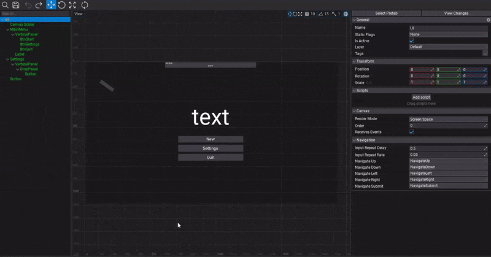
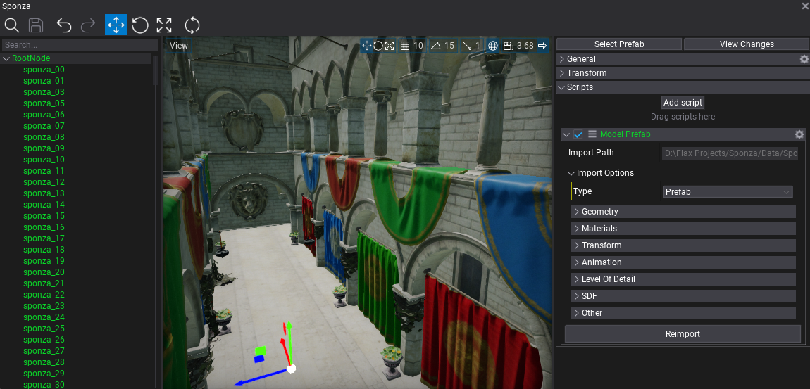
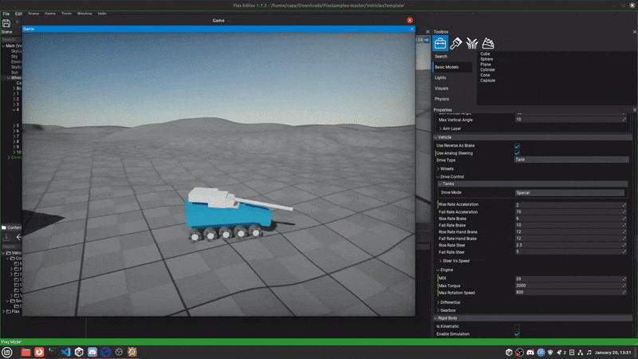
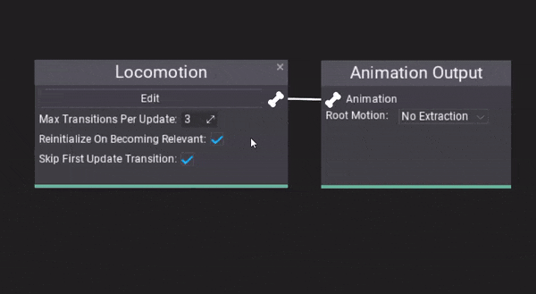
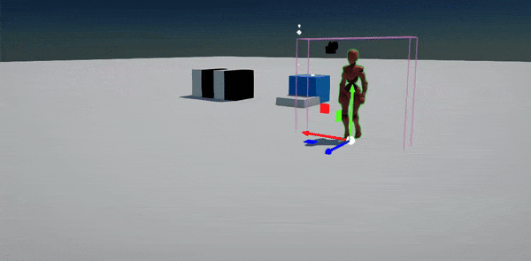
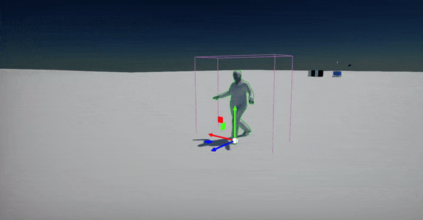
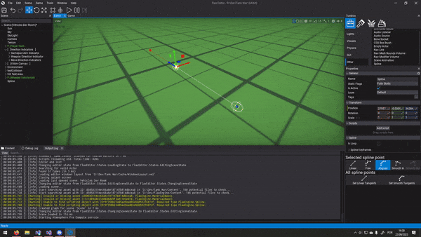
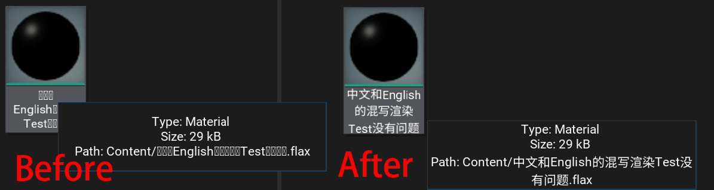
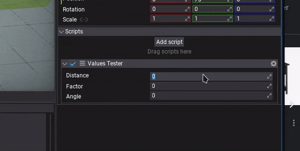
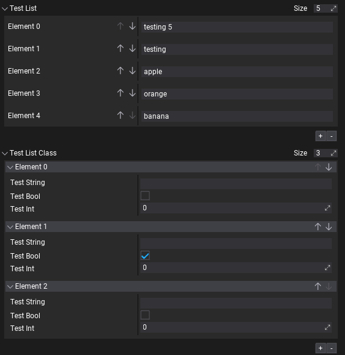

# Flax 1.8 release notes

## Highlights

### New UI Editor

We finally made it! New editing tools are coming to Flax. Now you can easily **view and modify user interface layout right in the Prefab or Game window**. This will improve UI development iterations time.

### .NET 8 support

**.NET SDK 8 is now used as a base version** (instead of `7`) with **C# 12** and the latest performance improvements. It's a Long Term Support version (`LTS`), meaning it will be maintained by Microsoft until `November 2026`. We plan to use the [official .NET release cycle](https://dotnet.microsoft.com/en-us/platform/support/policy/dotnet-core) and maintain active .NET versions in Flax tools ecosystem. Both Editor and Launcher will check for the proper .NET version on the system upon starting Editor. When building your game ensure to have the [latest .NET SDK installed](https://dotnet.microsoft.com/en-us/download/dotnet/8.0) (especially when cooking games for Android or iOS).

### ASTC texture compression

Every update brings new improvements for mobile platforms. This time we've added **ASTC texture compression** support for iOS and Android devices. This results in **up to 80% less texture memory usage**. Texture compression improves rendering performance because less texture data must be read from GPU memory when texturing objects. Also, game load time is faster as there is less data to read from the device memory into the GPU.

Flax supports ASTC `4x4`, `6x6`, and `8x8` block compression formats that can be set in platform build settings (`TexturesQuality` property in `AndroidPlatformSettings`/`iOSPlatformSettings`).

### Importing model files into prefabs

Now, when importing model files (such as `.fbx`) you can select the option `Prefab`. It will import all meshes, materials, textures, and animations from the source file (into a subdirectory) and create a prefab asset with the whole structure of the source file. This workflow addition allows to work with larger assets that contain multiple subobjects and improves iteration time due to reimport functionality (new *Model Prefab* script).

We plan to continue improving this feature by adding support for importing lights, cameras, and object animations as well as streamlining workflow.

### New vehicle features

Physics simulation always has been an important topic during Flax development. This time we've adding lots of new options for better vehicles driving control such as `Steer vs Speed`/`Anti Roll Bars` configs and **tank vehicles support**. ([GH-2192](https://github.com/FlaxEngine/FlaxEngine/pull/2192))

### Anim Graph debugging

Anim Graph editor will showcase the **current playback position of the animations and state machine insights** to empower debugging experience. Additionally, the new `AnimatedModel.GetTraceEvents` allows to gather animation playback information in the game code.

New **Root Motion feature** allows to specify which components of the motion should be applied to the movement of the object (position XZ, position Y, rotation) - this fixes root motion for Mixamo characters. Also, there is a new option to calculate root motion based on the skeleton's Center Of Mass movement.

|  |  |
|--------|--------|
|  |  |

### Spline improvements

Spline editor allows adding new points based on mouse screen position when holding `Ctrl` and clicking the right mouse button. It can also snap spline points to other spline points when moving point while holding `Shift` key (including other nearby splines). ([GH-1482](https://github.com/FlaxEngine/FlaxEngine/pull/1482))

### Fallback font rendering

We've added font fallback for text rendering, enabling **better support for CJK characters** (Chinese/Japanese/Korean characters). It handles any missing characters in the font used for rendering by picking up characters from the fallback font that contains those characters (such as CJK fonts). This feature works both in the Editor and the Game thus helping with localization and internalization of the Flax projects. ([GH-2019](https://github.com/FlaxEngine/FlaxEngine/pull/2019))

### Editor features

Every update brings more features and improvements to the Editor. This time we added functionalities such as:
* Saving collapsing panels state for subgroups in the Properties panel,
* Vertex Snapping (move gizmo with V key pressed),
* Refreshed collection editor interface to be more streamlined ([GH-2208](https://github.com/FlaxEngine/FlaxEngine/pull/2208)),
* SI units, such as meters, kilograms, in input fields for both displaying and parsing ([GH-2213](https://github.com/FlaxEngine/FlaxEngine/pull/2213)),
* Quick script creation right from *Add script* button ([GH-1827](https://github.com/FlaxEngine/FlaxEngine/pull/1827)).

## Migration Guide

* **.NET SDK 8 is now used as a base version** (instead of `7`). It's a Long Term Support (`LTS`) version, meaning it will be maintained by Microsoft until `November 10, 2026`. We plan to use the [official .NET release cycle](https://dotnet.microsoft.com/en-us/platform/support/policy/dotnet-core) and maintain active .NET versions in Flax tools ecosystem. Both Editor and Launcher will check for the proper .NET version on the system upon starting Editor.
- Objects rendering matrices are now using proper propagation of the parent transformations instead of a single `TRS`-style transform which properly handles nesting transformations. Existing scenes might have visual difference.
- Changed `DebugDraw.DrawWireArrow` and `DEBUG_DRAW_WIRE_ARROW` accept additional `capScale` parameter that controls arrow cap size.
- Added `DebugDraw::DrawRay` with `Ray` structure, `DEBUG_DRAW_RAY` changed to use `Ray` structure

## Changelog

### Version 1.8.6511.1 - 27 April 2024

Contributors: mafiesto4, GoaLitiuM, Tryibion, rkrahn, Zode, xxSeys1, Menotdan, Muzz, duarteroso

PRs merged: 25

* Add support for importing `.exr` textures
* Add logging and cleaning up leaked scene objects after play mode in Editor
* Add trading minor optimizations in MSVC Development builds for compile speed
* Add automatic restoring Anim Event tracks when reimporting animation asset
* Add `ShowDebugDrawSkeleton` to preview Animated Model skeleton via Debug Draw
* Add toggle orthographic view hotkey (`Numpad Decimal`)
* Add locking actor selection in properties and prefab windows
* Add displaying all actors in Actor toolbox search tab when no filter is applied
* Add better anim events visuals in timeline editor
* Add sorting search actor toolbox
* Add `Tags.Find` utility
* Add statically disabled tessellation on macOS/iOS
* Add statically disabled geometry shaders on mobile
* Add CPU profiler events for UI drawing
* Add setter for crword agent position and velocity
* Add option for using Address and Thread sanitizers
* Add hiding TAA settings if TAA isn't enabled
* Add `Time.Synchronize` to stabilize engine loop
* Add `Engine::UpdateCount` to sync gameplay logic updates with game loop rather than draw frames
* Add improved size of Multi Blend nodes
* Add undo for Multi Blend points moving
* Add context menu to Multi Blend node points
* Add tooltips to Multi Blend points
* Add `Ctrl` to snap points to grid in Multi Blend editor
* Add improved visuals of points in Multi Blend
* Add grid labels drawing to Multi Blend
* Add live debugging of blend position in Multi Blend
* Add add/remove buttons to Multi Blend
* Add better `const` correctness in `Mesh` and `SkinnedMesh` api
* Add `Write`/`Read` methods to `NetworkStream` for `INetworkSerializable` sending in C# api
* Add more useful orientation settings to Android
* Add exported property to activity element in `AndroidManifest.xml` template
* Add basic Android version settings to editor
* Optimize `DrawBatch` for faster sorting
* Optimize draw calls sorting in opaque passes
* Optimize TreeNode rendering
* Optimize ActorTreeNode reparent when it's not collapsed but one of the parents is
* Optimize Anim Graph node size and remove limit of max `64` state transitions
* Refactor engine loop to have better sync between game update, physics and drawing
* Refactor `UpdateGraph` to run after engine services and game scripts
* Refactor Visject Graph nodes data for unlimited size
* Refactor Multi Blend nodes to support up to `255` blend points
* Update `DirectXTex` to `mar2024`
* Change default collision type to `ConvexMesh` from `TriangleMesh`
* Fix default diffuse color value when importing material
* Fix Editor viewport aspect ratio scaling to be removed from camera mouse movement
* Fix numpad enter to normal enter on Linux
* Fix Two Bone IK to have correct bone roll
* Fix blend shapes transformation applying
* Fix blend shapes normals usage
* Fix blending nested animations to properly handle it per-node
* Fix nested animations sampling
* Fix animated model skinning precision issues
* Fix errors on using spline editor in Prefab window
* Fix error when applying prefab changes with Spline
* Fix deselecting actors when using camera orbiting in viewport after releasing LMB when Alt is up
* Fix text underline being in wrong spot on different DPIs
* Fix particle emitter creation from templates
* Fix various bugs in code detected with address/thread sanitizers
* Fix `EyeAdaptation` bug to flash on play mode start in Editor when time gets reset
* Fix heightfield not saved when editing splatmap of terrain with physical materials in use
* Fix editor toolstrip by moving game cooking and building to the right for less missclicks
* Fix panning Visject Surface with middle mouse button (right button does it) to prevent missed connections removals
* Fix Debug Log scrolling when many entries are added at once
* Fix cloning value utility for object references
* Fix missing UI Control preview when changing UI Widget type
* Fix surface node context menu to not show when moving surface
* Fix margins issues in context menus
* Fix `FindRandomPointAroundCircle` to always find a valid point on a NavMesh in the radius
* Fix NavMesh to initialize earlier and prevent issues with crowd agents on a scene
* Fix .NET runtime validity checks with daily runtime builds
* Fix `CachedAttributeGetter` holding references to collectible types
* Fix to release Prefab assets when unloading Scripting service
* Fix freeze when selecting ModelPrefab referencing a removed asset
* Fix terrain heightmap to use higher range format when decompressed
* Fix bug in `ValueContainer.HasDifferentTypes` causing incorrect editor setup
* Fix model tool importing to use temp file only for Assimp
* Fix deadlock when parsing invalid HTML text in `RichTextBox`
* Fix crash on prefab preview with lightmap in use
* Fix crash when accessing physics objects state in `OnLateFixedUpdate`
* Fix crash when resizing window on Vulkan
* Fix crash when removing Anim Event visual script that is used in opened Animation timeline
* Fix crash when using old `Blend with Mask` node in Anim Graph
* Fix crash when playing uninitialized audio source
* Fix crash when reimporting animation with translation set

### Version 1.8.6510.0 - 29 March 2024

Contributors: mafiesto4, Tryibion, stefnotch, abrasivetroop, Withaust, MineBill, z1dev, GoaLitiuM, NoriteSC, Menotdan, nothingTVatYT, plemsoft, GasimoCodes, whocares77, RuanLucasGD, envision3d, Tesla-J, Chikinsupu, rkrahn, dustytrailsdev, cNori, lifeformed

PRs merged: 108

* Add red tint highlight for CPU profiler table entries based on event duration
* Add selecting actor spawned in the prefab window
* Add color box to `ColorTrackBall`
* Add events tracing feature to Animated Model for animation playback insights
* Add displaying playback position of animation in Anim Graph window
* Add SourceState and DestinationState modes to State Machine interruption modes in Anim Graph
* Add **new collection editing UI**
* Add option to enable Depth Test on cloth painting debug preview (enabled by default)
* Add sub-groups expanded state restoring in Properties window
* Add directions to Slider control
* Add `IsValidIndex` to Array
* Add **Vehicle Physics Improvements** (new options, tank vehicles)
* Add `Create parent for selected actors` context menu button
* Add hiding Actor's Transform for `UIControl`Actor
* Add RayCast utility to UI controls
* Add `MinCount` and `MaxCount` to `Collection` attribute
* Add require script and actor attributes
* Add option to toggle focus game window on play inside context menu
* Add reload project menu button
* Add support for **multiple physical materials in terrain** - one for each painted layer
* Add `Material` to `RayCastHit` for surface detection logic
* Add API for runtime Terrain editing and expose Terrain patch and chunk to API
* Add support for structure and script types in `JsonAsset`
* Add improved Visject context menu items search
* Add **vertex snapping** (gizmo with `V` key pressed)
* Add support for importing material emissive and roughness from `fbx` file
* Add support for using pointer in `MarshalAs` in scripting types
* Add quick creation of scripts via `* Add script` button on Actor
* Add `ScriptingEnum::ToStringFlags` for printing flag enums into readable text
* Add **font fallback for text rendering**
* Add spline editing improvements
* Add focus selection lock input to scene tree window
* Add `SnapToGrid` to vectors
* Add `NextUnitCircleVector2` extension method
* Add the option to deselect all in Editor
* Add rubberband-style selection in a Content View
* Add the ability to quickly change window modes for the game window
* Add improved category drop panel to look similar to other panels in scripts adding popup
* Add parameter to change arrow cap size for Debug Draw
* Add `DrawAxisFromDirection` and `DrawRay` with `Ray` structure for Debug Draw
* Add `Actor.GetPrefabRoot()`
* Add prefab link breaking to preserve nested prefabs links
* Add skipping showing and applying changes to prefab root actor transform via Level
* Add `activeOnly` parameter to `Level::GetActors`
* Add parameter to finds only an active actor from the scenes
* Add breaking node connection under mouse with middle button click
* Add `MoveFileToRecycleBin` on Linux
* Add support for VS 2022 v17.10 / MSVC 14.4x toolset
* Add check to prevent incorrect `NavCrowd::RemoveAgent` usage
* Add clamping multiblend value to the range set 
* Add partition mode and cascade spacing for Directional Light shadows
* Add saving docking state for custom editor windows
* Add Guid picker to support asset refs
* Add `AnimationRootMotionFlags` to configure **root motion component extraction**
* Add `RootMotionMode` to support **extracting root motion from animated skeleton pose center of mass**
* Add skeleton mask asset parameter to Blend With Mask anim node
* Add remaining clang options for Apple and Unix toolchains
* Add initial ASTC pixel format support
* Add ‘astc’ encoder lib
* Add `BehaviorTreeKnowledgeBooleanDecorator`
* Add automatic last dangling separator removal in context menu
* Add better grid gizmo rendering in Editor viewport
* Add save input and undo redo in Editor Options
* Add support for animating `LocalizedString` value in Scene Animation
* Add **UI Control gizmo for editing UIs** (in Prefab and Game windows)
* Add resizing UI Control via widgets
* Add cursor change and showing timeline edge duration when moving it
* Add `UI Widget` to new asset creation for quick UI setup
* Add **physical units support to input fields** in Editor
* Add `InputAxis` and `InputEvent` integration with stdlib features
* Add manual chunks loading before Binary Asset load in case content streaming flushed them out
* Add changes to default post process settings
* Add focusing search bar in content view and output textbox
* Add normal logs for deps build subcommands
* Add support for storing custom platform tools data in Game Cooker cache
* Add auto focus to Editor Window when nothing clicked inside it
* Add initial support for Precompiled Header Files (PCH) in MSVC compilation
* Add support for building engine target as shared library on all platforms
* Add `Stopwatch` for accurate duration measuring
* Add `OutputName` to Build Settings for **game output exe/package renaming**
* Add better win32 resource file injection to be done during linker call
* Add printing stack trace even when not using log file
* Add better stack trace reporting in crashes when running on non-Windows platforms
* Add support for using Tracy profiler on Switch
* Add removing dotnet libs for iterative rebuilds when AOT cache gets cleared
* Add custom editor for buttons that allow listening for them inside the editor
* Add support for multiple `VisibleIf` attributes
* Add hold arrow key in tree to continuously scroll actors
* Add drag drop for actor script items into scenes and prefabs
* Add ability to use custom file proxy in Editor plugin for file type
* Add an option to skip existing materials when reimporting
* Add `Start Time` option for Audio Source actor
* Add support for manually dirtying objects that use `ReplicationFPS < 0` for manual-only replication
* Add sanity check to prevent crashes when Animated Model has NaN in skeleton pose
* Add support for stencil buffer on Vulkan and D3D11/D3D12
* Add clickable parsing errors in build tool
* Optimize `Matrix` decomposition to use `Matrix3x3` for rotation
* Optimize render targets freeing on the start of the game
* Optimize UI Control serialization
* Update Nintendo Switch support to he latest .NET 8 with Mono SGen
* Update `dotnet` fork to the latest .NET `8.0.1`
* Refactor win32 exe icon updating
* Refactor `ThreadLocal` when running on hardware with more cores than `PLATFORM_THREADS_LIMIT`
* Refactor UI Control actor active state mirroring in UI via `Visible` properties rather than unlinked from parent
* Refactor UI Control linkage in the prefab previews to prevent bugs
* Refactor undo logic for actors reparenting in Editor
* Refactor Editor UI style for selection and drag drop interactions
* Refactor collider shape raycasting utilities to the `PhysicsColliderActor` class
* Refactor `PhysicalMaterial` usage to utilize `JsonAssetReference` struct
* Refactor 3D audio implementation in XAudio2 backend to match OpenAL
* Refactor Visject Surface attributes data storage to use `JsonSerializer` instead of deprecated `BinaryFormatter`
* Refactor engine systems to use platform time seconds rather than date time
* Remove unused `SaveTime`/`LoadTime` from `Scene`
* Remove unused 'PixelFormatExtensions::ComputeScanlineCount'
* Rename `Navigation.ProjectPoint` into `Navigation.FindClosestPoint` to have consistent API naming
* Fix Animated Model slot animations clearing on start
* Fix fog to be usable for transparent materials (if enabled)
* Fix auto-docking windows on open when system DPI scale is not `1`
* Fix missing asset update when dependant asset gets saved in Editor
* Fix `unlink` usag on Unix systems to properly use returned value
* Fix PostFx Materials blending for duplicated entries
* Fix stopping slot animations and playing the same frame
* Fix unpacking `Variant` structure if input value is a scalar
* Fix missing default value for new Visject method parameter if method uses Vector param
* Fix shader source code preview in editor
* Fix `FileSystem::CopyDirectory` not failing when source folder is missing
* Fix mouse events handling over window title bar on Windows
* Fix `HeaderAttribute` usage with default values
* Fix invalid log timing when log file is disabled in cooked build
* Fix unreliable RPC calls to silently drop if we failed to find an object
* Fix for editor view's cached `CameraNearPlaneValue` getting overwritten
* Fix `Dropdown` panel to scale correctly
* Fix ` ContextMenu` short keys as needed to accommodate for scrollbar when visible
* Fix combobox window position based on what direction it opens
* Fix `AlwaysShowScrollbars` to update visibility state of the scroll bars
* Fix drop location of multiple nodes to be vertical in Visject
* Fix profiling hotkeys not working while profiler window is closed
* Fix GPU profiler event percentage calculation and * Add tint highlight to spot slow entries
* Fix opening projects with PostFx material assigned in Graphics Settings
* Fix Plugins Window layout in UI
* Fix Plugin Project creation when the user types in symbols
* Fix new asset naming to always validate filename
* Fix sprite atlas limit on `4096`
* Fix invalid shader codegen when using `ddx`/`ddy` in material vertex shader
* Fix terrain painting when using multiple layers
* Fix issue with CharacterController initialization when using Center offset
* Fix copy/paste for UI brushes
* Fix UI Control selection bounds drawing to handle rotations
* Fix `NextUnitVector2` to properly produce a vector within a unit circle
* Fix asset thumbnails refresh to support multi-selection
* Fix focusing editor camera on very large objects
* Fix duplicating array values in Editor
* Fix various Editor input shortcuts binding
* Fix Slider deserialization if value range is invalid
* Fix `Transform` diff serialization to properly handle prefab changes to a single component of transform
* Fix model prefab issue with scaling and rotation
* Fix differences between Assimp and OpenFBX imports in units scaling
* Fix prefab transform on drag drop with parent
* Fix Missing Script replacing in prefab
* Fix for resetting local transform of newly created prefab child
* Fix nested prefabs instance building logic
* Fix creating prefab out of actor to reset local transform of it for better instancing
* Fix cloth editing undo in Prefab viewport
* Fix incorrect vehicle wheels collisions inside trigger volumes
* Fix editor inputs processing in Game window to interferer with game inputs
* Fix no available getter/setter node and item for private parameters in Visual Script
* Fix Temporal Anti Aliasing ghosting and improve quality of blending
* Fix marshaling custom type array to C# with `MarshalAs` used
* Fix missing file error in `Content::GetAssetInfo`
* Fix bug with saving Missing Script into file
* Fix transform scaling applying to nested objects when drawing
* Fix uninitialized value of `NetworkConfig::NetworkDriver` field
* Fix networked objects dirtying for replication
* Fix bug in `NetworkReplicator::RemoveObject`
* Fix C++ Intellisense not working with latest version of Rider
* Fix incorrect including editor modules in `Game.Build.cs` when git plugin pulling
* Fix incorrect rigidbody rotation in `AddMovement` when using locked axis
* Fix codegen skipping `if` and writing `else if` first
* Fix codegen for nested enums
* Fix missing networked object ID resolving
* Fix `JsonAsset::GetInstance` to properly check base class
* Fix problem with Procedural Texture Sample flicker if using scaled UVs
* Fix getting file access time for Apple, Android and Linux
* Fix `DateTime::GetDate` calculations
* Fix render view panning when bug when no camera is active
* Fix Json serializer for CSharp data to use UTF-8 text encoding
* Fix editor exit with error code when game cooking CL fails
* Fix sorting directories in build tool
* Fix building macOS with the latest Vulkan SDK
* Fix anim graph debugging to include nodes path for nested graphs
* Fix root motion preview in animation window
* Fix invalid Visual Studio solution folder nesting
* Fix color grading issue with LUT texture used
* Fix spatial audio playback in OpenAL with Large Worlds enabled
* Fix terrain smoothing brush separation issue
* Fix going into windowed mode on Windows
* Fix `rpath` on Linux to handle plugins libraries loading in Editor
* Fix error loggig in headless mode on platforms that use `char16`
* Fix support for utf8 character in path on unix systems
* Fix deadlock when stack overflows in the Anim Graph update
* Fix timeline tracks dragging like recent improvements to tree UI
* Fix Bone Socket transform when Animated Model pose is not yet evaluated
* Fix error in Editor when Audio Clip duration is very small
* Fix vehicle center of mass rotation used in wheels setup
* Fix loading `BehaviorKnowledgeSelectorAny` from json object
* Fix incorrect mouse cursor hiding on Windows when window is not focused
* Fix preserving actors hierarchy order when performing undo of actor removal
* Fix UI size changes when saving scenes or prefabs in Editor with different layout
* Fix UI coordinate convertion in `CanvasScaler`
* Fix split dragging not working in some cases
* Fix carrot and selection height based on dpi scale to correctly scale with interface options
* Fix missing debug shapes in prefab window
* Fix loading shader cache when opened with different engine version
* Fix d3d12 warning on initial gpu buffer state
* Fix small GPU buffer update on Vulkan if data size align up overflows buffer size
* Fix potential issues with shader resources bindings when using custom post processing effect
* Fix TAA jitter in post-resolve passes such as editor primitives and debug gizmos
* Fix Z-fighting issues in Debug Draw when using TAA
* Fix bug in actors duplicate action due to incorrect actors list setup
* Fix snapping to the ground actor when viewport is not focused
* Fix drag and drop regression issue on tree UI
* Fix `Revert to Default` option when property is marked as `ReadOnly`
* Fix timeline playback control buttons visibility during seeking-only mode
* Fix game ui inputs to UI when game is paused in Editor
* Fix `Mono.Cecil` error in `NetworkingPlugin` when using external libraries
* Fix duplicate generation of native variant conversion helpers
* Fix `PhysicsScene` change not working in physics actors
* Fix crash when scene graph node gets somehow duplicated by internal error in Editor
* Fix crash in `StaticModel::GetMaterial` when model is not loaded or has invalid entries count
* Fix crash on incorrect object destruction event
* Fix crash on invalid string converted to managed string
* Fix crash due to incorrect PhysX usage for vehicle setup
* Fix crash while moving simulation disabled kinematic actors
* Fix crash when adding physics scene with auto simulation
* Fix crash when setting maanaged structure data via `Variant`
* Fix crash when storage file gets deleted due to missing ref from async thread which failed to load it
* Fix crash when finding actor or level with empty name text
* Fix crash when using multi-threaded objects spawn and caching scripting VTables
* Fix crash when replicating C# object with `NetworkReplicated` attribute on derived generic class
* Fix crash when using degenerated triangle in Multi Blend 2D to properly sample animation
* Fix crash when loading level with abstract script class
* Fix crash when using generic interface in C#
* Fix crash when using network replication or rpc after hot-reload in Editor
* Fix crash when using invalid `GPUTextureDescription`
