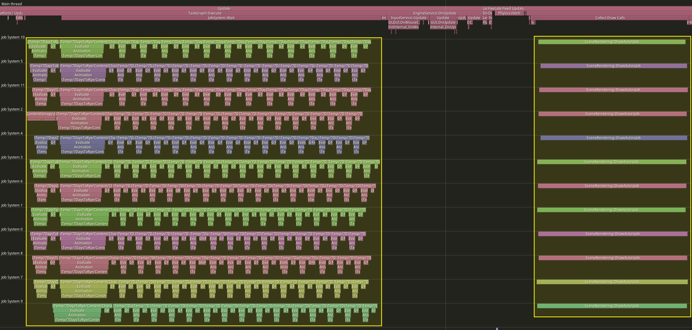
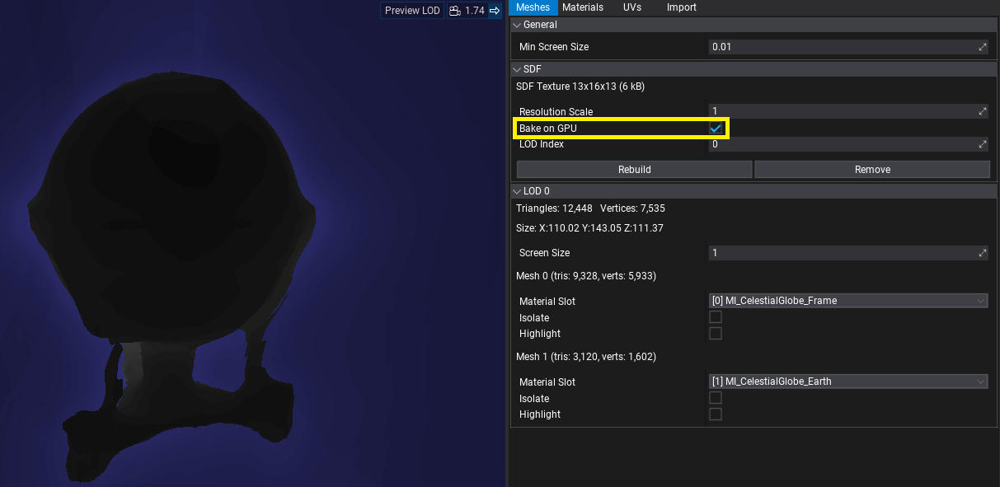
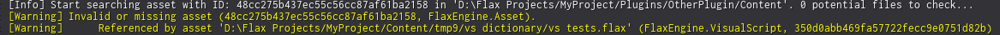
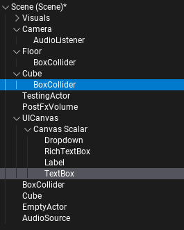
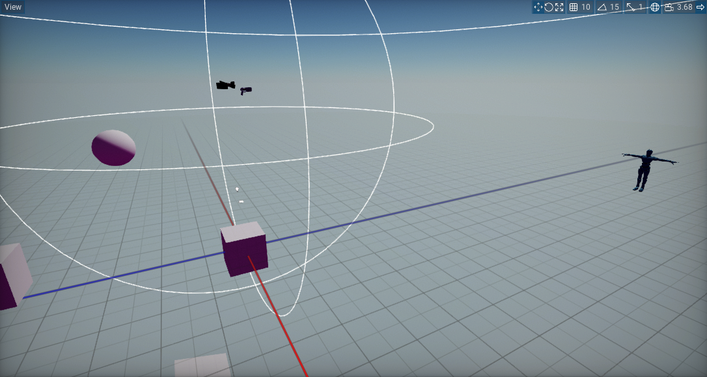
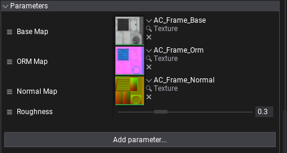
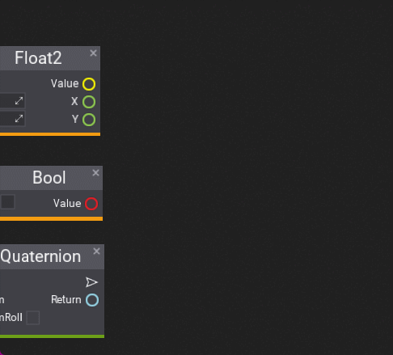
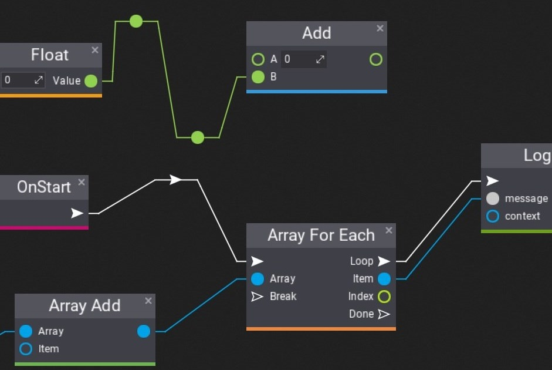
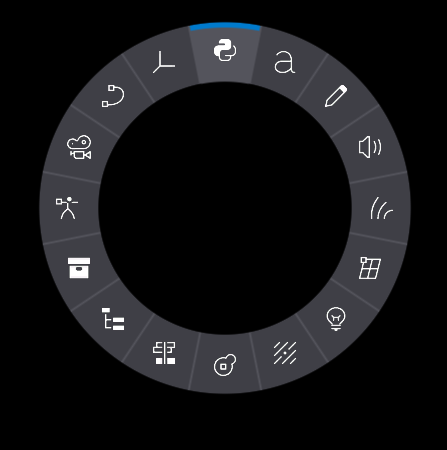

# Flax 1.9 release notes

## Highlights

### Video playback

This release includes a video player to load `.mp4` files and play them with video and audio. New `VideoPlayer` actor can be added on a scene, to prefab, attached to UI, or spawned dynamically from code. It can play a local file or stream video via an HTTP URL.

We've prepared documentation and tutorials on how to use [Video](../../graphics/video/index.md).

### Rendering performance boost

Every Flax update brings **new performance improvements** to the rendering. This time we've enhanced:
* draw calls sorting (by optimizing draw key memory and using Merge Sort rather than Quick Sort),
* async drawing (by running draw calls sorting, shadows setup and DDGI setup on Job System),
* objects batching (by merging material constants setup for all meshes using this material),
* GPU objects data (by uploading all draw call instances at once in async for a whole scene),
* shadow maps draws reduction (by using material-sharing for opaque unmasked geometry).

### Bistro scene sample

<iframe width="750" height="421" src="https://www.youtube-nocookie.com/embed/UR_yb1YWCz0" frameborder="0" allow="accelerometer; autoplay; clipboard-write; encrypted-media; gyroscope; picture-in-picture" allowfullscreen></iframe>

To better showcase both quality and performance improvements of Dynamic Diffuse Global Illumination (**DDGI**) solution in Flax Engine we've setup Amazon Lumberyard Bistro as a Flax project and released in on [Github](https://github.com/FlaxEngine/Bistro). Feel free to download it and use as a reference how to setup [Global SDF](../../graphics/models/sdf.md) for a scene and use it for accurate DDGI.

### DDGI improvements

[Dynamic Diffuse Global Illumination](../../graphics/lighting/gi/realtime.md) (**DDGI**) is using our custom software-raytracing solution used to draw dynamic lighting. Flax 1.9 adds substantial quality and performance upgrades to this visual. We've added **variable ray-count per-probe** meaning the GI probes outside the view frustum or far from geometry or far from camera origin use less rays per frame. Probes **relocation algorithm applies smooth probe movement** to better adapt in dynamically changing scenes. Also, probes sampling supports fallback from other grid cells which reduces back artifacts. Overall, **DDGI is ready for production** and can be used to achieve **realistic-looking lighting in large-scale games**.

To showcase those improvements we've updated our Tech Demo from 2022 which can be downloaded on Steam:

<iframe src="https://store.steampowered.com/widget/2138130/" frameborder="0" width="646" height="190"></iframe>

### Shadow Maps Atlas

Shadow Maps are depth textures used to draw shadows for lights in real-time. Flax used to have a fixed-size render target to draw shadows based on the global shadows quality setting. We've **reimplemented shadow mapping to use shared atlas texture** which comes with many benefits:
* variable shadow resolution (eg. based on the distance to light),
* variable update rate (eg. lower shadow map draw frequency for far lights),
* separate static atlas for static geometry (copied into dynamic atlas),
* shadowed lights in transparency (single atlas can be easily bound to shader),
* shadowed lights batching (eg. when rendering volumetric fog),
* better performance (depth drawing into a single texture).

### GPU-based mesh SDF generation

Mesh **SDF is now generated on a GPU** by default. It cuts computation time (incl. model import time when SDF is enabled in a project). For example, a model with *3,700,000* vertices is generated in *~160ms*. For some meshes (eg. thin objects like foliage) new GPU-generation results in artifacts (the different algorithm used) thus old CPU-based algorithm can still be used if necessary.

### Missing references debug improvements

When working on larger Flax projects, often asset or object reference gets missing. For example, if someone deleted texture or material that was used it might lead to gameplay or visual artifacts. Now, any missing asset or object will be logged with contextual info about source reference (eg. specific asset path, type, and id or specific actor/script info). This greatly improves devs ability to quickly solve broken references to be more successful. We plan to keep improving this feature and make it even easier to find missing references or data problems.

### Editor hierarchy guidelines

We've added showing guidelines to Editor tree hierarchy. This change greatly improves the readability of actors hierarchy or folders structure. This feature can be toggled off in editor interface options.

### Infinite grid

For this update, we've enhanced the grid in Editor to look much nicer. It no longer uses debug lines but instead a shader on a large quad that follows the camera around and properly blends with the environment. Both color and distance are configurable in the Editor Options.

### Reordering lists

Flax 1.9 adds a highly requested feature to Editor for arrays and lists editing. Now, you can use a small icon on the left side to drag the item up or down and reorder list. This feature works across the Editor, including material and visual script parameter lists.

### Visject improvements

Visject is a name of system used for surface-based content creation such as: materials, visual scripts, particle emitters, animation graphs, and more. Over the past months we've added multiple important updates to Visject to empower creators:

#### Tooltip and description panel

Added node documentation section to the context menu, allowing users to distinguish nodes in the context menu list quickly. This is especially useful for visual scripting as it displays visual parameters and return values types of functions.

#### Search and filter improvements

Improved UX of searching nodes in the context menu even more by adding 2 new features: `filtering by group` and `type sorting priority`.

#### Straight lines

Editor Options contain a setting for line curvature that can make them look straight.

### Radial Menu control

New `RadialMenu` control can be used to build the interactive user interface, especially useful in games that allow users to pick items from the inventory or when porting games to consoles for gamepad controls.

### General improvements

Flax Editor is under constant development towards making it the best game editor, this time we notably worked on:

* New content creation options (new prefab or widget root actor setup),
* UI Controls toolbox (toolbox section with UI Controls for drag&drop spawning),
* New material gradient nodes (cone, cycle, linear, radial, and ring gradients),
* Scene animation timelines gizmos (viewport gizmos to edit camera track curve),
* Animation events UI.

## Migration Guide

* Objects drawing has been refectored to use material batching for different meshes (aside from existing hardware instancing), all objects transformations and data is stored in a single large GPU buffer shared by the whole frame. New per-draw constant buffer is used at slot `2` - update your custom material shaders that were using additional constant buffers to use slot `3` instead. Materials and shaders using `WorldMatrix`, `LODDitherFactor`, `PerInstanceRandom` directly from `Data` constant buffer at slot `0` need to use `LoadObject` function to properly read data on a GPU.
* Sort Order has been reduced from `int16` to `int8` due to performance reason (more optimial sort key packing in rendering), this leaves range of `-[127; 127]`for transaprency sort reordering.
* `DEPRECATED` has been changed to be a function that accepts custom deprecation message.

## Changelog

### Version 1.9.6605 - 17 October 2024

Contributors: mafiesto4, Tryibion, GoaLitiuM, z1dev, abrasivetroop, Chikinsupu, MrCapy0, xxSeys1, HydrogenC, Swiggies, Menotdan, cNori, tecnessino, envision3d, Zode, RuanLucasGD, Arcnor, mtszkarbowiak, RomanZhu, GaryMcWhorter, lifeformed, amir9480, fibref, Muzz

PRs merged: 169

* Add **view playback support**
* Add shader cache invalidation when using debug shader option via cmd line in Editor
* Add frustum culling for editor preview camera mesh
* Add support for **Windows on ARM**
* Add `JobSystem::Dispatch` that accepts dependent jobs that needs to be completed before
* Add improved Global SDF tracing when going over different cascades
* Add improved Global Surface Atlas lighting at far cascades and cascade borders
* Add more precise Global SDF raycasting nearby geometry (at cost of performance)
* Add improved Global SDF sampling at empty areas
* Add option to sample Global SDF from higher cascade
* Add nearby probes search to fill cells with missing GI data
* Add random per-probe rotation for rays tracing in DDGI
* Add option for smooth DDGI cascades blending
* Add smoother DDGI probe relocation when old position is visible from new position
* Add improved DDGI cascade selection by using biased world position and smooth the transition
* Add `Graphics::SpreadWorkload` to disable graphics workloads amortization over several frames when debugging graphics perf
* Add `SetStablePowerState` for D3D12 when doing shaders profiling
* Add `WinPixEventRuntime` for D3D12 to provide GPU profiler event names
* Add `timeBeginPeriod(1)` on `Win32` platforms to improve timer precision
* Add support for custom deprecation messages in bindings generator
* Add utility `Packing.hlsl` shader for colors and vectors packing
* Add SpawnParticles utility to Particle Effect
* Add **variable rate update for shadow maps atlas based on distance to light**
* Add `stencilValue` for stencil buffer clearing
* Add **shadows caching for static geometry**
* Add reducing shadows quality for smaller local lights
* Add **better stability to Cascaded Shadow Maps** projection
* Add new Static Flag `Shadow` for cached shadow maps
* Add constant buffers alignment for data structures (16-byte boundaries)
* Add `InvalidateShadow` for manual shadow cache refresh
* Add `ShadowsResolution` for manually specified shadowmap resolution for lights
* Add `METERS_TO_UNITS` and impl metric units in shadows rendering
* Add `GlobalSDFDistance` to graphics settings for default GlobalSDF range
* Add video texture formats `YUY2` and `NV12`
* Add additional `StaticFlagsCompare` to Render View for dynamic or static only drawing
* Add grey out to obsolete/deprecated members in properties panel
* Add support for custom file proxies in Editor
* Add support for cooking raw files referenced by assets
* Add `FilePathEditor` custom editor for path-based editing asset/url refs with a file picker
* Add support for using `InputAction` editor on `string` variable
* Add `WindowsMinVer` config for minimum target Windows version switch
* Add **Model SDF baking on GPU** via Compute Shader
* Add option to SDF generation via GPU in Model Window
* Add half-texel margin to SDF around the mesh
* Add async SDF generation for all meshes in the scene
* Add improved Model SDF generation with sampling offset and min distance accumulation
* Add caching Model SDF options in the project cache
* Add increased by 1 mip sdf texture resolution for GlobalSDF building
* Add D3D11 shaders naming for profiling
* Add `IsDebugToolAttached` to GPUDevice for detecting gpu debugger tools attached and auto-enable GPU profiler in that case
* Add option to disable particles preview in scene view and play only looping effects
* Add alternative Rectangle function names for naming consistency
* Add support for log context and logging missing objects container info
* Add support for Windows SDK build 26100 (24H2)
* Add support for injecting scene children on scene loading
* Add **new infinite grid rendering** in Editor
* Add saving debug log collapse state
* Add Edit Prefab button for selected actor
* Add selecting all assets and scripts that are dropped in the tree panel
* Add separate import settings as new tab in texture window
* Add displaying file extension for scripts in content finder to distinguish C++ files
* Add more functionality and thumbnail to content items in finder for scripts
* Add utility `GetInstance` method to Json Asset refs in C#
* Add assertions for checking against un-normalized direction vectors
* Add **reordering lists and Visject parameters**
* Add Editor update event
* Add type display to empty object ref in editor
* Add slot spacing to uniform grid panel
* Add displaying asset picker type
* Add cutting of content items
* Add ability to rename multiple actors using scene hierarchy
* Add improved Visject search and filter
* Add improved UX for disabled boxes  in Visject
* Add improved context menu search filtering in Visject
* Add improved comment renaming and visual fix
* Add connection curvature option to Visject
* Add impulse/execution lines slightly thicker than data ones in Visject
* Add minor QoL change for moving reroute nodes in Visject
* Add **new material nodes: Cone, Cycle, Linear, Radial, Ring gradients**
* Add spawning parameter setter node when holding Alt` during drag and drop
* Add storing Debug Log view options in Editor options
* Add generated marshallers into separate `Interop` namespace
* Add new **Radial Menu control**
* Add a warning when there is more than one audio listener enabled
* Add default audio listener to newly created scenes
* Add being able to * Add a thumbnail to a `SpawnableJsonProxy`
* Add color picker option to accept changes on dismissal
* Add option for enabling enhanced determinism in Physics
* Add Lightmap UV material node
* Add text alignment options to Button
* Add support for customizing `Dropdown` popup visuals
* Add smooth light brightness fade out at last 10% of `ViewDistance` (if used)
* Add `MaterialInstance.ResetParameters`
* Add `TextFormat`, `SelectedItemChanged`, and text alignment options to Dropdown
* Add `Graphics.ShadowUpdateRate` to control global shadows atlas update rate
* Add Git cloning plugin project inside Git repo as submodule
* Add clearing render target pool textures to pink during in Debug builds
* Add `IndirectLightingIntensity` to `Sky` for GI intensity control
* Add **Contrast Adaptive Sharpening (CAS)** filter pass
* Add improved default value detection for scripting object references in bindings generator
* Add improved material instance setup on model import with base material
* Add improved `FormatBytesCount` to print large sizes in more detailed way
* Add copy/paste for material instance parameters via context menu on `Parameters` group header
* Add more `move` value operation for various code places for better performance
* Add support for using C# stdlib api in Visual Scripts
* Add more contextual log printing on missing object/asset reference
* Add `Transfrom.AlignRotationToNormalAndSnapToGrid`, `Vector3.SnapToGrid`
* Add ability to edit position curve in timeline with a gizmo in a viewport
* Add custom grid snapping value for translation
* Add software raytraced reflections to transparent material that have both GI and SSR enabled
* Add better engine responsiveness when not focused by ticking platform more frequently
* Add grid gizmo to prefab scene
* Add enlarging debug point of current blend value in Multi blend nodes in Anim Graph window
* Add options menu to json assets
* Add cleaning up modules from target files when deleted
* Add saving collection element groups
* Add copy/paste context actions to the sprite properties panel
* Add preserving local changes to model prefab objects when reimporting
* Add resizing foliage paint gizmo with shift scroll
* Add physics and lights debug drawing in prefabs when enabled
* Add check for not having right mouse button down for changing terrain gizmo sizes
* Add additional Actor virtual methods to C# and Visual Scripting to override
* Add attributes support for dotnet interop for methods, fields and properties
* Add automatic heightmap files removal on Editor shutdown for deleted terrains
* Add navigation focus support to `AssetPicker` control
* Add caching scroll values for actors in Properties window
* Add creating particle systems from particle emitters via context menu
* Add creating anim graph from skinned model via context menu
* Add prefab root actor option picking
* Add grid snapping option to Visject Surface editor
* Add option to reconstruct Z channel when importing OpenGL normal maps
* Add option to flip imported texture over X axis
* Add option to keep aspect ratio of texture when resizing
* Add `UpdateFlags` to `ISceneRenderingListener::UpdateActor` for more contextual control over dirtying actors state in renderer data
* Add `NetworkReplicationNode::SetObject` to customize object replication settings at runtime
* Add initial AGX tonemapping implementation
* Add widget UI root control type or canvas
* Add **tooltip and description inside Visual Script finder menu**
* Add bindings for handling `MAX` C++ defines in enums and converting them to C#
* Add `Invert Mouse Y-axis` option to input options in Editor
* Add handling `.f` in C++ values by bindings generator
* Add code gen for FixedAllocation arrays to generate Collection attribute with allocation count
* Add using `nameof` for adding new Modules to build targets
* Add `NetworkReplicator::MapObjectId` for networked object identifies mapping
* Add `OrthographicSize` to Camera for fixed ortho projection size
* Add disabling decals from effecting editor camera model
* Add material instance override options to be in setting button
* Add generic `CSharpProxy` and Empty C# template
* Add opening file proxy via shell on Windows in Editor as fallback
* Add Shift+End and PageUp/PageDown for `TextBoxBase`
* Add `ControlChildSize` option to disable auto resizing child controls in UI panel
* Add Background Brush to the control for more styling
* Add caching review model in Animation window
* Add `Foliage.RemoveAllInstances` to clear all instances of foliage
* Add gamepad buttons to Axis Config
* Add actor type and script type to search filters (`a:` for actors and `s:` for scripts, eg. `a:SkyLight, s:TestingMovement, MainLight`)
* Add improved anim slot blending between animation in the same slot
* Add picking the longest animation from the imported file instead of the first one as default
* Add `CHECK_DEBUG` and use it over over `ASSERT` in normalized direction checks
* Add requesting engine exit event. Expose Fatal error and requesting exit it to C#
* Optimize world matrix storage for drawable objects to use `Matrix3x4` instead of full matrix
* Optimize decals rendering
* Optimize depth pass rendering to batch simple materials together
* Optimize env probes data storage in renderer
* Optimize local lights sphere mesh rendering to match the area better
* Optimize `BoundingSphere.Intersects` to be inlined by the compiler
* Optimize `FileReadStream` seeking if new position is within the cached buffer
* Optimize draw calls batching sorting with Merge Sort
* Optimize win32 filesystem access via static buffer or unlimited path len
* Optimize Windows Development builds to use SSE2 by default on Windows and use SSE4.1 when targeting Windows 11
* Optimize `StaticModel` draw into SDF and SurfaceAtlas if SDF texture is unused
* Optimize `SceneObjectsFactory::SetupPrefabInstances` when loading large scenes
* Optimize `SceneObjectsFactory::SynchronizeNewPrefabInstances` when loading large scenes
* Optimize Global SDF drawing with async job system
* Optimize Global SDF to use 8-bit storage (50% less memory usage)
* Optimize Global Surface Atlas drawing when atlas is full
* Optimize Global Surface Atlas defragmenting to just reset tiles, not whole objects list
* Optimize Global Surface Atlas setup and objects buffer writing to be async
* Optimize Global Surface Atlas objects culling with shared thread group pre-cull
* Optimize GPU memory usage in Editor when viewport is inactive
* Optimize and refactor DDGI to use linear `attention` per-probe to dynamically control ray count and blend speed
* Optimize DDGI probes border pixels to be copied within probe update, rather than via separate dispatch
* **Optimize draw calls sorting and objects buffer building to be async**
* Optimize new rectangle packing to use binary search for faster inserting
* Optimize wait signal in Job System to wake waiting threads only when job batch ends
* Optimize `DynamicTypedBuffer` and `DynamicStructuredBuffer` to use GPU-memory for commonly used single-frame uploads
* **Refactor DDGI probe relocation algorithm to have smoother and more precise placement**
* Refactor draw calls rendering to use single objects buffer and better materials batching
* Refactor `RectPack` into new `RectPackNode` and `RectPackAtlas` that uses more optimized memory allocations
* Refactor `SortOrder` to use `int8` instead of `int16` due to performance reasons (more efficient sort keys packing in rendering)
* Refactor `Button` to inherit from `Label` and get all of its functionalities
* Refactor `WindowsFileSystemWatcher` to properly handle file modifications
* Refactor Audio Backend to support single listener only
* Refactor `Asset::GetReferences` to support file path references
* Refactor **shadows rendering to use Shadow Map Atlas**
* Rename `ShadowSamplerPCF` to `ShadowSamplerLinear`
* Reimplement cascaded shadow maps blending via dithering (optimized shader)
* Update GDK to `230305` and support `v143` MSVC toolset
* Update `VulkanMemoryAllocator` to  version`3.1.0`
* Update Assimp to `v5.4.1`
* Update `meshoptimizer` to version `v0.21`
* Update OpenFBX to the latest version `Jun 22, 2024` (* Add new triangulation)
* Update various third party dependencies
* Fix various FBX importing issues (new triangulation, better format support)
* Fix drop down image on scripts to be hidden if no objects are in the group
* Fix xml tooltips processing to ignore excessive whitespaces
* Fix thumb of scrollbar not showing up until dragged by user
* Fix `Convert to Parameter` to check if can perform action
* Fix playing from first scene with invalid asset id
* Fix project cache in editor to use invariant culture when converting numbers
* Fix game build when using some missing debug draw methods
* Fix editor play state exceptions into errors to prevent locking editor state
* Fix `SliderControl` not being unfocused on value change
* Fix header height when using HeaderAttribute with multiline label
* Fix TAA jittering when rendering UI in world after TAA resolve
* Fix a few edge cases for cursor showing/not showing
* Fix progress bar normalized percentage drawing
* Fix tree nodes culling when using search in scene tree
* Fix UICanvas controls to update when cavnas skips input events
* Fix UI control borders not tinting
* Fix missing layout performing of splitter panel once splitter is done being dragged
* Fix asset to be soft when transformation is nan or inf
* Fix text wrapping to wrap only on underscores and not other special characters
* Fix timer queries reset before use on Vulkan
* Fix terrain SDF thickness to be fixed at `300` units
* Fix terrain rasterization into Global SDF to less blocky
* Fix Global SDF sampling in materials to properly read far cascades
* Fix Global SDF mip sampling artifacts on edges of distance limit
* Fix DDGI probes scrolling to properly handle bigger scroll deltas
* Fix single-frame DDGI black artifacts when Global Surface Atlas got defragmented
* Fix Global Surface Atlas flickering in scenes with lots of objects
* Fix missing GPU events when using shaders profiling/debugging or graphics dev tools are enabled
* Fix D3D11 to properly issue instanced draws even if instance count is `1`
* Fix D3D11 to properly flush CB/SRVs when bindings new shaders after CB/SRV was set
* Fix `HashSet` adding item via move operation
* Fix playing 6-channel audio with XAudio2 backend
* Fix `MIN_int32` compilation on the latest Clang
* Fix model thumbnail for very large assets
* Fix Global Surface Atlas defragmentation flicker when atlas it nearly full
* Fix GlobalSDF for meshes intersections for negative distances inside the geometry 
* Fix GPU Tasks queue to be executed on frame start, rather than end
* Fix `GPUTexture::GetData` to properly handle volume textures
* Fix texture copy into staging one on DX12 and Vulkan
* Fix missing DirectX resources naming in Development builds for profiling
* Fix SSAO flickering artifacts in cooked game (disable depth mips usage)
* Fix Model SDF texture streaming to properly mark highest loaded mip as resident
* Fix generating project files for VSCode on Mac without .NET x64 SDK installed
* Fix statically linked binary modules not getting compiled
* Fix the profiler charts in place and only scroll profiler info
* Fix prefab actor buttons to be invisible in Prefab Window
* Fix Variant getters returning already freed managed handles
* Fix `Delegate` invoke to copy arguments values to each call instead of passing as reference
* Fix `World Triplanar Texture` node to support displacement and float4 value
* Fix missing debug draw from prefabs
* Fix terrain modes to not be visible if no terrain panel is showing
* Fix incorrect zoom in viewport if shift key is clicked and window is not focused
* Fix not needed anymore zero clamping from HingeJointDrive in Editor
* Fix surface parameters sorting alphabetically only if script member order is set to `Alphabetical`
* Fix  `Vector` `IsNormalized` checks to use larger epsilon
* Fix undo-redo for `JsonAssetReference` in Editor
* Fix `ConvertMouseToRay` for orthographic projection
* Fix drawing physics colliders in debug view mode
* Fix Content Finder input action binding in Output Log
* Fix editor viewport mouse control bug when using `Alt` key
* Fix editor log spam by rebuilding layout when Custom Editor throws exception on update
* Fix network profiler to properly calculate network usage statistics per second
* Fix animated model parameters to be hidden on end play
* Fix leftover bindings for `InputEvent` and `InputAxis` events on dispose
* Fix progress bar lerp jumping when first initialized
* Fix foliage shadows rendering when using cull distance
* Fix spline length calculations bug
* Fix SpriteRender all parameters override
* Fix terrain rendering to use the same LOD for main view and shadow passes
* Fix texture streaming reallocation task to ignore not-resident mips
* Fix Multi Blend 2D animation indices outside the blend space
* Fix missing parameters metadata on nested material layers
* Fix turbulence module in GPU particles far away from world origin
* Fix Flipbook node bug
* Fix Pre-Skinned Normal and Position when accessed in Pixel Shader
* Fix missing integer and double math node implementation in Visject
* Fix using `Tag` as key of serialized dictionary in cooked build
* Fix Visject parameter values restore after script is saved in editor by using original value diff
* Fix GPU particles issues with Global SDF far away from scene geometry
* Fix DDGI probes debug when using very large amount of probes
* Fix directional lights shadows jittering when using TAA
* Fix profiler window tabs layout for charts
* Fix draw calls sorting to favor distance over geometry and material
* Fix GlobalSDF tracing artifacts in reflections by using occlusion bias relative to each cascade voxel size
* Fix border placement in `Dropdown` control
* Fix importing compressed textures with `DirectXTex` with resizing
* Fix bug with missing baked SDF data on save when asset data chunk memory was freed by GC
* Fix interface bindings clashing namespace and class name if class has same name as namespace
* Fix properties editor labels positioning
* Fix sprite group name to be updated when sprite name is changed
* Fix `BehaviorTreeMoveToNode` when goal location changes every frame by less than tolerance
* Fix audio state for non-streaming audio
* Fix `HRTF` audio on start in cooked game if disabled in settings
* Fix C# structures memory packing to match C++ better
* Fix custom 2D clipping mask to properly inherit parent container clip mask
* Fix `HasBorder` and `BorderThickness` for Rich Text Box
* Fix `Label` auto sizing to be relative to pivot and sync layout when editing
* Fix Linux platform `CreateProcess` not working with whitespace in path
* Fix `Input::AxisValueChanged` event to properly handle value changes when using keyboard
* Fix incorrect network RPC sending when target client ids list is provided but is empty
* Fix lightmap uvs density view to handle `scale in lightmap` and outline non-static objects
* Fix `NetworkLagDriver` having wrong `ChannelType` and `Length`
* Fix realtime environment probes updating
* Fix missing scenes saving when entering play mode in full game mode
* Fix `TextBox` caret and selection when using text alignment options
* Fix `RichTextBox` selection bug when using style tags
* Fix navigation focus path in `UIControl` transform editor
* Fix game crashes due to scene objects C# instances removal on `EndPlay` before all game logic ends
* Fix freeing managed Object references in marshalled arrays
* Fix graphical glitches in Vulkan backend with AMD GPUs
* Fix error when previewing animation timeline values after reimport
* Fix mesh collider not inverting correctly due to negative scale
* Fix Invariant culture for unknown LCID
* Fix layers array editing to block resizing it
* Fix Translate/Rotate/Scale/TransformSpace hotkeys to be ignored when holding RMB
* Fix warnings about upcoming C# reserved keywords
* Fix deserializing clipboard content in Custom Editor paste checks to avoid safety issues
* Fix `CharacterController::SimpleMove` gravity displacement handling
* Fix missing CCD detection flag in pair flags to properly handle physics simulation
* Fix vehicles simulation instability when physics substepping is enabled
* Fix redundant first tab on floating window to be removed
* Fix unpacking marshaled field value
* Fix various issues related to fbx files importing (better triangulation)
* Fix incorrect `JsonAssetReference<T>` serialization
* Fix not being able to drag a window tab all of the way to the right
* Fix `Quaternion.FromDirection` giving bogus output when fed a perfect down vector
* Fix `IsActuallyPlayingSth` to be deprecated and (add `IsActuallyPlaying` to `AudioSource`)
* Fix crash in CharacterController to not process hits against removed actors
* Fix crash in gpu memory profiler if resource name is missing
* Fix crash when loading large scenes in async by using `UnsafeAccessor` to initialize scripting object interop fields
* Fix crash in D3D12 when constant buffer was binded but not updated before the draw
* Fix crash in particle emitter load
* Fix crash in build tool when generating project files with incorrect target setup
* Fix crash in editor when opening Visual Script that uses array of visual script references
* Fix crash in audio clip if it's still streaming after unload
* Fix crash in `Level.GetScene` when index is invalid
* Fix crash on exit when GPU async task failed
* Fix crash when trying to import unsupported EXR-file
* Fix crash when removing Visual Script asset that's instance is selected in Properties window
* Fix crash when showing shader source that is empty
* Fix crash when using content search in Visject surface
* Fix crash when drawing particle effect where one of the emitter assets is not yet loaded
* Fix crash when using and saving scene with Visual Script object instance which asset was deleted
* Fix crash when reading invalid data from file
* Fix crash in Colliders when `PhysicsMaterial` asset is reloaded in editor
