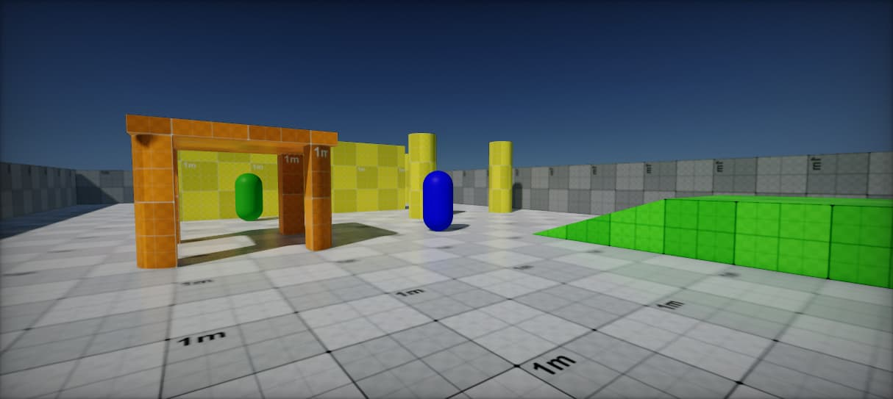

# Arizona Framework Sample

The [Arizona Framework Sample](https://github.com/FlaxEngine/ArizonaFrameworkSample) is an open-source sample project showcasing usage of the [Arizona Framework](https://github.com/FlaxEngine/ArizonaFramework) for Flax Engine.

It features a simple main menu and gameplay level with multiplayer which can be a good base for your shooter games.

