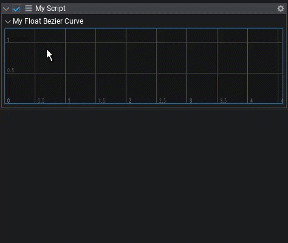

# Curve

Curves are a nice way to represent a value over a certain time. They have a lot of use cases, which include easing harsh transitions, defining different output values for different input values or a really fine tuned jump arc.

## Curve types

Flax engine provides the [`BezierCurve<T>`](https://docs.flaxengine.com/api/FlaxEngine.BezierCurve-1.html) and [`LinearCurve<T>`](https://docs.flaxengine.com/api/FlaxEngine.LinearCurve-1.html) classes to represent a **bezier-** or **linear curve**. Both come with an extensive API and editor, that allows you to quickly create, modify and utilize curves in your game.

Both curve classes have a *type wildcard* `<T>`, which you can use to make a curve represent different types, like for example `int`s, `float`s or even more complex ones like `Vector3` or `Color`. The curve editor will adapt based on which type the curve has.

## Curve editor

The curve editor provides an easy and intuitive way to edit and visualize a curve.

### Adding and editing curve points

You can pan the editor by moving the mouse while the right mouse button is pressed down. Double click anywhere in the curve editor to create a new curve point. To move a point, click and drag on it. You can double click an existing point to edit its values, like the time, value, or in the case of a bezier curve, the easing.

To bring up a menu with more edit options, right click anywhere in the curve editor. It allows you to copy and paste a point, edit multiple curve points at once, reset the view or show the whole curve. The latter one can also be done by pressing *F* on your keyboard.

### Curve presets

It is also possible to apply a preset to your curve: Simply bring up the right click menu, go to "*Apply Preset*" and chose the preset you want to apply.

### Resizing

The curve editor can be resized horizontally by dragging on the bottom bar, right below its horizontal scrollbar.



## Example

This sample script will show you how to use curves:

```cs
public class CustomCurve : Script
{
    public BezierCurve<float> FloatCurve = new BezierCurve<float>(new BezierCurve<float>.Keyframe(0, 0), new BezierCurve<float>.Keyframe(1, 1));

    public BezierCurve<Vector2> Vector2Curve = new BezierCurve<Vector2>();

    public BezierCurve<Vector3> Vector3Curve = new BezierCurve<Vector3>();

    private float start;
    public float speed = 0.1f;

    public override void OnStart()
    {
        start = Time.GameTime;
    }

    public override void OnUpdate()
    {
        var time = (Time.GameTime - start) * speed;

        // Access the curve's data
        FloatCurve.Evaluate(out float floatValue, time);
        Vector2Curve.Evaluate(out Vector2 vector2value, time);
        Vector3Curve.Evaluate(out Vector3 vector3value, time);

        Debug.Log($"At {time}: float: {floatValue}, vec2: {vector2value}, vec3: {vector3value}")
    }
}
```

