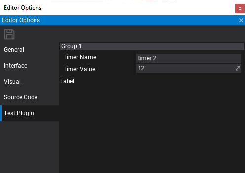

# Custom Editor Options



**Custom Editor Options** can be used to extend the default editor options. Also, it's a very unified way for plugins to inject custom options into the editor. In this tutorial, you will learn how to define, create and use custom editor settings right in your game or an editor plugin.

To learn more about plugins see related page [here](../plugins/index.md).

## Example code

The full source code of the implemented editor plugin with options:

```cs
public class TestPlugin : EditorPlugin
{
	// The custom options key used to idenify them
    public const string SettingsName = "Test Plugin";

	// Custom options object that defines the data layout
    [CustomEditor(typeof(CustomOptionsEditor))]
    public class CustomOptions
    {
        [EditorOrder(0), EditorDisplay("Group 1"), Tooltip("My tooltip!")]
        public string TimerName = "timer 1";

        [EditorOrder(10), EditorDisplay("Group 1")]
        public float TimerValue = 11.0f;
    }

    // Optional custom editor for the options object
    public class CustomOptionsEditor : GenericEditor
    {
        public override void Initialize(LayoutElementsContainer layout)
        {
            base.Initialize(layout);

            layout.Label("Label");
        }
    }

    public override void InitializeEditor()
    {
        base.InitializeEditor();

		// Register custom options type
        Editor.Options.AddCustomSettings(SettingsName, () => new CustomOptions());

		// Access editor options
        var options = Editor.Options.Options.GetCustomSettings<CustomOptions>(SettingsName);
        Debug.Log("Editor options: " + options.TimerName + ", " + options.TimerValue);
    }

    public override void DeinitializeEditor()
    {
    	// Cleanup on end
        Editor.Options.RemoveCustomSettings(SettingsName);

        base.DeinitializeEditor();
    }
}
```
