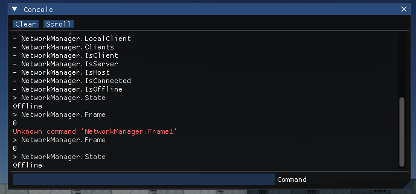

# Debug Commands

`DebugCommand` is an attribute that can be placed on classes, fields, methods, and properties to expose them to Debug Commands interface which can be used for configuration, modding, or tooling.

> [!TIP]
> Only `static` members can be used in debug commands.

## Access

### Output Log


[Output Log](../../editor/windows/output-log.md) is Editor window that displays the full log. At the bottom of that window, there is an input command field that can be used to run commands. You can type commands with an automatic search popup that displays similar commands based on the entered value. Use arrow keys to navigate around that popup list. The tab key can be used to autocomplete commands based on the best-found match. Finally, when input is empty you can use the arrow up key to navigate around the command history and re-try one of them again.

### In-game console



Debug Commands can appear within an in-game console or debug tooling. For example, [Arizona Framework](https://github.com/FlaxEngine/ArizonaFramework) implements console via [ImGui](https://github.com/FlaxEngine/ImGui). Such tool can be useful when developing games for various platforms and devices such as consoles where game configurations can be tweaked at runtime.

### `DebugCommands` API

Use `DebugCommands` class to execute or list debug commands within the project. It caches all commands for engine, game, and plugin projects.

Example usage:

# [C#](#tab/code-csharp)
```cs
// Disable vsync
DebugCommands.Execute("Graphics.UseVSync false");
```
# [C++](#tab/code-cpp)
```cpp
// Disable vsync
DebugCommands::Execute(TEXT("Graphics.UseVSync false"));
```
***

## Example

# [C#](#tab/code-csharp)
```cs
using FlaxEngine;

/// <summary>
/// Global gameplay configs.
/// </summary>
[DebugCommand]
public static class GameGlobals
{
    /// <summary>
    /// Disables player damage.
    /// </summary>
    public static bool GodMode = false;
}

/// <summary>
/// Player script.
/// </summary>
public class PlayerLogic : Script
{
    /// <summary>
    /// Player speed scale.
    /// </summary>
    [DebugCommand]
    public static float SpeedScale = 1.0f;

    /// <summary>
    /// Restores player HP to max.
    /// </summary>
    [DebugCommand]
    public static void HealPlayer()
    {
        //..
    }
}
```
# [C++](#tab/code-cpp)
```cpp
// Global gameplay configs.
API_CLASS(Static, Attributes="DebugCommand") class GAME_API GameGlobals
{
    DECLARE_SCRIPTING_TYPE_NO_SPAWN(GameGlobals);
public:
    // Disables player damage.
    API_FIELD() static bool GodMode;
};

// Player script.
API_CLASS() class GAME_API PlayerLogic : public Script
{
    API_AUTO_SERIALIZATION();
    DECLARE_SCRIPTING_TYPE(PlayerLogic);
public:
    // Player speed scale.
    API_FIELD(Attributes="DebugCommand") static float SpeedScale;

    // Restores player HP to max.
    API_FUNCTION(Attributes="DebugCommand") static void HealPlayer();
};
```
***
