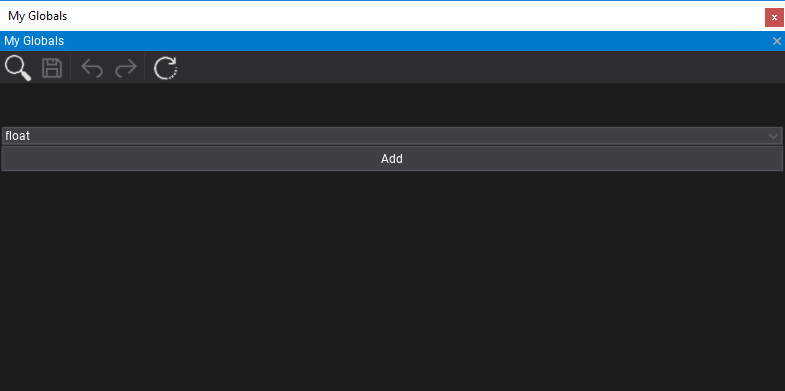
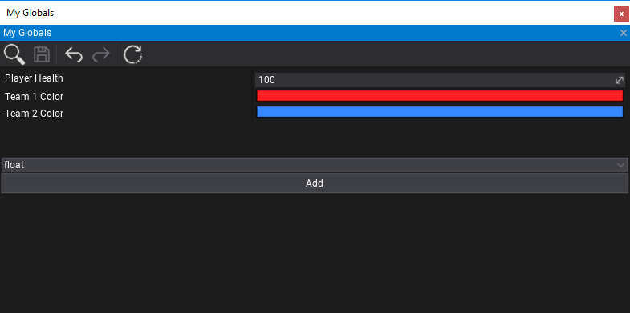
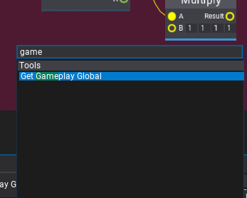
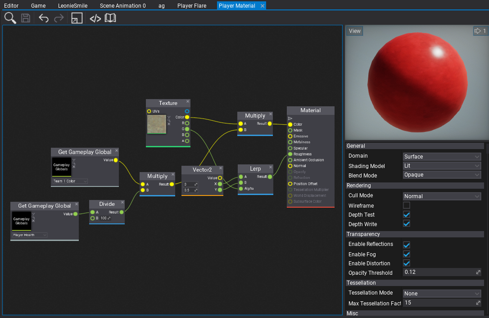

# Gameplay Globals

When creating more complex game systems that rely on the content or when creating technical art it's often useful to give global parameters that can affect the whole gameplay. For example, player team color, wind direction, wind speed or other weather parameters. **Gameplay Globals** asset contains a list of named parameters that can be accessed globally in the project including materials, animations, and particles. Their values can be set by the artist in the editor or driven from code. This vastly improves production speed and gives game developers a great tool to enrich the content of their games.

This documentation page explains how to create and use gameplay globals in your project.

## Creation

Use *Content Window* and *right-click*, then choose **New -> Gameplay Globals**, type asset name and confirm with enter. Then *double-click* to open the asset editor.



Now, you can specify the parameter type and use the Add button. After adding a new parameter you can rename it by double-clicking on the name label and edit the default value. In-play mode the editor window displays the current runtime values that can be previewed or edited. You can also restore the default values with the last toolbar button.



To remove the gameplay global right-click on it's name label and press Delete button.

> [!TIP]
> Remember to save the asset after editing to reflect those changes in editor.

## Usage in assets

Gameplay Globals can be accessed in all graph-based assets such as: materials, particle emitters and animation graph. To do so use the **Get Gameplay Global** node.



Then select the asset and pick the global variable to read.




## Usage in code

Gameplay Globals support scripting API for accessing the variables at runtime.

```cs
using FlaxEngine;

public class GameplayGlobalsSet : Script
{
    public GameplayGlobals MyGlobals;
    public float PlayerHealth = 100;

    public override void OnStart()
    {
        // Print globals values to the log
        var values = MyGlobals.Values;
        foreach (var value in values)
            Debug.Log(value.Key + " = " + value.Value);
    }

    public override void OnDisable()
    {
        // Restore the default state
        MyGlobals.ResetValues();
    }

    public override void OnUpdate()
    {
        // Update the player health
        MyGlobals.SetValue("Player Health", PlayerHealth);
    }
}
```

You can also create virtual Gameplay Globals assets from code and save it to project in case of code-generated procedural content.
