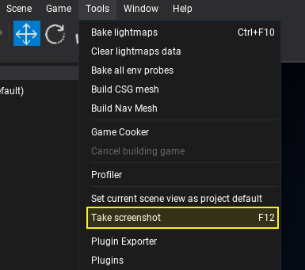
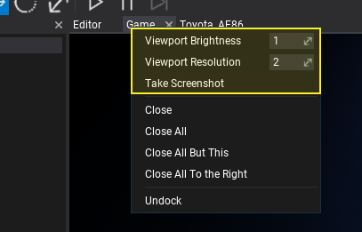

# Screenshots

Flax contains in-build screenshots taking utility. It captures the contents of the render target or the scene rendering task output and saves it to the file.

## Example code

Here is an example usage code that captures the screenshot of the game viewport and saves it to file.

```cs
// Pick a path to the output file
var path = Path.Combine(Environment.GetFolderPath(Environment.SpecialFolder.Desktop), "screenshot.png");

// Capture game screen to file (done in async)
FlaxEngine.Screenshot.Capture(MainRenderTask.Instance, path);
```

You can also use the in-build feature to render targets capturing and save the GPU texture to the file. The capture method will create an async task that will download the data from the GPU texture back to the CPU staging texture and save it to the file. If you're using the staging textures manually the capture methods work immediately on that data.

This feature works both in Editor and at runtime on all supported platforms.

## In Editor



To take a screenshot of the focused game view or game edit view you can use **F12** key or main menu option **Tools -> Take Screenshot**.



If you want to take **high-resolution** screenshot of the game viewport you can *right-click* on the dock window tab and use the option to increase the resolution scale (eg. to 2) and then use additional option for screenshot taking. Saved images are stored in the **project folder/Screenshots** directory.
