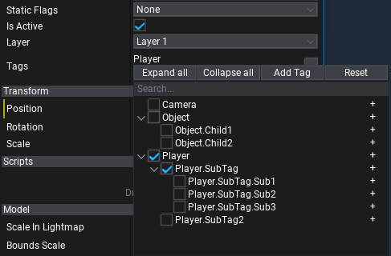

# Tags

Gameplay tag that represents a hierarchical name of the form `X.Y.Z` (namespaces separated with a dot). Tags are defined in project [LayersAndTagsSettings](../../editor/game-settings/layers-and-tags-settings.md) asset but can be also created from code.

Scripting API contains the structure `Tag` which holds index of the tag in a global `Tags.List` array. Tags comparison is very fast (`int32` compare), also single tag uses very little memory (4 bytes). Scripting API  `Tags` contains utilities for using tag lists such as `HasTag`/`HasTagExact`/`HasAny`/`HasAnyExact`/`HasAll`/`HasAllExact` which use an array of tags (`Tag[]` in C#, `Array<Tag>` in C++).

## Actor Tags

Every actor contains list of tags (`Actor.Tags`) and various utilities for quick checking for a tag (`Actor.HasTag`). Actors can be marked with specific tags to be used by different gameplay systems. For example, player rigidbody and collider can be marked with a tag `Player` to distinguish them when processing collision events or when calculating hit damage in a shooter game.

## Tag Editor



`Tag` and `Tag[]` are displayed in the properties panel with the ability to edit them via tree hierarchy. Each tag can contain nested child nodes. Tags can be selected via checkboxes. Each node has a plus (`+`) button on the right side which can be used to add a sub-tag to the list. Utility buttons on the top can help to edit tags, and the search field allows filtering tags by name.

## Scripting

Follow code examples below to use tags in your gameplay code:

# [C#](#tab/code-csharp)
```cs
using FlaxEngine;

public class MyScript : Script
{
    private BoxCollider _trigger;
    public Tag PlayerTag = Tags.Get("Player");
    public Tag[] EnemyTags;

    /// <inheritdoc />
    public override void OnEnable()
    {
        _trigger = Level.FindActor(Tags.Get("ObjectDetector")) as BoxCollider;
        if (_trigger)
            _trigger.TriggerEnter += OnTriggerEnter;
    }

    /// <inheritdoc />
    public override void OnDisable()
    {
        if (_trigger)
            _trigger.TriggerEnter -= OnTriggerEnter;
    }

    private void OnTriggerEnter(PhysicsColliderActor other)
    {
        if (other.HasTag(PlayerTag))
        {
            Debug.Log("Player entered trigger");
        }
        else if (other.Tags.HasAny(EnemyTags))
        {
            Debug.Log("Enemy entered trigger");
        }
    }
}
```
# [C++](#tab/code-cpp)
```cpp
#pragma once

#include "Engine/Core/Log.h"
#include "Engine/Level/Level.h"
#include "Engine/Scripting/Script.h"
#include "Engine/Scripting/ScriptingObjectReference.h"
#include "Engine/Physics/Colliders/BoxCollider.h"

API_CLASS()
class GAME_API MyScript : public Script
{
    API_AUTO_SERIALIZATION();
    DECLARE_SCRIPTING_TYPE(MyScript);
private:
    ScriptingObjectReference<BoxCollider> _trigger;

public:
    API_FIELD() Tag PlayerTag = Tags::Get(TEXT("Player"));
    API_FIELD() Array<Tag> EnemyTags;

    void OnEnable() override
    {
        _trigger = Cast<BoxCollider>(Level::FindActor(Tags::Get(TEXT("ObjectDetector"))));
        if (_trigger)
            _trigger->TriggerEnter.Bind<MyScript, &MyScript::OnTriggerEnter>(this);
    }
    void OnDisable() override
    {
        if (_trigger)
            _trigger->TriggerEnter.Unbind<MyScript, &MyScript::OnTriggerEnter>(this);
    }

private:
    void OnTriggerEnter(PhysicsColliderActor* other)
    {
        if (other->HasTag(PlayerTag))
        {
            LOG(Info, "Player entered trigger");
        }
        else if (Tags::HasAll(other->Tags, EnemyTags))
        {
            LOG(Info, "Enemy entered trigger");
        }
    }
};
```
***

