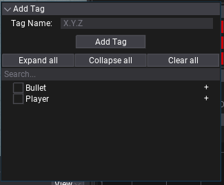

# Tags

Flax has the concept of **tags**, which are can be used to mark an actor as part of a group (not to be confused with [Static Flags](https://docs.flaxengine.com/api/FlaxEngine.StaticFlags.html) or [Layers](https://docs.flaxengine.com/manual/editor/game-settings/layers-and-tags-settings.html)) or to track state by using the **tags** as a way to represent booleans.

## Tags in Flax Engine

In case you are not familiar with what a **tag** is in the context of Flax Engine, similar terms you might recognize are "*label*", "*keyword*", "*marker*" or "*identifier*".  

They are represented in a hierarchical form as `X.Y.Z` (**tags** separated with a dot) and can be defined in a Flax project's [LayersAndTagsSettings](../../editor/game-settings/layers-and-tags-settings.md) settings, or be created from code.

As mentioned before, they are most commonly used to tag actors, but it is also possible to have an array of **tags** anywhere in your code, without the need for an *Actor* that holds the **tags**.

## Actor Tags

Every *Actor* contains a list of **tags** ([`Actor.Tags`](https://docs.flaxengine.com/api/FlaxEngine.Actor.html#FlaxEngine_Actor_Tags)) and an utility method for quick checking for a **tag** on the *Actor* with [`Actor.HasTag`](https://docs.flaxengine.com/api/FlaxEngine.Actor.html#FlaxEngine_Actor_HasTag). 

These can be edited in the *Properties Panel* under the *General/Tags* section by clicking the three dot button (`...`).

Actors can be marked with specific **tags** to be used by different gameplay systems. A common use case is to distinguish between objects on the same *Layer* when processing a physics result, like for example a raycast or collision.

## Tag Editor

[`Tag`](https://docs.flaxengine.com/api-cpp/Tag.html) and `Tag[]` are represented in the *Properties Panel* by a dedicated editor, which allows to edit and visualize them in a tree hierarchy.

**Tags** can be added or removed by ticking or unticking the **tag**'s checkbox. Each **tag** has a plus (`+`) button on the right side which can be used to add a **sub-tag** to the current **tag**. Utility buttons on the top of the editor provide quick access to frequently used actions and the search field allows to filter **tags** by their name. It is also possible to quickly add a new **tag** in the format of `X.Y.Z` via the *Add Tag* section.



## Tags in the Scripting API

The scripting API contains the struct [`Tag`](https://docs.flaxengine.com/api-cpp/Tag.html), which holds the index of the tag in a global `Tags.List` array. The [`Tags`](https://docs.flaxengine.com/api-cpp/Tags.html) class contains utilities for comparing two arrays of [`Tag`](https://docs.flaxengine.com/api-cpp/Tag.html)s, like checking the array has a specific tag ([`HasTag()`](https://docs.flaxengine.com/api-cpp/Tags.html#Tags_HasTag_const_Array_Tag____const_Tag_)) or to check if the first array has any of the [`Tag`](https://docs.flaxengine.com/api-cpp/Tag.html)s from the second array ([`HasAny()`](https://docs.flaxengine.com/api-cpp/Tags.html#Tags_HasAny_const_Array_Tag____const_Array_Tag____)). 

**Tag** comparison is very fast (`int32` comparison) and memory usage is only 4 bytes per **tag**. 

## Code Example

Follow these code examples to use **tags** in your gameplay code:

# [C#](#tab/code-csharp)
```cs
using FlaxEngine;

public class MyScript : Script
{
    private BoxCollider _trigger;
    public Tag PlayerTag = Tags.Get("Player");
    public Tag[] EnemyTags;

    public override void OnEnable()
    {
        _trigger = Level.FindActor(Tags.Get("ObjectDetector")) as BoxCollider;
        if (_trigger)
            _trigger.TriggerEnter += OnTriggerEnter;
    }

    public override void OnDisable()
    {
        if (_trigger)
            _trigger.TriggerEnter -= OnTriggerEnter;
    }

    private void OnTriggerEnter(PhysicsColliderActor other)
    {
        if (other.HasTag(PlayerTag))
        {
            Debug.Log("Player entered trigger");
        }
        else if (other.Tags.HasAny(EnemyTags))
        {
            Debug.Log("Enemy entered trigger");
        }
    }
}
```
# [C++](#tab/code-cpp)
```cpp
#pragma once

#include "Engine/Core/Log.h"
#include "Engine/Level/Level.h"
#include "Engine/Scripting/Script.h"
#include "Engine/Scripting/ScriptingObjectReference.h"
#include "Engine/Physics/Colliders/BoxCollider.h"

API_CLASS()
class GAME_API MyScript : public Script
{
    API_AUTO_SERIALIZATION();
    DECLARE_SCRIPTING_TYPE(MyScript);
private:
    ScriptingObjectReference<BoxCollider> _trigger;

public:
    API_FIELD() Tag PlayerTag = Tags::Get(TEXT("Player"));
    API_FIELD() Array<Tag> EnemyTags;

    void OnEnable() override
    {
        _trigger = Cast<BoxCollider>(Level::FindActor(Tags::Get(TEXT("ObjectDetector"))));
        if (_trigger)
            _trigger->TriggerEnter.Bind<MyScript, &MyScript::OnTriggerEnter>(this);
    }
    void OnDisable() override
    {
        if (_trigger)
            _trigger->TriggerEnter.Unbind<MyScript, &MyScript::OnTriggerEnter>(this);
    }

private:
    void OnTriggerEnter(PhysicsColliderActor* other)
    {
        if (other->HasTag(PlayerTag))
        {
            LOG(Info, "Player entered trigger");
        }
        else if (Tags::HasAll(other->Tags, EnemyTags))
        {
            LOG(Info, "Enemy entered trigger");
        }
    }
};
```
***

