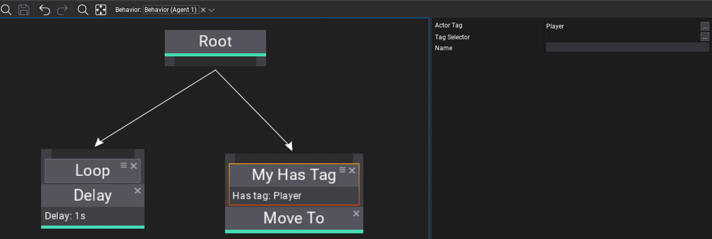

# HOWTO: Create a custom Behavior Tree decorator



Behavior Trees are very extensible meaning you can create own node types in your game project or use the ones from engine and plugins. Each node can define custom logic, contain properties and store runtime state (per-instance).

> [!Warning]
> Please keep in mind that Behavior execution is done in async via Job System (`Behavior.System`).

## Custom decorator node

Below is an example of a custom decorator that checks if a specific gameplay conditions are met. This showcase how Behavior Tree can interact with gameplay code.

# [C#](#tab/code-csharp)
```cs
using FlaxEngine;

/// <summary>
/// Simple node decorator.
/// </summary>
public class MyHasTagDecorator : BehaviorTreeDecorator
{
    /// <summary>
    /// Checks if behavior agent running this BT has a specific actor tag assigned. Used only if TagSelector is unused.
    /// </summary>
    public Tag ActorTag;

    /// <summary>
    /// Checks if behavior agent running this BT has a specific actor tag assigned. If set Tag is unused.
    /// </summary>
    public BehaviorKnowledgeSelector<Tag> TagSelector;

    /// <inheritdoc />
    public override bool CanUpdate(BehaviorUpdateContext context)
    {
        if (!TagSelector.TryGet(context.Knowledge, out var tag))
            tag = ActorTag;
        var agent = context.Behavior.Actor;
        // Here you can interact with level or gameplay objects (be aware that this code runs in async by default)
        return agent.HasTag(tag);
    }

#if FLAX_EDITOR
    /// <inheritdoc />
    public override string GetDebugInfo(BehaviorUpdateContext context)
    {
        if (!TagSelector.TryGet(context.Knowledge, out var tag))
            tag = ActorTag;
        return string.Format("Has tag: {0}", tag);
    }
#endif
}
```
# [C++](#tab/code-cpp)
```cpp
#pragma once

#include "Engine/AI/BehaviorTreeNode.h"
#include "Engine/AI/BehaviorKnowledgeSelector.h"
#include "Engine/Scripting/ScriptingObjectReference.h"

/// <summary>
/// Simple node decorator.
/// </summary>
API_CLASS() class MYPROJECT_API MyHasTagDecorator : public BehaviorTreeDecorator
{
    DECLARE_SCRIPTING_TYPE(MyHasTagDecorator);
    API_AUTO_SERIALIZATION();
    
    /// <summary>
    /// Checks if behavior agent running this BT has a specific actor tag assigned. Used only if TagSelector is unused.
    /// </summary>
    API_FIELD() Tag ActorTag;
    
    /// <summary>
    /// Checks if behavior agent running this BT has a specific actor tag assigned. If set Tag is unused.
    /// </summary>
    API_FIELD() BehaviorKnowledgeSelectorAny TagSelector;

public:
    // [BehaviorTreeNode]
    bool CanUpdate(const BehaviorUpdateContext& context) override
    {
        Tag tag = ActorTag;
        Variant value;
        if (TagSelector.TryGet(context.Knowledge, value))
        {
            if (auto* e = value.AsStructure<Tag>())
                tag = *e;
        }
        auto agent = context.Behavior->GetActor();
        // Here you can interact with level or gameplay objects (be aware that this code runs in async by default)
        return agent->HasTag(tag);
    }
#if USE_EDITOR
    String GetDebugInfo(const BehaviorUpdateContext& context) const override
    {
        Tag tag = ActorTag;
        Variant value;
        if (TagSelector.TryGet(context.Knowledge, value))
        {
            if (auto* e = value.AsStructure<Tag>())
                tag = *e;
        }
        return String::Format(TEXT("Has tag: {0}"), tag.ToString());
    }
#endif
};

inline MyHasTagDecorator::MyHasTagDecorator(const SpawnParams& params)
    : BehaviorTreeDecorator(params)
{
}
```
***
