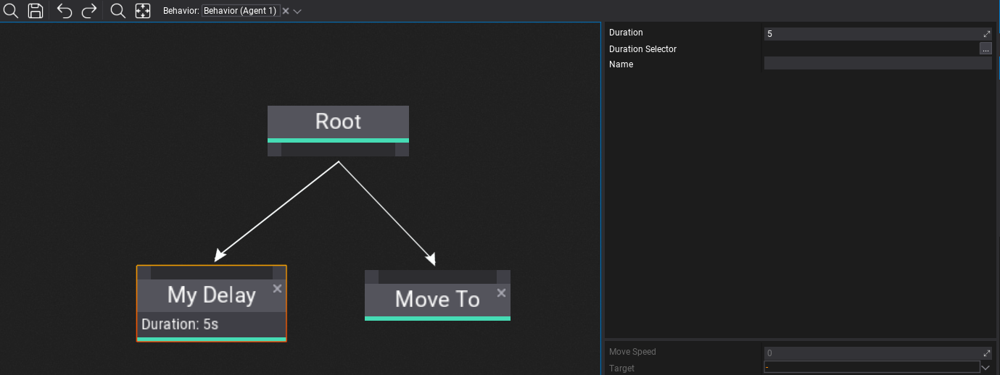

# HOWTO: Create a custom Behavior Tree node



Behavior Trees are very extensible meaning you can create own node tpyes in your game project or use the ones from engine and plugins. Each node can define custom logic, contain properties and store runtime state (per-instance).

> [!Warning]
> Please keep in mind that Behavior execution is done in async via Job System (`Behavior.System`).

## Custom delay node

Below is an example of a custom node that waits a specific amount of time before graph execution can continue to another node. It stores the time left value per-instance (data cached for each node, for each behavior using it).

# [C#](#tab/code-csharp)
```cs
using System.Runtime.InteropServices;
using FlaxEngine;

/// <summary>
/// Simple delay node.
/// </summary>
public class MyDelayNode : BehaviorTreeNode
{
    // Node state container (allocated per active node, see InitState/ReleaseState)
    [StructLayout(LayoutKind.Sequential)]
    private struct State
    {
        public float TimeLeft;
        public Actor ObjectRef;
    }

    /// <summary>
    /// Delay duration (in seconds). Used only if DurationSelector is unused.
    /// </summary>
    public float Duration = 5.0f;

    /// <summary>
    /// Delay duration selector. If set Duration is unused.
    /// </summary>
    public BehaviorKnowledgeSelector<float> DurationSelector;

    /// <inheritdoc />
    public override int GetStateSize()
    {
        // Return size of the per-instance node memory to allocate
        return GetStateSize<State>();
    }

    /// <inheritdoc />
    public override void InitState(BehaviorUpdateContext context)
    {
        // Initialize state and assign it
        var state = new State
        {
            TimeLeft = Duration,
            ObjectRef = context.Behavior.Actor, // State can contain object references
        };
        if (DurationSelector.TryGet(context.Knowledge, out var duration))
            state.TimeLeft = duration;
        NewState(context.Memory, state);
    }

    /// <inheritdoc />
    public override void ReleaseState(BehaviorUpdateContext context)
    {
        // Free node state (eg. object references)
        ref var state = ref GetState<State>(context.Memory);
        state.ObjectRef = null;
        FreeState(context.Memory);
    }

    /// <inheritdoc />
    public override BehaviorUpdateResult Update(BehaviorUpdateContext context)
    {
        // Decrement timer by the current update delta and keep running until it's above 0
        ref var state = ref GetState<State>(context.Memory);
        state.TimeLeft -= context.DeltaTime;
        return state.TimeLeft <= 0.0f ? BehaviorUpdateResult.Success : BehaviorUpdateResult.Running;
    }

#if FLAX_EDITOR
    /// <inheritdoc />
    public override string GetDebugInfo(BehaviorUpdateContext context)
    {
        // Editor-only debug text (shown under node title, can be multiline)
        if (context.Knowledge)
        {
            ref var state = ref GetState<State>(context.Memory);
            return string.Format("Time left: {0}s", state.TimeLeft);
        }

        // Context might not contain state at edit-time so display defaults
        if (!string.IsNullOrEmpty(DurationSelector.Path))
            return string.Format("Duration: {0}", DurationSelector);
        return string.Format("Duration: {0}s", Duration);
    }
#endif
}
```
# [C++](#tab/code-cpp)
```cpp
#pragma once

#include "Engine/AI/BehaviorTreeNode.h"
#include "Engine/AI/BehaviorKnowledgeSelector.h"
#include "Engine/Scripting/ScriptingObjectReference.h"

/// <summary>
/// Simple delay node.
/// </summary>
API_CLASS() class MYPROJECT_API MyDelayNode : public BehaviorTreeNode
{
    DECLARE_SCRIPTING_TYPE(MyDelayNode);
    API_AUTO_SERIALIZATION();

    /// <summary>
    /// Delay duration (in seconds). Used only if DurationSelector is unused.
    /// </summary>
    API_FIELD() float Duration = 5.0f;

    /// <summary>
    /// Delay duration selector. If set Duration is unused.
    /// </summary>
    API_FIELD() BehaviorKnowledgeSelector<float> DurationSelector;

public:
    // [BehaviorTreeNode]
    int32 GetStateSize() const override
    {
        // Return size of the per-instance node memory to allocate
        return sizeof(State);
    }
    void InitState(const BehaviorUpdateContext& context) override
    {
        // Initialize state and assign it
        auto state = GetState<State>(context.Memory);
        new(state)State();
        state->TimeLeft = Duration;
        state->ObjectRef = context.Behavior->GetActor(); // State can contain object references
        DurationSelector.TryGet(context.Knowledge, state->TimeLeft);
    }
    void ReleaseState(const BehaviorUpdateContext& context) override
    {
        // Free node state (eg. object references)
        auto state = GetState<State>(context.Memory);
        state->~State();
    }
    BehaviorUpdateResult Update(const BehaviorUpdateContext& context) override
    {
        // Decrement timer by the current update delta and keep running until it's above 0
        auto state = GetState<State>(context.Memory);
        state->TimeLeft -= context.DeltaTime;
        return state->TimeLeft <= 0.0f ? BehaviorUpdateResult::Success : BehaviorUpdateResult::Running;
    }
#if USE_EDITOR
    String GetDebugInfo(const BehaviorUpdateContext& context) const override
    {
        // Editor-only debug text (shown under node title, can be multiline)
        if (context.Knowledge)
        {
            auto state = GetState<State>(context.Memory);
            return String::Format(TEXT("Time left: {0}s"), state->TimeLeft);
        }
        // Context might not contain state at edit-time so display defaults
        if (DurationSelector.Path.HasChars())
            return String::Format(TEXT("Duration: {0}"), DurationSelector.ToString());
        return String::Format(TEXT("Duration: {0}s"), Duration);
    }
#endif

private:
    struct State
    {
        float TimeLeft;
        ScriptingObjectReference<Actor> ObjectRef;
    };
};

inline MyDelayNode::MyDelayNode(const SpawnParams& params)
    : BehaviorTreeNode(params)
{
}
```
***
