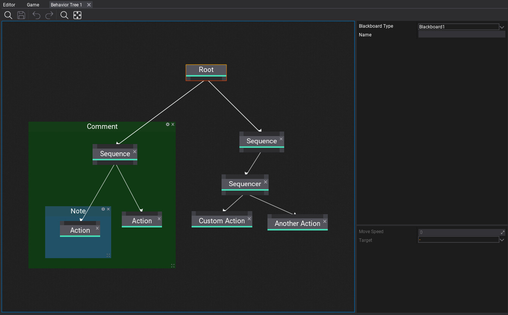
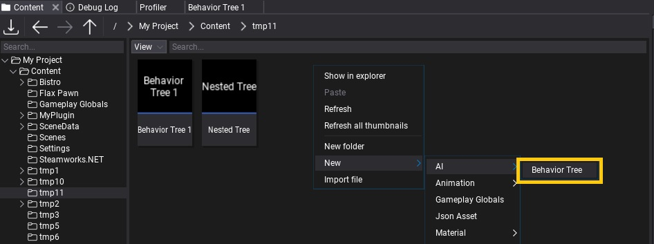
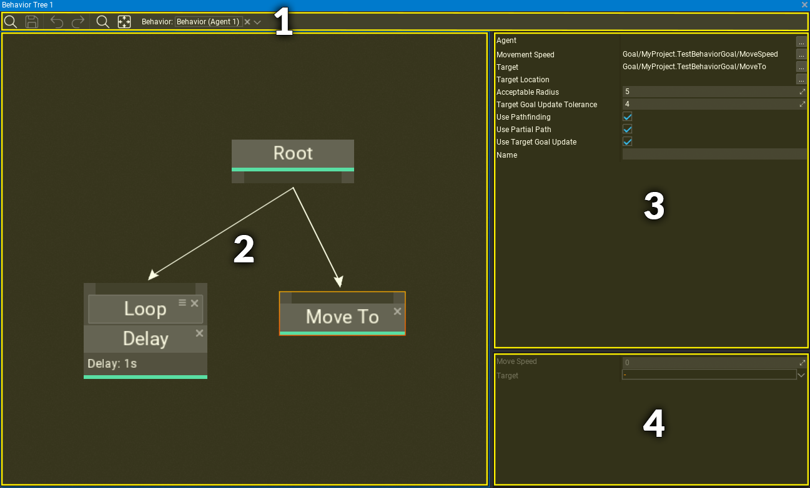
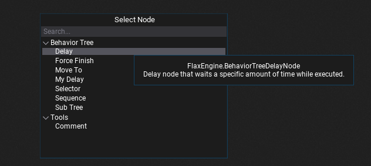
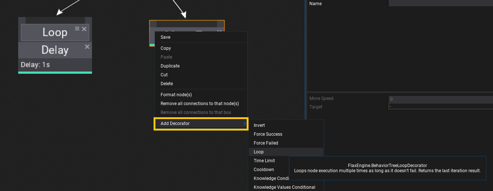
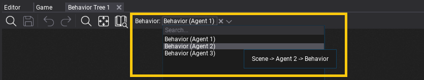

# Behavior Trees

**Behavior trees** (shortened as **BT**) are a popular AI technique used in many computer games to design and simulate intelligent characters, agents, or objects. A behavior tree is a combination of many different AI techniques: hierarchical state machines, planning, scheduling, and action execution. The key advantage of behavior trees is that they are quite easy to understand and can be created with visual editing tools rather than code-only.

In this documentation section, you will learn how to create and use Behavior Trees.

## In this section

* [Behavior Knowledge](knowledge.md)
* [Behavior](behavior.md)
* [Behavior Tree Nodes](nodes.md)
* [Behavior Tree Decorators](decorators.md)
* [How to create a custom Behavior Tree node](custom-node.md)
* [How to create a custom Behavior Tree decorator](custom-decorator.md)
* [How to create a custom Move To node](custom-move-to.md)

## Create Behavior Tree

To create a new Behavior Trees asset, simply navigate to the Content directory in the *Content* window, then right-click and choose option **New -> AI -> Behavior Tree**. Specify its name and press *Enter*.

## Behavior Tree editor window

Behavior Tree editor window contains:
1. **Toolstrip** - utility buttons such as saving or undo control, contains picker with Behavior to debug
2. **Visual Surface** - the nodes graph editor
3. **Selected node properties** - shows properties of selected node(s)
4. **Knowledge properties** - shows Behavior Knowledge blackboard data with goals.

### Navigation controls

Controls in the Behavior Tree Editor generally match the controls of other tools in the Flax Editor.

#### Mouse controls

| Control | Action |
|--------|--------|
| **RMB** drag on background | Pan nodes graph |
| **RMB** on background | Show node creation menu |
| **RMB** on node | Show node edit menu |
| **LMB** drag on background | Select nodes with rectangle tool |
| **LMB** on node | Select node |
| **Ctrl + LMB** on node | Toggle selection of node |
| **LMB** on node header | Move selected nodes |
| **Mouse Wheel** | Zoom in/out |

#### Keyboard controls

| Control | Action |
|--------|--------|
| **Ctrl + S** | Save the asset |
| **Ctrl + A** | Select all nodes |
| **Ctrl + C** | Copy selected nodes to the clipboard |
| **Ctrl + V** | Paste nodes from the clipboard |
| **Ctrl + X** | Cuts the selected nodes to the clipboard |
| **Ctrl + D** | Duplicate selected nodes |
| **Delete** | Delete selected nodes |
| **Escape** | Deselect nodes |
| **Arrow keys** | Move selected nodes |
| **//** | Create comment around selected nodes |

### Adding new node

In order to add a new node **right click** on a surface background and select a node type from a popup or type its name to find it. Behavior Trees can use nodes from engine, plugins and game. Also, when hovering the items with a mouse cursor the tooltip will show the documentation comments with details of every node.

### Adding new decorator

Every node can have a list of decorators (in specific order) that are additional functionality to perform checks if the node can be executed or to modify it's logic flow (eg. loop node). To add a new node **right click** on a node header, choose submenu **Add Decorator** and select a decorator type from a list. Also, when hovering the items with a mouse cursor the tooltip will show the documentation comments with details.

Decorators can be selected and edited just like regular nodes. You can change their order by dragging the icon next to the close button on each decorator.

### Connecting nodes

There are 3 types of nodes: root, composite, leaf. **Root** can contain children but is always the first node that starts the tree execution. **Composites** can have an incoming connection and a list of children to run execution of them depending on node type (eg. sequence or selector). **Leaf** nodes are action-based and usually perform a single action (instant or recurring).

Child **nodes are always executed from left to right**. Which means that placement of the nodes matters and helps to keep tree graph more readable.

### Debugging

Behavior Tree contains debugger functionality that can be used **during Play Mode** in Editor. Simply **select the target Behavior** with object picker on toolstrip.

