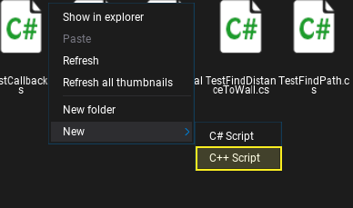
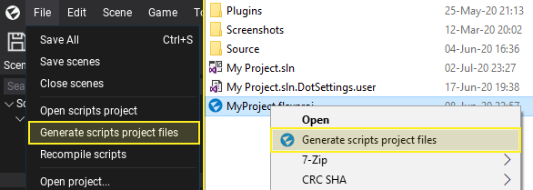
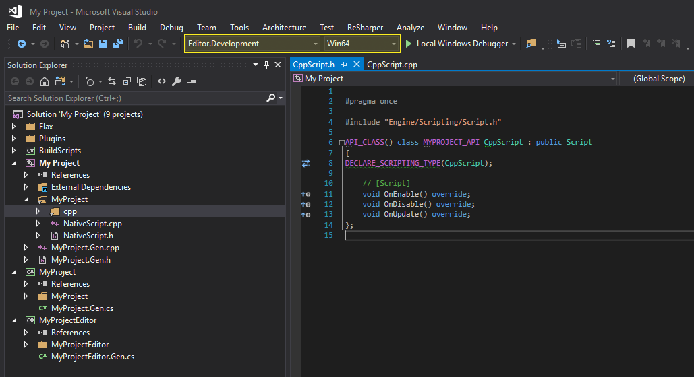
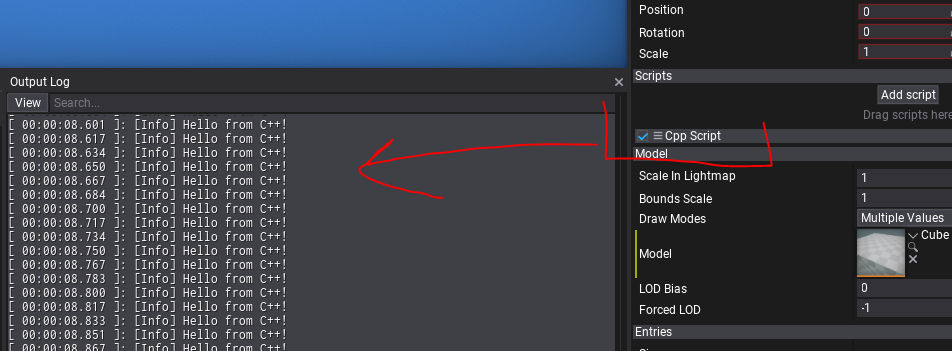

# C++ Scripting

Flax Engine supports fully C++ scripting with even more features than C# scripting. In general, C\+\+ offers more **performance** and allows to **access engine API directly** which comes with many benefits. Flax Engine is mostly written in C\+\+ with C# flavor which means you can easily build the game on top of the engine. Also, Flax uses its own build tool called [Flax.Build](../../editor/flax-build/index.md) to compile both engine and game.

Follow this documentation section to learn how to write your own C\+\+ scripts and use them in a game. Also, if you see any code examples in the *Flax Documentation* that are written in C# you can similarly use them in C\+\+ scripts since the engine uses the same API in both languages (you can even move your existing game code from C# to C\+\+ quite quickly).

## Setup

Flax Editor contains in-build C# compiler for scripts but for C\+\+ scripting the platform-dependent toolset is required to be installed in the machine. Every platform uses its own native tools. To learn about them see this [page](../../platforms/index.md). Below you can learn quickly how to setup depending on your platform.

#### Windows

* Install **Visual Studio 2019** or 2017 or 2015 ([download](https://visualstudio.microsoft.com/en/vs/community/))
* Install **Windows 10 SDK** (or Windows 8.1 SDK)
* Install **Microsoft Visual C++ 2015 v140 toolset**

#### Linux

* Install [Visual Studio Code](https://code.visualstudio.com/)
* Install [Mono](https://www.mono-project.com/download/stable/)
* Get compiler `sudo apt-get install clang-7 lldb-7 lld-7`

## How to create C++ script?

By default, new Flax projects have default game module using C# scripting. You can learn more about modules and targets [here](../../editor/flax-build/index.md). After installing requried tools, open `Scripts/<module_name>/<module_name>.Gen.cs` (i.e. `Scripts/Game/Game.Gen.cs`). This file is a build script for the code module and can specify its build environment and dependencies. It contains overriden **Setup(BuildOptions options)** method which performs the module initialization.

Find the `BuildNativeCode = false` line and change the value to `true` or add the following code at the end of the method:

```cs
BuildNativeCode = true;
```

Now, you can **add new C\+\+ script** to the project and they will be compiled into the binary libraries and loaded by the engine. To do so, navigate in *Content Window* to that module sources folder `Scripts/<module_name>`, *right-click* and choose option **C++ Script**. Specify its name and confirm with *Enter*.



Using Editor main menu **generate scripts project files** or right-click on a game project file and choose a similar option.



After that open the code project (eg. Visual Studio Solution). Ensure to use **Editor.Development** configuration and **Win64** platform (if you're working on Windows).



As you can see, Editor generated a simple Script from a template that overrides `OnEnable`, `OnDisable`, and `OnUpdate` methods similar to C# scripts. Open created `.cpp` file and add following code on top to include debug logging:

```cpp
#include "Engine/Core/Log.h"
```

Then add simple log instruction in `OnUpdate` method:

```cpp
void CppScript::OnUpdate()
{
    LOG(Info, "Hello from C++!");
}
```

Go back to Editor so it autocompiles scripts or open it from Visual Studio with **Local Windows Debugger** button aka Debugger Start (or hit *F5*). Now, you can add the script to the Actor and see the message printed in Output Log every frame by your own C\+\+ script.



Feel free to start coding your game logic in C\+\+!

## C\+\+ scripting with Flax

Flax supports **hot-reloading C\+\+** code in Editor which greatly improves the workflow. It works in the same way as for C# scripting and can be configured in Editor Options. You can also close Editor, compile scripts from Visual Studio and open project with Visual Studio debuggeer.

In many cases before using a specific API type (eg. `PointLight` actor or `Model` asset) you have to **include a proper header file** since Flax uses paradigm *include-only-what-you-see*. But if you want easily include all common header you can include `Engine/Core/Common.h`. Also, as you've probably noticed the Visual Studio solution contains also **Flax** C\+\+ project (in Flax folder). You can freely browse the Flax code to learn more about API and available code utilities. If you downloaded the engine from Flax Store then it will contain only header files. Flax header files use **XML documentation tags** and are almost 100% documented so working with them is fairly smooth as you can quickly learn what given method/field does. Those documentation comments are later parsed by the build tool and exposed to C# for scripting and editor tooltips.

Now, to understand some basic concepts related to C\+\+ scripting in Flax let's analyze the following script that spawns decals on mouse clicks and places them at the geometry using raycast from mouse location:

```cpp
#pragma once

#include "Engine/Scripting/Script.h"
#include "Engine/Content/AssetReference.h"
#include "Engine/Content/Assets/MaterialBase.h"
#include "Engine/Input/Input.h"
#include "Engine/Level/Level.h"
#include "Engine/Level/ActorTypes/Camera.h"
#include "Engine/Level/ActorTypes/Decal.h"
#include "Engine/Serialization/JsonTools.h"
#include "Engine/Physics/Physics.h"

API_CLASS() class MYPROJECT_API MouseDecalShoot : public Script
{
API_AUTO_SERIALIZATION();
DECLARE_SCRIPTING_TYPE(MouseDecalShoot);

	// The decal material to use for spawned decals.
	API_FIELD() AssetReference<MaterialBase> DecalMaterial;

	// Spawns the decal at the given mouse screen position.
	API_FUNCTION() void SpawnDecal(const Vector2& mousePos)
	{
		// Convert mouse position into the world-space ray and perform the raycast in physics scene
		const auto ray = Camera::GetMainCamera()->ConvertMouseToRay(mousePos);
		RayCastHit hit;
		if (Physics::RayCast(ray.Position, ray.Direction, hit))
		{
			// Create decal at hit point and add it to the scene
			auto decal = New<Decal>();
			decal->Material = DecalMaterial;
			decal->SetPosition(hit.Point);
			decal->SetDirection(hit.Normal);
			Level::SpawnActor(decal);
		}
	}

	// [Script]
	void OnUpdate() override
	{
		if (Input::GetMouseButtonDown(MouseButton::Left))
		{
			SpawnDecal(Input::GetMousePosition());
		}
	}
};

inline MouseDecalShoot::MouseDecalShoot(const SpawnParams& params)
	: Script(params)
{
	// Enable ticking OnUpdate function
	_tickUpdate = true;
}
```

Some important notes to learn:
* You can use raw pointers to the assets but the safe way is with `AssetReference<T>` or `WeakAssetReference<T>`
* To reference scene objects and other scripts in a safe way `ScriptingObjectReference<T>` is preferred
* Scripting classes can be visible in Editor and C# scripting needs to have `API_CLASS()` meta macro before and `DECLARE_SCRIPTING_TYPE(<typename>);` added
* By default script objects contain a constructor that takes a single parameter `const SpawnParams& params`
* To expose a field into the editor and C# scripting use `API_FIELD()` prefix macro that can contain additional metadata attributes
* To expose a function to the editor and C# scripting use `API_FUNCTION` prefix macro
* You can use engine API similar to C# (eg. Camera, Physics, Input...)
* The `<module_name>_API` define used between `class` and class name (i.e. `class MYPROJECT_API MouseDecalShoot`) is to export the C++ class to public module symbols so it can be used by other code
* You can manually override `Serialize`/`Deserialize` method or use `API_AUTO_SERIALIZATION` macro to automatically generate serialziation code for the type (for classes and structures that inherit from `ISerializable`)
* If your game module uses types from various engine modules (eg. Graphics, Physics) you have to add a reference to the in a build script so build tools can handle modules dependencies and properly link binaries - simply add `options.PublicDependencies.Add("<module_name>");` in you build script (where module name is Physics/Terrain/etc. - see BuildScripts for all modules you can use)

To learn about **API_** tags see [this documentation](../../editor/flax-build/api-tags.md).

Also, since C# and C\+\+ API are very similar you can use this [API reference](https://docs.flaxengine.com/api/FlaxEngine.html).

## Interop with C# #

To call C# from C\+\+ you need to use engine managed scripting wrappers `MClass` and `MMethod` as in the following example:

```cs
public void CallMe()
{
   // Code in C#
}
```

```cpp
#include "Engine/Scripting/ManagedCLR/MClass.h"
#include "Engine/Scripting/ManagedCLR/MMethod.h"

...

Script* someCSharpScript = ...;
auto method = someCSharpScript->GetClass()->GetMethod("CallMe");
method->Invoke(someCSharpScript->GetOrCreateManagedInstance(), nullptr, nullptr);
```

This code will call parameter-less, member function named *CallMe* from the given object.

To call C\+\+ from C# simply expose your type with `API_CLASS` to C# and expose the given method with `API_FUNCTION` tag too. The build tool will generate the glue code for native methods invocation from C#.

```cpp
API_FUNCTION() void CallMe()
{
   // Code in C++
}
```

```cs
NativeScript someCppScript = ...;
someCppScript.CallMe();
```
