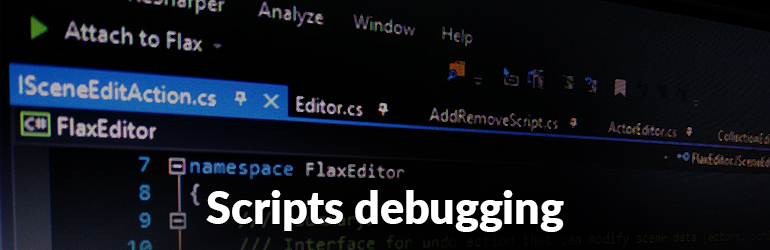
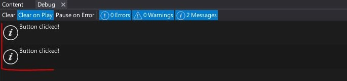
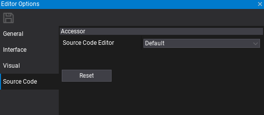

# Scripts debugging

If your script is producing unexpected result at runtime, you can debug it. There are several ways to do it. Te easiest one is to use [Debug.Log](https://docs.flaxengine.com/api/FlaxEngine.Debug.html#FlaxEngine_Debug_Log_System_Object_).
Then you can preview the output in *Debug* window.

## Code Editor

Flax supports various code editors integrations and allows to integrate cstom ones via plugins.
You can use editor options to change the current editor (in **Source Code** tab).

## Using a debugger

**The best way to debug you code is to use an IDE** such as Visual Studio. See the dedicated documentation:
* [Visual Studio](visual-studio.md)
* [Visual Studio Code](visual-studio-code.md)
* [Rider](rider.md)
