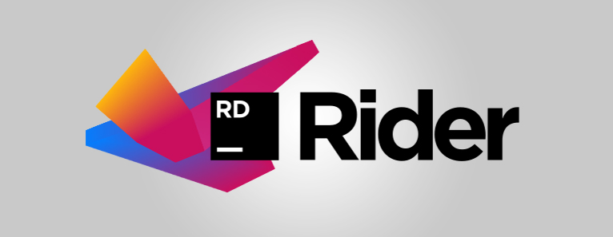
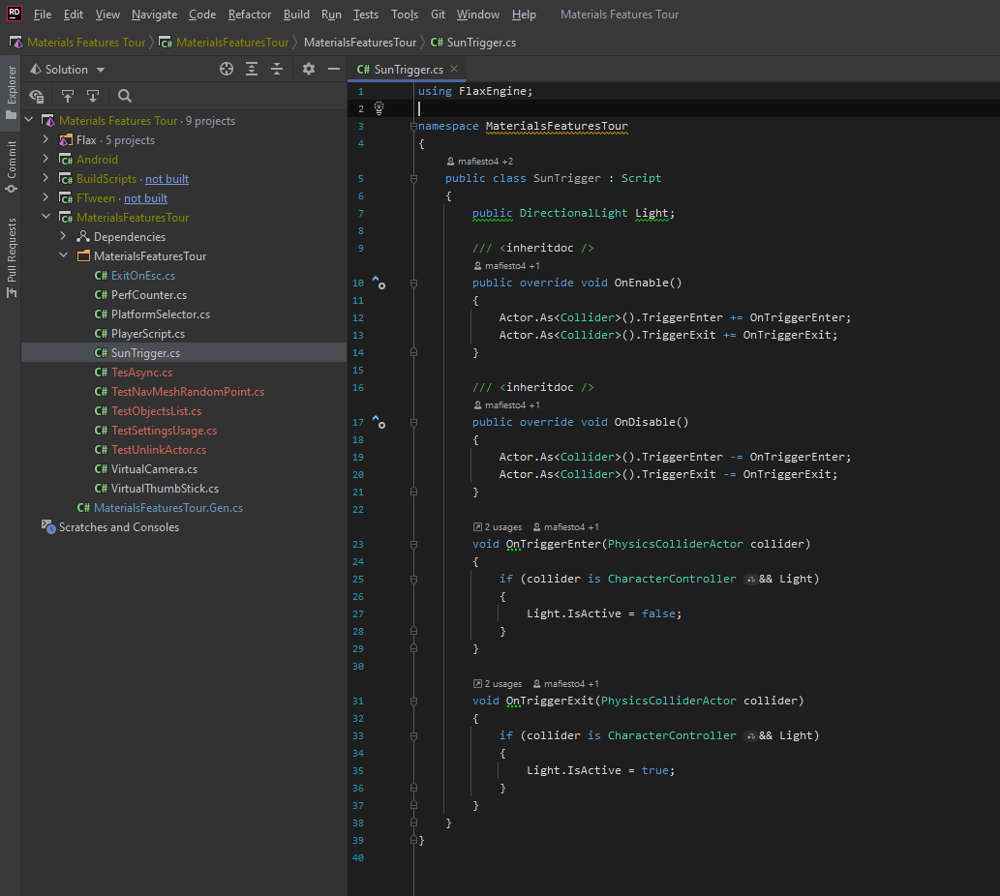
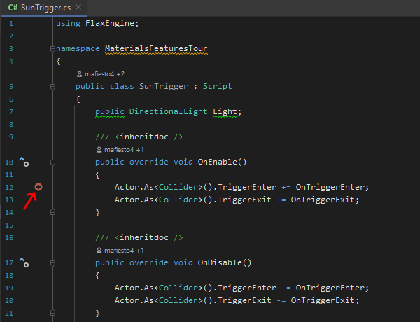
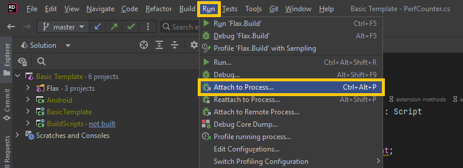
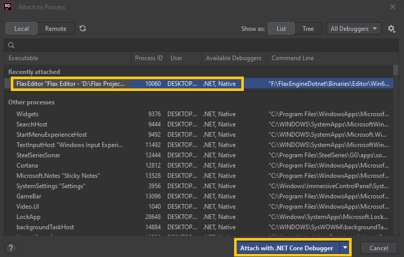
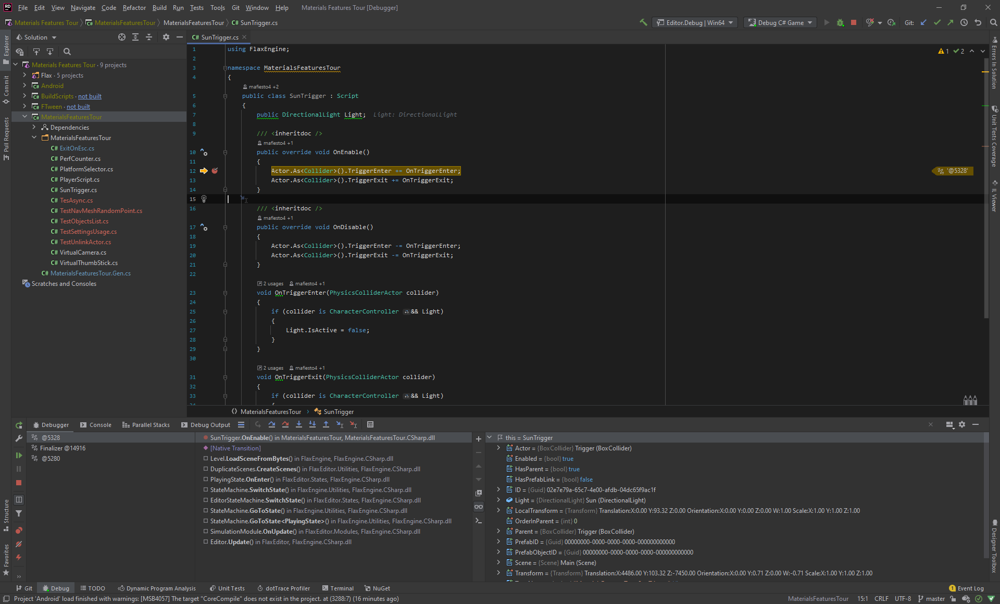
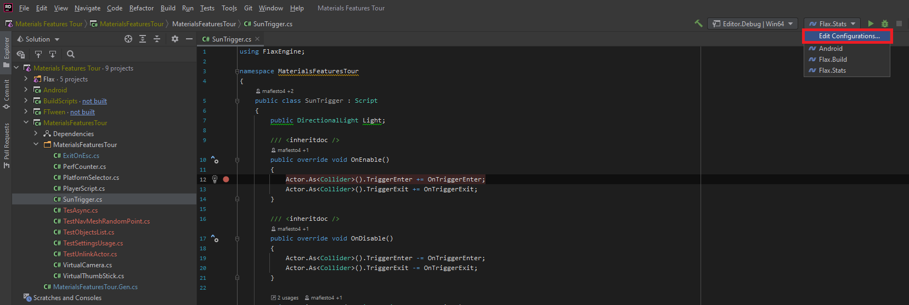
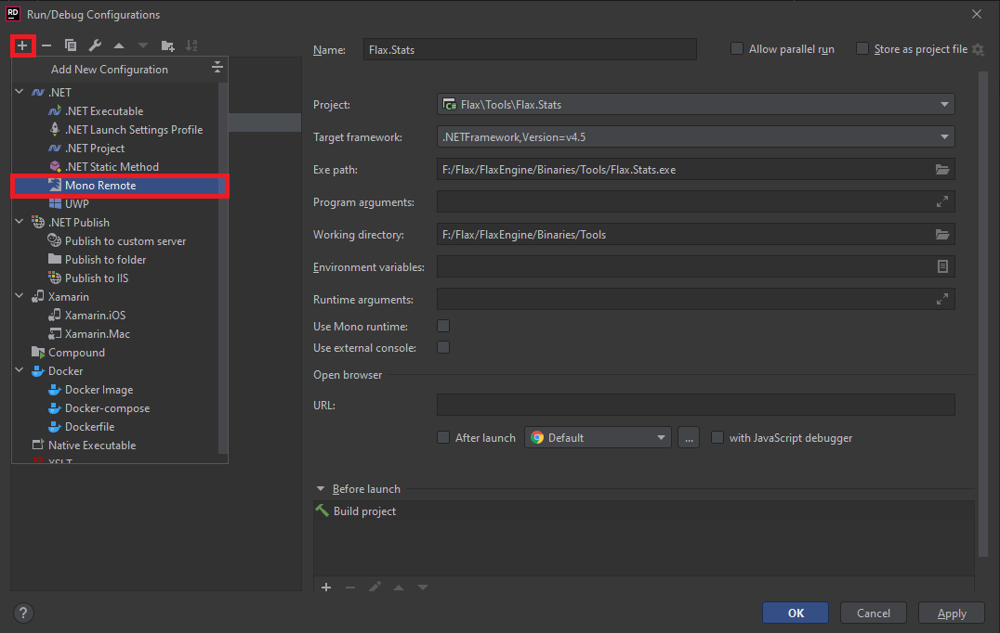
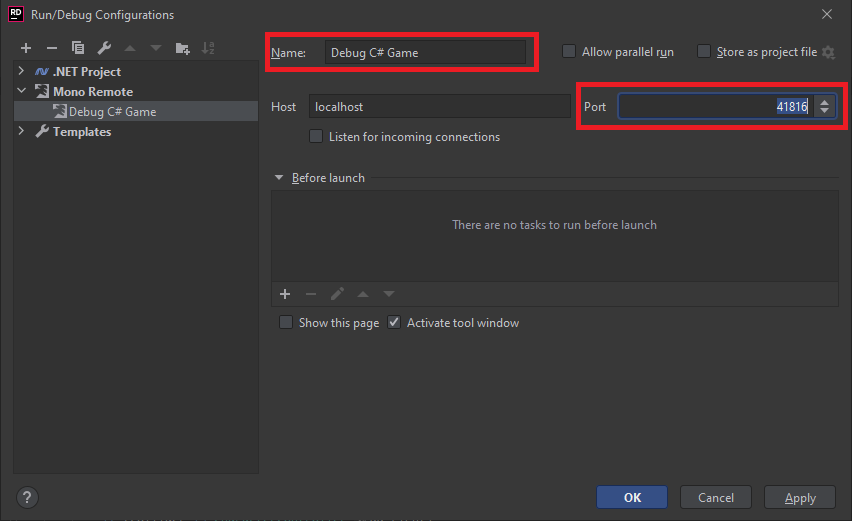
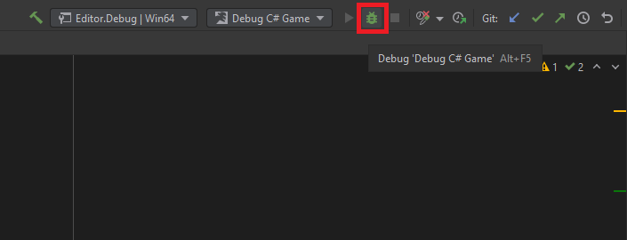

# Rider



You can download Rider [here](https://www.jetbrains.com/rider).

### 1. Change source code editor


Open Flax Editor, go to **Tools -> Options** in main menu to open editor options windows. Then select **Source Code** tab and set **Source Code Editor** to **Rider**. If this option is missing, then ensure you have Rider installed. Confirm with the Save button to apply changes.

### 2. Attach script to actor

To debug script code it has to be attached to the actor in the scene.
Simply drag and drop it into the selected actor properties area.


### 3. Open script in Rider

Double-click on a script item and wait for the IDE to show up.



### 4. Add a breakpoint

Click on a left side of the code editor to assign a breakpoint to the line. Red dot should be added as shown in the picture below.



### 5. Attach to Flax

Now, use **Run -> Attach to Process** option.



Then, select `FlaxEditor` process (or cooked Flax Game executable) to attach with .NET Core Debugger (you can attach with native C++ debugger too for native scripts).



### 6. Start a game

Go back to the Flax Editor and press the `Play` button to start a game. Then script *OnUpdate()* function will be called and assigned breakpoint hit.


### 7. Debug your code

Now you can use all Rider debugging features to verify state of the variables and test your code.



For more information about C# in Rider, see the [Rider documentation](https://www.jetbrains.com/help/rider/Languages_CSharp.html).

## Mono debugging

In past, Flax used mono for C# runtime (version 1.5 and older). Mobile and Console platforms still use mono for .NET hosting (including Mono AOT feature). To debug such builds use to attach with C# Mono debugger by identifying the debugger server port from Log:

```
...
[ 00:00:02.667 ]: [Info] Initialize Scripting...
[ 00:00:02.667 ]: [Info] Mono debugger server at 127.0.0.1:41816
...
```

This informs about the Mono debugger server running on a local machine and the given port. It's calculated from expression `41000 + process_id % 1000`. You can also run Flax with specified ip and port with a command-line argument such as `-debug 127.0.0.1:55555`.

Once you know the port you can create configuration of type **Mono Remote**. Use *Edit Configuration* button and select `+` plus button to create new confgiuration for Mono Remote debugging.





Then name it eg. to `Debug C# Game` and set **Port** to the value from the editor log.



Once you've set the port you can launch this configuration and attach with debugger.


