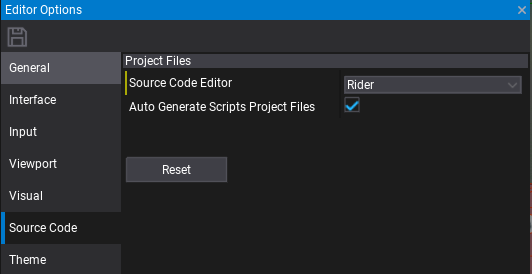
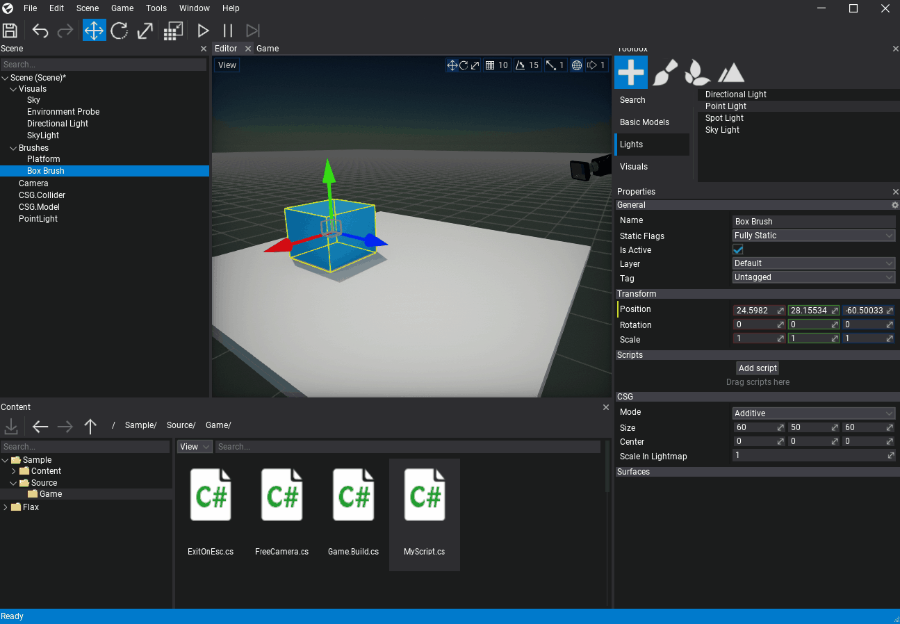
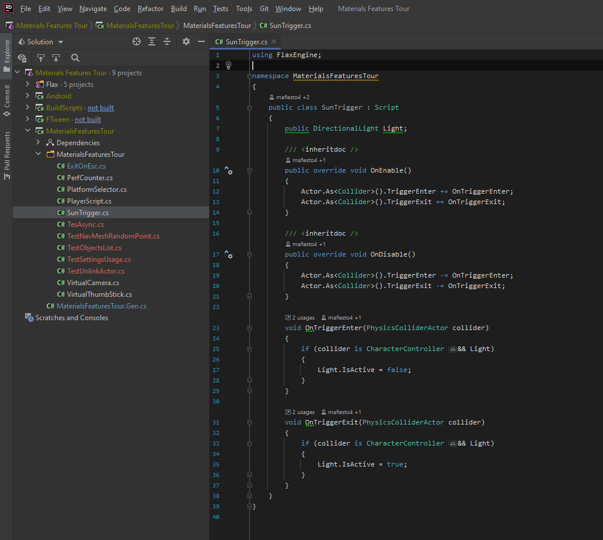
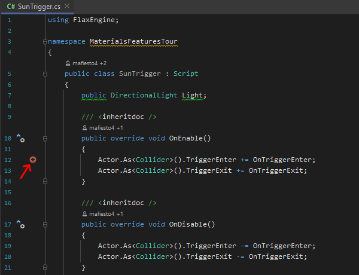
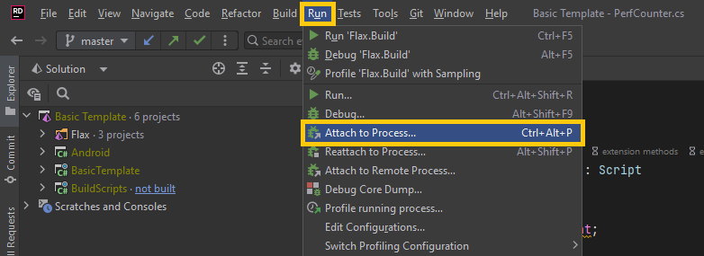
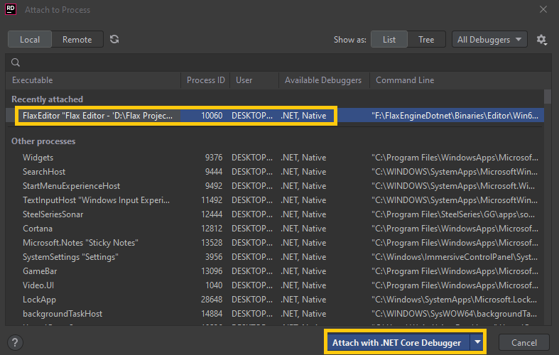
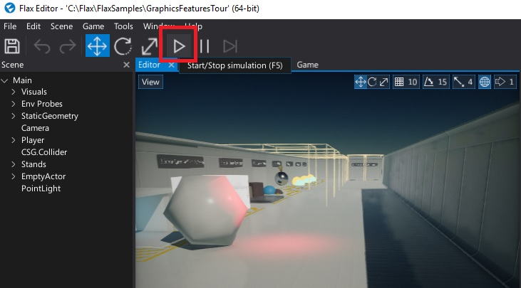
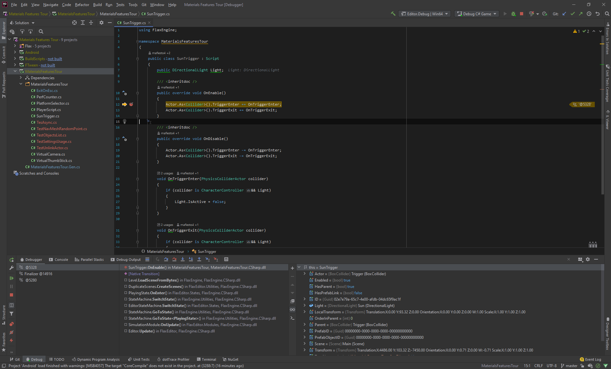

# Rider

You can download Rider [here](https://www.jetbrains.com/rider).

### 1. Change source code editor

Open Flax Editor, go to **Tools -> Options** in main menu to open editor options windows. Then select **Source Code** tab and set **Source Code Editor** to **Rider**. If this option is missing, then ensure you have Rider installed. Confirm with the Save button to apply changes.

### 2. Attach script to actor

To debug script code it has to be attached to the actor in the scene.
Simply drag and drop it into the selected actor properties area.

### 3. Open script in Rider

Double-click on a script item and wait for the IDE to show up.

### 4. Add a breakpoint

Click on a left side of the code editor to assign a breakpoint to the line. Red dot should be added as shown in the picture below.

### 5. Attach to Flax

Now, use **Run -> Attach to Process** option.

Then, select `FlaxEditor` process (or cooked Flax Game executable) to attach with .NET Core Debugger (you can attach with native C++ debugger too for native scripts).

### 6. Start a game

Go back to the Flax Editor and press the `Play` button to start a game. Then script *OnUpdate()* function will be called and assigned breakpoint hit.

### 7. Debug your code

Now you can use all Rider debugging features to verify state of the variables and test your code.

For more information about C# in Rider, see the [Rider documentation](https://www.jetbrains.com/help/rider/Languages_CSharp.html).
