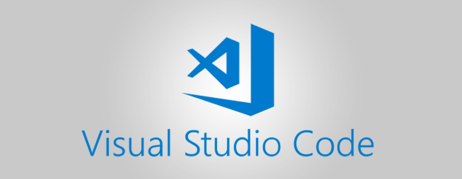
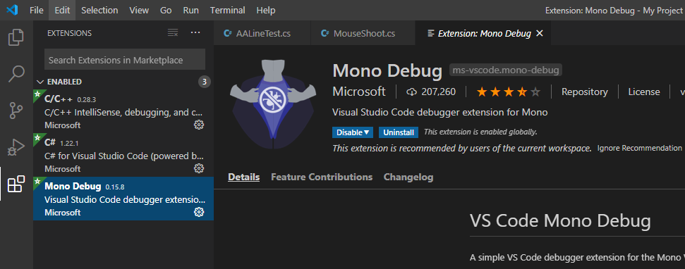
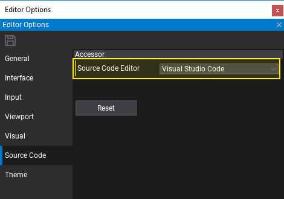
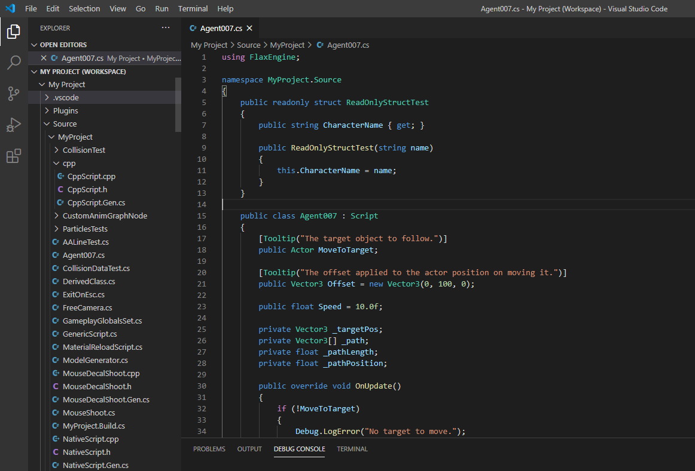
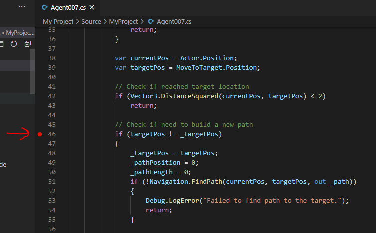
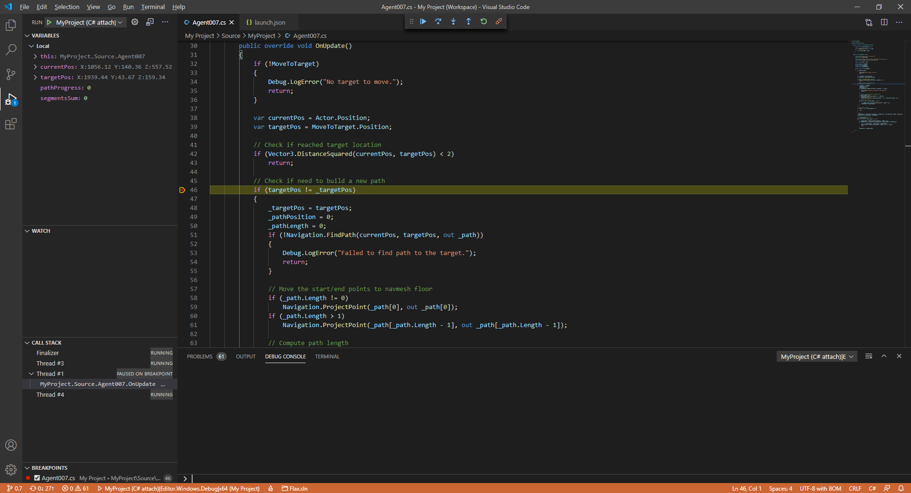

# Visual Studio Code



You can download Visual Studio Code [here](https://code.visualstudio.com).

### 1. Install extensions



Programming gameplay for Flax game in VS Code requries a set of extensions:
* **C#** - `ms-dotnettools.csharp`
* **Mono Debug** - `ms-vscode.mono-debug`
* **C/C++** - `ms-vscode.cpptools` (optional - useful if you code in C++)

### 2. Change source code editor



Open Flax Editor, go to **Tools -> Options** in main menu to open editor options windows. Then select **Source Code** tab and set **Source Code Editor** to **Visual Studio Code**. If this option is missing, then ensure you have VSCode installed. Confirm with the Save button to apply changes.

### 3. Attach script to actor

To debug script code it has to be attached to the actor in the scene.
Simply drag and drop it into the selected actor properties area.


### 4. Open script in Visual Studio Code

Double-click on a script item and wait for the IDE to show up.



### 5. Add a breakpoint

Click on a left side of the code editor to assign a breakpoint to the line. Red dot should be added as shown in the picture below.



### 6. Attach to Flax

To attach with C# debugger to Flax you will need to know the **debugger port**. This can be checked in the log file of the engine from `<project>\Logs` - see the latest file and find the line similar to the following:

```
...
[ 00:00:02.667 ]: [Info] Initialize Scripting...
[ 00:00:02.667 ]: [Info] Mono debugger server at 127.0.0.1:41816
...
```

This informs about the Mono debugger server running on a local machine and the given port. It's calculated from expression `41000 + process_id % 1000`. You can also run Flax Editor with specified ip and port with a command-line argument such as `-debug 127.0.0.1:55555`.

Once you know the port you can set it in the `launch.json` file that contains a debugger configurations for VS Code. Find the chunk similar to the following and set the port property to the one your Flax editor is using right now.

```json
...
{
    "type": "mono",
    "name": "MyProject (C# attach)|Editor.Windows.Development|x64",
    "request": "attach",
    "address": "localhost",
    "port": 55555
},
...
```

If you set the port property to the proper port you can launch this task and attach with debugger. Visual Studio Code should enter a debugging mode and the bottom of the IDE will remain orange. This signifies IDE is ready for debugging.

### 7. Start a game

Go back to the Flax Editor and press the `Play` button to start a game. Then script *OnUpdate()* function will be called and assigned breakpoint hit.


### 8. Debug your code

Now you can use all Visual Studio Code debugging features to verify state of the variables and test your code.



For more information about C# in Visual Studio Code, see the [VS Code documentation](https://code.visualstudio.com/docs/languages/csharp).
