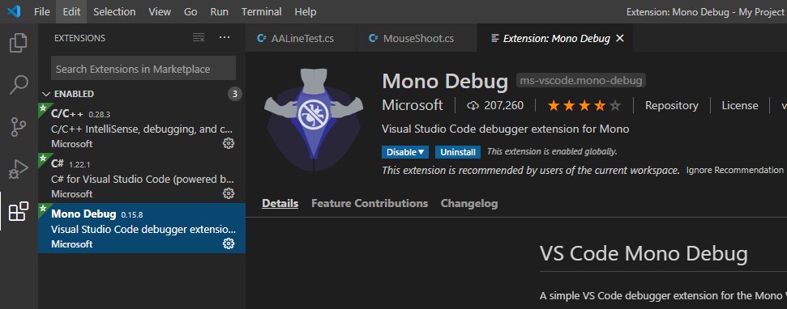
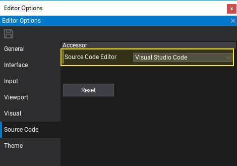
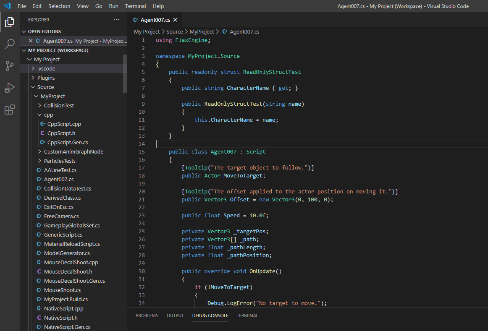
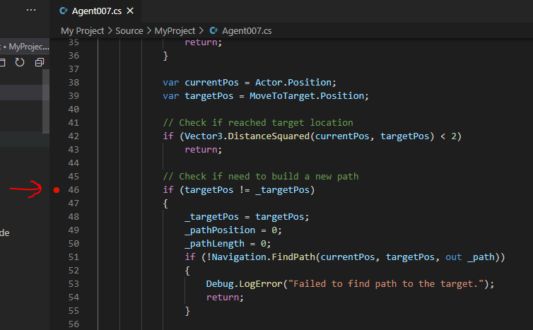
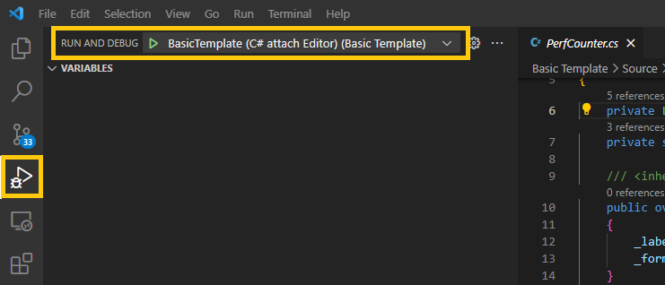
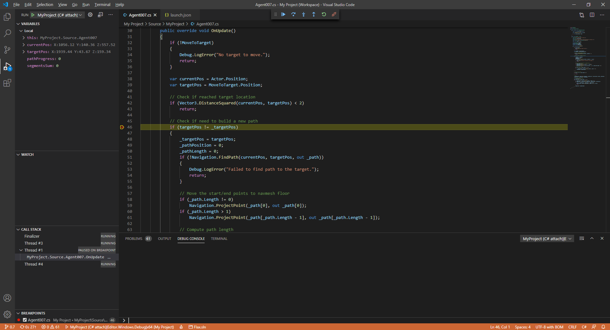

# Visual Studio Code

You can download Visual Studio Code [here](https://code.visualstudio.com).

### 1. Install extensions

Programming gameplay for Flax game in VS Code requries a set of extensions:
* **C#** - `ms-dotnettools.csharp`
* **C/C++** - `ms-vscode.cpptools` (optional - useful if you code in C++)

### 2. Change source code editor

Open Flax Editor, go to **Tools -> Options** in main menu to open editor options windows. Then select **Source Code** tab and set **Source Code Editor** to **Visual Studio Code**. If this option is missing, then ensure you have VSCode installed. Confirm with the Save button to apply changes.

### 3. Attach script to actor

To debug script code it has to be attached to the actor in the scene.
Simply drag and drop it into the selected actor properties area.

### 4. Open script in Visual Studio Code

Double-click on a script item and wait for the IDE to show up.

### 5. Add a breakpoint

Click on a left side of the code editor to assign a breakpoint to the line. Red dot should be added as shown in the picture below.

### 6. Attach to Flax

Now, attach with .NET Core debugger to Flax Editor (or cooked Flax Game). You can also select other configurations (eg. `MyProject|Editor.Windows.Development|x64 (C#)`) to run editor with C# debugger from the very beginning.

### 7. Start a game

Go back to the Flax Editor and press the `Play` button to start a game. Then script *OnUpdate()* function will be called and assigned breakpoint hit.

### 8. Debug your code

Now you can use all Visual Studio Code debugging features to verify state of the variables and test your code.

For more information about C# in Visual Studio Code, see the [VS Code documentation](https://code.visualstudio.com/docs/languages/csharp).
