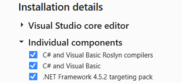
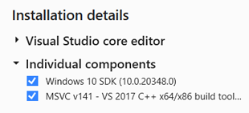
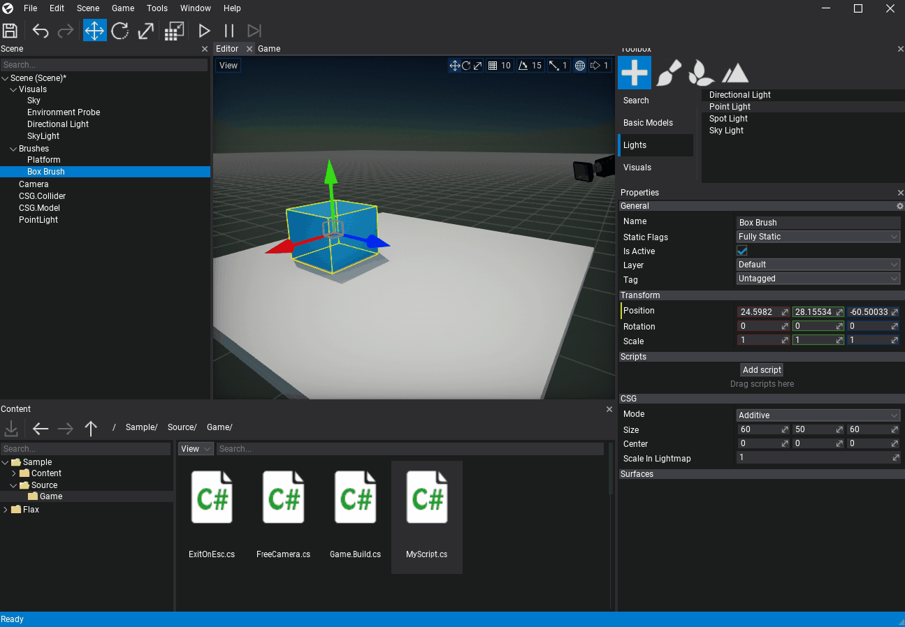
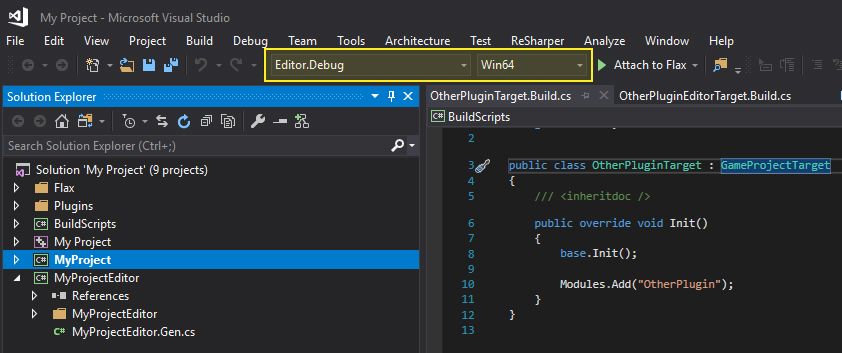
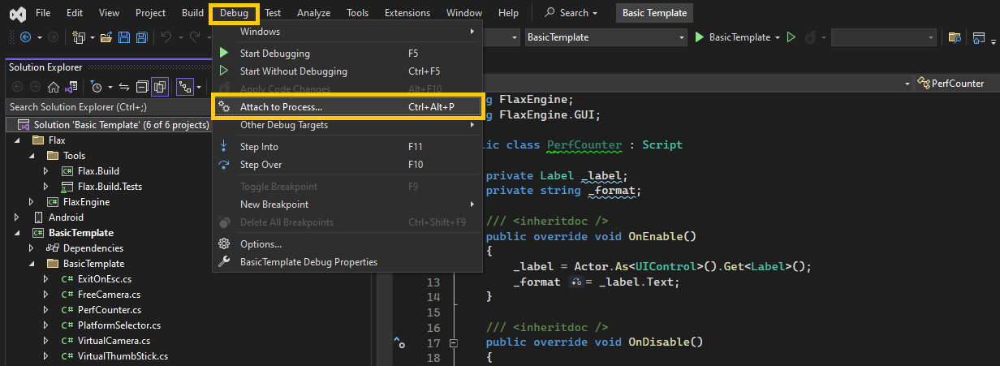
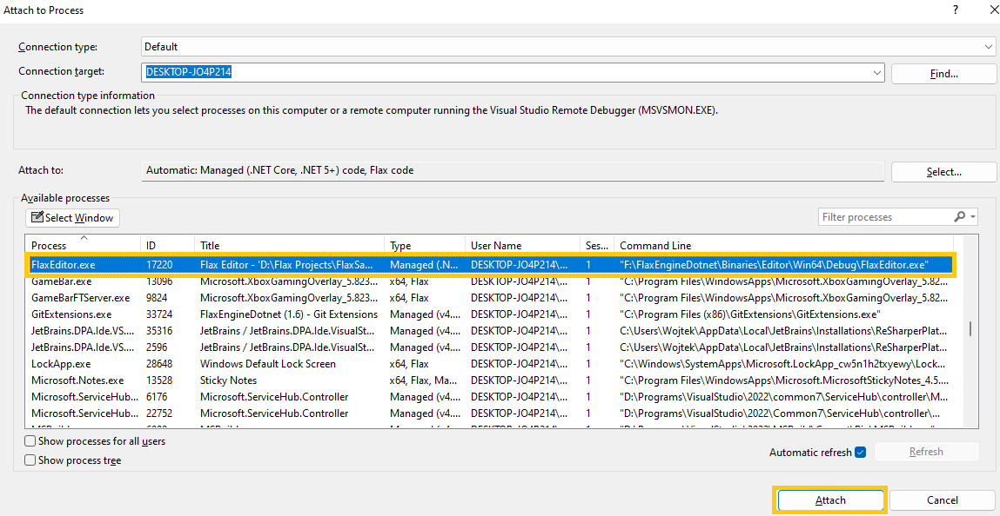
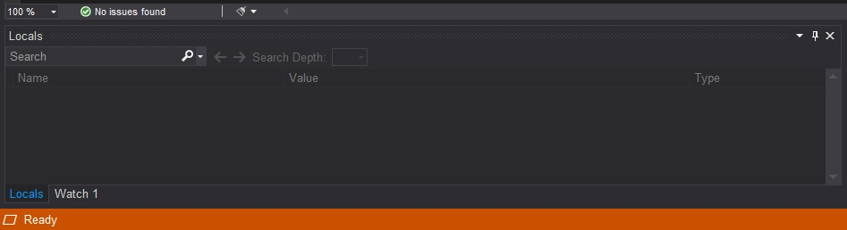

# Visual Studio

You can download Visual Studio [here](https://www.visualstudio.com). We support **Visual Studio 2022** (older versions still work with Flax but the latest .NET SDK 7 doesn't support them).

Flax requries the following components to be installed in order to support C# scripts debugging:
* C# and Visual Basic Roslyn Compilers
* C# and Visual Basic
* .NET 8.0 Runtime (already required by Flax Editor)
* .NET SDK (already required by Flax Editor)

For C++ scripts debugging platform-dependant toolset is required:
* Windows 10 SDK (or any other newer SDK)
* MSVC C++ 2015 v140 toolset (or any other newer toolset)

### 1. Attach script to actor

To debug script code it has to be attached to the actor in the scene.
Simply drag and drop it into the selected actor properties area.

### 2. Open script in Visual Studio

Double-click on a script item and wait for the IDE to show up.

Ensure to pick a proper solution configuration eg. **Editor.Development** and select platform **Win64**.

### 3. Add a breakpoint

Click on a left side of the code editor to assign a breakpoint to the line. Red dot should be added as shown in the picture below.

### 4. Attach to Flax

Press **Attach to Process** under **Debug** menu in Visual Studio.

It will open an additional window where you can select a process to debug (eg. Flax Editor, cooked game, or game running on a DevKit). After you select the target process click **Attach**. You can search processes by name by using *Filter process* text field or use *Select Window* tool. In most cases, you want to select `FlaxEditor.exe` process that is running a project which you want to debug.

Visual Studio should enter a debugging mode and the bottom of the IDE will remain orange. This signifies Visual Studio is ready for debugging.

### 5. Start a game

Go back to the Flax Editor and press the `Play` button to start a game. Then script *OnUpdate()* function will be called and assigned breakpoint hit.

### 6. Debug your code

Now you can use all Visual Studio debugging features to verify state of the variables and test your code.

For more information about debugging in Visual Studio, see the [VS documentation](https://docs.microsoft.com/en-us/visualstudio/debugger/index).
