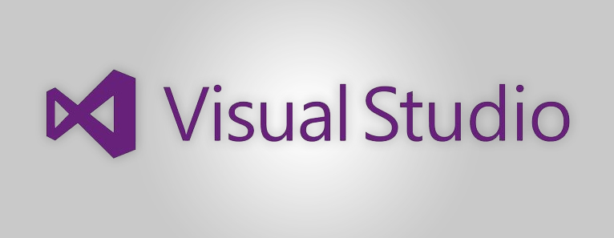
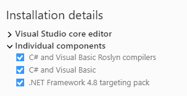
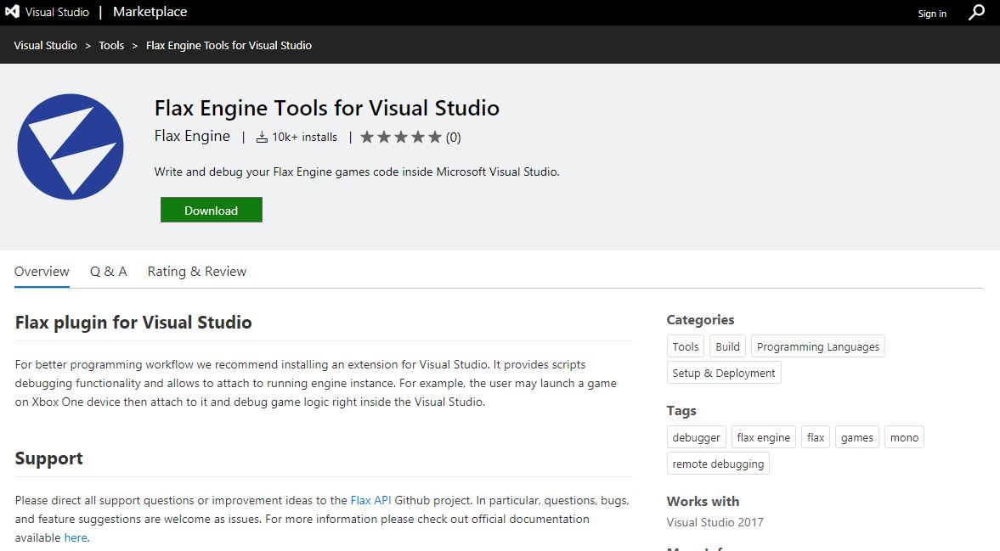
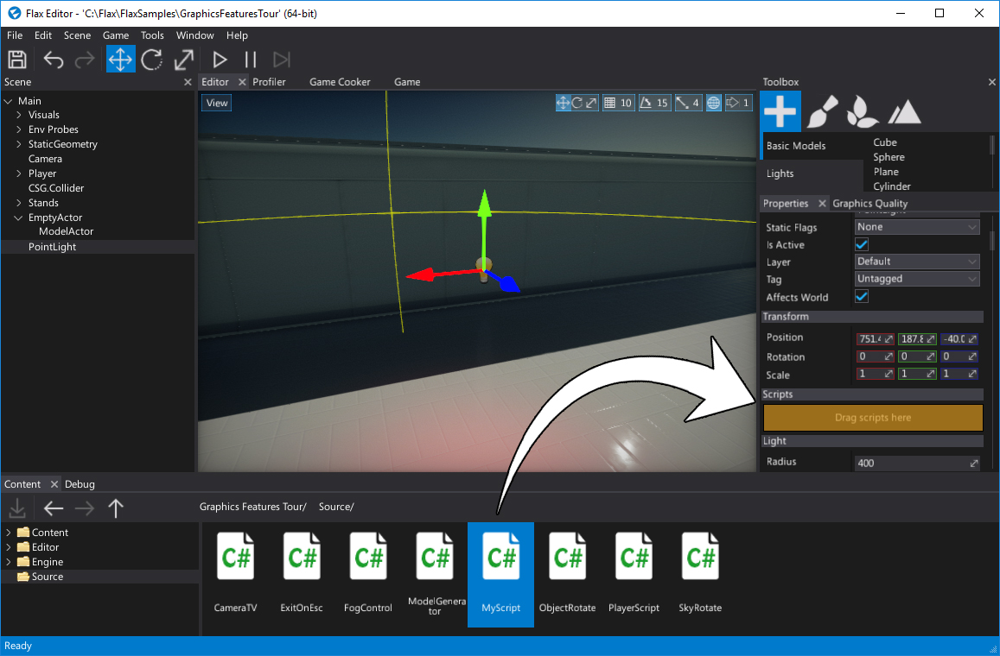
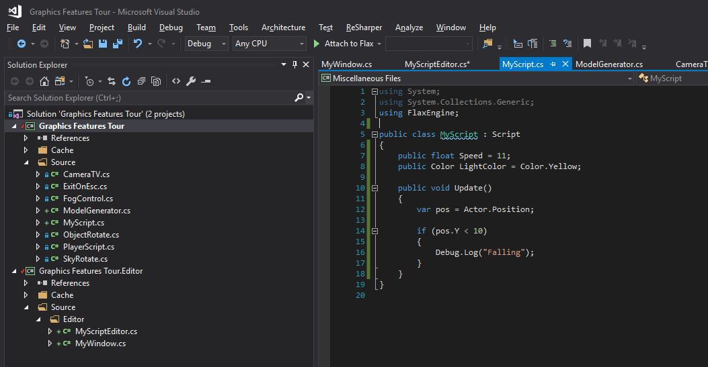
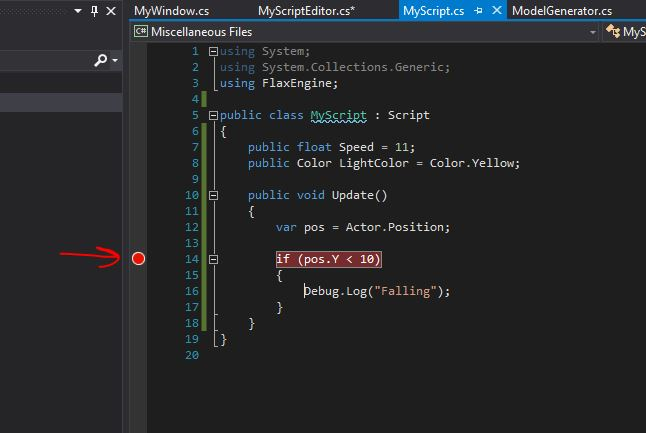
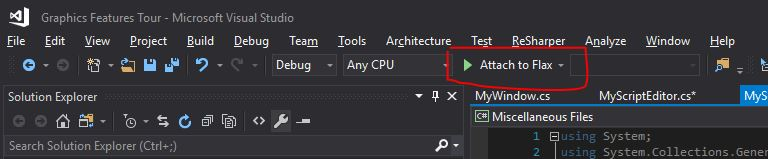
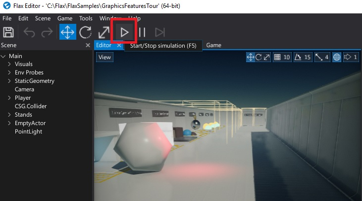
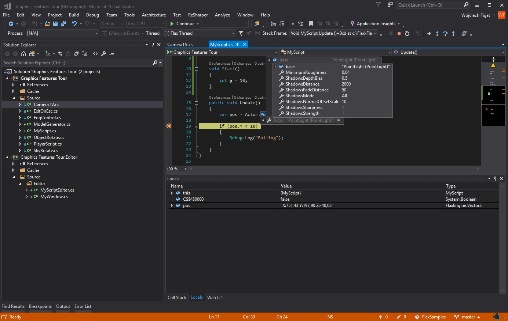

# Visual Studio

You can download Visual Studio [here](https://www.visualstudio.com). We support **Visual Studio 2017, Visual Studio 2019**.

Flax requries the following components to be installed in order to support C# scripts debugging:
* C# and Visual Basic Roslyn Compilers
* C# and Visual Basic
* .NET Framework 4.8 targeting pack (or any other .Net 4.5 or newer framework)

### 1. Install Visual Studio plugin

Download and install [Flax Engine Tools for Visual Studio](https://marketplace.visualstudio.com/items?itemName=Flax.FlaxVS) which is requried to debug game scripts right inside the VS.

### 2. Attach script to actor

To debug script code it has to be attached to the actor in the scene.
Simply drag and drop it into the selected actor properties area.

### 3. Open script in Visual Studio

Double-click on a script item and wait for the IDE to show up.

### 4. Add a breakpoint

Click on a left side of the code editor to assign a breakpoint to the line. Red dot should be added as shown in the picture below.

### 5. Attach to Flax

Press the `Attach to Flax` button with a green arrow to connect Visual Studio to Flax Editor.

### 6. Start a game

Go back to the Flax Editor and press the `Play` button to start a game. Then script *Update()* function will be called and assigned breakpoint hit.

### 7. Debug your code

Now you can use all Visual Studio debugging features to verify state of the variables and test your code.

For more information about debugging in Visual Studio, see the [VS documentation](https://docs.microsoft.com/en-us/visualstudio/debugger/index).
