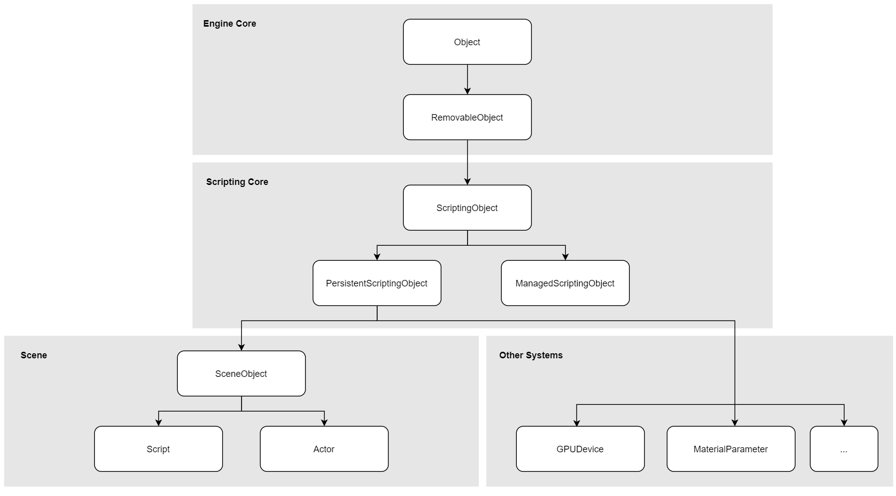

# Engine API

Scripting API list for gameplay programming (available in both C++, C# and Visual Scripting):
* `Engine` - global engine API
* `Content` - assets loading and content management
* `Audio` - audio effects and music playback
* `DebugDraw` - debug shapes drawing
* `DebugLog` - debug log messages sending
* `Globals` - global engine variables container
* `Screen` - utility for game viewport management
* `Time` - game ticking and time management
* `Graphics` - rendering quality and management
* `Input` - user input reading, access and processing
* `Level` - scene manager for actors and scene object lifetime handling
* `Navigation` - pathfinding and navigation utilities for AI
* `Physics` - physical simulation manager
* `Platform` - low-level runtime platform implementation (memory access, system info, etc.)
* `Clipboard` - system clipboard
* `MessageBox` - native platform message box popup utility
* `Render2D` - 2D graphics rendering system
* `Renderer` - 3D graphics rendering system
* `Scripting` - game scripting manager

## Objects Hierarchy

Diagram with a hierarchy of the main object types used in Flax.

In C# and Visual Scripting API `FlaxEngine.Object` type is mapped into `ScriptingObject`.

