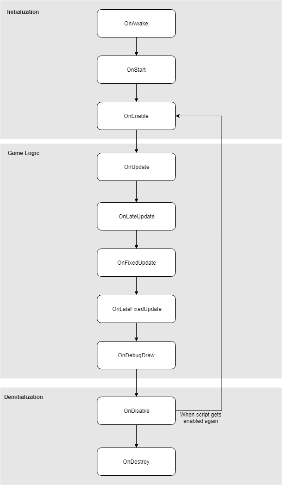

# Script events

Scripts in Flax does not work like the traditional programs where code runs continuously in a loop until end.
Instead, Flax calls declared in script functions to handle specific game events like update or physics collision.
These functions are called **event functions** because they are executed by Flax in response to events that occur during gameplay. Using these function allows you to implement gameplay logic and handle different situations inside your game.

## Examples

# [C#](#tab/code-csharp)
[!code-csharp[Example1](code-examples/events.cs)]
# [C++](#tab/code-cpp)
[!code-cpp[Example2](code-examples/events.h)]
***

## Event functions

The following table lists all the available event functions to override from the base **Script** class.

> [!TIP]
> You don't have to call the base class methods if you script inherits directly from Script type. The default implementations are empty.

| Event | Description |
|--------|--------|
| **void OnAwake()** | Called after the object is loaded to initialize it. Before the enabling it or calling start (including any other scene objects). |
| **void OnEnable()** | Called when object becomes enabled and active. |
| **void OnDisable()** | Called when object becomes disabled and inactive. |
| **void OnDestroy()** | Called before the object will be destroyed. |
| **void OnStart()** | Called when a script is enabled just before any of the Update methods is called for the first time. |
| **void OnUpdate()** | Called every frame if object is enabled (C++ scripts need to set `_tickUpdate=true` in constructor). |
| **void OnLateUpdate()** | Called every frame (after *Update*) if object is enabled (C++ scripts need to set `_tickLateUpdate=true` in constructor). |
| **void OnFixedUpdate()** | Called every fixed framerate frame if object is enable (C++ scripts need to set `_tickFixedUpdate=true` in constructor)d. |
| **void OnDebugDraw()** | Called during drawing debug shapes in editor. Use [DebugDraw](https://docs.flaxengine.com/api/FlaxEngine.DebugDraw.html). |
| **void OnDebugDrawSelected()** | Called during drawing debug shapes in editor when the object is selected. Use [DebugDraw](https://docs.flaxengine.com/api/FlaxEngine.DebugDraw.html). |

## Order of execution for event functions

Script events are invoked in the following order:

### Initialization

Every created and added to *Actor* script receives **OnAwake**. If Script and its parent are active in the hierarchy then **OnStart** and **OnEnable** are being called (on game start or object spawn). Otherwise, this call is postponed until someone enables that script.

Events OnAwake and OnStart can be called only once on a script. OnStart is always called before the first OnEnable. All scripts receive OnAwake first, before BeginPlay-phrase starts that enables the scripts. In general, OnAwake should be used to initialize the object itself (eg. setup game system manager or pre-allocate memory). Then OnStart/OnEnable should be utilized for cross-object interactions (eg. register to a game manager, cache player scripts, etc.).

### Game Logic

Engine main loop update is highly configurable and supports performing the game update, physics update and drawing at different framerates. This means that update, fixed update, and a draw might be desynchronized and not called in the same order. Event **OnUpdate** is called during the game update, then is followed by **OnLateUpdate**. During physics update engine invokes **OnFixedUpdate**. During rendering engine can invoke **OnDebugDraw** and **OnDebugDrawSelected** (used by the editor).

### Deinitialization

On game end all scripts are disabled and **OnDisable** event is called when removing the object from gameplay. Then during actual object destruction, the **OnDestroy** is invoked. Also, if the script becomes inactive (eg. someone disables it or one of its parents in its hierarchy) then the engine invokes **OnDisable**. The disabled script can be activated again and receive *OnEnable* to begin being part of the gameplay logic.

Event OnDestroy can be called only once on a script. Flax does not use the script anymore after OnDestroy event invocation.

### Events in Editor

Flax does not invoke any script events during `edit-time` (when the scene is loaded and the user modifies it) except **OnDebugDraw** and **OnDebugDrawSelected**. Only when in-build play mode starts the actual game logic is being simulated. However, if the game script wants to receive events during editing it can be marked with `[ExecuteInEditMode]` attribute. Then all events will be called normally.

### Order

The Script event's invocation order depends on the event type. Gameplay logic events (update, fixed update and debug drawing) are called in non-stable order so gameplay logic should not depend on it. Initialization events (awake, enable, start) and deinitialization events (disable, destroy) are always called for the parent objects first, then further down into the hierarchy. This means that script in parent actor can query the child actors' objects and scripts but they might not be initialized yet.

However, you can still use initialization events to add new objects as child actors/scripts because Flax will invoke initialization for them when required.

All script events are called when a script is already deserialized and has valid data ready to use (exception is OnAwake which relies to a single object readiness - other objects might be not initialized yet).
