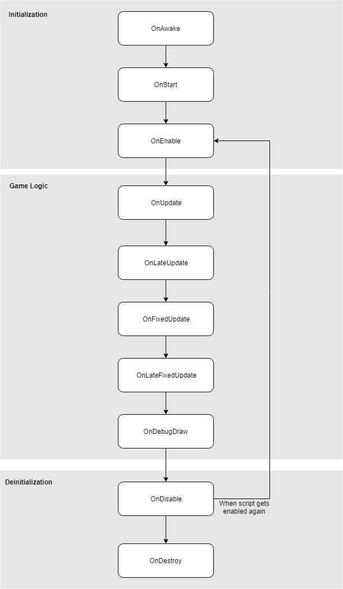

# Script events

Programming using scripts in Flax does not work like traditional programs, where code runs continuously in a loop until the program is exited.

Instead, Flax calls different functions in `Script`s to handle game and editor events like the main update loop (`OnUpdate()`) or user input. These functions are called **event functions**, **events** or **callbacks**, because they are executed by Flax in response to events that have occurred. 

## Examples

Example for `Script`:

# [C#](#tab/code-csharp)
[!code-csharp[Example1](code-examples/event-examples-script.cs)]
# [C++](#tab/code-cpp)
[!code-cpp[Example2](code-examples/events.h)]
***
 
Example for a custom UI `Control`:
# [C#](#tab/code-csharp)
[!code-csharp[Example1](code-examples/event-examples-ui-control.cs)]
***

## Event functions

The following table lists all the available event functions to override from the base `Script` class.

> [!TIP]
> The default implementations of these methods are empty, so no need to call the base implementation if you script inherits directly from the `Script` type. 

| Event | Description |
|--------|--------|
| `void OnAwake()` | Called after the object is loaded but before `OnStart()` or `OnEnable()`. Can be used to initialize it. |
| `void OnEnable()` | Called when object becomes enabled and active, before any of the update methods will be called. |
| `void OnDisable()` | Called when object becomes disabled and inactive. |
| `void OnDestroy()` | Called before the object will be destroyed. |
| `void OnStart()` | Called when a script is enabled, just before `OnEnable()` is called. |
| `void OnUpdate()` | Called every frame if the object is enabled (C++ scripts need to set `_tickUpdate = true` in their constructor). |
| `void OnLateUpdate()` | Called every frame (after `OnUpdate()`) if the object is enabled (C++ scripts need to set `_tickLateUpdate = true` in their constructor). |
| `void OnFixedUpdate()` | Called every fixed framerate frame if object is enabled (C++ scripts need to set `_tickFixedUpdate = true` in their constructor). |
| `void OnLateFixedUpdate()` | Called every fixed framerate frame (after `OnFixedUpdate()`) if the object is enabled (C++ scripts need to set `_tickLateFixedUpdate = true` in their constructor). |
| `void OnDebugDraw()` | Called during the drawing of debug shapes in the editor. See [DebugDraw](https://docs.flaxengine.com/api/FlaxEngine.DebugDraw.html). |
| `void OnDebugDrawSelected()` | Called during the drawing of debug shapes in editor if the object is selected. See [DebugDraw](https://docs.flaxengine.com/api/FlaxEngine.DebugDraw.html). |

## Order of execution

This diagram shows the invocation order of all script events:

### Update callbacks

Flax supports performing the games update, physics update and drawing at different update-/ frame rates. This means that gameplay logic should not depend on `Script`s events like `OnUpdate()`, `OnFixedUpdate()` and `OnDebugDraw()` being called in a deterministic order. 

`OnUpdate()` is called during the game update, which is then followed by `OnLateUpdate()`. 

During physics update the engine invokes `OnFixedUpdate()` and then `OnLateFixedUpdate()`. 

During rendering, the engine will invoke `OnDebugDraw()` and `OnDebugDrawSelected()`.

### Initialization

Every script that was attached to an *Actor* receives the `OnAwake()` event after it was created. 

If the script and the actor it is attached to are active in the scene hierarchy, `OnEnable()` will be called immediately, while `OnStart()` will be called right before the first call to `OnEnable()`. 

If the actor or script are disabled, these calls are postponed until the actor and script are enabled.

Note that `OnAwake()` and `OnStart()` are only called once per script instance.

`OnAwake()` should be used to initialize the object itself (eg. to perform setup or pre-allocate memory). `OnStart()`/ `OnEnable()` should be used for cross-object interactions (eg. registering the object to a game manager, caching player scripts).

### Deinitialization

When the game ends, all scripts are disabled and the `OnDisable()` event is called when the object is removed from gameplay. Then, during the actual object destruction, the `OnDestroy()` callback is invoked.

If the script becomes inactive (eg. it or the actor it is attached to are disabled), the engine invokes `OnDisable()`. The disabled script can be re-activated, receiving a call to `OnEnable()` and all subsequent calls to `OnUpdate()` and other update methods again.

The `OnDestroy()` event can be called only once per a script. Flax does not use the script instance anymore after the `OnDestroy()` event was invoked.

### Some Notes On Initialization and Deinitialization

Initialization events (`OnAwake()`, `OnEnable()`, `OnStart()`) and deinitialization events (`OnDisable()`, `OnDestroy()`) are always called for the object that is being created or destroyed first, then further down into the hierarchy. 

This means that scripts can try to access child actors and their data while they might not be initialized yet.

However, you can still use initialization events to add child actors or scripts to the actor. Flax will invoke initialization events for the newly created scripts/ actors when required.

All the other script events are called when a script is already deserialized and has valid data ready to use, with the exception being `OnAwake()`. It only waits for the object itself to be ready - other objects might be not initialized yet.

## Events in Editor

Flax by default does not invoke any script events during *edit-time* (when the scene is loaded in editor), except `OnDebugDraw()` and `OnDebugDrawSelected()`. 

Only when the game is running, for example in in-editor play mode, will the actual game logic be simulated. 

If you want a `Script` to receive events during editing, it can be marked with the `[ExecuteInEditMode]` attribute. Then all events will be called normally during *edit-time*, just like the game was actually running.